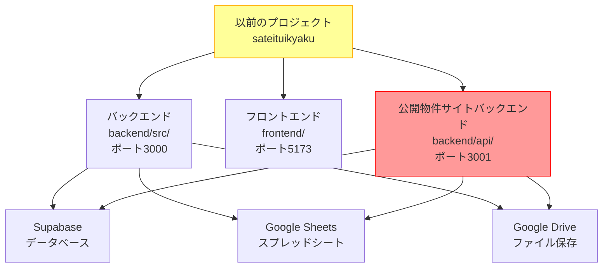
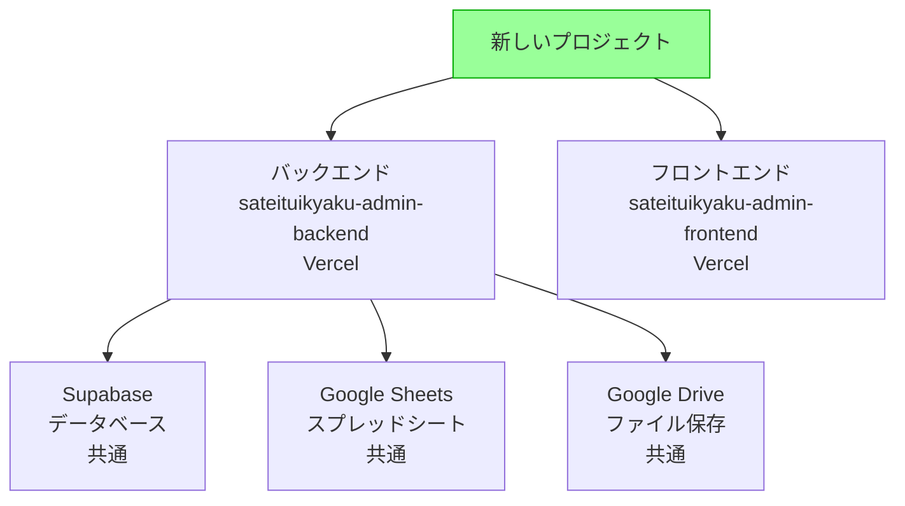
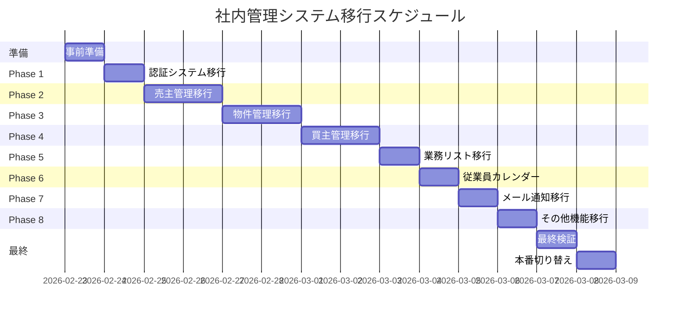

# Design Document: 社内管理システムの段階的移行

## Overview

以前のプロジェクト（`c:\Users\kunih\sateituikyaku`）で開発した社内管理システムの全機能を、新しいプロジェクト（`sateituikyaku-admin-backend`/`sateituikyaku-admin-frontend`）に段階的に移行します。

**背景**:
- 以前のプロジェクトはローカル環境では正常動作
- 本番環境では公開物件サイトとデプロイが競合していた
- 新しいプロジェクトは公開物件サイトから完全に分離されている

**制約条件**:
1. **段階的移行**: 一気に移行すると認証エラーが発生するため、順番に移行
2. **公開物件サイトへの影響ゼロ**: 公開物件サイトには絶対に影響を与えない
3. **既存機能の保持**: 移行後も全機能が正常動作すること

## Architecture

### 移行元プロジェクト構成



**注意**: 赤色の「公開物件サイトバックエンド」は移行対象外です。

### 移行先プロジェクト構成



**重要**: データベース、スプレッドシート、Google Driveは以前のプロジェクトと共通です。


## Components and Interfaces

### Phase 1: 認証システム（最優先）

**目的**: 認証エラーを防ぐため、最初に認証システムを移行

**移行対象**:
- `backend/src/routes/auth.supabase.ts` - Supabase認証ルート
- `backend/src/services/AuthService.supabase.ts` - 認証サービス
- `frontend/src/pages/LoginPage.tsx` - ログインページ
- `frontend/src/store/authStore.ts` - 認証状態管理
- `frontend/src/components/ProtectedRoute.tsx` - 認証保護ルート

**依存関係**:
- Supabase認証設定
- 環境変数（`SUPABASE_URL`, `SUPABASE_ANON_KEY`）
- セッション管理

**検証項目**:
- [ ] ログイン成功
- [ ] ログアウト成功
- [ ] セッション永続化
- [ ] 認証保護ルートのリダイレクト

---

### Phase 2: 売主管理（コア機能）

**目的**: 最も重要な売主管理機能を移行

**移行対象**:

**バックエンド**:
- `backend/src/routes/sellers.ts` - 売主CRUD API
- `backend/src/routes/sellersManagement.ts` - 売主管理API
- `backend/src/services/SellerService.supabase.ts` - 売主サービス
- `backend/src/services/SpreadsheetSyncService.ts` - スプレッドシート同期
- `backend/src/services/SyncQueue.ts` - 同期キュー
- `backend/src/services/EnhancedAutoSyncService.ts` - 自動同期

**フロントエンド**:
- `frontend/src/pages/SellersPage.tsx` - 売主一覧
- `frontend/src/pages/NewSellerPage.tsx` - 売主作成
- `frontend/src/pages/SellerDetailPage.tsx` - 売主詳細
- `frontend/src/pages/CallModePage.tsx` - 通話モード

**依存関係**:
- Phase 1（認証システム）
- Google Sheets API設定
- Supabaseデータベーススキーマ

**検証項目**:
- [ ] 売主一覧表示
- [ ] 売主作成
- [ ] 売主編集
- [ ] 売主削除
- [ ] スプレッドシート同期（DB → Sheet）
- [ ] スプレッドシート同期（Sheet → DB）
- [ ] 通話モード動作

---

### Phase 3: 物件管理

**目的**: 物件管理機能を移行

**移行対象**:

**バックエンド**:
- `backend/src/routes/properties.ts` - 物件CRUD API
- `backend/src/routes/propertyListings.ts` - 物件リストAPI
- `backend/src/services/PropertyService.ts` - 物件サービス
- `backend/src/services/PropertyListingService.ts` - 物件リストサービス
- `backend/src/services/PropertyImageService.ts` - 物件画像サービス
- `backend/src/services/GoogleDriveService.ts` - Google Drive連携

**フロントエンド**:
- `frontend/src/pages/PropertyListingsPage.tsx` - 物件一覧
- `frontend/src/pages/PropertyListingDetailPage.tsx` - 物件詳細

**依存関係**:
- Phase 2（売主管理）
- Google Drive API設定

**検証項目**:
- [ ] 物件一覧表示
- [ ] 物件詳細表示
- [ ] 物件画像表示
- [ ] Google Driveからの画像取得


### Phase 4: 買主管理

**目的**: 買主管理機能を移行

**移行対象**:

**バックエンド**:
- `backend/src/routes/buyers.ts` - 買主CRUD API
- `backend/src/services/BuyerService.ts` - 買主サービス
- `backend/src/services/BuyerSyncService.ts` - 買主同期サービス
- `backend/src/services/BuyerDistributionService.ts` - 買主配信サービス

**フロントエンド**:
- `frontend/src/pages/BuyersPage.tsx` - 買主一覧
- `frontend/src/pages/NewBuyerPage.tsx` - 買主作成
- `frontend/src/pages/BuyerDetailPage.tsx` - 買主詳細

**依存関係**:
- Phase 2（売主管理）
- Phase 3（物件管理）

**検証項目**:
- [ ] 買主一覧表示
- [ ] 買主作成
- [ ] 買主編集
- [ ] 買主削除
- [ ] 物件配信機能

---

### Phase 5: 業務リスト管理

**目的**: 業務リスト管理機能を移行

**移行対象**:

**バックエンド**:
- `backend/src/routes/workTasks.ts` - 業務タスクAPI
- `backend/src/services/WorkTaskService.ts` - 業務タスクサービス
- `backend/src/services/WorkTaskSyncService.ts` - 業務タスク同期

**フロントエンド**:
- `frontend/src/pages/WorkTasksPage.tsx` - 業務リスト

**依存関係**:
- Phase 2（売主管理）
- Phase 3（物件管理）

**検証項目**:
- [ ] 業務リスト表示
- [ ] タスク作成
- [ ] タスク編集
- [ ] タスク完了

---

### Phase 6: 従業員・カレンダー管理

**目的**: 従業員管理とカレンダー機能を移行

**移行対象**:

**バックエンド**:
- `backend/src/routes/employees.ts` - 従業員API
- `backend/src/routes/googleCalendar.ts` - Googleカレンダー連携
- `backend/src/services/CalendarService.supabase.ts` - カレンダーサービス

**フロントエンド**:
- `frontend/src/pages/EmployeeCalendarStatusPage.tsx` - 従業員カレンダー状態

**依存関係**:
- Phase 1（認証システム）
- Google Calendar API設定

**検証項目**:
- [ ] 従業員一覧表示
- [ ] カレンダー同期
- [ ] 予定表示

---

### Phase 7: メール・通知機能

**目的**: メール送信と通知機能を移行

**移行対象**:

**バックエンド**:
- `backend/src/routes/emails.ts` - メールAPI
- `backend/src/routes/gmail.ts` - Gmail連携
- `backend/src/services/EmailService.supabase.ts` - メールサービス
- `backend/src/services/ChatNotificationService.ts` - チャット通知

**依存関係**:
- Phase 2（売主管理）
- Gmail API設定

**検証項目**:
- [ ] メール送信
- [ ] Gmail連携
- [ ] 通知送信

---

### Phase 8: その他の機能

**目的**: 残りの機能を移行

**移行対象**:
- アクティビティログ
- フォローアップ
- 予約管理
- 通話履歴
- 設定ページ

**依存関係**:
- 全ての前フェーズ

**検証項目**:
- [ ] 全機能の動作確認


## Data Models

### 環境変数マッピング

**移行元** → **移行先**

```bash
# Supabase設定
SUPABASE_URL → SUPABASE_URL（同じ）
SUPABASE_ANON_KEY → SUPABASE_ANON_KEY（同じ）
SUPABASE_SERVICE_ROLE_KEY → SUPABASE_SERVICE_ROLE_KEY（同じ）

# Google Sheets設定
GOOGLE_SHEETS_SPREADSHEET_ID → GOOGLE_SHEETS_SPREADSHEET_ID（同じ）
GOOGLE_SHEETS_SHEET_NAME → GOOGLE_SHEETS_SHEET_NAME（同じ）
GOOGLE_SERVICE_ACCOUNT_KEY_PATH → GOOGLE_SERVICE_ACCOUNT_KEY（Base64エンコード）

# Google Drive設定
GOOGLE_DRIVE_FOLDER_ID → GOOGLE_DRIVE_FOLDER_ID（同じ）

# Gmail設定
GMAIL_CLIENT_ID → GMAIL_CLIENT_ID（同じ）
GMAIL_CLIENT_SECRET → GMAIL_CLIENT_SECRET（同じ）
GMAIL_REFRESH_TOKEN → GMAIL_REFRESH_TOKEN（同じ）

# Google Calendar設定
GOOGLE_CALENDAR_CLIENT_ID → GOOGLE_CALENDAR_CLIENT_ID（同じ）
GOOGLE_CALENDAR_CLIENT_SECRET → GOOGLE_CALENDAR_CLIENT_SECRET（同じ）
GOOGLE_CALENDAR_REFRESH_TOKEN → GOOGLE_CALENDAR_REFRESH_TOKEN（同じ）

# 自動同期設定
AUTO_SYNC_ENABLED → AUTO_SYNC_ENABLED（同じ）
AUTO_SYNC_INTERVAL_MINUTES → AUTO_SYNC_INTERVAL_MINUTES（同じ）

# その他
ENCRYPTION_KEY → ENCRYPTION_KEY（同じ）
CRON_SECRET → CRON_SECRET（新規生成）
```

**重要**: `GOOGLE_SERVICE_ACCOUNT_KEY_PATH`は、Vercel環境では環境変数`GOOGLE_SERVICE_ACCOUNT_KEY`にBase64エンコードしたJSONを設定します。

---

### データベーススキーマ

**重要**: データベーススキーマは以前のプロジェクトと共通です。移行時にスキーマ変更は不要です。

**主要テーブル**:
- `sellers` - 売主データ
- `properties` - 物件データ
- `property_listings` - 物件リストデータ
- `property_details` - 物件詳細データ
- `buyers` - 買主データ
- `work_tasks` - 業務タスクデータ
- `employees` - 従業員データ
- `activity_logs` - アクティビティログ
- `follow_ups` - フォローアップデータ
- `appointments` - 予約データ

---

### ファイル構造マッピング

**移行元** → **移行先**

```
backend/src/
├── routes/
│   ├── auth.supabase.ts → routes/auth.supabase.ts
│   ├── sellers.ts → routes/sellers.ts
│   ├── properties.ts → routes/properties.ts
│   ├── buyers.ts → routes/buyers.ts
│   └── ... → ...
├── services/
│   ├── SellerService.supabase.ts → services/SellerService.supabase.ts
│   ├── PropertyService.ts → services/PropertyService.ts
│   ├── BuyerService.ts → services/BuyerService.ts
│   └── ... → ...
├── middleware/
│   └── ... → middleware/...
├── config/
│   ├── supabase.ts → config/supabase.ts
│   └── redis.ts → config/redis.ts（オプション）
└── index.ts → index.ts

frontend/src/
├── pages/
│   ├── LoginPage.tsx → pages/LoginPage.tsx
│   ├── SellersPage.tsx → pages/SellersPage.tsx
│   ├── SellerDetailPage.tsx → pages/SellerDetailPage.tsx
│   └── ... → ...
├── components/
│   └── ... → components/...
├── store/
│   └── authStore.ts → store/authStore.ts
└── App.tsx → App.tsx
```


## Error Handling

### 移行時のリスクと対策

#### リスク1: 認証エラー

**原因**: 認証設定の不一致

**対策**:
1. Phase 1で認証システムを最初に移行
2. 環境変数を正確にコピー
3. Supabase認証設定を確認
4. セッション管理を検証

**ロールバック手順**:
1. 新しいプロジェクトのデプロイを停止
2. 以前のプロジェクトに戻す
3. 環境変数を再確認

---

#### リスク2: スプレッドシート同期エラー

**原因**: Google Sheets API設定の不一致

**対策**:
1. サービスアカウントキーを正確にコピー
2. スプレッドシートIDを確認
3. 同期ログを監視
4. 手動同期でテスト

**ロールバック手順**:
1. 自動同期を無効化（`AUTO_SYNC_ENABLED=false`）
2. 手動同期で修正
3. 自動同期を再有効化

---

#### リスク3: 公開物件サイトへの影響

**原因**: 誤って公開物件サイトのファイルを移行

**対策**:
1. `backend/api/`ディレクトリは絶対に移行しない
2. 移行前にファイルパスを確認
3. 公開物件サイトの動作を定期的に確認

**ロールバック手順**:
1. 公開物件サイトのデプロイを確認
2. 影響がある場合、即座に以前のバージョンに戻す

---

#### リスク4: データベース接続エラー

**原因**: Supabase設定の不一致

**対策**:
1. 環境変数を正確にコピー
2. 接続テストを実行
3. ログを監視

**ロールバック手順**:
1. 環境変数を再確認
2. Supabase設定を確認
3. 必要に応じて以前のプロジェクトに戻す

---

#### リスク5: Google Drive画像取得エラー

**原因**: Google Drive API設定の不一致

**対策**:
1. サービスアカウントキーを正確にコピー
2. フォルダIDを確認
3. 画像取得テストを実行

**ロールバック手順**:
1. Google Drive設定を再確認
2. 必要に応じて以前のプロジェクトに戻す


## Testing Strategy

### Phase 1: 認証システムのテスト

**単体テスト**:
- [ ] `AuthService.supabase.ts`のメソッドテスト
- [ ] ログイン処理のテスト
- [ ] ログアウト処理のテスト
- [ ] セッション管理のテスト

**統合テスト**:
- [ ] ログインフロー全体のテスト
- [ ] 認証保護ルートのテスト
- [ ] セッション永続化のテスト

**本番環境テスト**:
- [ ] Vercelデプロイ後のログインテスト
- [ ] セッション永続化の確認
- [ ] 複数ブラウザでのテスト

---

### Phase 2: 売主管理のテスト

**単体テスト**:
- [ ] `SellerService.supabase.ts`のメソッドテスト
- [ ] スプレッドシート同期のテスト
- [ ] 同期キューのテスト

**統合テスト**:
- [ ] 売主CRUD操作のテスト
- [ ] スプレッドシート同期（DB → Sheet）のテスト
- [ ] スプレッドシート同期（Sheet → DB）のテスト
- [ ] 通話モードのテスト

**本番環境テスト**:
- [ ] 売主一覧表示の確認
- [ ] 売主作成・編集・削除の確認
- [ ] スプレッドシート同期の確認（5分間隔）
- [ ] 通話モードの動作確認

---

### Phase 3: 物件管理のテスト

**単体テスト**:
- [ ] `PropertyService.ts`のメソッドテスト
- [ ] `PropertyImageService.ts`のメソッドテスト
- [ ] Google Drive連携のテスト

**統合テスト**:
- [ ] 物件CRUD操作のテスト
- [ ] 物件画像取得のテスト
- [ ] Google Driveからの画像取得のテスト

**本番環境テスト**:
- [ ] 物件一覧表示の確認
- [ ] 物件詳細表示の確認
- [ ] 物件画像表示の確認

---

### Phase 4-8: その他機能のテスト

各フェーズで同様のテスト戦略を適用します。

---

### 回帰テスト

**全フェーズ完了後**:
- [ ] 全機能の動作確認
- [ ] 以前のプロジェクトとの比較テスト
- [ ] パフォーマンステスト
- [ ] セキュリティテスト

---

### テスト自動化

**推奨ツール**:
- Jest（単体テスト）
- Playwright（E2Eテスト）
- Postman（APIテスト）

**CI/CD統合**:
- GitHub Actionsでテスト自動実行
- Vercelデプロイ前にテスト実行


## Performance Considerations

### 自動同期のパフォーマンス

**現在の設定**:
- 同期間隔: 5分ごと
- キャッシュTTL: 5分
- スプレッドシートキャッシュ: 15分

**最適化**:
1. 同期間隔を延長（5分 → 10分）
2. キャッシュTTLを延長（5分 → 10分）
3. バッチ処理の最適化

**監視項目**:
- 同期時間
- Google Sheets APIクォータ使用量
- メモリ使用量

---

### 画像取得のパフォーマンス

**現在の実装**:
- Google Driveから画像を取得
- キャッシュ機能あり

**最適化**:
1. 画像キャッシュの有効期限を延長
2. CDN導入を検討
3. 画像サイズの最適化

**監視項目**:
- 画像取得時間
- Google Drive APIクォータ使用量
- キャッシュヒット率

---

### データベースクエリのパフォーマンス

**最適化**:
1. インデックスの追加
2. クエリの最適化
3. ページネーションの実装

**監視項目**:
- クエリ実行時間
- データベース接続数
- メモリ使用量


## Security Considerations

### 環境変数の管理

**重要**: 環境変数は絶対にGitにコミットしないでください。

**Vercel環境変数の設定**:
1. Vercelダッシュボードにログイン
2. プロジェクト設定 → Environment Variables
3. 以下の環境変数を設定

**必須環境変数**:
```bash
# Supabase
SUPABASE_URL=https://xxx.supabase.co
SUPABASE_ANON_KEY=eyJxxx...
SUPABASE_SERVICE_ROLE_KEY=eyJxxx...

# Google Sheets（Base64エンコード）
GOOGLE_SERVICE_ACCOUNT_KEY=eyJ0eXBlIjoic2VydmljZV9hY2NvdW50Iiwi...
GOOGLE_SHEETS_SPREADSHEET_ID=1xxx...
GOOGLE_SHEETS_SHEET_NAME=売主リスト

# Google Drive
GOOGLE_DRIVE_FOLDER_ID=1xxx...

# Gmail
GMAIL_CLIENT_ID=xxx.apps.googleusercontent.com
GMAIL_CLIENT_SECRET=xxx
GMAIL_REFRESH_TOKEN=1//xxx

# Google Calendar
GOOGLE_CALENDAR_CLIENT_ID=xxx.apps.googleusercontent.com
GOOGLE_CALENDAR_CLIENT_SECRET=xxx
GOOGLE_CALENDAR_REFRESH_TOKEN=1//xxx

# 暗号化
ENCRYPTION_KEY=xxx（32文字以上のランダム文字列）

# Cron Job
CRON_SECRET=xxx（ランダム文字列）

# 自動同期
AUTO_SYNC_ENABLED=true
AUTO_SYNC_INTERVAL_MINUTES=5
```

---

### Google Service Account Keyの変換

**ローカル環境**:
```bash
GOOGLE_SERVICE_ACCOUNT_KEY_PATH=./google-service-account.json
```

**Vercel環境**:
```bash
# JSONファイルをBase64エンコード
cat google-service-account.json | base64 -w 0

# 出力された文字列を環境変数に設定
GOOGLE_SERVICE_ACCOUNT_KEY=eyJ0eXBlIjoic2VydmljZV9hY2NvdW50Iiwi...
```

**コード側の対応**:
```typescript
// backend/src/services/GoogleSheetsClient.ts
const serviceAccountKey = process.env.GOOGLE_SERVICE_ACCOUNT_KEY_PATH
  ? JSON.parse(fs.readFileSync(process.env.GOOGLE_SERVICE_ACCOUNT_KEY_PATH, 'utf8'))
  : JSON.parse(Buffer.from(process.env.GOOGLE_SERVICE_ACCOUNT_KEY!, 'base64').toString('utf8'));
```

---

### 認証とセッション管理

**Supabase認証**:
- JWTトークンベースの認証
- セッション永続化（localStorage）
- 自動リフレッシュ

**セキュリティ対策**:
- HTTPS必須
- CORS設定の厳格化
- CSRFトークンの実装（推奨）

---

### データ暗号化

**暗号化対象**:
- 売主の個人情報（名前、電話番号、メールアドレス）
- 買主の個人情報

**暗号化方式**:
- AES-256-GCM
- 暗号化キー: `ENCRYPTION_KEY`環境変数

**実装**:
```typescript
// backend/src/services/SellerService.supabase.ts
import crypto from 'crypto';

const ENCRYPTION_KEY = process.env.ENCRYPTION_KEY!;
const ALGORITHM = 'aes-256-gcm';

function encrypt(text: string): string {
  const iv = crypto.randomBytes(16);
  const cipher = crypto.createCipheriv(ALGORITHM, Buffer.from(ENCRYPTION_KEY, 'hex'), iv);
  let encrypted = cipher.update(text, 'utf8', 'hex');
  encrypted += cipher.final('hex');
  const authTag = cipher.getAuthTag();
  return iv.toString('hex') + ':' + authTag.toString('hex') + ':' + encrypted;
}

function decrypt(text: string): string {
  const parts = text.split(':');
  const iv = Buffer.from(parts[0], 'hex');
  const authTag = Buffer.from(parts[1], 'hex');
  const encrypted = parts[2];
  const decipher = crypto.createDecipheriv(ALGORITHM, Buffer.from(ENCRYPTION_KEY, 'hex'), iv);
  decipher.setAuthTag(authTag);
  let decrypted = decipher.update(encrypted, 'hex', 'utf8');
  decrypted += decipher.final('utf8');
  return decrypted;
}
```


## Dependencies

### バックエンド依存関係

**主要パッケージ**:
```json
{
  "dependencies": {
    "express": "^4.18.2",
    "cors": "^2.8.5",
    "helmet": "^7.0.0",
    "compression": "^1.7.4",
    "morgan": "^1.10.0",
    "@supabase/supabase-js": "^2.38.0",
    "googleapis": "^126.0.0",
    "redis": "^4.6.10",
    "dotenv": "^16.3.1",
    "typescript": "^5.2.2",
    "ts-node": "^10.9.1"
  }
}
```

**Google APIs**:
- Google Sheets API v4
- Google Drive API v3
- Gmail API v1
- Google Calendar API v3

---

### フロントエンド依存関係

**主要パッケージ**:
```json
{
  "dependencies": {
    "react": "^18.2.0",
    "react-dom": "^18.2.0",
    "react-router-dom": "^6.16.0",
    "zustand": "^4.4.1",
    "@supabase/supabase-js": "^2.38.0",
    "axios": "^1.5.0",
    "typescript": "^5.2.2",
    "vite": "^4.4.9"
  }
}
```

---

### 外部サービス依存関係

**必須サービス**:
1. **Supabase** - データベース、認証
2. **Google Sheets** - スプレッドシート同期
3. **Google Drive** - ファイル保存
4. **Gmail** - メール送信
5. **Google Calendar** - カレンダー同期
6. **Vercel** - ホスティング

**オプションサービス**:
1. **Redis** - セッション管理、キャッシュ（Upstash推奨）
2. **Sentry** - エラー監視（推奨）
3. **LogRocket** - ユーザー行動分析（推奨）

---

### API制限とクォータ

**Google Sheets API**:
- 読み取り: 100リクエスト/100秒/ユーザー
- 書き込み: 100リクエスト/100秒/ユーザー
- 対策: キャッシュ（15分間）

**Google Drive API**:
- 読み取り: 1000リクエスト/100秒/ユーザー
- 対策: キャッシュ

**Gmail API**:
- 送信: 100メッセージ/秒/ユーザー
- 対策: レート制限

**Supabase**:
- 無料プラン: 500MB データベース、50,000リクエスト/月
- Pro プラン: 8GB データベース、無制限リクエスト
- 推奨: Pro プラン


## 移行手順の詳細

### 事前準備

**1. 新しいVercelプロジェクトの作成**

```bash
# バックエンドプロジェクト
vercel --name sateituikyaku-admin-backend

# フロントエンドプロジェクト
vercel --name sateituikyaku-admin-frontend
```

**2. 環境変数の設定**

Vercelダッシュボードで全ての環境変数を設定します。

**3. Gitリポジトリの準備**

```bash
# 新しいリポジトリを作成
git init
git remote add origin https://github.com/your-org/sateituikyaku-admin.git
```

---

### Phase 1: 認証システムの移行（1日目）

**ステップ1: バックエンドファイルのコピー**

```bash
# 移行元から移行先へコピー
cp backend/src/routes/auth.supabase.ts ../sateituikyaku-admin-backend/src/routes/
cp backend/src/services/AuthService.supabase.ts ../sateituikyaku-admin-backend/src/services/
cp backend/src/config/supabase.ts ../sateituikyaku-admin-backend/src/config/
```

**ステップ2: フロントエンドファイルのコピー**

```bash
# 移行元から移行先へコピー
cp frontend/src/pages/LoginPage.tsx ../sateituikyaku-admin-frontend/src/pages/
cp frontend/src/store/authStore.ts ../sateituikyaku-admin-frontend/src/store/
cp frontend/src/components/ProtectedRoute.tsx ../sateituikyaku-admin-frontend/src/components/
```

**ステップ3: index.tsの更新**

```typescript
// backend/src/index.ts
import authSupabaseRoutes from './routes/auth.supabase';

app.use('/auth', authSupabaseRoutes);
app.use('/api/auth', authSupabaseRoutes);
```

**ステップ4: App.tsxの更新**

```typescript
// frontend/src/App.tsx
import LoginPage from './pages/LoginPage';
import ProtectedRoute from './components/ProtectedRoute';
import { useAuthStore } from './store/authStore';

function App() {
  const checkAuth = useAuthStore((state) => state.checkAuth);
  
  useEffect(() => {
    checkAuth();
  }, [checkAuth]);
  
  return (
    <Routes>
      <Route path="/login" element={<LoginPage />} />
      <Route path="/" element={<ProtectedRoute><div>Home</div></ProtectedRoute>} />
    </Routes>
  );
}
```

**ステップ5: デプロイとテスト**

```bash
# バックエンドデプロイ
cd backend
vercel --prod

# フロントエンドデプロイ
cd frontend
vercel --prod

# テスト
# 1. ログインページにアクセス
# 2. ログイン成功を確認
# 3. セッション永続化を確認
```

**ステップ6: 検証**

- [ ] ログイン成功
- [ ] ログアウト成功
- [ ] セッション永続化
- [ ] 認証保護ルートのリダイレクト

**問題が発生した場合**:
1. 環境変数を再確認
2. Supabase設定を確認
3. ログを確認
4. 必要に応じてロールバック

---

### Phase 2: 売主管理の移行（2-3日目）

**ステップ1: バックエンドファイルのコピー**

```bash
# ルート
cp backend/src/routes/sellers.ts ../sateituikyaku-admin-backend/src/routes/
cp backend/src/routes/sellersManagement.ts ../sateituikyaku-admin-backend/src/routes/

# サービス
cp backend/src/services/SellerService.supabase.ts ../sateituikyaku-admin-backend/src/services/
cp backend/src/services/SpreadsheetSyncService.ts ../sateituikyaku-admin-backend/src/services/
cp backend/src/services/SyncQueue.ts ../sateituikyaku-admin-backend/src/services/
cp backend/src/services/EnhancedAutoSyncService.ts ../sateituikyaku-admin-backend/src/services/
cp backend/src/services/GoogleSheetsClient.ts ../sateituikyaku-admin-backend/src/services/

# カラムマッピング
cp backend/src/config/column-mapping.json ../sateituikyaku-admin-backend/src/config/
```

**ステップ2: フロントエンドファイルのコピー**

```bash
# ページ
cp frontend/src/pages/SellersPage.tsx ../sateituikyaku-admin-frontend/src/pages/
cp frontend/src/pages/NewSellerPage.tsx ../sateituikyaku-admin-frontend/src/pages/
cp frontend/src/pages/SellerDetailPage.tsx ../sateituikyaku-admin-frontend/src/pages/
cp frontend/src/pages/CallModePage.tsx ../sateituikyaku-admin-frontend/src/pages/

# コンポーネント（必要に応じて）
cp -r frontend/src/components/sellers/ ../sateituikyaku-admin-frontend/src/components/
```

**ステップ3: index.tsの更新**

```typescript
// backend/src/index.ts
import sellerRoutes from './routes/sellers';
import sellersManagementRoutes from './routes/sellersManagement';
import syncRoutes from './routes/sync';

app.use('/api/sellers', sellerRoutes);
app.use('/api/sellers', sellersManagementRoutes);
app.use('/api/sync', syncRoutes);

// 自動同期の起動
setTimeout(async () => {
  const { getEnhancedPeriodicSyncManager } = await import('./services/EnhancedAutoSyncService');
  const periodicSyncManager = getEnhancedPeriodicSyncManager();
  await periodicSyncManager.start();
  console.log('📊 Enhanced periodic auto-sync enabled');
}, 10000);
```

**ステップ4: App.tsxの更新**

```typescript
// frontend/src/App.tsx
import SellersPage from './pages/SellersPage';
import NewSellerPage from './pages/NewSellerPage';
import SellerDetailPage from './pages/SellerDetailPage';
import CallModePage from './pages/CallModePage';

<Routes>
  <Route path="/" element={<ProtectedRoute><SellersPage /></ProtectedRoute>} />
  <Route path="/sellers/new" element={<ProtectedRoute><NewSellerPage /></ProtectedRoute>} />
  <Route path="/sellers/:id" element={<ProtectedRoute><SellerDetailPage /></ProtectedRoute>} />
  <Route path="/sellers/:id/call" element={<ProtectedRoute><CallModePage /></ProtectedRoute>} />
</Routes>
```

**ステップ5: デプロイとテスト**

```bash
# バックエンドデプロイ
cd backend
vercel --prod

# フロントエンドデプロイ
cd frontend
vercel --prod

# テスト
# 1. 売主一覧表示
# 2. 売主作成
# 3. 売主編集
# 4. スプレッドシート同期確認（5分待機）
```

**ステップ6: 検証**

- [ ] 売主一覧表示
- [ ] 売主作成
- [ ] 売主編集
- [ ] 売主削除
- [ ] スプレッドシート同期（DB → Sheet）
- [ ] スプレッドシート同期（Sheet → DB）
- [ ] 通話モード動作

**問題が発生した場合**:
1. Google Sheets API設定を確認
2. 環境変数を確認
3. 同期ログを確認（`/api/sync/health`）
4. 必要に応じてロールバック


### Phase 3-8: 残りの機能の移行（4-10日目）

各フェーズで同様の手順を繰り返します：

1. バックエンドファイルのコピー
2. フロントエンドファイルのコピー
3. index.tsの更新
4. App.tsxの更新
5. デプロイとテスト
6. 検証

**Phase 3: 物件管理**（4-5日目）
**Phase 4: 買主管理**（6-7日目）
**Phase 5: 業務リスト管理**（7日目）
**Phase 6: 従業員・カレンダー管理**（8日目）
**Phase 7: メール・通知機能**（9日目）
**Phase 8: その他の機能**（10日目）

---

### 最終検証（11日目）

**全機能の動作確認**:
- [ ] 認証システム
- [ ] 売主管理
- [ ] 物件管理
- [ ] 買主管理
- [ ] 業務リスト管理
- [ ] 従業員・カレンダー管理
- [ ] メール・通知機能
- [ ] その他の機能

**パフォーマンステスト**:
- [ ] ページ読み込み時間
- [ ] API応答時間
- [ ] スプレッドシート同期時間

**セキュリティテスト**:
- [ ] 認証・認可
- [ ] データ暗号化
- [ ] CORS設定

**回帰テスト**:
- [ ] 以前のプロジェクトとの比較
- [ ] 全機能の動作確認

---

### 本番切り替え（12日目）

**ステップ1: 最終確認**

- [ ] 全機能が正常動作
- [ ] パフォーマンスが許容範囲内
- [ ] セキュリティ対策が実装済み

**ステップ2: DNS切り替え（該当する場合）**

カスタムドメインを使用している場合、DNSレコードを新しいVercelプロジェクトに向けます。

**ステップ3: 監視開始**

- [ ] エラーログの監視
- [ ] パフォーマンスの監視
- [ ] ユーザーフィードバックの収集

**ステップ4: 以前のプロジェクトの保持**

**重要**: 以前のプロジェクトは最低1ヶ月間保持してください。問題が発生した場合、即座にロールバックできます。

---

### ロールバック手順

**問題が発生した場合**:

1. **即座に以前のプロジェクトに戻す**
   - DNS設定を元に戻す（該当する場合）
   - ユーザーに通知

2. **問題の特定**
   - ログを確認
   - エラーメッセージを確認
   - ユーザーフィードバックを確認

3. **修正**
   - 問題を修正
   - テスト環境で検証
   - 再デプロイ

4. **再切り替え**
   - 修正が確認できたら、再度新しいプロジェクトに切り替え


## 移行スケジュール

### タイムライン（12日間）



---

### 日別タスク

**1日目（2/23）: 事前準備**
- Vercelプロジェクト作成
- 環境変数設定
- Gitリポジトリ準備

**2日目（2/24）: Phase 1 - 認証システム**
- ファイルコピー
- デプロイ
- テスト・検証

**3-4日目（2/25-26）: Phase 2 - 売主管理**
- ファイルコピー
- 自動同期設定
- デプロイ
- テスト・検証

**5-6日目（2/27-28）: Phase 3 - 物件管理**
- ファイルコピー
- Google Drive連携
- デプロイ
- テスト・検証

**7-8日目（3/1-2）: Phase 4 - 買主管理**
- ファイルコピー
- デプロイ
- テスト・検証

**9日目（3/3）: Phase 5 - 業務リスト**
- ファイルコピー
- デプロイ
- テスト・検証

**10日目（3/4）: Phase 6 - 従業員・カレンダー**
- ファイルコピー
- Google Calendar連携
- デプロイ
- テスト・検証

**11日目（3/5）: Phase 7 - メール・通知**
- ファイルコピー
- Gmail連携
- デプロイ
- テスト・検証

**12日目（3/6）: Phase 8 - その他機能**
- ファイルコピー
- デプロイ
- テスト・検証

**13日目（3/7）: 最終検証**
- 全機能の動作確認
- パフォーマンステスト
- セキュリティテスト

**14日目（3/8）: 本番切り替え**
- 最終確認
- DNS切り替え（該当する場合）
- 監視開始

---

### マイルストーン

**M1: 認証システム完了**（2/24）
- ログイン・ログアウト機能が動作

**M2: 売主管理完了**（2/26）
- 売主CRUD操作が動作
- スプレッドシート同期が動作

**M3: 物件管理完了**（2/28）
- 物件表示が動作
- 画像取得が動作

**M4: 買主管理完了**（3/2）
- 買主CRUD操作が動作

**M5: 全機能完了**（3/6）
- 全機能が動作

**M6: 本番稼働**（3/8）
- 新しいプロジェクトで本番稼働


## チェックリスト

### 事前準備チェックリスト

- [ ] Vercelアカウント作成済み
- [ ] Supabaseプロジェクト確認済み
- [ ] Google Cloud Console設定確認済み
- [ ] 全ての環境変数を把握済み
- [ ] 以前のプロジェクトのバックアップ作成済み

---

### Phase 1: 認証システムチェックリスト

**移行前**:
- [ ] 認証関連ファイルを特定
- [ ] 環境変数を確認
- [ ] Supabase認証設定を確認

**移行中**:
- [ ] ファイルをコピー
- [ ] index.tsを更新
- [ ] App.tsxを更新
- [ ] デプロイ

**移行後**:
- [ ] ログイン成功
- [ ] ログアウト成功
- [ ] セッション永続化
- [ ] 認証保護ルートのリダイレクト

---

### Phase 2: 売主管理チェックリスト

**移行前**:
- [ ] 売主管理関連ファイルを特定
- [ ] Google Sheets API設定を確認
- [ ] カラムマッピングを確認

**移行中**:
- [ ] ファイルをコピー
- [ ] index.tsを更新
- [ ] App.tsxを更新
- [ ] 自動同期を設定
- [ ] デプロイ

**移行後**:
- [ ] 売主一覧表示
- [ ] 売主作成
- [ ] 売主編集
- [ ] 売主削除
- [ ] スプレッドシート同期（DB → Sheet）
- [ ] スプレッドシート同期（Sheet → DB）
- [ ] 通話モード動作

---

### Phase 3: 物件管理チェックリスト

**移行前**:
- [ ] 物件管理関連ファイルを特定
- [ ] Google Drive API設定を確認

**移行中**:
- [ ] ファイルをコピー
- [ ] index.tsを更新
- [ ] App.tsxを更新
- [ ] デプロイ

**移行後**:
- [ ] 物件一覧表示
- [ ] 物件詳細表示
- [ ] 物件画像表示
- [ ] Google Driveからの画像取得

---

### Phase 4-8: その他機能チェックリスト

各フェーズで同様のチェックリストを使用します。

---

### 最終検証チェックリスト

**機能テスト**:
- [ ] 認証システム
- [ ] 売主管理
- [ ] 物件管理
- [ ] 買主管理
- [ ] 業務リスト管理
- [ ] 従業員・カレンダー管理
- [ ] メール・通知機能
- [ ] その他の機能

**パフォーマンステスト**:
- [ ] ページ読み込み時間 < 3秒
- [ ] API応答時間 < 1秒
- [ ] スプレッドシート同期時間 < 30秒

**セキュリティテスト**:
- [ ] 認証・認可が正常動作
- [ ] データ暗号化が実装済み
- [ ] CORS設定が正しい
- [ ] 環境変数が安全に管理されている

**回帰テスト**:
- [ ] 以前のプロジェクトと同じ動作
- [ ] データの整合性が保たれている
- [ ] パフォーマンスが同等以上

---

### 本番切り替えチェックリスト

**切り替え前**:
- [ ] 全機能が正常動作
- [ ] パフォーマンスが許容範囲内
- [ ] セキュリティ対策が実装済み
- [ ] ユーザーに通知済み

**切り替え中**:
- [ ] DNS切り替え（該当する場合）
- [ ] 監視開始

**切り替え後**:
- [ ] 全機能が正常動作
- [ ] エラーログを確認
- [ ] ユーザーフィードバックを収集
- [ ] 以前のプロジェクトを保持（1ヶ月間）


## トラブルシューティングガイド

### 問題1: 認証エラー

**症状**:
- ログインできない
- セッションが保持されない
- 認証保護ルートにアクセスできない

**原因**:
- Supabase設定の不一致
- 環境変数の誤り
- CORS設定の問題

**解決策**:
1. 環境変数を確認
   ```bash
   SUPABASE_URL=https://xxx.supabase.co
   SUPABASE_ANON_KEY=eyJxxx...
   ```
2. Supabase設定を確認
3. CORS設定を確認
   ```typescript
   app.use(cors({
     origin: ['https://sateituikyaku-admin-frontend.vercel.app'],
     credentials: true
   }));
   ```

---

### 問題2: スプレッドシート同期エラー

**症状**:
- 同期が実行されない
- 同期エラーが発生
- データが反映されない

**原因**:
- Google Sheets API設定の不一致
- サービスアカウントキーの誤り
- スプレッドシートIDの誤り

**解決策**:
1. 環境変数を確認
   ```bash
   GOOGLE_SERVICE_ACCOUNT_KEY=eyJ0eXBlIjoic2VydmljZV9hY2NvdW50Iiwi...
   GOOGLE_SHEETS_SPREADSHEET_ID=1xxx...
   ```
2. サービスアカウントキーを再確認
3. スプレッドシートIDを確認
4. 同期ログを確認
   ```bash
   curl https://sateituikyaku-admin-backend.vercel.app/api/sync/health
   ```

---

### 問題3: 画像が表示されない

**症状**:
- 物件画像が表示されない
- Google Driveからの画像取得エラー

**原因**:
- Google Drive API設定の不一致
- サービスアカウントキーの誤り
- フォルダIDの誤り

**解決策**:
1. 環境変数を確認
   ```bash
   GOOGLE_DRIVE_FOLDER_ID=1xxx...
   ```
2. サービスアカウントキーを再確認
3. フォルダIDを確認
4. 画像取得テストを実行

---

### 問題4: パフォーマンス低下

**症状**:
- ページ読み込みが遅い
- API応答が遅い
- スプレッドシート同期が遅い

**原因**:
- キャッシュが無効
- 同期間隔が短すぎる
- データ量が多い

**解決策**:
1. キャッシュTTLを延長
   ```bash
   # 環境変数を設定
   AUTO_SYNC_INTERVAL_MINUTES=10
   ```
2. 同期間隔を延長
3. データベースクエリを最適化

---

### 問題5: 公開物件サイトへの影響

**症状**:
- 公開物件サイトが動作しない
- 公開物件サイトのAPIエラー

**原因**:
- 誤って公開物件サイトのファイルを移行
- 環境変数の誤り

**解決策**:
1. 公開物件サイトのデプロイを確認
2. 影響がある場合、即座に以前のバージョンに戻す
3. `backend/api/`ディレクトリは絶対に移行しない

---

### 緊急連絡先

**問題が解決しない場合**:
1. 以前のプロジェクトに即座にロールバック
2. ログを収集
3. エラーメッセージを記録
4. 技術サポートに連絡


## Correctness Properties

*A property is a characteristic or behavior that should hold true across all valid executions of a system-essentially, a formal statement about what the system should do. Properties serve as the bridge between human-readable specifications and machine-verifiable correctness guarantees.*

### Property 1: 認証トークン発行の正確性

*For any* ユーザーがログインする場合、認証システムは有効な認証トークンを発行し、そのトークンを使用してAPIにアクセスできる

**Validates: Requirements 1.1**

---

### Property 2: 認証エラーハンドリング

*For any* 無効な認証情報でログインを試みる場合、認証システムは適切なエラーメッセージを返し、認証トークンを発行しない

**Validates: Requirements 1.2**

---

### Property 3: 公開物件サイトの独立性

*For any* 社内管理システムの変更を行う場合、公開物件サイトの動作に影響を与えない

**Validates: Requirements 1.3, 13.1, 13.2, 13.3**

---

### Property 4: 売主データ取得の正確性

*For any* 売主IDでデータを取得する場合、新しいバックエンドは正しい売主データを返す

**Validates: Requirements 2.1**

---

### Property 5: 売主データ更新の同期性

*For any* 売主データを更新する場合、データベースとスプレッドシートの両方が同じデータで更新される

**Validates: Requirements 2.2**

---

### Property 6: 売主リストフィルタリングの正確性

*For any* フィルタ条件を指定する場合、売主管理システムはその条件に一致する売主のみを返す

**Validates: Requirements 2.3**

---

### Property 7: 物件データ取得の正確性

*For any* 物件IDでデータを取得する場合、新しいバックエンドは正しい物件データを返す

**Validates: Requirements 3.1**

---

### Property 8: 物件データ更新の同期性

*For any* 物件データを更新する場合、データベースとスプレッドシートの両方が同じデータで更新される

**Validates: Requirements 3.2**

---

### Property 9: 物件画像取得の正確性

*For any* 物件IDで画像を取得する場合、物件管理システムはGoogle Driveから正しい画像を返す

**Validates: Requirements 3.4**

---

### Property 10: 買主データ取得の正確性

*For any* 買主IDでデータを取得する場合、新しいバックエンドは正しい買主データを返す

**Validates: Requirements 4.1**

---

### Property 11: 買主データ更新の同期性

*For any* 買主データを更新する場合、データベースとスプレッドシートの両方が同じデータで更新される

**Validates: Requirements 4.2**

---

### Property 12: 業務データ取得の正確性

*For any* 業務IDでデータを取得する場合、新しいバックエンドは正しい業務データを返す

**Validates: Requirements 5.1**

---

### Property 13: 業務データ更新の同期性

*For any* 業務データを更新する場合、データベースとスプレッドシートの両方が同じデータで更新される

**Validates: Requirements 5.2**

---

### Property 14: 従業員データ取得の正確性

*For any* 従業員IDでデータを取得する場合、新しいバックエンドは正しい従業員データを返す

**Validates: Requirements 6.1**

---

### Property 15: カレンダーイベント取得の正確性

*For any* 日付範囲でカレンダーイベントを取得する場合、カレンダー管理システムはその範囲内の全てのイベントを返す

**Validates: Requirements 6.2**

---

### Property 16: カレンダーイベント作成の永続性

*For any* カレンダーイベントを作成する場合、そのイベントはデータベースに保存され、後で取得できる

**Validates: Requirements 6.3**

---

### Property 17: メール送信の正確性

*For any* メールを送信する場合、メールシステムは指定された宛先に指定された内容を送信する

**Validates: Requirements 7.1**

---

### Property 18: 通知送信の正確性

*For any* 通知を送信する場合、通知システムは指定されたユーザーに指定された内容を送信する

**Validates: Requirements 7.2**

---

### Property 19: 統計データ取得の正確性

*For any* 期間を指定して統計データを取得する場合、システムはその期間の正しい統計データを返す

**Validates: Requirements 8.1**

---

### Property 20: レポート生成の正確性

*For any* レポート条件を指定する場合、システムは指定された形式で正しいレポートを生成する

**Validates: Requirements 8.2**

---

### Property 21: APIレスポンスタイムの保証

*For any* APIリクエストを送信する場合、システムは500ms以内にレスポンスを返す

**Validates: Requirements 9.1**

---

### Property 22: 同時アクセスの安定性

*For any* 100ユーザーが同時にアクセスする場合、システムは全てのリクエストを正常に処理する

**Validates: Requirements 9.2**

---

### Property 23: データベース接続エラーハンドリング

*For any* データベース接続が失敗する場合、システムは適切なエラーメッセージを返し、システムをクラッシュさせない

**Validates: Requirements 9.3**

---

### Property 24: 無効な認証トークンの拒否

*For any* 無効な認証トークンでAPIにアクセスする場合、認証システムは401エラーを返す

**Validates: Requirements 10.1**

---

### Property 25: データ移行の正確性

*For any* データ移行を実行する場合、移行前後のデータが一致する

**Validates: Requirements 11.1, 11.3**

---

### Property 26: データ移行エラー時のロールバック

*For any* データ移行中にエラーが発生する場合、システムは変更をロールバックし、移行前の状態に戻す

**Validates: Requirements 11.2**

---

### Property 27: 後方互換性の保証

*For any* 既存のAPIエンドポイントにアクセスする場合、移行後も移行前と同じレスポンスを返す

**Validates: Requirements 12.1**

---

### Property 28: 段階的移行の完了条件

*For any* フェーズを完了する場合、そのフェーズの全ての機能が正常に動作することを確認してから次のフェーズに進む

**Validates: Requirements 14.1**

---

### Property 29: フェーズエラー時のロールバック

*For any* フェーズ中にエラーが発生する場合、システムは前のフェーズにロールバックできる

**Validates: Requirements 14.2**

---

## まとめ

### 移行の重要ポイント

1. **段階的移行**: 一気に移行せず、フェーズごとに移行
2. **認証優先**: 認証システムを最初に移行
3. **公開物件サイト保護**: `backend/api/`は絶対に移行しない
4. **テストの徹底**: 各フェーズで必ずテスト
5. **ロールバック準備**: 以前のプロジェクトを1ヶ月間保持

---

### 成功の鍵

1. **計画的な実行**: スケジュールに従って実行
2. **チェックリストの活用**: 各フェーズでチェックリストを確認
3. **ログの監視**: エラーログを常に監視
4. **ユーザーフィードバック**: ユーザーからのフィードバックを収集
5. **柔軟な対応**: 問題が発生したら即座に対応

---

### 期待される成果

1. **公開物件サイトとの分離**: デプロイ競合の解消
2. **安定した運用**: 認証エラーの解消
3. **スケーラビリティ**: 独立したプロジェクトで拡張性向上
4. **保守性の向上**: コードベースの整理

---

### 次のステップ

1. **事前準備**: Vercelプロジェクト作成、環境変数設定
2. **Phase 1開始**: 認証システムの移行
3. **段階的実行**: 各フェーズを順次実行
4. **最終検証**: 全機能の動作確認
5. **本番切り替え**: 新しいプロジェクトで本番稼働

---

**移行開始予定日**: 2026年2月23日  
**本番切り替え予定日**: 2026年3月8日  
**移行期間**: 14日間

