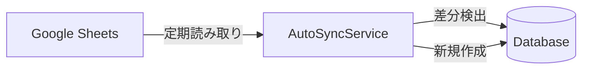

# Design Document: Auto-Sync Reliability Enhancement

## Overview

スプレッドシートに新しい売主が追加されたら、アプリを開いたときにそのデータが見れるようにする。

### 現在の問題点

1. **検出ロジックの問題**: 「最新の売主番号より大きい番号のみ」を対象としているため、途中に追加されたデータを見逃す
2. **環境変数の設定漏れ**: `AUTO_SYNC_ENABLED=true`が設定されていない可能性

### 解決方法

1. **全件比較方式に変更**: スプレッドシートの全売主番号とDBの全売主番号を比較し、DBにないものを同期
2. **デフォルト有効化**: 環境変数が未設定でも同期を有効化

## Architecture



## Components and Interfaces

### AutoSyncService の修正

```typescript
// 現在のロジック（問題あり）
const newRows = allRows.filter((row) => {
  const currentNum = parseInt(sellerNumber.replace('AA', ''), 10);
  const latestNum = parseInt(latestSellerNumber.replace('AA', ''), 10);
  return currentNum > latestNum;  // ← 最新より大きいもののみ
});

// 修正後のロジック
async syncNewSellers(): Promise<AutoSyncResult> {
  // 1. DBの全売主番号を取得
  const dbSellerNumbers = await this.getAllDbSellerNumbers();
  
  // 2. スプレッドシートの全売主番号を取得
  const sheetRows = await this.sheetsClient.readAll();
  
  // 3. DBにない売主を特定（全件比較）
  const missingRows = sheetRows.filter(row => {
    const sellerNumber = row['売主番号'];
    return sellerNumber && !dbSellerNumbers.has(sellerNumber);
  });
  
  // 4. 不足分を同期
  for (const row of missingRows) {
    await this.syncSeller(row);
  }
}
```

## Data Models

既存のテーブルをそのまま使用。変更なし。

## Correctness Properties

*A property is a characteristic or behavior that should hold true across all valid executions of a system-essentially, a formal statement about what the system should do. Properties serve as the bridge between human-readable specifications and machine-verifiable correctness guarantees.*

### Property 1: Missing seller detection completeness
*For any* set of seller numbers in the spreadsheet and any set of seller numbers in the database, the sync function SHALL detect and create all sellers that exist in the spreadsheet but not in the database.
**Validates: Requirements 1.1, 1.2, 1.3**

### Property 2: Data mapping correctness
*For any* seller row from the spreadsheet, the synced database record SHALL contain correctly mapped fields including unit conversion for valuations (万円 → 円).
**Validates: Requirements 5.1, 5.3**

## Error Handling

- 個別レコードでエラーが発生しても、他のレコードの同期は継続
- エラーはログに記録

## Testing Strategy

### Property-Based Tests

Property-based testing library: **fast-check**

1. **Property 1 test**: ランダムな売主番号セットを生成し、差分検出の正確性を検証
2. **Property 2 test**: ランダムな売主データを生成し、マッピングの正確性を検証
