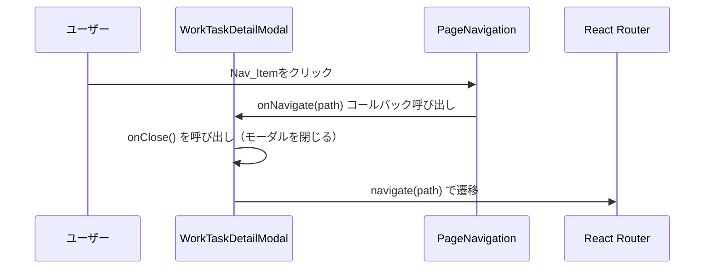
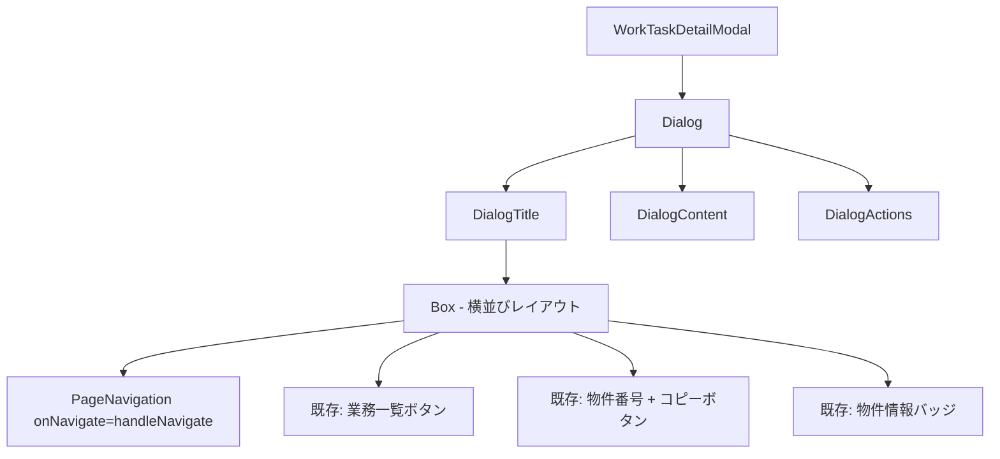

# 設計ドキュメント: 業務リスト詳細画面ヘッダーナビゲーション

## 概要

`WorkTaskDetailModal`の`DialogTitle`内に`PageNavigation`コンポーネントを追加し、業務詳細画面から他の主要画面（売主リスト・買主リスト・物件リスト・共有・公開物件サイト）へワンクリックで遷移できるようにする。

参照実装として`BuyerDetailPage`が`PageNavigation`を`onNavigate`コールバック経由で使用しているパターンを踏襲する。フロントエンドのみの変更であり、バックエンド変更は不要。

## アーキテクチャ

### 変更対象

- `frontend/frontend/src/components/WorkTaskDetailModal.tsx` のみ

### 変更なし

- `frontend/frontend/src/components/PageNavigation.tsx`（既存コンポーネントをそのまま再利用）
- バックエンド一切

### データフロー



### コンポーネント構成



## コンポーネントとインターフェース

### WorkTaskDetailModal の変更点

#### 追加するインポート

```typescript
import { useNavigate } from 'react-router-dom';
import PageNavigation from './PageNavigation';
```

#### 追加するフック

```typescript
const navigate = useNavigate();
```

#### 追加するハンドラー

```typescript
const handleNavigate = (path: string) => {
  onClose();       // モーダルを閉じる
  navigate(path);  // 遷移する
};
```

#### DialogTitle のレイアウト変更

現在の`DialogTitle`内レイアウト（「業務一覧」ボタン・物件番号・バッジ）を維持しつつ、`PageNavigation`を追加する。

```tsx
<DialogTitle sx={{ p: 1 }}>
  <Box sx={{ display: 'flex', alignItems: 'center', gap: 1, flexWrap: 'wrap' }}>
    {/* 追加: ナビゲーションバー */}
    <PageNavigation onNavigate={handleNavigate} />
    {/* 既存: 業務一覧ボタン・物件番号・バッジ */}
    ...
  </Box>
</DialogTitle>
```

### PageNavigation インターフェース（変更なし）

```typescript
interface PageNavigationProps {
  onNavigate?: (url: string) => void;
}
```

`onNavigate`が提供された場合、各Nav_Itemクリック時にそのコールバックを呼び出す。公開物件サイトは`window.open`で新しいタブを開くため`onNavigate`は呼ばれない（PageNavigation内部で処理済み）。

## データモデル

本機能はUIナビゲーションのみであり、新規データモデルは不要。既存の`WorkTaskDetailModalProps`に変更はない。

```typescript
interface WorkTaskDetailModalProps {
  open: boolean;
  onClose: () => void;
  propertyNumber: string | null;
  onUpdate?: () => void;
  initialData?: Partial<WorkTaskData> | null;
}
```

## 正確性プロパティ

*プロパティとは、システムの全ての有効な実行において成立すべき特性・振る舞いのことであり、人間が読める仕様と機械で検証可能な正確性保証の橋渡しをする形式的な記述である。*

### Property 1: ナビゲーション時のモーダルクローズ

*For any* 内部ナビゲーションパス（`/`・`/buyers`・`/property-listings`・`/work-tasks`・`/shared-items`）に対して、`handleNavigate(path)`が呼ばれた時、`onClose`が必ず先に呼ばれ、その後`navigate(path)`が呼ばれること

**Validates: Requirements 2.1, 2.2, 2.3, 2.4, 2.5, 4.4**

## エラーハンドリング

### ナビゲーション失敗

React Routerの`navigate`は通常失敗しないが、存在しないパスへの遷移は404ページに遷移する。これは既存のルーティング設定で対応済みであり、本機能での追加対応は不要。

### モーダルクローズ失敗

`onClose`は親コンポーネントから渡されるコールバックであり、失敗ケースは親コンポーネントの責務。本機能では`onClose()`を呼び出すのみ。

### 公開物件サイトのポップアップブロック

`window.open`はブラウザのポップアップブロッカーによりブロックされる可能性があるが、これは`PageNavigation`コンポーネントの既存動作であり、本機能での変更対象外。

## テスト戦略

### PBT適用性の評価

本機能はUIコンポーネントの変更であり、主な変更点は「`onNavigate`コールバックが呼ばれた時にモーダルを閉じてから遷移する」という動作。この動作は全てのナビゲーションパスに対して同一のパターンが適用されるため、プロパティベーステストが適用可能。

### ユニットテスト

- `handleNavigate`が呼ばれた時に`onClose`が呼ばれることを確認
- `handleNavigate`が呼ばれた時に`navigate`が正しいパスで呼ばれることを確認
- `WorkTaskDetailModal`が開いた時に`PageNavigation`コンポーネントが存在することを確認
- 既存の「業務一覧」ボタン・物件番号・バッジが引き続き表示されることを確認

### プロパティベーステスト

**使用ライブラリ**: `fast-check`（TypeScript/React向けPBTライブラリ）

**Property 1: ナビゲーション時のモーダルクローズ**

```typescript
// Feature: business-detail-header-navigation, Property 1: ナビゲーション時のモーダルクローズ
it('任意の内部ナビゲーションパスに対してonCloseが先に呼ばれnavigateが後に呼ばれる', () => {
  fc.assert(
    fc.property(
      fc.constantFrom('/', '/buyers', '/property-listings', '/work-tasks', '/shared-items'),
      (path) => {
        const callOrder: string[] = [];
        const mockOnClose = jest.fn(() => callOrder.push('onClose'));
        const mockNavigate = jest.fn(() => callOrder.push('navigate'));
        
        // handleNavigateを呼び出す
        handleNavigate(path, mockOnClose, mockNavigate);
        
        expect(mockOnClose).toHaveBeenCalledTimes(1);
        expect(mockNavigate).toHaveBeenCalledWith(path);
        expect(callOrder[0]).toBe('onClose');
        expect(callOrder[1]).toBe('navigate');
      }
    ),
    { numRuns: 100 }
  );
});
```

### 統合テスト

- `WorkTaskDetailModal`を実際にレンダリングし、Nav_Itemクリック時にモーダルが閉じて遷移することをE2Eで確認
- モバイル幅でハンバーガーメニューが表示されることを確認

### 手動テスト

- デスクトップ: 各Nav_Itemクリック時にモーダルが閉じて正しいページに遷移することを確認
- モバイル: ハンバーガーアイコンクリックでドロワーが開き、Nav_Itemクリックで遷移することを確認
- 業務依頼ボタンがアクティブ状態（紫背景）で表示されることを確認
- 既存の「業務一覧」ボタン・物件番号・バッジが正常に表示・動作することを確認
