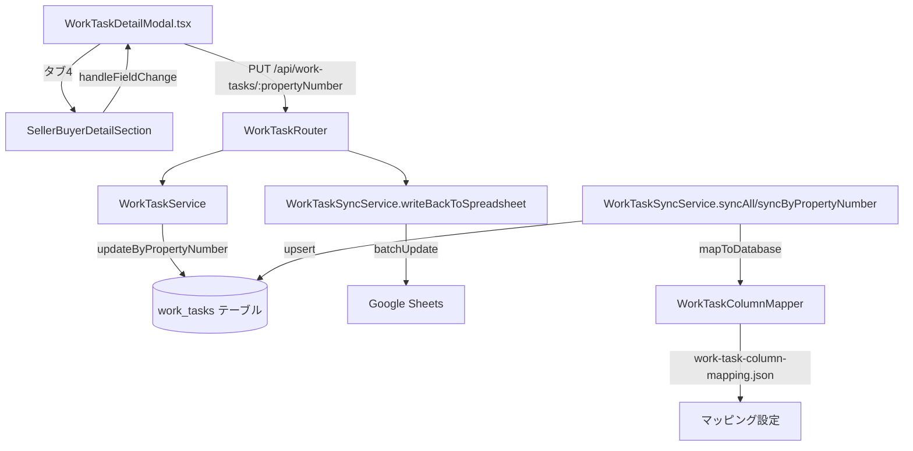

# 設計ドキュメント: 業務詳細画面「売主、買主詳細」タブ機能

## 概要

業務詳細画面（`WorkTaskDetailModal`）の「司法書士、相手側不動産情報」タブを「売主、買主詳細」タブに改名し、売主・買主の連絡先情報、ローン情報、引き渡し予定日などの新規フィールドを追加する。

新規フィールドはDBマイグレーション、バックエンドAPI、スプレッドシート同期の対応も含む。`loan_approval_scheduled_date`（融資承認予定日）は既存カラムのため、フロントエンドへの表示追加のみ行う。

---

## アーキテクチャ



### データフロー

1. **スプシ → DB（同期）**: `WorkTaskSyncService.syncAll` / `syncByPropertyNumber` → `WorkTaskColumnMapper.mapToDatabase` → `work_tasks` テーブルへ upsert
2. **フロントエンド → DB（保存）**: `WorkTaskDetailModal` → `PUT /api/work-tasks/:propertyNumber` → `WorkTaskService.updateByPropertyNumber`
3. **DB → スプシ（書き戻し）**: 保存API → `WorkTaskSyncService.writeBackToSpreadsheet` → Google Sheets batchUpdate

---

## コンポーネントとインターフェース

### フロントエンド

#### WorkTaskDetailModal.tsx の変更点

**タブラベル変更**:
```typescript
// 変更前
const tabLabels = ['媒介契約', 'サイト登録', '契約決済', '司法書士、相手側不動産情報'];

// 変更後
const tabLabels = ['媒介契約', 'サイト登録', '契約決済', '売主、買主詳細'];
```

**JudicialScrivenerSection → SellerBuyerDetailSection へのリネームと拡張**:

既存の `JudicialScrivenerSection` コンポーネントを `SellerBuyerDetailSection` にリネームし、新規フィールドを追加する。

```typescript
const SellerBuyerDetailSection = () => (
  <Box sx={{ p: 2 }}>
    {/* 売主情報 */}
    <SectionHeader label="【売主情報】" />
    <EditableField label="売主名前" field="seller_contact_name" />
    <EditableField label="売主メアド" field="seller_contact_email" />
    <EditableField label="売主TEL" field="seller_contact_tel" />

    {/* 買主情報 */}
    <SectionHeader label="【買主情報】" />
    <EditableField label="買主名前" field="buyer_contact_name" />
    <EditableField label="買主メアド" field="buyer_contact_email" />
    <EditableField label="買主TEL" field="buyer_contact_tel" />

    {/* ローン・金融機関 */}
    <SectionHeader label="【ローン情報】" />
    <EditableButtonSelect label="ローン" field="loan" options={['あり', 'なし']} />
    <EditableField label="金融機関名" field="financial_institution" />

    {/* 日程 */}
    <SectionHeader label="【日程】" />
    <EditableField label="引き渡し予定" field="delivery_scheduled_date" type="date" />
    <EditableField label="融資承認予定日" field="loan_approval_scheduled_date" type="date" />

    {/* 既存フィールド（司法書士・仲介業者情報） */}
    <SectionHeader label="【司法書士・仲介業者情報】" />
    <EditableField label="司法書士" field="judicial_scrivener" />
    <EditableField label="司法書士連絡先" field="judicial_scrivener_contact" />
    <EditableField label="仲介業者" field="broker" />
    <EditableField label="仲介業者担当連絡先" field="broker_contact" />
  </Box>
);
```

**タブコンテンツのレンダリング変更**:
```typescript
// 変更前
{tabIndex === 3 && <JudicialScrivenerSection />}

// 変更後
{tabIndex === 3 && <SellerBuyerDetailSection />}
```

### バックエンド

#### WorkTaskService.ts

変更なし。`updateByPropertyNumber` は `Partial<WorkTaskData>` を受け取り、`[key: string]: any` 型定義により新規フィールドを自動的に処理する。

#### WorkTaskSyncService.ts

変更なし。`writeBackToSpreadsheet` は `getMappingConfig()` から逆マッピングを動的に構築するため、`work-task-column-mapping.json` にマッピングを追加するだけで新規フィールドの書き戻しが自動的に対応される。

#### work-task-column-mapping.json

新規フィールドのマッピングを `spreadsheetToDatabase2` または新規セクションに追加する。

---

## データモデル

### DBマイグレーション

`work_tasks` テーブルに以下のカラムを追加する：

| カラム名 | 型 | 説明 |
|---|---|---|
| `seller_contact_name` | `TEXT` | 売主名前 |
| `seller_contact_email` | `TEXT` | 売主メールアドレス |
| `seller_contact_tel` | `TEXT` | 売主電話番号 |
| `buyer_contact_name` | `TEXT` | 買主名前 |
| `buyer_contact_email` | `TEXT` | 買主メールアドレス |
| `buyer_contact_tel` | `TEXT` | 買主電話番号 |
| `loan` | `TEXT` | ローン（「あり」「なし」） |
| `financial_institution` | `TEXT` | 金融機関名 |
| `delivery_scheduled_date` | `DATE` | 引き渡し予定日 |

`loan_approval_scheduled_date`（融資承認予定日）は既存カラムのため追加不要。

**マイグレーションSQL**:
```sql
ALTER TABLE work_tasks
  ADD COLUMN IF NOT EXISTS seller_contact_name TEXT,
  ADD COLUMN IF NOT EXISTS seller_contact_email TEXT,
  ADD COLUMN IF NOT EXISTS seller_contact_tel TEXT,
  ADD COLUMN IF NOT EXISTS buyer_contact_name TEXT,
  ADD COLUMN IF NOT EXISTS buyer_contact_email TEXT,
  ADD COLUMN IF NOT EXISTS buyer_contact_tel TEXT,
  ADD COLUMN IF NOT EXISTS loan TEXT,
  ADD COLUMN IF NOT EXISTS financial_institution TEXT,
  ADD COLUMN IF NOT EXISTS delivery_scheduled_date DATE;
```

### work-task-column-mapping.json の変更

`spreadsheetToDatabase2` に以下を追加する：

```json
"売主名前": "seller_contact_name",
"売主メアド": "seller_contact_email",
"売主TEL": "seller_contact_tel",
"買主名前": "buyer_contact_name",
"買主メアド": "buyer_contact_email",
"買主TEL": "buyer_contact_tel",
"ローン": "loan",
"金融機関名": "financial_institution",
"引き渡し予定": "delivery_scheduled_date"
```

`typeConversions` に以下を追加する：

```json
"delivery_scheduled_date": "date"
```

`融資承認予定日` → `loan_approval_scheduled_date` のマッピングは既存のため変更不要。

---

## 正確性プロパティ

*プロパティとは、システムの全ての有効な実行において真であるべき特性または振る舞いのことです。プロパティは人間が読める仕様と機械で検証可能な正確性保証の橋渡しをします。*

### プロパティ1: 新規フィールドの保存ラウンドトリップ

*任意の* 有効な文字列値（売主名前・売主メアド・売主TEL・買主名前・買主メアド・買主TEL・金融機関名）を `work_tasks` テーブルの対応するカラムに保存した場合、その後の取得で同じ値が返される。

**Validates: Requirements 2.4, 3.4, 4.3**

### プロパティ2: 日付フィールドの保存ラウンドトリップ

*任意の* 有効な日付文字列（YYYY-MM-DD形式）を `delivery_scheduled_date` または `loan_approval_scheduled_date` に保存した場合、その後の取得で同じ日付値が返される。

**Validates: Requirements 5.2, 6.2**

### プロパティ3: スプシカラム名→DBカラム名マッピングの一意性

*任意の* スプレッドシートカラム名に対して、`WorkTaskColumnMapper` は一意のDBカラム名を返す。すなわち、異なるスプシカラム名が同じDBカラム名にマッピングされることはない。

**Validates: Requirements 9.4**

---

## エラーハンドリング

### スプシカラムが存在しない場合

`writeBackToSpreadsheet` は既存の実装通り、スプシにカラムが存在しない場合（`colIndex === -1`）はそのフィールドをスキップし、DBへの保存には影響させない。新規フィールドがスプシに追加されていない環境でも安全に動作する。

```typescript
// 既存の実装（変更不要）
const colIndex = headers.indexOf(sheetCol);
if (colIndex === -1) continue; // スプシにカラムがなければスキップ
```

### DBカラムが存在しない場合

マイグレーション未実施の場合、Supabaseの `update` はエラーを返す。`WorkTaskService.updateByPropertyNumber` はエラーをスローし、APIは500エラーを返す。マイグレーションを先に実施することで回避する。

### フロントエンドのフィールド値がnullの場合

`EditableField` コンポーネントは `getValue(field) || ''` でnullをフォールバックするため、未入力フィールドは空文字として表示される。保存時は `null` として送信される（`e.target.value || null`）。

---

## テスト戦略

### ユニットテスト

- `WorkTaskColumnMapper` のマッピング設定テスト
  - 新規フィールドのスプシカラム名→DBカラム名マッピングが正しいことを確認
  - `delivery_scheduled_date` が `date` 型として設定されていることを確認
  - マッピングの一意性を確認

- `WorkTaskDetailModal` のタブラベルテスト
  - `tabLabels[3]` が「売主、買主詳細」であることを確認
  - 既存タブ（インデックス0〜2）の名称が変更されていないことを確認

- `SellerBuyerDetailSection` のレンダリングテスト
  - 全新規フィールドが表示されることを確認
  - 既存フィールド（司法書士・仲介業者情報）が引き続き表示されることを確認
  - ローンフィールドが「あり」「なし」のボタン選択として表示されることを確認

### プロパティベーステスト

プロパティベーステストには **fast-check**（TypeScript/JavaScript向けPBTライブラリ）を使用する。各テストは最低100回のイテレーションを実行する。

**プロパティ1: 新規フィールドの保存ラウンドトリップ**
```typescript
// Feature: business-detail-seller-buyer-tab, Property 1: 新規フィールドの保存ラウンドトリップ
fc.assert(fc.asyncProperty(
  fc.record({
    seller_contact_name: fc.string(),
    seller_contact_email: fc.string(),
    seller_contact_tel: fc.string(),
    buyer_contact_name: fc.string(),
    buyer_contact_email: fc.string(),
    buyer_contact_tel: fc.string(),
    financial_institution: fc.string(),
  }),
  async (fields) => {
    await workTaskService.updateByPropertyNumber(testPropertyNumber, fields);
    const result = await workTaskService.getByPropertyNumber(testPropertyNumber);
    return Object.entries(fields).every(([key, value]) => result?.[key] === value);
  }
), { numRuns: 100 });
```

**プロパティ2: 日付フィールドの保存ラウンドトリップ**
```typescript
// Feature: business-detail-seller-buyer-tab, Property 2: 日付フィールドの保存ラウンドトリップ
fc.assert(fc.asyncProperty(
  fc.date({ min: new Date('2020-01-01'), max: new Date('2030-12-31') }),
  async (date) => {
    const dateStr = date.toISOString().split('T')[0]; // YYYY-MM-DD
    await workTaskService.updateByPropertyNumber(testPropertyNumber, {
      delivery_scheduled_date: dateStr,
    });
    const result = await workTaskService.getByPropertyNumber(testPropertyNumber);
    return result?.delivery_scheduled_date === dateStr;
  }
), { numRuns: 100 });
```

**プロパティ3: スプシカラム名→DBカラム名マッピングの一意性**
```typescript
// Feature: business-detail-seller-buyer-tab, Property 3: マッピングの一意性
fc.assert(fc.property(
  fc.constant(new WorkTaskColumnMapper()),
  (mapper) => {
    const config = mapper.getMappingConfig();
    const dbColumns = Object.values(config.spreadsheetToDb);
    const uniqueDbColumns = new Set(dbColumns);
    return dbColumns.length === uniqueDbColumns.size;
  }
), { numRuns: 1 }); // 決定論的なテストなので1回で十分
```

### インテグレーションテスト

- `PUT /api/work-tasks/:propertyNumber` に新規フィールドを含むリクエストを送信し、DBに正しく保存されることを確認
- `WorkTaskSyncService.syncByPropertyNumber` を実行し、スプシの新規フィールドがDBに反映されることを確認（モックスプシデータ使用）
- `writeBackToSpreadsheet` がスプシにカラムが存在しない場合でもエラーなく動作することを確認

### スモークテスト

- マイグレーション後に `work_tasks` テーブルに新規カラムが存在することを確認
