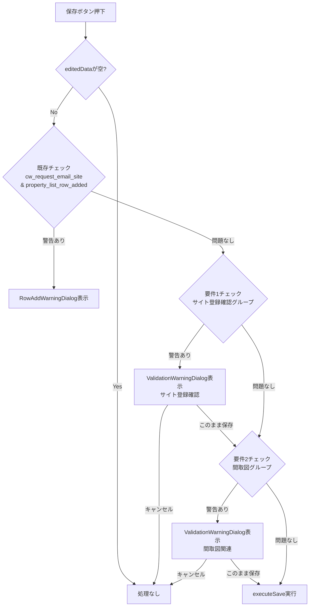

# デザインドキュメント：業務詳細画面バリデーション警告機能

## 概要

`WorkTaskDetailModal` の保存処理に、フィールド整合性チェックを追加する。対象は以下の2グループ：

1. **サイト登録確認グループ**：`site_registration_confirmed` と `site_registration_ok_sent` の片方だけ入力されている場合に警告
2. **間取図関連グループ**：`floor_plan_confirmer`、`floor_plan_ok_sent`、`floor_plan_completed_date`、`floor_plan_stored_email` のうち一部だけ入力されている場合に警告

どちらの警告も「このまま保存する」ボタンを提供し、ユーザーが警告を無視して保存できるようにする。

## アーキテクチャ

### 変更対象ファイル

- `frontend/frontend/src/components/WorkTaskDetailModal.tsx`（主要変更）

### 設計方針

既存の `RowAddWarningDialog` パターンを踏襲する。`WorkTaskDetailModal` 内に：

1. バリデーションロジックを純粋関数として切り出す
2. `ValidationWarningDialog` コンポーネントを追加する
3. `handleSave` にバリデーションチェックを組み込む
4. 複数警告の順序制御を実装する



## コンポーネントとインターフェース

### ValidationWarningDialog

新規コンポーネント。既存の `RowAddWarningDialog` と同様のパターンで実装する。

```typescript
interface ValidationWarningDialogProps {
  open: boolean;
  title: string;           // 警告タイトル（例：「サイト登録確認関連フィールドに未入力項目があります」）
  emptyFields: string[];   // 空欄フィールド名の一覧
  onConfirm: () => void;   // 「このまま保存する」押下時
  onCancel: () => void;    // 「キャンセル」押下時
}
```

### バリデーション関数

`WorkTaskDetailModal` 内に純粋関数として定義する。

```typescript
// フィールドの最終値を取得（editedData優先、なければdata）
type GetValueFn = (field: string) => any;

// サイト登録確認グループのバリデーション
// 片方だけ入力されている場合にtrueを返す
function checkSiteRegistrationWarning(getValue: GetValueFn): {
  hasWarning: boolean;
  emptyFields: string[];
}

// 間取図グループのバリデーション
// 一部入力・一部空欄の場合にtrueを返す
function checkFloorPlanWarning(getValue: GetValueFn): {
  hasWarning: boolean;
  emptyFields: string[];
}
```

### handleSave の変更

```typescript
const handleSave = async () => {
  if (!propertyNumber || Object.keys(editedData).length === 0) return;

  // 既存チェック（RowAddWarningDialog）
  const cwEmailSite = getValue('cw_request_email_site');
  const rowAdded = getValue('property_list_row_added');
  if (cwEmailSite && !rowAdded) {
    setRowAddWarningDialog({ open: true });
    return;
  }

  // 要件1チェック（サイト登録確認グループ）
  const siteResult = checkSiteRegistrationWarning(getValue);
  if (siteResult.hasWarning) {
    setValidationWarningDialog({
      open: true,
      title: 'サイト登録確認関連フィールドに未入力項目があります',
      emptyFields: siteResult.emptyFields,
      onConfirmAction: 'site', // 確認後に要件2チェックへ進む
    });
    return;
  }

  // 要件2チェック（間取図グループ）
  const floorResult = checkFloorPlanWarning(getValue);
  if (floorResult.hasWarning) {
    setValidationWarningDialog({
      open: true,
      title: '間取図関連フィールドに未入力項目があります',
      emptyFields: floorResult.emptyFields,
      onConfirmAction: 'floor',
    });
    return;
  }

  await executeSave();
};
```

### validationWarningDialog 状態

```typescript
const [validationWarningDialog, setValidationWarningDialog] = useState<{
  open: boolean;
  title: string;
  emptyFields: string[];
  onConfirmAction: 'site' | 'floor' | null;
}>({ open: false, title: '', emptyFields: [], onConfirmAction: null });
```

「このまま保存する」押下時のハンドラ：

```typescript
const handleValidationWarningConfirm = async () => {
  const action = validationWarningDialog.onConfirmAction;
  setValidationWarningDialog(prev => ({ ...prev, open: false }));

  if (action === 'site') {
    // 要件1をスキップして要件2チェックへ
    const floorResult = checkFloorPlanWarning(getValue);
    if (floorResult.hasWarning) {
      setValidationWarningDialog({
        open: true,
        title: '間取図関連フィールドに未入力項目があります',
        emptyFields: floorResult.emptyFields,
        onConfirmAction: 'floor',
      });
      return;
    }
  }

  await executeSave();
};
```

## データモデル

### フィールド空欄判定

空欄とは `''`、`null`、`undefined` のいずれかを指す。

```typescript
const isEmpty = (value: any): boolean =>
  value === '' || value === null || value === undefined;
```

### サイト登録確認グループのフィールドマッピング

| フィールドキー | 表示名 |
|---|---|
| `site_registration_confirmed` | サイト登録確認 |
| `site_registration_ok_sent` | サイト登録確認OK送信 |

### 間取図グループのフィールドマッピング

| フィールドキー | 表示名 |
|---|---|
| `floor_plan_confirmer` | 間取図確認者 |
| `floor_plan_ok_sent` | 間取図確認OK送信 |
| `floor_plan_completed_date` | 間取図完了日 |
| `floor_plan_stored_email` | 間取図格納済み連絡メール |

### バリデーション条件の論理

**サイト登録確認グループ**（2フィールド）：

| confirmed | ok_sent | 警告 |
|---|---|---|
| 空欄 | 空欄 | なし（両方空欄は正常） |
| 入力済み | 入力済み | なし（両方入力済みは正常） |
| 空欄 | 入力済み | あり（片方だけ） |
| 入力済み | 空欄 | あり（片方だけ） |

**間取図グループ**（4フィールド）：

- 全て空欄 → 警告なし
- 全て入力済み → 警告なし
- 一部入力・一部空欄 → 警告あり（空欄フィールドを列挙）

## 正確性プロパティ

*プロパティとは、システムの全ての有効な実行において真であるべき特性や振る舞いのことです。プロパティは人間が読める仕様と機械で検証可能な正確性保証の橋渡しをします。*

### Property 1: サイト登録確認バリデーションの正確性

*任意の* `site_registration_confirmed` と `site_registration_ok_sent` の値の組み合わせに対して、`checkSiteRegistrationWarning` は「片方だけ入力されている場合かつその場合に限り」`hasWarning: true` を返す。すなわち、XOR条件（一方が空欄で他方が非空欄）が成立する場合のみ警告が発生する。

**Validates: Requirements 1.2, 1.9, 1.10**

### Property 2: 間取図グループバリデーションの正確性

*任意の* `floor_plan_confirmer`、`floor_plan_ok_sent`、`floor_plan_completed_date`、`floor_plan_stored_email` の値の組み合わせに対して、`checkFloorPlanWarning` は「少なくとも1つが入力済みかつ少なくとも1つが空欄の場合かつその場合に限り」`hasWarning: true` を返す。全て空欄または全て入力済みの場合は `hasWarning: false` を返す。

**Validates: Requirements 2.2, 2.9, 2.10**

### Property 3: 空欄フィールド名の完全性

*任意の* フィールド値の組み合わせに対して、バリデーション関数が返す `emptyFields` 配列は、空欄と判定されたフィールドの表示名を過不足なく含む。すなわち、空欄フィールドは全て列挙され、入力済みフィールドは含まれない。

**Validates: Requirements 1.4, 2.4**

### Property 4: 最終値計算の優先順位

*任意の* `editedData` と `data` の組み合わせに対して、`getValue(field)` は `editedData[field]` が `undefined` でない場合はその値を返し、`undefined` の場合は `data[field]` を返す。

**Validates: Requirements 1.1, 2.1**

## エラーハンドリング

- バリデーション関数は例外を投げない。`data` が `null` の場合は全フィールドを空欄として扱う。
- `ValidationWarningDialog` は `open: false` の場合は何もレンダリングしない（MUI Dialog の標準動作）。
- 保存処理中（`saving: true`）は保存ボタンが無効化されるため、二重送信は発生しない。

## テスト戦略

### PBT適用判断

このフィーチャーはバリデーションロジック（純粋関数）を含むため、プロパティベーステストが適用可能。

### ユニットテスト（例ベース）

- `ValidationWarningDialog` のレンダリング確認（メッセージ、ボタン、アイコン）
- 「このまま保存する」ボタン押下時に `onConfirm` が呼ばれること
- 「キャンセル」ボタン押下時に `onCancel` が呼ばれること
- 要件1警告後に要件2チェックが実行されること（順序制御）
- 要件1キャンセル後に要件2チェックが実行されないこと

### プロパティベーステスト（fast-check 使用）

最小100イテレーション。各テストは対応するデザインプロパティを参照する。

**Property 1のテスト**：
```typescript
// Feature: business-detail-validation-warning, Property 1: サイト登録確認バリデーションの正確性
fc.assert(fc.property(
  fc.record({
    confirmed: fc.oneof(fc.constant(''), fc.constant(null), fc.constant(undefined), fc.constant('確認中'), fc.constant('完了'), fc.constant('他')),
    okSent: fc.oneof(fc.constant(''), fc.constant(null), fc.constant(undefined), fc.constant('Y'), fc.constant('N')),
  }),
  ({ confirmed, okSent }) => {
    const result = checkSiteRegistrationWarning(field =>
      field === 'site_registration_confirmed' ? confirmed : okSent
    );
    const confirmedEmpty = isEmpty(confirmed);
    const okSentEmpty = isEmpty(okSent);
    const expectedWarning = confirmedEmpty !== okSentEmpty; // XOR
    return result.hasWarning === expectedWarning;
  }
), { numRuns: 100 });
```

**Property 2のテスト**：
```typescript
// Feature: business-detail-validation-warning, Property 2: 間取図グループバリデーションの正確性
fc.assert(fc.property(
  fc.record({
    confirmer: fc.oneof(fc.constant(''), fc.constant(null), fc.constant(undefined), fc.string()),
    okSent: fc.oneof(fc.constant(''), fc.constant(null), fc.constant(undefined), fc.constant('Y')),
    completedDate: fc.oneof(fc.constant(''), fc.constant(null), fc.constant(undefined), fc.string()),
    storedEmail: fc.oneof(fc.constant(''), fc.constant(null), fc.constant(undefined), fc.constant('Y')),
  }),
  ({ confirmer, okSent, completedDate, storedEmail }) => {
    const values = { floor_plan_confirmer: confirmer, floor_plan_ok_sent: okSent, floor_plan_completed_date: completedDate, floor_plan_stored_email: storedEmail };
    const result = checkFloorPlanWarning(field => values[field as keyof typeof values]);
    const emptyCount = [confirmer, okSent, completedDate, storedEmail].filter(isEmpty).length;
    const expectedWarning = emptyCount > 0 && emptyCount < 4;
    return result.hasWarning === expectedWarning;
  }
), { numRuns: 100 });
```

**Property 3のテスト**：
```typescript
// Feature: business-detail-validation-warning, Property 3: 空欄フィールド名の完全性
fc.assert(fc.property(
  fc.record({
    confirmer: fc.oneof(fc.constant(''), fc.constant(null), fc.string()),
    okSent: fc.oneof(fc.constant(''), fc.constant(null), fc.constant('Y')),
    completedDate: fc.oneof(fc.constant(''), fc.constant(null), fc.string()),
    storedEmail: fc.oneof(fc.constant(''), fc.constant(null), fc.constant('Y')),
  }),
  ({ confirmer, okSent, completedDate, storedEmail }) => {
    const values = { floor_plan_confirmer: confirmer, floor_plan_ok_sent: okSent, floor_plan_completed_date: completedDate, floor_plan_stored_email: storedEmail };
    const result = checkFloorPlanWarning(field => values[field as keyof typeof values]);
    const expectedEmpty = Object.entries(values).filter(([, v]) => isEmpty(v)).map(([k]) => FLOOR_PLAN_FIELD_LABELS[k]);
    return JSON.stringify(result.emptyFields.sort()) === JSON.stringify(expectedEmpty.sort());
  }
), { numRuns: 100 });
```

**Property 4のテスト**：
```typescript
// Feature: business-detail-validation-warning, Property 4: 最終値計算の優先順位
fc.assert(fc.property(
  fc.record({
    editedValue: fc.oneof(fc.constant(undefined), fc.string()),
    dataValue: fc.oneof(fc.constant(undefined), fc.string()),
  }),
  ({ editedValue, dataValue }) => {
    const editedData = editedValue !== undefined ? { testField: editedValue } : {};
    const data = dataValue !== undefined ? { testField: dataValue } : {};
    const getValue = (field: string) => editedData[field] !== undefined ? editedData[field] : data[field];
    const result = getValue('testField');
    const expected = editedValue !== undefined ? editedValue : dataValue;
    return result === expected;
  }
), { numRuns: 100 });
```
