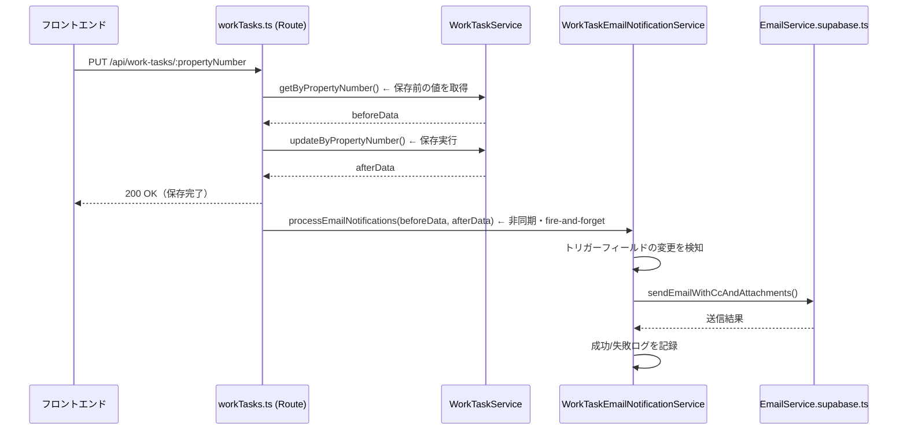

# 設計ドキュメント：業務リスト自動メール送信機能

## 概要

業務リスト（WorkTasksPage）の保存時に、特定フィールドの変更を検知して自動メールを送信する機能。

`PUT /api/work-tasks/:propertyNumber` エンドポイントで保存前後の値を比較し、6つのトリガーフィールドのいずれかが変更された場合に、対応するメールテンプレートで指定の宛先へメールを送信する。

メール送信は非同期・ベストエフォートで行い、送信失敗は保存処理をブロックしない。

---

## アーキテクチャ



### 設計方針

- **Email_Rule 配列による一元管理**: 全メール送信ルールを配列で定義し、新しいルールの追加は配列へのエントリ追加のみで対応できる
- **既存 EmailService の活用**: `EmailService.supabase.ts` の `sendEmailWithCcAndAttachments` メソッドを再利用し、Gmail API 経由で送信する
- **非同期・ベストエフォート**: メール送信は `Promise` を `.catch()` で囲み、失敗しても保存レスポンスに影響しない
- **テンプレート変数の純粋関数化**: `resolveTemplate(template, data)` を副作用のない純粋関数として実装し、テスト容易性を確保する

---

## コンポーネントとインターフェース

### 新規作成: `WorkTaskEmailNotificationService`

**ファイルパス**: `backend/src/services/WorkTaskEmailNotificationService.ts`

```typescript
// メール送信ルールの定義
export interface EmailRule {
  triggerField: string;           // トリガーフィールド名（DBカラム名）
  to: string;                     // 宛先メールアドレス
  cc?: string;                    // CCメールアドレス
  subjectTemplate: string;        // 件名テンプレート（{変数名}形式）
  bodyTemplate: string;           // 本文テンプレート（{変数名}形式、HTML）
}

// テンプレート変数のカラムマッピング
export interface TemplateVariableMapping {
  [templateVar: string]: string;  // テンプレート変数名 → DBカラム名
}

// サービスの公開インターフェース
export class WorkTaskEmailNotificationService {
  // トリガーフィールドの変更を検知してメールを送信する
  async processEmailNotifications(
    propertyNumber: string,
    beforeData: Record<string, any>,
    afterData: Record<string, any>
  ): Promise<void>;

  // テンプレート変数を解決する（純粋関数・テスト用にexport）
  resolveTemplate(template: string, data: Record<string, any>): string;

  // 日付フィールドをJST形式に変換する（純粋関数・テスト用にexport）
  formatDateToJST(isoString: string | null | undefined): string;
}
```

### 変更: `workTasks.ts` の PUT エンドポイント

保存前に `getByPropertyNumber` で現在値を取得し、保存後に `processEmailNotifications` を非同期呼び出しする。

```typescript
router.put('/:propertyNumber', async (req: Request, res: Response) => {
  // 1. 保存前の値を取得
  const beforeData = await workTaskService.getByPropertyNumber(propertyNumber);

  // 2. 保存実行
  const workTask = await workTaskService.updateByPropertyNumber(propertyNumber, updates);

  // 3. レスポンスを返す（メール送信を待たない）
  res.json({ message: '更新が完了しました', data: workTask });

  // 4. メール送信（非同期・失敗しても保存に影響しない）
  emailNotificationService
    .processEmailNotifications(propertyNumber, beforeData ?? {}, workTask ?? {})
    .catch((e) => console.error('[WorkTaskEmail] 通知処理エラー:', e.message));
});
```

---

## データモデル

### Email_Rule 配列（全6ルール）

| triggerField | to | cc | 件名テンプレート |
|---|---|---|---|
| `cw_request_email_floor_plan` | `freetask.e72@gmail.com` | `tenant@ifoo-oita.com` | `間取図作成関係お願いいたします！{物件番号}{物件所在}（㈱いふう）` |
| `cw_request_email_2f_above` | `freetask.e72@gmail.com` | `tenant@ifoo-oita.com` | `間取図作成関係お願いいたします！{物件番号}{物件所在}（㈱いふう）` |
| `floor_plan_ok_send` | `freetask.e72@gmail.com` | `tenant@ifoo-oita.com` | `図面ありがとうございます！{物件番号}{物件所在}（㈱いふう）` |
| `cw_request_email_site_registration` | `shiraishi8biz@gmail.com` | `tenant@ifoo-oita.com` | `サイト登録関係お願いいたします！{物件番号}{物件所在}（㈱いふう）` |
| `site_registration_ok_send` | `shiraishi8biz@gmail.com` | `tenant@ifoo-oita.com` | `サイト登録ありがとうございます！{物件番号}{物件所在}（㈱いふう）` |
| `floor_plan_stored_notification` | `shiraishi8biz@gmail.com` | `tenant@ifoo-oita.com` | `間取図格納済みです！{物件番号}{物件所在}（㈱いふう）` |

### テンプレート変数マッピング

| テンプレート変数 | DBカラム名 | 特記事項 |
|---|---|---|
| `{物件番号}` | `property_number` | |
| `{物件所在}` | `property_address` | |
| `{コメント（間取図関係）}` | `floor_plan_comment` | |
| `{道路寸法}` | `road_dimensions` | |
| `{間取図完了予定}` | `floor_plan_due_date` | ISO 8601 → `YYYY-MM-DD HH:mm` (JST) に変換 |
| `{格納先URL}` | `storage_url` | |
| `{間取図確認OK/修正コメント}` | `floor_plan_ok_comment` | |
| `{コメント（サイト登録）}` | `site_registration_comment` | |
| `{サイト登録依頼日}` | `site_registration_request_date` | |
| `{サイト登録依頼者}` | `site_registration_requester` | |
| `{サイト登録納期予定日}` | `site_registration_due_date` | |
| `{パノラマ}` | `panorama` | |
| `{スプシURL}` | `spreadsheet_url` | |
| `{サイト登録確認OKコメント}` | `site_registration_ok_comment` | |

### トリガーフィールドの値型

全トリガーフィールドは `'Y' | 'N' | null` の3値を取る。変更検知は `beforeValue !== afterValue` の単純比較で行う（`null` と `'N'` は異なる値として扱う）。

---

## 正確性プロパティ

*プロパティとは、システムの全ての有効な実行において成立すべき特性や振る舞いのことです。プロパティは人間が読める仕様と機械で検証可能な正確性保証の橋渡しをします。*

### プロパティ1: 変更検知の正確性

*任意の* トリガーフィールド名と、保存前後の値のペア `(before, after)` に対して、`before !== after` の場合にのみメール送信が呼び出され、`before === after` の場合はメール送信が呼び出されない。

**Validates: Requirements 1.2, 1.3, 1.4, 1.5, 1.6, 1.7, 1.8**

### プロパティ2: テンプレート変数解決の完全性

*任意の* WorkTaskData オブジェクトに対して、`resolveTemplate(template, data)` を呼び出した結果に `{` と `}` で囲まれた未解決の変数が残らない（全変数が解決されるか空文字に置換される）。

**Validates: Requirements 4.1, 4.4, 2.4, 8.4, 9.4, 10.4, 11.4**

### プロパティ3: null フィールドの安全な置換

*任意の* テンプレート変数に対して、対応する DBカラムの値が `null` または空文字の場合、`resolveTemplate` はエラーをスローせず、その変数を空文字に置換した文字列を返す。

**Validates: Requirements 4.4, 2.4**

### プロパティ4: 日付フォーマット変換の正確性

*任意の* ISO 8601 形式の日時文字列に対して、`formatDateToJST` は `YYYY-MM-DD HH:mm` 形式（日本時間 UTC+9）の文字列を返す。

**Validates: Requirements 4.3**

---

## エラーハンドリング

### メール送信失敗時

```
保存処理 → 成功レスポンス返却 → メール送信（非同期）
                                    ↓ 失敗
                              エラーログ記録のみ
                              （保存レスポンスには影響しない）
```

- `processEmailNotifications` 内の各メール送信は `try/catch` で囲む
- 1つのトリガーフィールドのメール送信が失敗しても、他のフィールドの処理は継続する
- エラーログには物件番号・宛先・トリガーフィールド名・エラーメッセージを含める

### Gmail API 認証失敗時

- `EmailService.supabase.ts` の既存エラーハンドリングに委譲する
- 認証エラーは `WorkTaskEmailNotificationService` でキャッチしてログに記録する

### ログ形式

```
// 成功時
[WorkTaskEmail] メール送信成功: { propertyNumber, to, triggerField }

// 失敗時
[WorkTaskEmail] メール送信失敗: { propertyNumber, to, triggerField, error }
```

---

## テスト戦略

### ユニットテスト（`WorkTaskEmailNotificationService`）

`resolveTemplate` と `formatDateToJST` は副作用のない純粋関数として実装するため、外部依存なしでテストできる。

**テスト対象**:
- `resolveTemplate`: 全テンプレート変数が正しく解決されること
- `resolveTemplate`: null/空文字フィールドが空文字に置換されること
- `formatDateToJST`: ISO 8601 → `YYYY-MM-DD HH:mm` (JST) 変換
- `processEmailNotifications`: 変更検知ロジック（EmailService をモック化）

### プロパティベーステスト

プロパティベーステストには **fast-check**（TypeScript 対応の PBT ライブラリ）を使用する。各プロパティテストは最低 100 回のイテレーションで実行する。

**プロパティ1のテスト実装方針**:
```typescript
// Feature: business-floor-plan-email-notification, Property 1: 変更検知の正確性
fc.assert(fc.property(
  fc.constantFrom(...TRIGGER_FIELDS),  // 任意のトリガーフィールド
  fc.option(fc.constantFrom('Y', 'N'), { nil: null }),  // before値
  fc.option(fc.constantFrom('Y', 'N'), { nil: null }),  // after値
  (field, before, after) => {
    const mockSend = jest.fn();
    // before !== after の場合のみ送信が呼び出されることを検証
    if (before !== after) {
      expect(mockSend).toHaveBeenCalledTimes(1);
    } else {
      expect(mockSend).not.toHaveBeenCalled();
    }
  }
));
```

**プロパティ2・3のテスト実装方針**:
```typescript
// Feature: business-floor-plan-email-notification, Property 2: テンプレート変数解決の完全性
fc.assert(fc.property(
  fc.record({ property_number: fc.string(), property_address: fc.string(), ... }),
  (data) => {
    const result = service.resolveTemplate(template, data);
    // 未解決の変数が残らないことを検証
    expect(result).not.toMatch(/\{[^}]+\}/);
  }
));
```

**プロパティ4のテスト実装方針**:
```typescript
// Feature: business-floor-plan-email-notification, Property 4: 日付フォーマット変換の正確性
fc.assert(fc.property(
  fc.date(),  // 任意のDateオブジェクト
  (date) => {
    const iso = date.toISOString();
    const result = service.formatDateToJST(iso);
    // YYYY-MM-DD HH:mm 形式であることを検証
    expect(result).toMatch(/^\d{4}-\d{2}-\d{2} \d{2}:\d{2}$/);
  }
));
```

### 統合テスト

- Gmail API への実際の送信は統合テストで 1-2 例確認する
- 環境変数（`GMAIL_CLIENT_ID` 等）が設定されている場合のみ実行する

### テストファイルの配置

```
backend/src/services/__tests__/WorkTaskEmailNotificationService.test.ts
```
