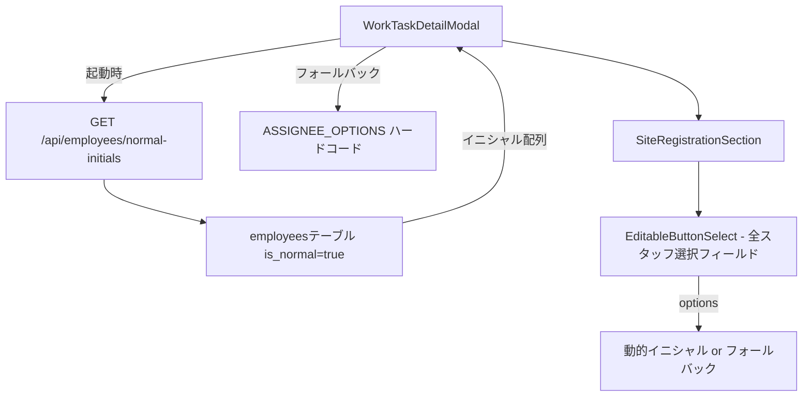

# デザインドキュメント: 業務リストUI複数改善

## 概要

`WorkTaskDetailModal` コンポーネントと `/api/employees/normal-initials` バックエンドエンドポイントに対して、以下の8つの改善を行う。

1. 字図・地積測量図URLフィールドのボタン選択化
2. 地積測量図・字図（営業入力）の編集不可化
3. サイト登録依頼コメントの編集不可化
4. パノラマフィールドのボタン選択化
5. `/api/employees/normal-initials` のフィルタ条件修正（`is_active` → `is_normal`）
6. 間取図修正回数フィールドへの説明書き追加
7. 「確認後処理」セクションのメール配信フィールド表示修正
8. 全スタッフ選択フィールドの動的イニシャル取得

## アーキテクチャ



変更対象ファイル:
- `frontend/frontend/src/components/WorkTaskDetailModal.tsx` — フロントエンド改善
- `backend/src/routes/employees.ts` — `normal-initials` エンドポイント修正

## コンポーネントとインターフェース

### フロントエンド変更

#### 1. スタッフイニシャル取得フック（新規）

```typescript
function useNormalInitials(): string[] {
  const [initials, setInitials] = useState<string[]>(ASSIGNEE_OPTIONS);
  useEffect(() => {
    api.get('/api/employees/normal-initials')
      .then(res => {
        if (res.data.initials?.length > 0) setInitials(res.data.initials);
      })
      .catch(() => { /* フォールバック: ASSIGNEE_OPTIONS のまま */ });
  }, []);
  return initials;
}
```

モーダルコンポーネント内で `useNormalInitials()` を呼び出し、返された配列を全スタッフ選択フィールドの `options` に渡す。

#### 2. 字図・地積測量図URLフィールド（要件1）

現在: `EditableField type="url"` → 変更後: `EditableButtonSelect options={['URL入力済み', '未']}`

`cadastral_map_url` フィールドに選択値を保存する。

#### 3. 読み取り専用フィールド（要件2・3）

- `cadastral_map_sales_input`: `EditableField` → `ReadOnlyDisplayField`
- `site_registration_requestor`: `TextField multiline` → `ReadOnlyDisplayField`（複数行対応のため `Typography` で改行を表示）

#### 4. パノラマフィールド（要件4）

現在: `EditableField type="text"` → 変更後: `EditableButtonSelect options={['あり']}`

#### 5. 間取図修正回数への説明書き（要件6）

`EditableButtonSelect` の直後に `RedNote` コンポーネントを追加:

```
ここでの修正とは、当社のミスによる修正のことです。CWの方のミスによる修正はカウントNGです！！
```

#### 6. メール配信フィールド修正（要件7）

「確認後処理」セクションの `ReadOnlyDisplayField label="メール配信"` の `value` を `getValue('email_distribution') || null` に修正。

### バックエンド変更

#### `/api/employees/normal-initials` エンドポイント（要件5）

```typescript
// 変更前
.eq('is_active', true)

// 変更後
.eq('is_normal', true)
```

## データモデル

### employeesテーブル（既存）

| カラム | 型 | 説明 |
|--------|-----|------|
| `initials` | text | スタッフのイニシャル |
| `is_active` | boolean | 有効フラグ（現在使用中） |
| `is_normal` | boolean | 通常スタッフフラグ（スタッフ管理シートの「通常」列） |

`is_normal=true` のスタッフが業務リストのスタッフ選択ボタンに表示される対象。

### WorkTaskData インターフェース（既存・変更なし）

`cadastral_map_url`、`panorama`、`email_distribution` 等のフィールドは既に定義済み。

## Correctness Properties

*A property is a characteristic or behavior that should hold true across all valid executions of a system — essentially, a formal statement about what the system should do. Properties serve as the bridge between human-readable specifications and machine-verifiable correctness guarantees.*

### Property 1: ボタン選択値とハイライトの一致

*For any* `EditableButtonSelect` コンポーネントにおいて、フィールドの現在値と一致するオプションのボタンが `contained` バリアントでレンダリングされ、それ以外のボタンは `outlined` バリアントでレンダリングされる。

**Validates: Requirements 1.3**

### Property 2: is_normal フィルタリングの正確性

*For any* `employees` テーブルのデータセットに対して、`/api/employees/normal-initials` エンドポイントが返すイニシャル一覧は `is_normal=true` のスタッフのイニシャルのみを含み、`is_normal=false` または `null` のスタッフのイニシャルを含まない。

**Validates: Requirements 5.1**

### Property 3: 動的イニシャルの全フィールド適用

*For any* `useNormalInitials()` が返すイニシャル配列に対して、`WorkTaskDetailModal` 内の全スタッフ選択フィールド（`sales_assignee`、`mediation_creator`、`employee_contract_creation`、`site_registration_requester`、`floor_plan_confirmer`）の `EditableButtonSelect` の `options` がその配列と等しい。

**Validates: Requirements 8.2, 5.3**

## エラーハンドリング

### API取得失敗時のフォールバック

`useNormalInitials()` フックは API 呼び出しが失敗した場合、初期値として設定した `ASSIGNEE_OPTIONS` をそのまま返す。`catch` ブロックで `setInitials` を呼ばないことで、デフォルト値が維持される。

### 空配列レスポンス時のフォールバック

API が空配列を返した場合も `ASSIGNEE_OPTIONS` を維持する（`res.data.initials?.length > 0` の条件チェック）。

### 読み取り専用フィールドの null 値

`ReadOnlyDisplayField` は `value` が `null` または空文字の場合、空文字または「-」を表示する（既存の実装に準拠）。

## テスト戦略

### ユニットテスト（例ベース）

- `WorkTaskDetailModal` が開いた時に `/api/employees/normal-initials` が呼び出されること
- API エラー時に `ASSIGNEE_OPTIONS` がフォールバックとして使用されること
- `property_type='土'` の場合に字図・地積測量図URLがボタン選択で表示されること
- `cadastral_map_sales_input` フィールドが `ReadOnlyDisplayField` として表示されること
- `site_registration_requestor` フィールドが `ReadOnlyDisplayField` として表示されること
- パノラマフィールドが `EditableButtonSelect options={['あり']}` として表示されること
- 間取図修正回数フィールドの下に `RedNote` が表示されること
- 「確認後処理」の「メール配信」に `email_distribution` の値が表示されること
- `email_distribution` が空の場合に空文字または「-」が表示されること

### プロパティベーステスト

プロパティベーステストには [fast-check](https://github.com/dubzzz/fast-check)（TypeScript/JavaScript 向け）を使用する。各テストは最低100回実行する。

**Property 1: ボタン選択値とハイライトの一致**

```typescript
// Feature: business-list-ui-enhancement, Property 1: ボタン選択値とハイライトの一致
fc.assert(fc.property(
  fc.constantFrom('URL入力済み', '未'),
  (selectedValue) => {
    const { getByText } = render(
      <EditableButtonSelect field="cadastral_map_url" options={['URL入力済み', '未']} ... />
    );
    // selectedValue のボタンが contained、それ以外が outlined であることを確認
  }
), { numRuns: 100 });
```

**Property 2: is_normal フィルタリングの正確性**

```typescript
// Feature: business-list-ui-enhancement, Property 2: is_normal フィルタリングの正確性
fc.assert(fc.property(
  fc.array(fc.record({
    initials: fc.string({ minLength: 1 }),
    is_normal: fc.boolean(),
  })),
  async (employees) => {
    // モックDBにemployeesを設定
    // エンドポイントを呼び出し
    // 返されたイニシャルが全てis_normal=trueのスタッフのものであることを確認
    const result = await callNormalInitialsEndpoint(employees);
    const normalInitials = employees.filter(e => e.is_normal).map(e => e.initials);
    return result.every(i => normalInitials.includes(i)) &&
           normalInitials.every(i => result.includes(i));
  }
), { numRuns: 100 });
```

**Property 3: 動的イニシャルの全フィールド適用**

```typescript
// Feature: business-list-ui-enhancement, Property 3: 動的イニシャルの全フィールド適用
fc.assert(fc.property(
  fc.array(fc.string({ minLength: 1 }), { minLength: 1 }),
  (initials) => {
    // useNormalInitialsがinitialsを返すようにモック
    const { getAllByRole } = render(<WorkTaskDetailModal ... />);
    // 全スタッフ選択フィールドのボタングループがinitialsと一致することを確認
  }
), { numRuns: 100 });
```

### インテグレーションテスト

- `/api/employees/normal-initials` エンドポイントが実際のDBに対して `is_normal=true` のスタッフのみを返すこと（1〜2例）
