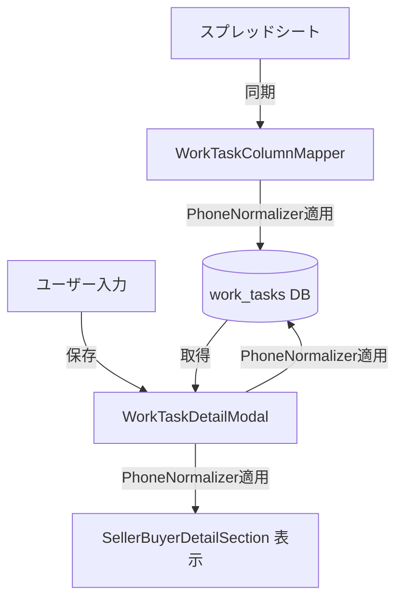

# 設計書：業務電話番号先頭「0」自動補完

## 概要

業務依頼（business detail）画面の売主TEL・買主TELフィールドにおいて、日本の電話番号の先頭「0」が欠落している場合に自動補完する機能を実装する。

補完は以下の3箇所で行う：
1. **フロントエンド保存時** — `WorkTaskDetailModal` の保存処理
2. **フロントエンド表示時** — DBから取得した値の表示前
3. **バックエンド同期時** — `WorkTaskColumnMapper.mapToDatabase` でのスプレッドシート→DB変換

補完ロジックは `PhoneNormalizer` ユーティリティ関数として一元管理し、フロントエンド・バックエンド双方から利用する。

---

## アーキテクチャ



### 設計方針

- **単一責任**: 補完ロジックは `PhoneNormalizer` に集約し、フロントエンド・バックエンドで同一ロジックを使用
- **防御的設計**: null/undefined/空文字は変換せずそのまま返す
- **非破壊的**: 先頭「0」以外の文字列内容は一切変更しない
- **既存コードへの最小変更**: `EditableField` コンポーネントや `convertValue` メソッドは変更せず、呼び出し側で補完を適用

---

## コンポーネントとインターフェース

### 1. PhoneNormalizer（フロントエンド）

**ファイル**: `frontend/frontend/src/utils/phoneNormalizer.ts`

```typescript
/**
 * 電話番号の先頭「0」補完ユーティリティ
 */

/**
 * 電話番号文字列の先頭が「0」でない場合に「0」を付加する
 * - null/undefined/空文字はそのまま返す
 * - 先頭が既に「0」の場合はそのまま返す
 * - 文字列の内容（ハイフン・括弧・特殊文字）は変更しない
 */
export function normalizePhoneNumber(tel: string | null | undefined): string | null | undefined {
  if (tel === null || tel === undefined || tel === '') {
    return tel;
  }
  if (tel.startsWith('0')) {
    return tel;
  }
  return '0' + tel;
}
```

### 2. PhoneNormalizer（バックエンド）

**ファイル**: `backend/src/utils/phoneNormalizer.ts`

フロントエンドと同一ロジック。バックエンド側でも独立して利用できるよう別ファイルとして配置する。

```typescript
/**
 * 電話番号の先頭「0」補完ユーティリティ
 */
export function normalizePhoneNumber(tel: string | null | undefined): string | null | undefined {
  if (tel === null || tel === undefined || tel === '') {
    return tel;
  }
  if (tel.startsWith('0')) {
    return tel;
  }
  return '0' + tel;
}
```

### 3. WorkTaskDetailModal（フロントエンド）の変更点

**ファイル**: `frontend/frontend/src/components/WorkTaskDetailModal.tsx`

#### 保存時の補完（`executeSave` 前処理）

`handleSave` → `executeSave` の呼び出し前に、`editedData` 内の `seller_contact_tel` / `buyer_contact_tel` に `normalizePhoneNumber` を適用する。

```typescript
// executeSave 内で保存データを構築する際に補完を適用
const normalizedData = {
  ...editedData,
  ...(editedData.seller_contact_tel !== undefined && {
    seller_contact_tel: normalizePhoneNumber(editedData.seller_contact_tel) ?? null,
  }),
  ...(editedData.buyer_contact_tel !== undefined && {
    buyer_contact_tel: normalizePhoneNumber(editedData.buyer_contact_tel) ?? null,
  }),
};
await api.put(`/api/work-tasks/${propertyNumber}`, normalizedData);
```

#### 表示時の補完（`getValue` 関数）

`getValue` 関数で `seller_contact_tel` / `buyer_contact_tel` を返す際に補完を適用する。

```typescript
const getValue = (field: string) => {
  const raw = editedData[field] !== undefined ? editedData[field] : data?.[field];
  if (field === 'seller_contact_tel' || field === 'buyer_contact_tel') {
    return normalizePhoneNumber(raw) ?? raw;
  }
  return raw;
};
```

### 4. WorkTaskColumnMapper（バックエンド）の変更点

**ファイル**: `backend/src/services/WorkTaskColumnMapper.ts`

`mapToDatabase` メソッド内で `seller_contact_tel` / `buyer_contact_tel` カラムに対して `normalizePhoneNumber` を適用する。

```typescript
import { normalizePhoneNumber } from '../utils/phoneNormalizer';

// mapToDatabase メソッド内
const TEL_COLUMNS = ['seller_contact_tel', 'buyer_contact_tel'];

for (const [sheetColumn, dbColumn] of Object.entries(this.spreadsheetToDb)) {
  const value = sheetRow[sheetColumn];
  
  if (value === null || value === undefined || value === '') {
    dbData[dbColumn] = null;
    continue;
  }

  const targetType = this.typeConversions[dbColumn];
  const converted = this.convertValue(value, targetType);
  
  // 電話番号カラムは先頭「0」補完を適用
  if (TEL_COLUMNS.includes(dbColumn)) {
    dbData[dbColumn] = normalizePhoneNumber(converted as string) ?? null;
  } else {
    dbData[dbColumn] = converted;
  }
}
```

---

## データモデル

### work_tasks テーブル（変更なし）

既存カラムをそのまま使用する。スキーマ変更は不要。

| カラム名 | 型 | 説明 |
|---|---|---|
| `seller_contact_tel` | TEXT | 売主電話番号（先頭「0」補完済みで保存） |
| `buyer_contact_tel` | TEXT | 買主電話番号（先頭「0」補完済みで保存） |

### 補完ロジックの入出力仕様

| 入力値 | 出力値 | 備考 |
|---|---|---|
| `"90-1234-5678"` | `"090-1234-5678"` | 先頭「0」なし → 補完 |
| `"090-1234-5678"` | `"090-1234-5678"` | 先頭「0」あり → そのまま |
| `""` | `""` | 空文字 → そのまま |
| `null` | `null` | null → そのまま |
| `undefined` | `undefined` | undefined → そのまま |
| `"0"` | `"0"` | 「0」のみ → そのまま |
| `"abc"` | `"0abc"` | 非数字文字列 → 先頭「0」補完のみ |

---

## 正確性プロパティ

*プロパティとは、システムの全ての有効な実行において成立すべき特性や振る舞いのことです。プロパティは人間が読める仕様と機械検証可能な正確性保証の橋渡しとなります。*

### Property 1: PhoneNormalizerの先頭0補完

*For any* 先頭が「0」でない非空文字列 `s` に対して、`normalizePhoneNumber(s)` の結果は `"0" + s` と等しい

**Validates: Requirements 1.1, 1.4, 1.5**

### Property 2: PhoneNormalizerのべき等性

*For any* 先頭が「0」である文字列 `s` に対して、`normalizePhoneNumber(s)` の結果は `s` と等しい（変更なし）

**Validates: Requirements 1.2, 2.3**

### Property 3: mapToDatabaseでの電話番号補完

*For any* 先頭が「0」でない電話番号文字列を「売主TEL」または「買主TEL」カラムに含む `SheetRow` に対して、`WorkTaskColumnMapper.mapToDatabase` の結果の `seller_contact_tel` / `buyer_contact_tel` は先頭「0」が付加された値になる

**Validates: Requirements 3.1, 3.2**

### Property 4: 表示時の補完

*For any* 先頭が「0」でない値が `seller_contact_tel` または `buyer_contact_tel` に格納されている `WorkTaskData` に対して、`getValue` 関数が返す値は先頭「0」が付加された値になる

**Validates: Requirements 4.1, 4.2**

---

## エラーハンドリング

### 補完ロジックのエラー

`normalizePhoneNumber` は純粋関数であり、例外を発生させない。入力値の型チェックを行い、予期しない型（数値など）が渡された場合は文字列に変換してから処理する。

### 保存時のエラー

既存の `executeSave` のエラーハンドリング（`try/catch` + Snackbar表示）をそのまま使用する。補完処理は保存前の前処理であるため、補完自体でエラーは発生しない。

### スプレッドシート同期時のエラー

`WorkTaskColumnMapper.mapToDatabase` は既存のエラーハンドリングをそのまま使用する。補完処理は変換後の値に対して適用するため、既存の型変換エラーには影響しない。

---

## テスト戦略

### ユニットテスト

`PhoneNormalizer` の具体的なケースを検証する：

- 先頭「0」なし → 補完されること
- 先頭「0」あり → 変更なしであること
- 空文字 → そのまま返ること
- null → そのまま返ること
- undefined → そのまま返ること
- ハイフンあり（`"90-1234-5678"`）→ `"090-1234-5678"` になること
- 括弧あり（`"(90)1234-5678"`）→ `"0(90)1234-5678"` になること

`WorkTaskColumnMapper.mapToDatabase` の電話番号補完：

- 「売主TEL」に先頭「0」なし値 → `seller_contact_tel` が補完されること
- 「買主TEL」に先頭「0」なし値 → `buyer_contact_tel` が補完されること
- 他カラムの変換結果が変わらないこと

### プロパティベーステスト

プロパティベーステストには [fast-check](https://github.com/dubzzz/fast-check)（TypeScript向け）を使用する。各プロパティテストは最低100回のイテレーションで実行する。

**Property 1のテスト実装方針**:
```typescript
// Feature: business-phone-number-zero-prefix, Property 1: PhoneNormalizerの先頭0補完
fc.assert(fc.property(
  fc.string().filter(s => s.length > 0 && !s.startsWith('0')),
  (s) => normalizePhoneNumber(s) === '0' + s
), { numRuns: 100 });
```

**Property 2のテスト実装方針**:
```typescript
// Feature: business-phone-number-zero-prefix, Property 2: PhoneNormalizerのべき等性
fc.assert(fc.property(
  fc.string().filter(s => s.startsWith('0')),
  (s) => normalizePhoneNumber(s) === s
), { numRuns: 100 });
```

**Property 3のテスト実装方針**:
```typescript
// Feature: business-phone-number-zero-prefix, Property 3: mapToDatabaseでの電話番号補完
fc.assert(fc.property(
  fc.string().filter(s => s.length > 0 && !s.startsWith('0')),
  (tel) => {
    const row = { '売主TEL': tel, '買主TEL': tel };
    const result = mapper.mapToDatabase(row);
    return result.seller_contact_tel === '0' + tel &&
           result.buyer_contact_tel === '0' + tel;
  }
), { numRuns: 100 });
```

**Property 4のテスト実装方針**:
```typescript
// Feature: business-phone-number-zero-prefix, Property 4: 表示時の補完
fc.assert(fc.property(
  fc.string().filter(s => s.length > 0 && !s.startsWith('0')),
  (tel) => {
    // getValue関数のロジックを直接テスト
    const data = { seller_contact_tel: tel };
    const result = getValueWithNormalization('seller_contact_tel', data);
    return result === '0' + tel;
  }
), { numRuns: 100 });
```
