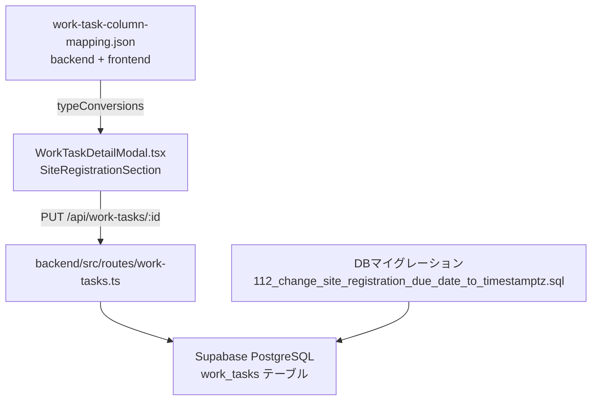

# 技術設計書

## 機能名
業務依頼リスト「サイト登録」タブ拡張機能

## 概要

社内管理システム（sateituikyaku-admin）の業務依頼リスト詳細モーダル（`WorkTaskDetailModal.tsx`）の「サイト登録」タブに対して以下の変更を行う。

1. `site_registration_due_date`（サイト登録納期予定日）: DBカラムを `DATE` → `TIMESTAMPTZ` に変更し、UIを `datetime-local` 入力に変更
2. `floor_plan_due_date`（間取図完了予定）: DBは変更済みのため、UIのみ `datetime-local` 入力に変更
3. 「メール配信v」フィールドの直下に `site_registration_ok_comment`（サイト登録確認OKコメント）と `site_registration_ok_sent`（サイト登録確認OK送信）を追加

---

## アーキテクチャ



変更は以下の4レイヤーに分かれる：

| レイヤー | 変更内容 |
|---------|---------|
| DB | `site_registration_due_date` を `DATE` → `TIMESTAMPTZ` に変更（マイグレーション112） |
| バックエンド設定 | `work-task-column-mapping.json` の `typeConversions` を更新 |
| フロントエンド設定 | 同上（フロントエンド側コピー） |
| フロントエンドUI | `WorkTaskDetailModal.tsx` の `SiteRegistrationSection` を変更 |

---

## コンポーネントとインターフェース

### WorkTaskDetailModal.tsx の変更箇所

#### 1. `formatDateTimeForInput` 関数の追加

既存の `formatDateForInput`（`DATE` 型用）に加えて、`TIMESTAMPTZ` 値を `datetime-local` 形式（`YYYY-MM-DDTHH:mm`）に変換する関数を追加する。

```typescript
// TIMESTAMPTZ / DATE 文字列を datetime-local 形式に変換
const formatDateTimeForInput = (dateStr: string | null | undefined): string => {
  if (!dateStr) return '';
  try {
    const d = new Date(dateStr);
    if (isNaN(d.getTime())) return '';
    const yyyy = d.getFullYear();
    const MM = String(d.getMonth() + 1).padStart(2, '0');
    const dd = String(d.getDate()).padStart(2, '0');
    const hh = String(d.getHours()).padStart(2, '0');
    const mm = String(d.getMinutes()).padStart(2, '0');
    return `${yyyy}-${MM}-${dd}T${hh}:${mm}`;
  } catch {
    return '';
  }
};
```

**設計上の注意**: `new Date(dateStr)` はローカルタイムゾーンで解釈するため、Supabaseから返される `TIMESTAMPTZ` 値（UTC ISO文字列）をそのまま渡すと、ブラウザのタイムゾーンで表示される。これは既存の `floor_plan_due_date` の挙動と一致させる。

#### 2. `SiteRegistrationSection` の変更

**変更1: `site_registration_due_date` フィールドの `type` 変更**

現在:
```tsx
<TextField type="date" value={formatDateForInput(getValue('site_registration_due_date') || getDefaultDueDate())} ... />
```

変更後:
```tsx
<TextField
  type="datetime-local"
  value={formatDateTimeForInput(getValue('site_registration_due_date')) || getDefaultDueDatetime()}
  ...
/>
```

デフォルト値生成関数も `datetime-local` 形式（`YYYY-MM-DDTHH:mm`）を返すよう変更する：

```typescript
const getDefaultDueDatetime = () => {
  const today = new Date();
  const dayOfWeek = today.getDay();
  const daysToAdd = dayOfWeek === 2 ? 3 : 2;
  const result = new Date(today);
  result.setDate(today.getDate() + daysToAdd);
  result.setHours(12, 0, 0, 0);
  const yyyy = result.getFullYear();
  const MM = String(result.getMonth() + 1).padStart(2, '0');
  const dd = String(result.getDate()).padStart(2, '0');
  return `${yyyy}-${MM}-${dd}T12:00`;
};
```

**変更2: `floor_plan_due_date` フィールドの `type` 変更**

現在:
```tsx
<EditableField label="間取図完了予定*" field="floor_plan_due_date" type="date" />
```

変更後: `EditableField` の `type` を `"datetime-local"` に変更するか、直接 `TextField` で `datetime-local` を使用する。`EditableField` コンポーネントに `datetime-local` 対応を追加する。

**変更3: 新規フィールドの追加（確認関係エリア）**

「メール配信v」（`email_distribution`）フィールドの直下に以下を追加：

```tsx
<EditableField label="サイト登録確認OKコメント" field="site_registration_ok_comment" type="text" />
<EditableYesNo label="サイト登録確認OK送信" field="site_registration_ok_sent" />
```

#### 3. `EditableField` コンポーネントへの `datetime-local` 対応追加

現在の `EditableField` は `type` として `'text' | 'date' | 'number' | 'url'` を受け付ける。`'datetime-local'` を追加する：

```tsx
const EditableField = ({ label, field, type = 'text' }: {
  label: string;
  field: string;
  type?: 'text' | 'date' | 'datetime-local' | 'number' | 'url';
}) => (
  // ...
  {type === 'date' ? (
    <TextField type="date" value={formatDateForInput(getValue(field))} ... />
  ) : type === 'datetime-local' ? (
    <TextField type="datetime-local" value={formatDateTimeForInput(getValue(field))} ... />
  ) : /* 他のtype */}
);
```

---

## データモデル

### work_tasks テーブルの変更

| カラム名 | 変更前 | 変更後 | 備考 |
|---------|--------|--------|------|
| `site_registration_due_date` | `DATE` | `TIMESTAMPTZ` | マイグレーション112で変更 |
| `floor_plan_due_date` | `DATE` | `TIMESTAMPTZ` | マイグレーション100で変更済み |
| `site_registration_ok_comment` | `TEXT` | `TEXT` | マイグレーション040で定義済み、変更なし |
| `site_registration_ok_sent` | `TEXT` | `TEXT` | マイグレーション040で定義済み、変更なし |

### マイグレーション: 112_change_site_registration_due_date_to_timestamptz.sql

```sql
-- site_registration_due_date を DATE から TIMESTAMPTZ に変更
-- 理由: スプレッドシートにタイムスタンプ（日時）が入力されており、時刻情報も保存する必要があるため
-- 参考: migration 100 で floor_plan_due_date に同様の変更を実施済み

ALTER TABLE work_tasks
  ALTER COLUMN site_registration_due_date TYPE TIMESTAMPTZ
  USING site_registration_due_date::TIMESTAMPTZ;

COMMENT ON COLUMN work_tasks.site_registration_due_date IS 'サイト登録納期予定日（タイムスタンプ）';
```

### work-task-column-mapping.json の変更

`typeConversions` セクションの変更（バックエンド・フロントエンド両方）：

```json
"typeConversions": {
  "site_registration_due_date": "datetime",  // "date" → "datetime" に変更
  "floor_plan_due_date": "datetime",          // "date" → "datetime" に変更（確認・修正）
  // 他のエントリは変更なし
}
```

### WorkTaskData インターフェース

`site_registration_ok_comment` と `site_registration_ok_sent` は既に `WorkTaskData` インターフェースに定義済みのため変更不要：

```typescript
interface WorkTaskData {
  // ...
  site_registration_ok_comment: string;  // 既存
  site_registration_ok_sent: string;     // 既存
  // ...
}
```

---

## 正確性プロパティ

*プロパティとは、システムの全ての有効な実行において成立すべき特性や振る舞いのことです。プロパティは人間が読める仕様と機械で検証可能な正確性保証の橋渡しをします。*

本機能はUIコンポーネントの変更と設定ファイルの更新が主体であり、純粋な関数ロジックとして独立してテスト可能な部分は `formatDateTimeForInput` 関数のみである。この関数に対してプロパティベーステストが適用可能。

### Property 1: datetime-local 変換の正規化

*For any* 有効な日付・日時文字列（ISO 8601形式、DATE形式、TIMESTAMPTZ形式）に対して、`formatDateTimeForInput` 関数は `YYYY-MM-DDTHH:mm` 形式の文字列を返すか、空文字を返す。

**Validates: Requirements 1.3, 2.3**

### Property 2: null/空文字の安全な処理

*For any* null、undefined、または空文字の入力に対して、`formatDateTimeForInput` 関数は例外をスローせず空文字を返す。

**Validates: Requirements 1.3, 2.3**

---

## エラーハンドリング

### DBマイグレーション

- `USING site_registration_due_date::TIMESTAMPTZ` により既存の `DATE` 値は `TIMESTAMPTZ`（時刻部分は `00:00:00+00`）に変換される
- 既存データが `NULL` の場合はそのまま `NULL` として保持される
- マイグレーション失敗時はロールバック可能（`ALTER COLUMN TYPE` は DDL トランザクション内で実行）

### フロントエンドの日時変換

- `new Date(dateStr)` が無効な日付を返した場合（`isNaN(d.getTime())`）は空文字を返す
- `datetime-local` 入力でユーザーが値をクリアした場合、`e.target.value` は空文字になるため `handleFieldChange(field, null)` を呼ぶ

### 既存データの表示互換性

- `site_registration_due_date` の既存値は `DATE` 型（例: `2026-04-08`）
- マイグレーション後は `TIMESTAMPTZ`（例: `2026-04-08T00:00:00+00:00`）として返される
- `formatDateTimeForInput` はこの値を `2026-04-08T09:00`（JST）として表示する（ブラウザのタイムゾーン依存）

---

## テスト戦略

本機能はUIコンポーネントの変更が主体のため、PBTよりもexampleベースのテストが中心となる。

### ユニットテスト（例示ベース）

**`formatDateTimeForInput` 関数のテスト**:
- `'2026-04-08'` → `'2026-04-08T09:00'`（JST環境）
- `'2026-04-08T12:00:00+09:00'` → `'2026-04-08T12:00'`
- `null` → `''`
- `''` → `''`
- `'invalid'` → `''`

**`SiteRegistrationSection` コンポーネントのテスト**:
- `site_registration_due_date` フィールドが `type="datetime-local"` で描画されること
- `floor_plan_due_date` フィールドが `type="datetime-local"` で描画されること
- 「メール配信v」の直後に「サイト登録確認OKコメント」フィールドが存在すること
- 「サイト登録確認OKコメント」の直後に「サイト登録確認OK送信」フィールドが存在すること
- `site_registration_ok_sent` フィールドが Y/N ボタン（EditableYesNo）として描画されること

### プロパティベーステスト

**Property 1: datetime-local 変換の正規化**

```typescript
// fast-check を使用
import * as fc from 'fast-check';

test('formatDateTimeForInput: 有効な日付文字列は YYYY-MM-DDTHH:mm 形式を返す', () => {
  fc.assert(
    fc.property(
      fc.date({ min: new Date('2000-01-01'), max: new Date('2099-12-31') }),
      (date) => {
        const input = date.toISOString();
        const result = formatDateTimeForInput(input);
        // 空文字でなければ YYYY-MM-DDTHH:mm 形式であること
        if (result !== '') {
          expect(result).toMatch(/^\d{4}-\d{2}-\d{2}T\d{2}:\d{2}$/);
        }
      }
    ),
    { numRuns: 100 }
  );
  // Feature: business-request-site-registration-tab-enhancement, Property 1: datetime-local 変換の正規化
});
```

**Property 2: null/空文字の安全な処理**

```typescript
test('formatDateTimeForInput: null/undefined/空文字は空文字を返す', () => {
  fc.assert(
    fc.property(
      fc.oneof(fc.constant(null), fc.constant(undefined), fc.constant('')),
      (input) => {
        expect(() => formatDateTimeForInput(input)).not.toThrow();
        expect(formatDateTimeForInput(input)).toBe('');
      }
    ),
    { numRuns: 100 }
  );
  // Feature: business-request-site-registration-tab-enhancement, Property 2: null/空文字の安全な処理
});
```

### スモークテスト（手動確認）

- マイグレーション112実行後、`work_tasks.site_registration_due_date` のカラム型が `TIMESTAMPTZ` であること
- `work-task-column-mapping.json`（バックエンド・フロントエンド両方）の `typeConversions.site_registration_due_date` が `"datetime"` であること
- `work-task-column-mapping.json` の `typeConversions.floor_plan_due_date` が `"datetime"` であること
- `spreadsheetToDatabase3` に `"サイト登録確認OKコメント": "site_registration_ok_comment"` が存在すること
- `spreadsheetToDatabase3` に `"サイト登録確認OK送信": "site_registration_ok_sent"` が存在すること

### 統合テスト（手動確認）

- 既存の `DATE` 型データ（例: `2026-04-08`）がマイグレーション後も正しく `datetime-local` フィールドに表示されること
- `datetime-local` で入力した値がDBに `TIMESTAMPTZ` として保存されること
- 「サイト登録確認OKコメント」に入力したテキストが `site_registration_ok_comment` として保存されること
- 「サイト登録確認OK送信」で Y/N を選択した値が `site_registration_ok_sent` として保存されること
