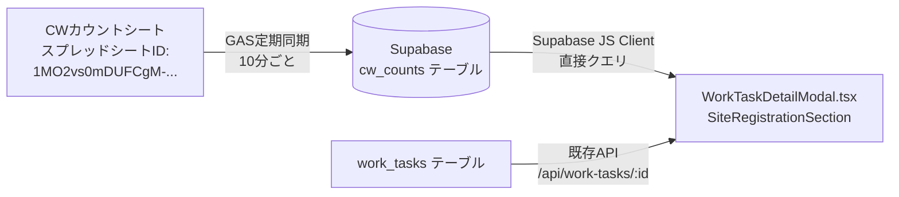

# 設計書：業務依頼リスト「サイト登録」タブへの表示追加機能

## 概要

本設計書は、社内管理システムの業務依頼リスト「サイト登録」タブに以下3つの表示項目を追加するための技術設計を定義する。

1. **「メール配信」の追加表示**：「確認後処理」セクションの「公開予定日」直下に `email_distribution` の値を赤字・読み取り専用で表示
2. **「間取図300円（CW）計」の追加表示**：「確認関係」セクションの「間取図完了日」直上にCWカウントデータを表示
3. **「サイト登録（CW）計」の追加表示**：「★サイト登録確認」セクションの「サイト登録確認OK送信」直下にCWカウントデータを表示

CWカウントデータの取得方法として**方法C（GASでSupabaseに定期同期）**を採用する。

---

## アーキテクチャ

### データフロー



### 採用理由（方法C）

- バックエンドAPIへの追加負荷を避けられる
- フロントエンドが既にSupabase JSクライアントを使用している場合、DBから直接取得可能
- GASは既存の `GyomuWorkTaskSync.gs` と同じスプレッドシートを参照しており、同一パターンで実装できる

---

## コンポーネントとインターフェース

### 1. 新規Supabaseテーブル：`cw_counts`

CWカウントシートのデータを格納するテーブル。GASが定期的にupsertする。

```sql
CREATE TABLE IF NOT EXISTS cw_counts (
  id UUID PRIMARY KEY DEFAULT gen_random_uuid(),
  item_name TEXT NOT NULL UNIQUE,   -- 「項目」列の値（例: 「間取図（300円）」「サイト登録」）
  current_total TEXT,               -- 「現在計」列の値
  synced_at TIMESTAMPTZ DEFAULT NOW(),
  updated_at TIMESTAMPTZ DEFAULT NOW()
);
```

### 2. GAS追加関数：`syncCwCounts()`

既存の `GyomuWorkTaskSync.gs` に追加する関数。CWカウントシートのデータをSupabaseの `cw_counts` テーブルに同期する。

**対象シート**: スプレッドシートID `1MO2vs0mDUFCgM-rjXXPRIy3pKKdfIFvUDwacM-2174g`、シート名「CWカウント」

**同期対象行**:
- 「項目」列 = `間取図（300円）` → `item_name = '間取図（300円）'`
- 「項目」列 = `サイト登録` → `item_name = 'サイト登録'`

**同期タイミング**: 既存の `syncGyomuWorkTasks()` と同じトリガー（10分ごと）で呼び出す

### 3. フロントエンド：`WorkTaskDetailModal.tsx` の変更

#### 3.1 CWカウントデータ取得フック

`SiteRegistrationSection` コンポーネント内でSupabaseから `cw_counts` テーブルを直接クエリする。

```typescript
// CWカウントデータの型
interface CwCountData {
  floorPlan300: string | null;   // 間取図（300円）の現在計
  siteRegistration: string | null; // サイト登録の現在計
}
```

#### 3.2 表示コンポーネント：`ReadOnlyDisplayField`

読み取り専用の表示フィールド（CWカウント表示用）。

```typescript
const ReadOnlyDisplayField = ({ label, value, labelColor }: {
  label: string;
  value: string | null;
  labelColor?: 'error' | 'text.secondary';
}) => (
  <Grid container spacing={2} alignItems="center" sx={{ mb: 1.5 }}>
    <Grid item xs={4}>
      <Typography variant="body2" color={labelColor || 'text.secondary'} sx={{ fontWeight: 500 }}>
        {label}
      </Typography>
    </Grid>
    <Grid item xs={8}>
      <Typography variant="body2">{value || ''}</Typography>
    </Grid>
  </Grid>
);
```

#### 3.3 変更箇所の概要

**「確認後処理」セクション（右側）**:
```
公開予定日（既存）
↓ 追加
メール配信（赤字ラベル、email_distribution の値、読み取り専用）
↓ 既存
メール配信（pre_distribution_check）
```

**「確認関係」セクション（右側）**:
```
間取図確認OK送信*（既存）
間取図修正回数（既存）
↓ 追加
間取図300円（CW)計⇒ {値}（読み取り専用）
↓ 既存
間取図完了日*
```

**「★サイト登録確認」セクション（右側）**:
```
サイト登録確認OK送信（既存）
↓ 追加
サイト登録（CW)計⇒ {値}（読み取り専用）
↓ 既存
（次の要素）
```

---

## データモデル

### `cw_counts` テーブル

| カラム名 | 型 | 説明 |
|---------|-----|------|
| `id` | UUID | 主キー |
| `item_name` | TEXT (UNIQUE) | 項目名（例: 「間取図（300円）」「サイト登録」） |
| `current_total` | TEXT | 現在計の値 |
| `synced_at` | TIMESTAMPTZ | 最終同期日時 |
| `updated_at` | TIMESTAMPTZ | 最終更新日時 |

### CWカウントシートの想定構造

| 列名 | 説明 |
|-----|------|
| 項目 | 作業種別（例: 「間取図（300円）」「サイト登録」） |
| 現在計 | 現在の集計値 |
| （その他列） | 同期対象外 |

### GASでの取得ロジック

```javascript
// CWカウントシートから「項目」と「現在計」を取得
// LOOKUP("現在計", "CWカウント", "項目", "間取図（300円）") に相当
function getCwCountValue(sheet, itemName) {
  var headers = sheet.getRange(1, 1, 1, sheet.getLastColumn()).getValues()[0];
  var itemColIndex = headers.indexOf('項目');
  var currentTotalColIndex = headers.indexOf('現在計');
  
  if (itemColIndex < 0 || currentTotalColIndex < 0) return null;
  
  var data = sheet.getRange(2, 1, sheet.getLastRow() - 1, sheet.getLastColumn()).getValues();
  for (var i = 0; i < data.length; i++) {
    if (String(data[i][itemColIndex]).trim() === itemName) {
      return String(data[i][currentTotalColIndex]).trim() || null;
    }
  }
  return null;
}
```

---

## 正確性プロパティ

*プロパティとは、システムの全ての有効な実行において成立すべき特性や振る舞いのことである。プロパティは人間が読める仕様と機械で検証可能な正確性保証の橋渡しをする。*

### Property 1: CWカウント表示フォーマットの一貫性

*For any* CWカウントの現在計の値（文字列または数値）に対して、「間取図300円（CW)計⇒ {値}」の形式でフォーマットされた文字列が返されること

**Validates: Requirements 2.2**

### Property 2: サイト登録CWカウント表示フォーマットの一貫性

*For any* CWカウントの現在計の値（文字列または数値）に対して、「サイト登録（CW)計⇒ {値}」の形式でフォーマットされた文字列が返されること

**Validates: Requirements 3.2**

### Property 3: email_distribution 値のパススルー

*For any* `email_distribution` の値（null、空文字列、任意の文字列）に対して、読み取り専用フィールドがその値をそのまま表示し、エラーを発生させないこと

**Validates: Requirements 1.4, 1.5**

---

## エラーハンドリング

### CWカウントデータ取得失敗時

| シナリオ | 対応 |
|---------|------|
| `cw_counts` テーブルが存在しない | フォールバック値「-」を表示 |
| 対象の `item_name` が見つからない | フォールバック値「-」を表示 |
| Supabaseクエリエラー | コンソールにエラーログ、フォールバック値「-」を表示 |
| `current_total` が null/空 | フォールバック値「-」を表示 |

### GAS同期失敗時

| シナリオ | 対応 |
|---------|------|
| CWカウントシートが見つからない | ログに記録してスキップ（業務依頼同期は継続） |
| 「項目」または「現在計」列が見つからない | ログに記録してスキップ |
| Supabase upsertエラー | ログに記録（次回の同期で再試行） |

### `email_distribution` 表示

| シナリオ | 対応 |
|---------|------|
| null | 空表示（エラーなし） |
| 空文字列 | 空表示（エラーなし） |
| 任意の文字列 | そのまま表示 |

---

## テスト戦略

### PBT適用性の評価

本機能はUIレンダリングとデータ表示が主体であるが、以下の純粋関数に対してプロパティベーステストが適用可能：
- CWカウント値のフォーマット関数（`formatCwCount`）
- `email_distribution` 値の表示ロジック

### ユニットテスト

**対象**: フォーマット関数、エラーハンドリングロジック

```typescript
// フォーマット関数のテスト例
describe('formatCwCount', () => {
  it('値がある場合は正しい形式で返す', () => {
    expect(formatCwCount('間取図300円（CW)計', '42')).toBe('間取図300円（CW)計⇒ 42');
  });
  it('値がnullの場合は「-」を返す', () => {
    expect(formatCwCount('間取図300円（CW)計', null)).toBe('-');
  });
});
```

### プロパティベーステスト

**ライブラリ**: `fast-check`（TypeScript/JavaScript向け）
**最小実行回数**: 100回

```typescript
// Property 1: CWカウント表示フォーマットの一貫性
// Feature: business-request-site-registration-tab-enhancement, Property 1: CWカウント表示フォーマットの一貫性
it('任意の値に対してフォーマットが一貫している', () => {
  fc.assert(fc.property(
    fc.string(),
    (value) => {
      const result = formatCwCount('間取図300円（CW)計', value);
      return result === `間取図300円（CW)計⇒ ${value}`;
    }
  ), { numRuns: 100 });
});

// Property 3: email_distribution 値のパススルー
// Feature: business-request-site-registration-tab-enhancement, Property 3: email_distribution 値のパススルー
it('任意のemail_distribution値でエラーが発生しない', () => {
  fc.assert(fc.property(
    fc.option(fc.string()),
    (value) => {
      // null/空/任意の文字列でエラーが発生しないことを確認
      expect(() => renderEmailDistributionField(value)).not.toThrow();
      return true;
    }
  ), { numRuns: 100 });
});
```

### インテグレーションテスト

**対象**: GAS同期後のSupabaseデータ確認

1. GASの `syncCwCounts()` を実行後、`cw_counts` テーブルに期待するデータが存在することを確認
2. フロントエンドがSupabaseから正しくデータを取得できることを確認（1〜2件のサンプルで確認）

### スモークテスト

1. GASのトリガーが正常に設定されていることを確認
2. `cw_counts` テーブルが存在し、RLSポリシーが適切に設定されていることを確認
