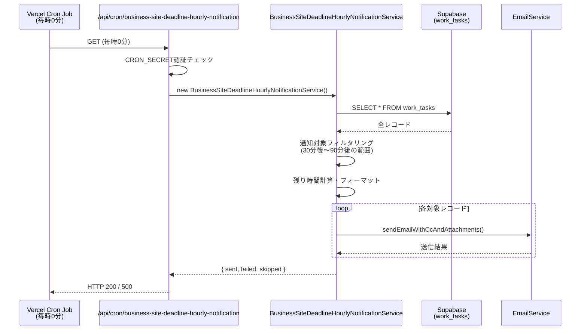

# 設計ドキュメント: 業務詳細サイト登録・間取図納期通知機能

## 概要

業務詳細の「サイト登録」タブにおいて、サイト登録納期（`site_registration_deadline`）および間取図完了予定（`floor_plan_due_date`）の約1時間前に、確認OK送信が未完了の場合に自動メール通知を送信する機能を実装する。

既存の `WorkTaskDeadlineNotificationService`（毎日JST 09:00に締切日当日通知）および `WorkTaskEmailNotificationService`（フィールド変更トリガー通知）とは独立した、**時刻ベースの通知**として実装する。

Vercel Cron Job（毎時0分実行）から呼び出されるバックエンドAPIエンドポイントとして実装し、対象レコードを `work_tasks` テーブルから取得してメールを送信する。メールの件名・本文には、Cron Job実行時点から納期までの**実際の残り時間を動的に計算**して表示する。

### 設計方針

- 既存の `WorkTaskDeadlineNotificationService` のパターンを踏襲し、独立したサービスクラスとして実装
- `EmailService.sendEmailWithCcAndAttachments()` を使用してメール送信
- Cron Jobエンドポイントは `backend/src/index.ts` に直接定義（既存パターンと統一）
- 残り時間フォーマット関数は純粋関数として実装し、テスト容易性を確保
- 日付のみ（時刻なし）の `site_registration_deadline` はJST 00:00:00として解釈

---

## アーキテクチャ



### 既存システムとの関係

```
WorkTaskDeadlineNotificationService  ← 毎日JST 09:00（締切日当日通知）
WorkTaskEmailNotificationService     ← フィールド変更トリガー通知
BusinessSiteDeadlineHourlyNotificationService  ← 毎時0分（1時間前通知）★新規
```

---

## コンポーネントとインターフェース

### 新規ファイル

| ファイル | 役割 |
|---------|------|
| `backend/src/services/BusinessSiteDeadlineHourlyNotificationService.ts` | 通知ロジック本体 |

### 変更ファイル

| ファイル | 変更内容 |
|---------|---------|
| `backend/src/index.ts` | Cron Jobエンドポイント追加 |
| `backend/vercel.json` | Cron Job設定追加 |

### サービスクラスのインターフェース

```typescript
/** 通知対象レコードの型 */
export interface HourlyNotificationTarget {
  property_number: string;
  property_address: string;
  notificationType: 'site_registration' | 'floor_plan';
  dueDateTime: Date;       // 解釈済みの納期日時（JST基準）
  remainingMinutes: number; // 残り時間（分）
}

/** 通知結果 */
export interface HourlyNotificationResult {
  sent: number;
  failed: number;
  skipped: number;
  details: Array<{
    property_number: string;
    notificationType: string;
    success: boolean;
    error?: string;
  }>;
}
```

### 主要メソッド

```typescript
class BusinessSiteDeadlineHourlyNotificationService {
  /** 通知対象レコードを取得する */
  async getTargets(): Promise<HourlyNotificationTarget[]>

  /** 通知メールを送信する */
  async sendNotifications(targets: HourlyNotificationTarget[]): Promise<HourlyNotificationResult>

  /** 残り時間を日本語フォーマットに変換する（純粋関数） */
  formatRemainingTime(minutes: number): string

  /** 日付文字列をJST基準のDateに変換する（純粋関数） */
  parseDueDateAsJST(dateStr: string): Date | null

  /** 現在時刻（JST）の30分後〜90分後の範囲内かチェックする（純粋関数） */
  isInNotificationWindow(dueDateTime: Date, nowJST: Date): boolean
}
```

---

## データモデル

### work_tasks テーブル（参照カラム）

| カラム名 | 型 | 説明 |
|---------|---|------|
| `property_number` | text | 物件番号 |
| `property_address` | text | 物件所在 |
| `site_registration_deadline` | text | サイト登録納期予定日（YYYY-MM-DD形式、時刻なし） |
| `site_registration_ok_sent` | text | サイト登録確認OK送信（空欄チェック対象） |
| `floor_plan_due_date` | text | 間取図完了予定（YYYY-MM-DD形式） |
| `floor_plan_ok_sent` | text | 間取図確認OK送信（空欄チェック対象） |

### 日付解釈ルール

`site_registration_deadline` および `floor_plan_due_date` は日付のみ（YYYY-MM-DD）の形式で格納されている。

```
"2025-06-15" → JST 2025-06-15 00:00:00 として解釈
             → UTC 2025-06-14 15:00:00 に相当
```

実装上は、文字列を `new Date(dateStr + 'T00:00:00+09:00')` として解釈することで、JSTの00:00:00として扱う。

### 通知ウィンドウの計算

```
現在時刻（JST）: nowJST
通知対象条件: nowJST + 30分 <= dueDateTime <= nowJST + 90分
```

Cron Jobが毎時0分に実行されるため、実際の通知タイミングは以下の通り：

| 納期時刻（JST） | 通知実行時刻 |
|---------------|------------|
| 00:00 | 前日 22:00 〜 23:00 の間の実行（23:00実行で通知） |
| 09:00 | 07:00 〜 08:00 の間の実行（08:00実行で通知） |

### 残り時間フォーマット仕様

```
remainingMinutes < 60  → "あと約{N}分"
remainingMinutes == 60 → "あと約1時間"
remainingMinutes == 120 → "あと約2時間"
remainingMinutes % 60 == 0 → "あと約{N}時間"
remainingMinutes > 60 かつ 端数あり → "あと約{H}時間{M}分"
```

例：
- 30分 → "あと約30分"
- 60分 → "あと約1時間"
- 90分 → "あと約1時間30分"

---

## 正確性プロパティ

*プロパティとは、システムの全ての有効な実行において成立すべき特性や振る舞いのことです。プロパティは人間が読める仕様と機械で検証可能な正確性保証の橋渡しをします。*

### プロパティ1: 残り時間フォーマットの一貫性

*任意の* 非負整数の残り時間（分）に対して、`formatRemainingTime` 関数は以下の不変条件を満たす：
- 60未満の場合、結果は「あと約N分」の形式（Nは入力値）
- 60の倍数の場合、結果は「あと約N時間」の形式（Nは入力÷60）
- 60以上かつ端数がある場合、結果は「あと約H時間M分」の形式（H=商、M=余り）

**Validates: Requirements 4.5**

### プロパティ2: 通知ウィンドウ判定の正確性

*任意の* 納期日時と現在時刻に対して、`isInNotificationWindow` 関数は以下を満たす：
- `nowJST + 30分 <= dueDateTime <= nowJST + 90分` の場合のみ `true` を返す
- 範囲外の場合は必ず `false` を返す

**Validates: Requirements 1.2, 2.2, 4.1**

### プロパティ3: 日付解釈のラウンドトリップ

*任意の* 有効なYYYY-MM-DD形式の日付文字列に対して、`parseDueDateAsJST` 関数は：
- 返却されたDateオブジェクトをJST基準で読み取ると、元の日付の00:00:00に一致する
- 無効な文字列（空文字、不正フォーマット）に対しては `null` を返す

**Validates: Requirements 4.2, 4.3, 1.9, 2.9**

---

## エラーハンドリング

### 個別レコードのエラー

| エラー種別 | 対応 |
|-----------|------|
| `site_registration_deadline` が空欄 | スキップ（`skipped` カウント増加） |
| `site_registration_deadline` が無効な日付形式 | スキップ（`skipped` カウント増加） |
| `site_registration_ok_sent` が空欄でない | スキップ（`skipped` カウント増加） |
| メール送信失敗 | エラーログ記録、`failed` カウント増加、次のレコードへ継続 |

### Cron Job全体のエラー

| エラー種別 | 対応 |
|-----------|------|
| DB取得エラー | HTTP 500 + エラー詳細を返す |
| 認証失敗（CRON_SECRET不一致） | HTTP 401 を返す |
| 予期しない例外 | HTTP 500 + エラー詳細を返す |

### エラーログ形式

```
[Cron BusinessSiteDeadline] エラー: {error.message}
[BusinessSiteDeadline] 送信失敗: {property_number} / {notificationType} - {error.message}
[BusinessSiteDeadline] 送信成功: {property_number} / {notificationType}
```

---

## テスト戦略

### ユニットテスト（例ベース）

以下の純粋関数に対してユニットテストを実装する：

**`formatRemainingTime` のテストケース**
- 30分 → "あと約30分"
- 60分 → "あと約1時間"
- 90分 → "あと約1時間30分"
- 120分 → "あと約2時間"
- 0分 → "あと約0分"

**`parseDueDateAsJST` のテストケース**
- "2025-06-15" → JST 2025-06-15 00:00:00 に相当するDate
- "" → null
- "invalid" → null
- null → null

**`isInNotificationWindow` のテストケース**
- 境界値: 30分後 → true
- 境界値: 90分後 → true
- 境界値: 29分後 → false
- 境界値: 91分後 → false
- 60分後 → true

### プロパティベーステスト

PBTが適用可能な純粋関数に対してプロパティテストを実装する。

使用ライブラリ: `fast-check`（既存プロジェクトのTypeScript環境に適合）

各プロパティテストは最低100回のイテレーションで実行する。

**プロパティ1のテスト実装方針**

```typescript
// Feature: business-site-registration-deadline-notification, Property 1: 残り時間フォーマットの一貫性
fc.property(fc.integer({ min: 0, max: 10000 }), (minutes) => {
  const result = service.formatRemainingTime(minutes);
  if (minutes < 60) {
    return result === `あと約${minutes}分`;
  } else if (minutes % 60 === 0) {
    return result === `あと約${minutes / 60}時間`;
  } else {
    const h = Math.floor(minutes / 60);
    const m = minutes % 60;
    return result === `あと約${h}時間${m}分`;
  }
});
```

**プロパティ2のテスト実装方針**

```typescript
// Feature: business-site-registration-deadline-notification, Property 2: 通知ウィンドウ判定の正確性
fc.property(fc.integer({ min: -200, max: 200 }), (offsetMinutes) => {
  const now = new Date();
  const due = new Date(now.getTime() + offsetMinutes * 60 * 1000);
  const result = service.isInNotificationWindow(due, now);
  const expected = offsetMinutes >= 30 && offsetMinutes <= 90;
  return result === expected;
});
```

**プロパティ3のテスト実装方針**

```typescript
// Feature: business-site-registration-deadline-notification, Property 3: 日付解釈のラウンドトリップ
fc.property(
  fc.date({ min: new Date('2020-01-01'), max: new Date('2030-12-31') }),
  (date) => {
    const yyyy = date.getFullYear();
    const mm = String(date.getMonth() + 1).padStart(2, '0');
    const dd = String(date.getDate()).padStart(2, '0');
    const dateStr = `${yyyy}-${mm}-${dd}`;
    const parsed = service.parseDueDateAsJST(dateStr);
    if (!parsed) return false;
    // JSTで読み取ると元の日付の00:00:00に一致する
    const jstDate = new Date(parsed.getTime() + 9 * 60 * 60 * 1000);
    return (
      jstDate.getUTCFullYear() === date.getFullYear() &&
      jstDate.getUTCMonth() === date.getMonth() &&
      jstDate.getUTCDate() === date.getDate() &&
      jstDate.getUTCHours() === 0 &&
      jstDate.getUTCMinutes() === 0
    );
  }
);
```

### 統合テスト

- Cron Jobエンドポイントへの認証なしアクセス → HTTP 401
- Cron Jobエンドポイントへの正常アクセス → HTTP 200 + `{ sent, failed, skipped }` 形式のレスポンス
