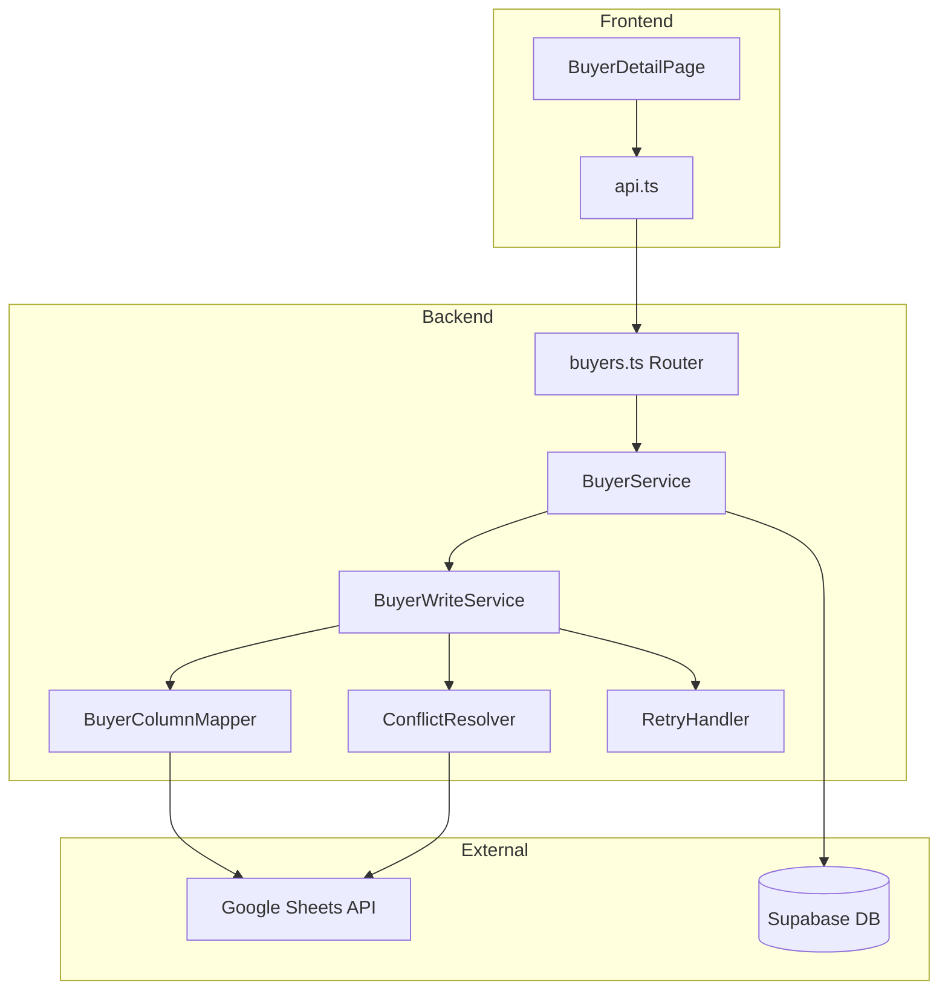

# Design Document

## Overview

買主データの双方向同期機能を実装する。現在のスプレッドシート→DB一方向同期に加えて、DB→スプレッドシートの書き戻し機能を追加する。これにより、ブラウザ上での買主情報編集がスプレッドシートにも反映される。

## Architecture



## Components and Interfaces

### BuyerWriteService

スプレッドシートへの書き込みを担当するサービス。

```typescript
interface BuyerWriteService {
  // 単一フィールドの更新
  updateField(buyerNumber: string, field: string, value: any): Promise<WriteResult>;
  
  // 複数フィールドの一括更新
  updateFields(buyerNumber: string, fields: Record<string, any>): Promise<WriteResult>;
  
  // 行番号を取得
  findRowByBuyerNumber(buyerNumber: string): Promise<number | null>;
}

interface WriteResult {
  success: boolean;
  syncedAt: string | null;
  error?: string;
  conflict?: ConflictInfo;
  pendingSync?: boolean;
}

interface ConflictInfo {
  field: string;
  currentValue: any;
  attemptedValue: any;
  spreadsheetValue: any;
}
```

### ConflictResolver

競合検出と解決を担当するコンポーネント。

```typescript
interface ConflictResolver {
  // 競合をチェック
  checkConflict(
    buyerNumber: string, 
    field: string, 
    expectedValue: any, 
    newValue: any
  ): Promise<ConflictCheckResult>;
  
  // 強制上書き
  forceOverwrite(
    buyerNumber: string, 
    field: string, 
    value: any
  ): Promise<WriteResult>;
}

interface ConflictCheckResult {
  hasConflict: boolean;
  spreadsheetValue?: any;
  lastSyncedAt?: string;
}
```

### RetryHandler

リトライロジックを担当するコンポーネント。

```typescript
interface RetryHandler {
  // リトライ付き実行
  executeWithRetry<T>(
    operation: () => Promise<T>,
    maxRetries: number,
    backoffMs: number
  ): Promise<T>;
  
  // 失敗した変更をキューに追加
  queueFailedChange(change: PendingChange): Promise<void>;
  
  // キューの変更を処理
  processQueue(): Promise<void>;
}

interface PendingChange {
  buyerNumber: string;
  field: string;
  value: any;
  attemptedAt: string;
  retryCount: number;
}
```

### 拡張されたBuyerColumnMapper

既存のマッパーに列番号取得機能を追加。

```typescript
interface BuyerColumnMapper {
  // 既存メソッド
  mapSpreadsheetToDatabase(headers: string[], row: any[]): BuyerRecord;
  mapDatabaseToSpreadsheet(record: BuyerRecord): Record<string, any>;
  
  // 新規メソッド
  getColumnLetter(dbField: string): string | null;
  getColumnIndex(dbField: string, headers: string[]): number | null;
}
```

## Data Models

### pending_sync_changes テーブル

失敗した同期変更を保存するテーブル。

```sql
CREATE TABLE pending_sync_changes (
  id UUID PRIMARY KEY DEFAULT gen_random_uuid(),
  buyer_number VARCHAR(50) NOT NULL,
  field_name VARCHAR(100) NOT NULL,
  old_value TEXT,
  new_value TEXT,
  attempted_at TIMESTAMP WITH TIME ZONE DEFAULT NOW(),
  retry_count INTEGER DEFAULT 0,
  last_error TEXT,
  status VARCHAR(20) DEFAULT 'pending', -- pending, processing, completed, failed
  created_at TIMESTAMP WITH TIME ZONE DEFAULT NOW(),
  updated_at TIMESTAMP WITH TIME ZONE DEFAULT NOW()
);

CREATE INDEX idx_pending_sync_status ON pending_sync_changes(status);
CREATE INDEX idx_pending_sync_buyer ON pending_sync_changes(buyer_number);
```

### audit_logs テーブル拡張

既存のaudit_logsテーブルにsync_statusカラムを追加。

```sql
ALTER TABLE audit_logs ADD COLUMN IF NOT EXISTS sync_status VARCHAR(20) DEFAULT 'synced';
-- sync_status: synced, pending, failed
```

## Correctness Properties

*A property is a characteristic or behavior that should hold true across all valid executions of a system-essentially, a formal statement about what the system should do. Properties serve as the bridge between human-readable specifications and machine-verifiable correctness guarantees.*

### Property 1: Spreadsheet Write Correctness

*For any* buyer update with a valid buyer_number and mapped field, the BuyerWriteService SHALL write the value to the correct row and column in the spreadsheet, and only the specified fields SHALL be modified.

**Validates: Requirements 1.1, 1.4, 1.5**

### Property 2: Timestamp Update After Sync

*For any* successful spreadsheet write operation, the buyer's `last_synced_at` timestamp in the database SHALL be updated to the current time.

**Validates: Requirements 1.2**

### Property 3: Error Handling

*For any* failed spreadsheet write operation, the system SHALL return an error response containing the error message, and the error SHALL be logged.

**Validates: Requirements 1.3**

### Property 4: Column Mapping Correctness

*For any* database field that has a corresponding spreadsheet column in the mapping configuration, the BuyerColumnMapper SHALL return the correct column letter/index.

**Validates: Requirements 2.1, 2.2**

### Property 5: Conflict Detection

*For any* update operation, if the spreadsheet value differs from the expected value (based on last_synced_at), the ConflictResolver SHALL detect and report the conflict.

**Validates: Requirements 3.1, 3.4**

### Property 6: Conflict Reporting

*For any* detected conflict, the error response SHALL contain the current spreadsheet value, the attempted new value, and the field name.

**Validates: Requirements 3.2**

### Property 7: Audit Logging Completeness

*For any* buyer field update, the audit log entry SHALL contain the old value, new value, timestamp, user ID, and user email.

**Validates: Requirements 4.1**

### Property 8: Sync Status Tracking

*For any* spreadsheet write operation, the sync_status SHALL be set to 'synced' on success and 'pending' on failure.

**Validates: Requirements 4.3, 4.4**

### Property 9: Retry and Recovery

*For any* failed write operation due to network error, the system SHALL retry up to 3 times with exponential backoff, and if all retries fail, the change SHALL be queued for later processing.

**Validates: Requirements 5.1, 5.2, 5.3**

### Property 10: API Endpoint Behavior

*For any* PUT /api/buyers/:id request, the system SHALL first update the database, then attempt spreadsheet sync, and return the updated buyer data with sync status. If sync fails but DB succeeds, the response SHALL indicate pending sync.

**Validates: Requirements 6.2, 6.3, 6.4, 6.5**

### Property 11: Batch Updates

*For any* update with multiple fields, the SpreadsheetWriter SHALL batch them into a single Google Sheets API call.

**Validates: Requirements 7.2**

## Error Handling

### エラー種別

1. **NetworkError**: Google Sheets APIへの接続失敗
   - リトライ対象
   - 最大3回、指数バックオフ

2. **AuthenticationError**: 認証エラー
   - リトライ対象外
   - 即座にエラー返却

3. **ConflictError**: 競合検出
   - リトライ対象外
   - ユーザーに選択を促す

4. **ValidationError**: データ検証エラー
   - リトライ対象外
   - 即座にエラー返却

5. **RateLimitError**: API制限
   - リトライ対象
   - 長めのバックオフ

### エラーレスポンス形式

```typescript
interface ErrorResponse {
  success: false;
  error: {
    code: string;
    message: string;
    details?: any;
  };
  syncStatus: 'failed' | 'pending';
  conflict?: ConflictInfo;
}
```

## Testing Strategy

### Unit Tests

1. **BuyerColumnMapper Tests**
   - DB→スプレッドシート列マッピングの正確性
   - 未マッピングフィールドの処理

2. **ConflictResolver Tests**
   - 競合検出ロジック
   - タイムスタンプ比較

3. **RetryHandler Tests**
   - リトライ回数
   - バックオフ計算

### Property-Based Tests

各Correctness Propertyに対応するプロパティテストを実装。
- fast-checkライブラリを使用
- 最低100イテレーション

### Integration Tests

1. **API Endpoint Tests**
   - PUT /api/buyers/:id の正常系・異常系
   - 競合時の動作
   - force パラメータの動作

2. **End-to-End Tests**
   - DB更新→スプレッドシート反映の確認
   - リトライ動作の確認
