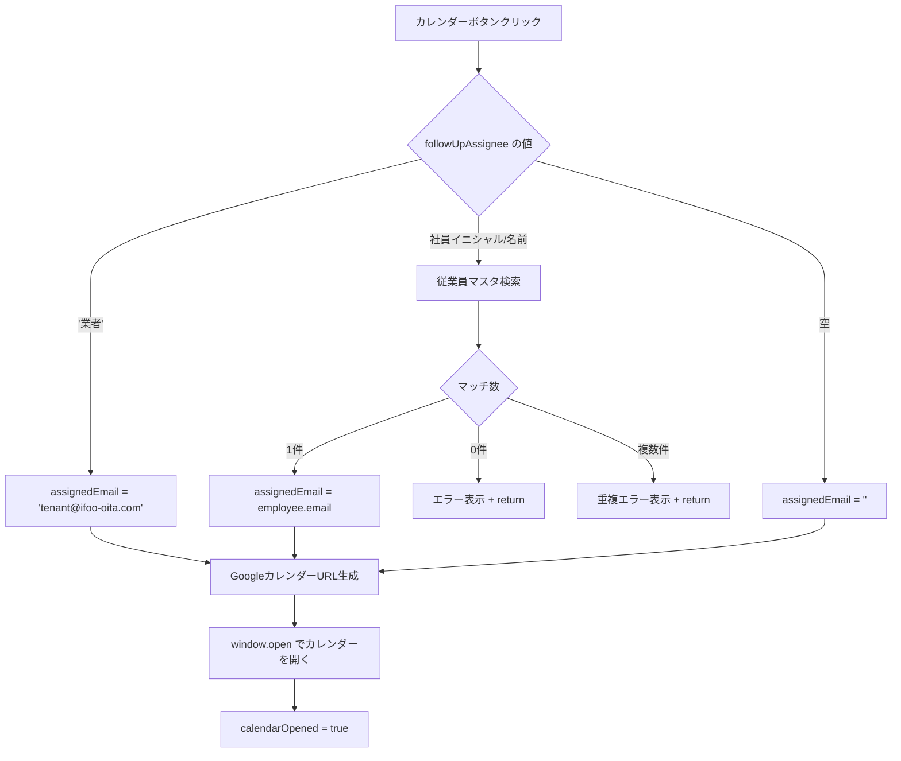

# 設計ドキュメント: buyer-calendar-agency-tenant-send

## 概要

`BuyerViewingResultPage` において、後続担当に「業者」が選択された場合のカレンダー送信動作を変更する。

現在の動作:
- 「業者」選択時 → カレンダー送信をスキップし、警告メッセージを表示して `return`

変更後の動作:
- 「業者」選択時 → `tenant@ifoo-oita.com` 宛にカレンダーを送信する（他の社員担当者と同様の処理フロー）

変更対象ファイルは1つのみ:
- `frontend/frontend/src/pages/BuyerViewingResultPage.tsx`

---

## アーキテクチャ

### 変更範囲

本変更はフロントエンドのみ。バックエンドへの変更は不要。

```
BuyerViewingResultPage.tsx
  └── handleCalendarButtonClick()
        └── メールアドレス解決ロジック（変更箇所）
              ├── followUpAssignee === '業者'  ← ここを変更
              │     現在: スキップ + 警告表示
              │     変更後: assignedEmail = 'tenant@ifoo-oita.com'
              ├── 社員イニシャル/名前 → 従業員マスタ検索（変更なし）
              └── 空 → srcなし（変更なし）
```

### 処理フロー（変更後）



---

## コンポーネントとインターフェース

### 変更対象: `handleCalendarButtonClick` 関数

**ファイル**: `frontend/frontend/src/pages/BuyerViewingResultPage.tsx`（約560行目）

#### 変更前のコード

```typescript
if (followUpAssignee === '業者') {
  setSnackbar({
    open: true,
    message: '後続担当が「業者」のため、カレンダー送信をスキップしました',
    severity: 'warning',
  });
  return;  // ← ここで処理を中断
}
```

#### 変更後のコード

```typescript
if (followUpAssignee === '業者') {
  // 業者の場合はテナントメールアドレスを使用
  assignedEmail = 'tenant@ifoo-oita.com';
}
```

### 定数定義

テナントメールアドレスはハードコードではなく定数として定義する。

```typescript
const TENANT_EMAIL = 'tenant@ifoo-oita.com';
```

定数の配置場所: `handleCalendarButtonClick` 関数内、または同ファイルのモジュールスコープ。

---

## データモデル

本変更に伴うデータモデルの変更はなし。

### 関連する既存データ

| フィールド | 型 | 説明 |
|---|---|---|
| `buyer.follow_up_assignee` | `string \| null` | 後続担当。「業者」、社員イニシャル、社員名、または空 |
| `assignedEmail` | `string` | カレンダー送信先メールアドレス（ローカル変数） |

### メールアドレス解決ルール（変更後）

| `follow_up_assignee` の値 | `assignedEmail` の値 | 動作 |
|---|---|---|
| `'業者'` | `'tenant@ifoo-oita.com'` | カレンダーを開く |
| 社員イニシャル/名前（1件マッチ） | `employee.email` | カレンダーを開く |
| 社員イニシャル/名前（0件マッチ） | — | エラー表示 + 中断 |
| 社員イニシャル/名前（複数マッチ） | — | 重複エラー表示 + 中断 |
| 空 | `''` | srcなしでカレンダーを開く |

---

## 正確性プロパティ

*プロパティとは、システムの全ての有効な実行において成立すべき特性や振る舞いのことです。プロパティは人間が読める仕様と機械検証可能な正確性保証の橋渡しをします。*

### Property 1: メールアドレス解決の一貫性

*For any* `follow_up_assignee` の値と従業員リストに対して、メールアドレス解決ロジックは以下の不変条件を満たす:
- `'業者'` → 常に `'tenant@ifoo-oita.com'` を返す
- 従業員マスタに1件マッチ → その従業員のメールアドレスを返す
- 従業員マスタに0件マッチ → エラーを返す
- 従業員マスタに複数マッチ → 重複エラーを返す
- 空 → 空文字列を返す

**Validates: Requirements 1.1, 3.1, 3.2, 3.3, 3.4**

### Property 2: 「業者」選択時のURL生成

*For any* 内覧情報（日時・タイトル・説明）に対して、後続担当が「業者」の場合に生成されるGoogleカレンダーURLは常に `src=tenant%40ifoo-oita.com` パラメータを含む。

**Validates: Requirements 1.4**

### Property 3: 既存社員ロジックの不変性

*For any* 有効な社員イニシャルまたは名前（従業員マスタに1件マッチするもの）に対して、メールアドレス解決ロジックは変更前後で同一の結果を返す。

**Validates: Requirements 2.2, 3.1**

---

## エラーハンドリング

本変更によるエラーハンドリングの変更点:

| ケース | 変更前 | 変更後 |
|---|---|---|
| `follow_up_assignee === '業者'` | `severity: 'warning'` のsnackbarを表示して中断 | `assignedEmail = 'tenant@ifoo-oita.com'` を設定して処理継続 |

その他のエラーハンドリング（社員マスタ未発見、重複イニシャル）は変更なし。

### 業者選択時のフィードバック（要件2.1）

「業者」選択時にカレンダーが開いた後のフィードバックについては、既存の `calendarOpened` フラグによる離脱ガードが機能するため、追加のsnackbarは不要。ただし、要件2.1の「適切なフィードバック」として、既存の成功系snackbarまたはUIの変化（カレンダーボタンの状態変化）で対応する。

---

## テスト戦略

### ユニットテスト（例ベース）

対象: `handleCalendarButtonClick` 内のメールアドレス解決ロジック

テストケース:
1. `follow_up_assignee === '業者'` → `assignedEmail === 'tenant@ifoo-oita.com'`
2. `follow_up_assignee === '業者'` → 警告snackbarが表示されない
3. `follow_up_assignee === '業者'` → `window.open` が呼ばれる
4. `follow_up_assignee === '業者'` → 生成URLに `src=tenant%40ifoo-oita.com` が含まれる
5. `follow_up_assignee === ''`（空） → `src` パラメータなしでURLが生成される

### プロパティベーステスト

対象: メールアドレス解決ロジック（純粋関数として切り出した場合）

使用ライブラリ: `fast-check`（TypeScript/React環境に適合）

```typescript
// Property 1: メールアドレス解決の一貫性
// Feature: buyer-calendar-agency-tenant-send, Property 1: メールアドレス解決の一貫性
fc.assert(
  fc.property(
    fc.array(fc.record({ initials: fc.string(), name: fc.string(), email: fc.emailAddress() })),
    fc.string(),
    (employees, followUpAssignee) => {
      const result = resolveEmail(followUpAssignee, employees);
      if (followUpAssignee === '業者') {
        return result.email === 'tenant@ifoo-oita.com';
      }
      // ... 他のケース
    }
  ),
  { numRuns: 100 }
);
```

### 回帰テスト

- 社員イニシャル選択時の既存動作が変わらないことを確認
- 空の後続担当時の既存動作が変わらないことを確認
