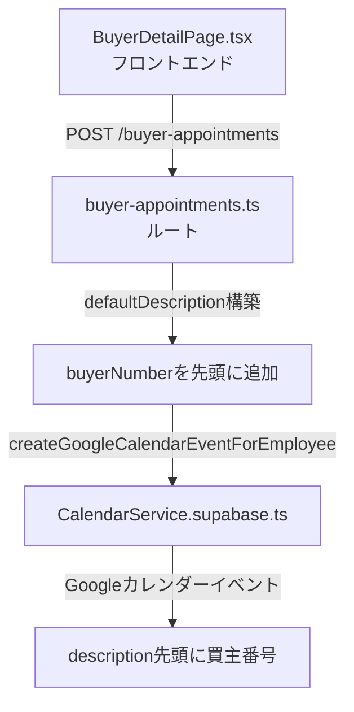
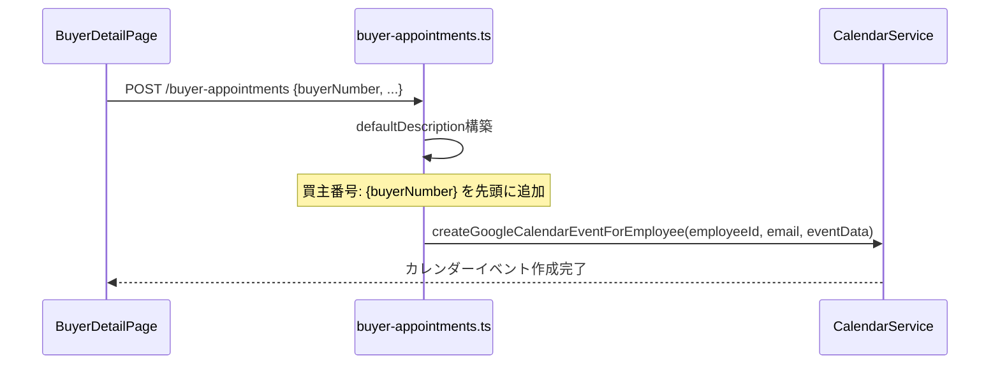

# 設計ドキュメント: buyer-calendar-buyer-number-display

## 概要

買主リストの内覧日カレンダー送信時に、Googleカレンダーイベントのメモ（description）の一番上に買主番号を表示する機能。

現在のメモ構造：
```
物件住所: なし
GoogleMap: なし

お客様名: くにひろてすと
電話番号: 09066394809
問合時ヒアリング: なし
内覧取得者名: なし

買主詳細ページ:
https://sateituikyaku-admin-frontend.vercel.app/buyers/7359
```

変更後のメモ構造：
```
買主番号: 7359
物件住所: なし
GoogleMap: なし

お客様名: くにひろてすと
電話番号: 09066394809
問合時ヒアリング: なし
内覧取得者名: なし

買主詳細ページ:
https://sateituikyaku-admin-frontend.vercel.app/buyers/7359
```

## アーキテクチャ



## シーケンス図



## 変更対象ファイル

### `backend/src/routes/buyer-appointments.ts`

#### defaultDescription の変更

**現在の実装**:
```typescript
const defaultDescription =
  `物件住所: ${propertyAddress || 'なし'}\n` +
  `GoogleMap: ${propertyGoogleMapUrl || 'なし'}\n` +
  `\n` +
  `お客様名: ${buyerName || buyerNumber}\n` +
  `電話番号: ${buyerPhone || 'なし'}\n` +
  `問合時ヒアリング: ${inquiryHearing || 'なし'}\n` +
  `内覧取得者名: ${creatorName || 'なし'}\n` +
  `\n` +
  `買主詳細ページ:\n${(process.env.FRONTEND_URL || 'https://sateituikyaku-admin-frontend.vercel.app').split(',')[0].trim()}/buyers/${buyerNumber}`;
```

**変更後の実装**:
```typescript
const defaultDescription =
  `買主番号: ${buyerNumber}\n` +
  `物件住所: ${propertyAddress || 'なし'}\n` +
  `GoogleMap: ${propertyGoogleMapUrl || 'なし'}\n` +
  `\n` +
  `お客様名: ${buyerName || buyerNumber}\n` +
  `電話番号: ${buyerPhone || 'なし'}\n` +
  `問合時ヒアリング: ${inquiryHearing || 'なし'}\n` +
  `内覧取得者名: ${creatorName || 'なし'}\n` +
  `\n` +
  `買主詳細ページ:\n${(process.env.FRONTEND_URL || 'https://sateituikyaku-admin-frontend.vercel.app').split(',')[0].trim()}/buyers/${buyerNumber}`;
```

## コンポーネントとインターフェース

### buyer-appointments.ts ルート

| 変更箇所 | 変更内容 |
|---------|---------|
| `defaultDescription` 文字列 | 先頭に `買主番号: ${buyerNumber}\n` を追加 |

変更は1行のみ。`buyerNumber` は既にリクエストボディから取得済みのため、追加のデータ取得は不要。

## データモデル

変更なし。`buyerNumber` は既に `req.body.buyerNumber` として受け取っており、追加のDB参照は不要。

## エラーハンドリング

- `buyerNumber` はバリデーション済み（`body('buyerNumber').isString()`）のため、常に文字列として存在する
- 既存のエラーハンドリングに変更なし

## テスト戦略

### 手動テスト

1. 買主詳細ページから内覧日カレンダー送信を実行
2. 担当者のGoogleカレンダーでイベントのメモを確認
3. 「買主番号: 7359」が一番上に表示されることを確認
4. 既存の他フィールドが正しく表示されることを確認

## 依存関係

変更なし。既存の依存関係のみ使用。

## Correctness Properties

*A property is a characteristic or behavior that should hold true across all valid executions of a system-essentially, a formal statement about what the system should do. Properties serve as the bridge between human-readable specifications and machine-verifiable correctness guarantees.*

### Property 1: 買主番号がメモ先頭に存在する

For any valid `buyerNumber` 文字列、内覧日カレンダー送信時に生成される `defaultDescription` の先頭行は `買主番号: {buyerNumber}` であること

**Validates: Requirements 1.1**

### Property 2: メモのフィールド順序が正しい

For any 内覧予約データ（buyerNumber・propertyAddress・buyerName・buyerPhone 等）、生成される `defaultDescription` は 買主番号 → 物件住所 → GoogleMap → お客様名 → 電話番号 → 問合時ヒアリング → 内覧取得者名 → 買主詳細ページURL の順序を維持すること

**Validates: Requirements 1.2**

### Property 3: 既存フィールドが保持される

For any 内覧予約データ、買主番号行の追加によって既存フィールド（物件住所・GoogleMap URL・お客様名・電話番号・問合時ヒアリング・内覧取得者名・買主詳細ページURL）の値が変化しないこと

**Validates: Requirements 1.3**
