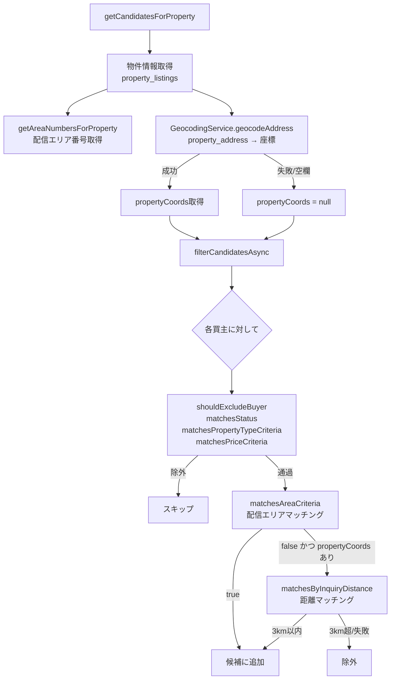

# 設計ドキュメント：買主候補半径3km検索

## 概要

物件リストの買主候補リスト機能において、現在の配信エリア番号マッチングに加えて、売主の物件住所（`property_address`）から半径3km以内で問い合わせてきた買主も候補に含める機能を追加する。

既存の `BuyerCandidateService` には `matchesByInquiryDistance` メソッドが既に実装されているが無効化されている。本設計では、このメソッドを有効化しつつ、以下の課題を解決する：

- 現在の実装は `google_map_url` から座標を抽出しているが、要件では `property_address` からジオコーディングする方針に変更
- 非同期処理への対応（`filterCandidates` が同期処理のため、非同期版に切り替える）
- パフォーマンス：ジオコーディング結果のキャッシュ、重複計算の回避

---

## アーキテクチャ



**設計方針：**
- 既存フィルタ（種別・価格・ステータス・配信種別）を先に適用し、通過した買主のみを対象にする
- 配信エリアマッチングで既に候補に含まれた買主は距離計算をスキップ（OR条件の効率的な実装）
- 距離マッチングは非同期処理（GeocodingService呼び出しを含む）

---

## コンポーネントとインターフェース

### 変更対象ファイル

**`backend/src/services/BuyerCandidateService.ts`**

#### 変更点1：`GeocodingService` のインポートと注入

```typescript
import { GeocodingService } from './GeocodingService';

export class BuyerCandidateService {
  private geocodingService: GeocodingService;
  private geocodingCache: Map<string, { lat: number; lng: number } | null>;

  constructor() {
    // ...既存...
    this.geocodingService = new GeocodingService();
    this.geocodingCache = new Map();
  }
}
```

#### 変更点2：`getCandidatesForProperty` の修正

`propertyCoords` の取得を `google_map_url` ベースから `property_address` ベースに変更する。

```typescript
// 変更前（無効化されていた）
const propertyCoords = null;

// 変更後
const propertyCoords = await this.getPropertyCoordsFromAddress(property);
```

#### 変更点3：`filterCandidates` を非同期版 `filterCandidatesAsync` に切り替え

```typescript
// 変更前（同期）
private filterCandidates(buyers, propertyType, salesPrice, propertyAreaNumbers, propertyCoords): any[]

// 変更後（非同期）
private async filterCandidatesAsync(buyers, propertyType, salesPrice, propertyAreaNumbers, propertyCoords): Promise<any[]>
```

#### 変更点4：`matchesByInquiryDistance` の修正

現在の実装は `google_map_url` から座標を抽出しているが、`property_listings.address` を `GeocodingService` でジオコーディングする方式に変更する。

```typescript
private async matchesByInquiryDistance(
  buyer: any,
  propertyCoords: { lat: number; lng: number },
  geocodingCache: Map<string, { lat: number; lng: number } | null>
): Promise<boolean>
```

#### 変更点5：`getPropertyCoordsFromAddress` の追加（新規メソッド）

`sellers.property_address` または `property_listings.address` から座標を取得する。

```typescript
private async getPropertyCoordsFromAddress(
  property: any
): Promise<{ lat: number; lng: number } | null>
```

### 既存サービスの利用

| サービス | メソッド | 用途 |
|---------|---------|------|
| `GeocodingService` | `geocodeAddress(address)` | 住所文字列 → `{ latitude, longitude }` |
| `GeolocationService` | `calculateDistance(point1, point2)` | Haversine公式で2点間距離（km）計算 |

**座標型の変換：**
`GeocodingService` は `{ latitude, longitude }` を返すが、`GeolocationService.calculateDistance` は `{ lat, lng }` を受け取る。変換が必要。

```typescript
const coords = await this.geocodingService.geocodeAddress(address);
if (coords) {
  return { lat: coords.latitude, lng: coords.longitude };
}
```

---

## データモデル

### 関連テーブル

| テーブル | カラム | 用途 |
|---------|-------|------|
| `property_listings` | `address` | 物件住所（ジオコーディング対象） |
| `property_listings` | `property_number` | 買主の問い合わせ物件番号との照合 |
| `buyers` | `property_number` | 買主が問い合わせた物件番号（カンマ区切り複数可） |
| `sellers` | `property_address` | 売主の物件住所（本機能では `property_listings.address` を使用） |

**注意：** 本機能では `getCandidatesForProperty(propertyNumber)` の引数は `property_listings` の `property_number` であり、`property_listings.address` を物件住所として使用する。`sellers.property_address` は直接参照しない（`property_listings` 経由で取得済みの物件情報を使う）。

### ジオコーディングキャッシュ

```typescript
// インスタンス変数として保持（リクエスト内キャッシュ）
private geocodingCache: Map<string, { lat: number; lng: number } | null>;
```

- キー：物件番号（`property_number`）
- 値：座標オブジェクト、またはジオコーディング失敗時は `null`
- スコープ：`getCandidatesForProperty` の1リクエスト内で有効
- 目的：同一物件番号を持つ複数の買主に対して、GeocodingService APIを1回のみ呼び出す

---

## 処理フローの詳細

### `filterCandidatesAsync` の処理順序

```
for each buyer:
  1. shouldExcludeBuyer → false なら次へ
  2. matchesStatus → true なら次へ
  3. matchesPropertyTypeCriteria → true なら次へ
  4. matchesPriceCriteria → true なら次へ
  5. matchesAreaCriteria（配信エリア）→ true なら候補に追加（距離計算スキップ）
  6. propertyCoords が null → 除外
  7. matchesByInquiryDistance（距離マッチング）→ true なら候補に追加
```

ステップ5で `true` になった買主はステップ7をスキップすることで、重複計算を回避する。

### `matchesByInquiryDistance` の処理フロー

```
1. buyer.property_number が空 → false
2. 最初の物件番号を取得（カンマ区切りの先頭）
3. geocodingCache に存在する → キャッシュから座標取得
4. キャッシュなし → property_listings から address を取得
5. address が空 → キャッシュに null を保存 → false
6. GeocodingService.geocodeAddress(address) を呼び出し
7. 失敗 → キャッシュに null を保存 → false
8. 成功 → キャッシュに座標を保存
9. GeolocationService.calculateDistance(propertyCoords, inquiryCoords) で距離計算
10. distance <= 3.0 → true、それ以外 → false
```

### `getPropertyCoordsFromAddress` の処理フロー

```
1. property.address が空 → null を返す
2. GeocodingService.geocodeAddress(property.address) を呼び出し
3. 失敗（APIキー未設定・APIエラー・ZERO_RESULTS）→ null を返す
4. 成功 → { lat, lng } に変換して返す
```

---

## 正確性プロパティ

*プロパティとは、システムの全ての有効な実行において成立すべき特性や振る舞いのことです。形式的に「何をすべきか」を述べるものであり、人間が読める仕様と機械で検証可能な正確性保証の橋渡しをします。*

### プロパティ1：距離マッチングによる候補追加

*任意の* 物件と、その物件住所から半径3km以内に問い合わせ物件を持つ買主（他の全フィルタ条件を満たす）に対して、`getCandidatesForProperty` の結果にその買主が含まれる。

**Validates: Requirements 1.1, 1.2**

### プロパティ2：OR条件の成立

*任意の* 物件に対して、配信エリアマッチングのみで合致する買主・距離マッチングのみで合致する買主・両方で合致する買主が、全て候補リストに含まれる。

**Validates: Requirements 1.3**

### プロパティ3：既存フィルタの不変性

*任意の* 距離マッチングで候補に追加される買主に対して、`shouldExcludeBuyer`・`matchesStatus`・`matchesPropertyTypeCriteria`・`matchesPriceCriteria` の各フィルタが適用される。すなわち、これらのフィルタで除外されるべき買主は距離マッチングで追加されない。

**Validates: Requirements 1.4, 5.1, 5.2, 5.3, 5.4**

### プロパティ4：重複計算の回避

*任意の* 配信エリアマッチングで既に候補に含まれた買主に対して、`GeocodingService.geocodeAddress` が呼び出されない。

**Validates: Requirements 4.1, 4.3**

### プロパティ5：ジオコーディングキャッシュの有効性

*任意の* 同一物件番号を持つ複数の買主に対して、`GeocodingService.geocodeAddress` は1回のみ呼び出される。

**Validates: Requirements 4.2**

---

## エラーハンドリング

| 状況 | 対応 |
|------|------|
| `property_address` が空欄 | `getPropertyCoordsFromAddress` が `null` を返す → 距離マッチングをスキップ、配信エリアマッチングのみで処理継続 |
| `GOOGLE_MAPS_API_KEY` 未設定 | `GeocodingService.geocodeAddress` が `null` を返す → 距離マッチングをスキップ |
| Geocoding APIエラー（タイムアウト・クォータ超過など） | `GeocodingService` が `null` を返す → 距離マッチングをスキップ |
| 買主の `property_number` が空欄 | `matchesByInquiryDistance` が `false` を返す |
| 買主の `property_number` が `property_listings` に存在しない | `address` が取得できず `false` を返す |
| 買主の問い合わせ物件住所のジオコーディング失敗 | キャッシュに `null` を保存し `false` を返す |

全てのエラーは例外を発生させず、フォールバック（距離マッチングをスキップ）として処理する。これにより、GeocodingService が利用不可な環境でも既存の配信エリアマッチングが正常に動作する。

---

## テスト戦略

### デュアルテストアプローチ

本機能のテストは**ユニットテスト**と**プロパティベーステスト**の両方で構成する。

- ユニットテスト：具体的な例・エッジケース・エラー条件を検証
- プロパティテスト：全入力に対して成立すべき普遍的な性質を検証

### ユニットテスト

**ファイル：** `backend/src/services/__tests__/BuyerCandidateService.test.ts`

**テストケース：**

1. `matchesByInquiryDistance`
   - 3km以内の物件 → `true`
   - 3km超の物件 → `false`
   - `property_number` が空 → `false`
   - `property_number` が `property_listings` に存在しない → `false`
   - ジオコーディング失敗 → `false`
   - カンマ区切り複数物件番号 → 最初の番号のみ使用

2. `getPropertyCoordsFromAddress`
   - `address` が空 → `null`
   - ジオコーディング成功 → `{ lat, lng }` を返す
   - APIキー未設定 → `null`

3. `filterCandidatesAsync`
   - 配信エリアマッチング済み買主は距離計算をスキップ
   - 距離マッチングで追加された買主にも既存フィルタが適用される

4. エッジケース
   - `property_address` が空の場合、配信エリアマッチングのみで結果を返す
   - APIエラー時でも例外が発生しない

### プロパティベーステスト

**ライブラリ：** `fast-check`（TypeScript向けプロパティベーステストライブラリ）

**設定：** 各プロパティテストは最低100回実行する

**ファイル：** `backend/src/services/__tests__/BuyerCandidateService.property.test.ts`

#### プロパティテスト1：距離マッチングによる候補追加

```
// Feature: buyer-candidate-radius-search, Property 1: 距離マッチングによる候補追加
// 任意の物件座標と、3km以内の座標を持つ問い合わせ物件を持つ買主に対して
// 候補リストに含まれることを検証
```

**Validates: Requirements 1.1, 1.2**

#### プロパティテスト2：OR条件の成立

```
// Feature: buyer-candidate-radius-search, Property 2: OR条件の成立
// 配信エリアのみ合致・距離のみ合致・両方合致の買主が全て候補に含まれることを検証
```

**Validates: Requirements 1.3**

#### プロパティテスト3：既存フィルタの不変性

```
// Feature: buyer-candidate-radius-search, Property 3: 既存フィルタの不変性
// 任意の距離マッチング候補買主に対して、既存フィルタで除外されるべき買主が
// 候補リストに含まれないことを検証
```

**Validates: Requirements 1.4, 5.1, 5.2, 5.3, 5.4**

#### プロパティテスト4：重複計算の回避

```
// Feature: buyer-candidate-radius-search, Property 4: 重複計算の回避
// 配信エリアマッチング済みの買主に対してGeocodingServiceが呼ばれないことを検証
```

**Validates: Requirements 4.1, 4.3**

#### プロパティテスト5：ジオコーディングキャッシュの有効性

```
// Feature: buyer-candidate-radius-search, Property 5: ジオコーディングキャッシュの有効性
// 同一物件番号を持つ複数の買主に対してGeocodingServiceが1回のみ呼ばれることを検証
```

**Validates: Requirements 4.2**
