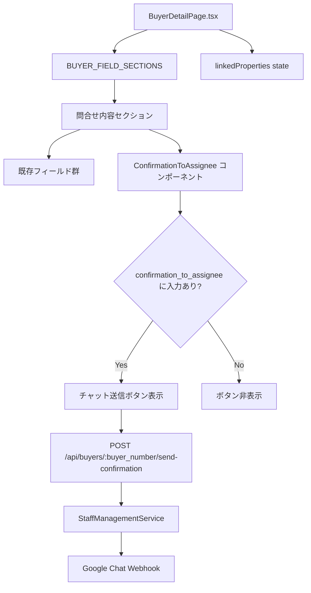

# 設計ドキュメント: buyer-detail-chat-notification

## Overview

買主詳細画面（`BuyerDetailPage.tsx`）のUI改善と、物件担当者へのチャット送信機能の整理を行う。

具体的には以下の変更を実施する：
1. `BUYER_FIELD_SECTIONS` から「その他」セクションを削除
2. 「問合せ内容」セクションから「配信種別」フィールドを削除
3. 「担当への確認事項」を「問合せ内容」セクション内の「配信種別」があった位置に移動
4. 物件担当者（`sales_assignee`）が設定されている場合のみ「担当への確認事項」を表示
5. 既存の `ConfirmationToAssignee` コンポーネントを活用してチャット送信ボタンを表示

バックエンドの `/api/buyers/:buyer_number/send-confirmation` エンドポイントおよび `ConfirmationToAssignee` コンポーネントは既に実装済みであるため、フロントエンドの `BuyerDetailPage.tsx` の `BUYER_FIELD_SECTIONS` 定義とレンダリングロジックの変更が主な作業となる。

## Architecture



### 変更の影響範囲

- **フロントエンド**: `BuyerDetailPage.tsx` のみ（`BUYER_FIELD_SECTIONS` 定義とレンダリングロジック）
- **バックエンド**: 変更なし（エンドポイント既存）
- **コンポーネント**: `ConfirmationToAssignee.tsx` は変更なし（既存のまま使用）

## Components and Interfaces

### 変更対象: BuyerDetailPage.tsx

#### BUYER_FIELD_SECTIONS の変更

**削除するセクション**:
- `title: 'その他'` セクション全体（`special_notes`, `message_to_assignee`, `confirmation_to_assignee`, `family_composition`, `must_have_points`, `liked_points`, `disliked_points`, `purchase_obstacles`, `next_action` を含む）

**削除するフィールド**:
- 「問合せ内容」セクションの `distribution_type`（配信種別）

**移動するフィールド**:
- `confirmation_to_assignee`（担当への確認事項）を「問合せ内容」セクション内の `distribution_type` があった位置に追加

ただし、`confirmation_to_assignee` は通常の `InlineEditableField` ではなく、`ConfirmationToAssignee` コンポーネントで表示するため、`BUYER_FIELD_SECTIONS` には `fieldType: 'confirmationToAssignee'` として定義し、レンダリング時に特別処理する。

#### 条件分岐ロジック

```typescript
// linkedProperties[0].sales_assignee が存在する場合のみ表示
const propertyAssignee = linkedProperties[0]?.sales_assignee || null;
const showConfirmationToAssignee = !!propertyAssignee;
```

#### ConfirmationToAssignee コンポーネントの統合

```typescript
// 問合せ内容セクション内で、fieldType === 'confirmationToAssignee' の場合
if (field.key === 'confirmation_to_assignee' && field.fieldType === 'confirmationToAssignee') {
  if (!showConfirmationToAssignee) return null;
  return (
    <Grid item xs={12} key={`${section.title}-${field.key}`}>
      <ConfirmationToAssignee
        buyer={{
          buyer_number: buyer.buyer_number,
          name: buyer.name || '',
          property_number: linkedProperties[0]?.property_number || '',
          confirmation_to_assignee: buyer.confirmation_to_assignee,
        }}
        propertyAssignee={propertyAssignee}
        onSendSuccess={() => {
          fetchBuyer();
          setSnackbar({ open: true, message: 'チャットを送信しました', severity: 'success' });
        }}
      />
    </Grid>
  );
}
```

### 既存コンポーネント: ConfirmationToAssignee.tsx（変更なし）

インターフェース:
```typescript
interface ConfirmationToAssigneeProps {
  buyer: {
    buyer_number: string;
    name: string;
    property_number: string;
    confirmation_to_assignee?: string;
  };
  propertyAssignee: string | null;
  onSendSuccess: () => void;
}
```

### 既存エンドポイント: POST /api/buyers/:buyer_number/send-confirmation（変更なし）

リクエスト:
```typescript
{
  confirmationText: string;
  buyerDetailUrl: string;
}
```

レスポンス:
```typescript
{
  success: boolean;
  message?: string;
  error?: string;
}
```

## Data Models

### BUYER_FIELD_SECTIONS（変更後）

```typescript
const BUYER_FIELD_SECTIONS = [
  {
    title: '問合せ内容',
    fields: [
      { key: 'inquiry_hearing', label: '問合時ヒアリング', multiline: true, inlineEditable: true },
      { key: 'initial_assignee', label: '初動担当', inlineEditable: true },
      { key: 'reception_date', label: '受付日', type: 'date', inlineEditable: true },
      { key: 'inquiry_source', label: '問合せ元', inlineEditable: true },
      { key: 'latest_status', label: '★最新状況', inlineEditable: true },
      { key: 'inquiry_email_phone', label: '【問合メール】電話対応', inlineEditable: true, fieldType: 'dropdown' },
      { key: 'three_calls_confirmed', label: '3回架電確認済み', inlineEditable: true, fieldType: 'dropdown' },
      { key: 'email_type', label: 'メール種別', inlineEditable: true, fieldType: 'dropdown' },
      // distribution_type を削除
      // confirmation_to_assignee を distribution_type があった位置に追加
      { key: 'confirmation_to_assignee', label: '担当への確認事項', inlineEditable: true, fieldType: 'confirmationToAssignee' },
      { key: 'next_call_date', label: '次電日', type: 'date', inlineEditable: true },
      { key: 'owned_home_hearing_inquiry', label: '問合時持家ヒアリング', inlineEditable: true, fieldType: 'staffSelect' },
      { key: 'owned_home_hearing_result', label: '持家ヒアリング結果', inlineEditable: true, fieldType: 'homeHearingResult' },
      { key: 'valuation_required', label: '要査定', inlineEditable: true, fieldType: 'valuationRequired' },
    ],
  },
  {
    title: '基本情報',
    fields: [
      { key: 'buyer_number', label: '買主番号', inlineEditable: true, readOnly: true },
      { key: 'name', label: '氏名・会社名', inlineEditable: true },
      { key: 'phone_number', label: '電話番号', inlineEditable: true },
      { key: 'email', label: 'メールアドレス', inlineEditable: true },
      { key: 'company_name', label: '法人名', inlineEditable: true },
      { key: 'broker_inquiry', label: '業者問合せ', inlineEditable: true, fieldType: 'boxSelect' },
    ],
  },
  // 'その他' セクションを削除
];
```

### 状態管理

`BuyerDetailPage` の既存 state を活用:
- `linkedProperties`: 紐づく物件リスト（`sales_assignee` の取得に使用）
- `buyer`: 買主データ（`confirmation_to_assignee` の値を含む）

新規 state の追加は不要。

## Correctness Properties


*A property is a characteristic or behavior that should hold true across all valid executions of a system-essentially, a formal statement about what the system should do. Properties serve as the bridge between human-readable specifications and machine-verifiable correctness guarantees.*

### Property 1: distribution_type フィールドが全セクションに存在しない

*For any* `BUYER_FIELD_SECTIONS` の全セクション・全フィールドを走査した場合、`key === 'distribution_type'` のフィールドは1件も存在しない

**Validates: Requirements 2.1, 2.2**

### Property 2: PropertyAssignee の有無と「担当への確認事項」表示の対応

*For any* 買主データと物件データの組み合わせにおいて、`linkedProperties[0].sales_assignee` が非空文字列の場合は `ConfirmationToAssignee` コンポーネントが表示され、`sales_assignee` が null または空文字列の場合は表示されない

**Validates: Requirements 3.2, 3.3**

### Property 3: confirmation_to_assignee の入力有無とチャット送信ボタン表示の対応

*For any* `confirmation_to_assignee` の値において、1文字以上の非空白文字を含む場合はチャット送信ボタンが表示され、空文字列・空白のみ・null の場合はボタンが表示されない

**Validates: Requirements 4.1, 4.2**

### Property 4: チャット送信ボタンのラベル形式

*For any* `propertyAssignee` の名前文字列に対して、チャット送信ボタンのラベルは `{propertyAssignee}へチャット送信` の形式になる

**Validates: Requirements 4.6**

## Error Handling

### フロントエンド

| エラーケース | 対応 |
|------------|------|
| `linkedProperties` が空（物件未紐づけ） | `propertyAssignee` が null になり `ConfirmationToAssignee` を非表示 |
| チャット送信APIエラー（4xx/5xx） | `ConfirmationToAssignee` 内の `error` state にメッセージをセット、Alert で表示 |
| チャット送信中の重複クリック | `isSending` フラグでボタンを disabled にして防止 |

### バックエンド（既存実装）

| エラーケース | HTTPステータス | レスポンス |
|------------|--------------|-----------|
| `confirmationText` が空 | 400 | `{ success: false, error: '確認事項を入力してください' }` |
| 買主が見つからない | 404 | `{ success: false, error: '買主が見つかりませんでした' }` |
| 物件担当者が未設定 | 400 | `{ success: false, error: '物件担当者が設定されていません' }` |
| Webhook URL取得失敗 | 404 | `{ success: false, error: '担当者のWebhook URLが取得できませんでした' }` |
| Google Chat送信失敗 | 500 | `{ success: false, error: 'メッセージの送信に失敗しました' }` |

## Testing Strategy

### ユニットテスト

以下の具体的なケースをユニットテストでカバーする：

- `BUYER_FIELD_SECTIONS` に「その他」セクションが存在しないこと（要件1.1/1.2）
- `BUYER_FIELD_SECTIONS` の「問合せ内容」セクションに `confirmation_to_assignee` が含まれること（要件3.1）
- チャット送信ボタンクリック時に `/api/buyers/:buyer_number/send-confirmation` が呼び出されること（要件4.3）
- 送信成功時に成功メッセージが表示されること（要件4.4）
- 送信失敗時にエラーメッセージが表示されること（要件4.5）

### プロパティベーステスト

プロパティベーステストには [fast-check](https://github.com/dubzzz/fast-check)（TypeScript/JavaScript向けPBTライブラリ）を使用する。各テストは最低100回のランダム入力で検証する。

**Property 1: distribution_type フィールドが全セクションに存在しない**
```typescript
// Feature: buyer-detail-chat-notification, Property 1: distribution_type フィールドが全セクションに存在しない
it('BUYER_FIELD_SECTIONSのどのセクションにもdistribution_typeフィールドが存在しない', () => {
  const allFields = BUYER_FIELD_SECTIONS.flatMap(s => s.fields);
  expect(allFields.every(f => f.key !== 'distribution_type')).toBe(true);
});
// ※ BUYER_FIELD_SECTIONS は静的定義のため、プロパティテストよりもexampleテストが適切
```

**Property 2: PropertyAssignee の有無と表示の対応**
```typescript
// Feature: buyer-detail-chat-notification, Property 2: PropertyAssigneeの有無とConfirmationToAssignee表示の対応
fc.assert(
  fc.property(
    fc.oneof(fc.string({ minLength: 1 }), fc.constant(null), fc.constant('')),
    (salesAssignee) => {
      const shouldShow = !!salesAssignee && salesAssignee.trim().length > 0;
      // レンダリング結果でConfirmationToAssigneeの表示/非表示を検証
      expect(isConfirmationVisible(salesAssignee)).toBe(shouldShow);
    }
  ),
  { numRuns: 100 }
);
```

**Property 3: confirmation_to_assignee の入力有無とボタン表示の対応**
```typescript
// Feature: buyer-detail-chat-notification, Property 3: confirmation_to_assigneeの入力有無とチャット送信ボタン表示の対応
fc.assert(
  fc.property(
    fc.oneof(fc.string(), fc.constant(null), fc.constant(undefined)),
    (confirmationText) => {
      const hasText = typeof confirmationText === 'string' && confirmationText.trim().length > 0;
      expect(isSendButtonVisible(confirmationText)).toBe(hasText);
    }
  ),
  { numRuns: 100 }
);
```

**Property 4: チャット送信ボタンのラベル形式**
```typescript
// Feature: buyer-detail-chat-notification, Property 4: チャット送信ボタンのラベル形式
fc.assert(
  fc.property(
    fc.string({ minLength: 1 }),
    (assigneeName) => {
      const label = getSendButtonLabel(assigneeName);
      expect(label).toBe(`${assigneeName}へチャット送信`);
    }
  ),
  { numRuns: 100 }
);
```
