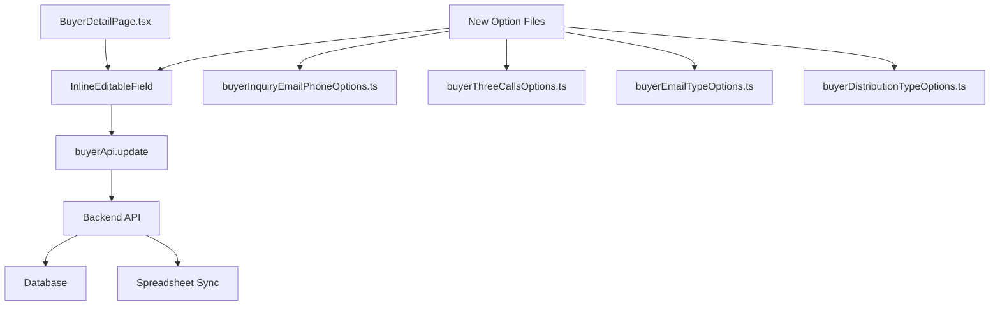

# Design Document: 買主詳細ページフィールド追加・削除

## Overview

買主詳細ページ（BuyerDetailPage.tsx）に新しいフィールドを追加し、不要なフィールドを非表示にする。追加するフィールドは既存のスプレッドシートカラムマッピングに対応しており、インライン編集機能を使用してデータベースとスプレッドシートの双方向同期を実現する。

## Architecture



## Components and Interfaces

### 新規オプションファイル

#### 1. buyerInquiryEmailPhoneOptions.ts
```typescript
export const INQUIRY_EMAIL_PHONE_OPTIONS = [
  { value: '済', label: '済' },
  { value: '未', label: '未' },
  { value: '不通', label: '不通' },
  { value: '電話番号なし', label: '電話番号なし' },
  { value: '不要', label: '不要' },
];
```

#### 2. buyerThreeCallsOptions.ts
```typescript
export const THREE_CALLS_OPTIONS = [
  { value: '3回架電OK', label: '3回架電OK' },
  { value: '3回架電未', label: '3回架電未' },
  { value: '他', label: '他' },
];
```

#### 3. buyerEmailTypeOptions.ts
```typescript
export const EMAIL_TYPE_OPTIONS = [
  { value: 'メールアドレス確認', label: 'メールアドレス確認' },
  { value: '資料請求メール（戸、マ）', label: '資料請求メール（戸、マ）' },
  { value: '資料請求メール（土）許可不要', label: '資料請求メール（土）許可不要' },
  { value: '資料請求メール（土）売主へ要許可', label: '資料請求メール（土）売主へ要許可' },
  { value: '買付あり内覧NG', label: '買付あり内覧NG' },
  { value: '買付あり内覧OK', label: '買付あり内覧OK' },
  { value: '前回問合せ後反応なし', label: '前回問合せ後反応なし' },
  { value: '前回問合せ後反応なし（買付あり、物件不適合）', label: '前回問合せ後反応なし（買付あり、物件不適合）' },
  { value: '物件指定なし問合せ（Pinrich)', label: '物件指定なし問合せ（Pinrich)' },
  { value: '民泊問合せ', label: '民泊問合せ' },
];
```

#### 4. buyerDistributionTypeOptions.ts
```typescript
export const DISTRIBUTION_TYPE_OPTIONS = [
  { value: '要', label: '要' },
  { value: '不要', label: '不要' },
];
```

### BuyerDetailPage.tsx の変更

#### BUYER_FIELD_SECTIONS の更新

```typescript
// 基本情報セクションから削除するフィールド
// - line_id (LINE)
// - nickname (ニックネーム)
// - current_residence (現住居)

// 問合せ・内覧情報セクションに追加するフィールド
{ key: 'inquiry_email_phone', label: '【問合メール】電話対応', inlineEditable: true, fieldType: 'dropdown' },
{ key: 'three_calls_confirmed', label: '3回架電確認済み', inlineEditable: true, fieldType: 'dropdown' },
{ key: 'email_type', label: 'メール種別', inlineEditable: true, fieldType: 'dropdown' },
{ key: 'distribution_type', label: '配信種別', inlineEditable: true, fieldType: 'dropdown' },
{ key: 'owned_home_hearing', label: '持家ヒアリング', inlineEditable: true },
{ key: 'confirmation_to_assignee', label: '担当への確認事項', multiline: true, inlineEditable: true },
```

## Data Models

### 既存のカラムマッピング（buyer-column-mapping.json）

以下のフィールドは既にマッピングに存在：
- `inquiry_email_phone` ← 「【問合メール】電話対応」
- `three_calls_confirmed` ← 「3回架電確認済み」
- `email_type` ← 「メール種別」
- `distribution_type` ← 「配信種別」
- `owned_home_hearing` ← 「持家ヒアリング」
- `confirmation_to_assignee` ← 「担当への確認事項」

### データベーススキーマ

既存のbuyersテーブルに以下のカラムが存在することを確認：
- inquiry_email_phone (TEXT)
- three_calls_confirmed (TEXT)
- email_type (TEXT)
- distribution_type (TEXT)
- owned_home_hearing (TEXT)
- confirmation_to_assignee (TEXT)

## Correctness Properties

*A property is a characteristic or behavior that should hold true across all valid executions of a system-essentially, a formal statement about what the system should do. Properties serve as the bridge between human-readable specifications and machine-verifiable correctness guarantees.*

### Property 1: ドロップダウンオプションの完全性
*For any* ドロップダウンフィールド, そのオプション配列は要件で定義されたすべての選択肢を含む
**Validates: Requirements 1.2, 2.2, 3.2, 6.2**

### Property 2: フィールド表示の一貫性
*For any* 買主詳細ページのレンダリング, 追加されたフィールドは正しいセクションに表示され、削除されたフィールドは表示されない
**Validates: Requirements 1.1, 2.1, 3.1, 4.1, 5.1, 6.1, 7.1, 7.2, 7.3**

## Error Handling

1. **API エラー**: フィールド更新時にAPIエラーが発生した場合、Snackbarでエラーメッセージを表示
2. **同期競合**: スプレッドシートとの同期競合が発生した場合、警告メッセージを表示
3. **バリデーション**: ドロップダウンフィールドは定義された選択肢のみを許可

## Testing Strategy

### Unit Tests
- 各オプションファイルが正しい選択肢を含むことを確認
- BUYER_FIELD_SECTIONSの構造が正しいことを確認

### Property-Based Tests
- ドロップダウンオプションの完全性テスト
- フィールド表示の一貫性テスト

### Integration Tests
- フィールド更新がデータベースに正しく保存されることを確認
- スプレッドシート同期が正しく動作することを確認
