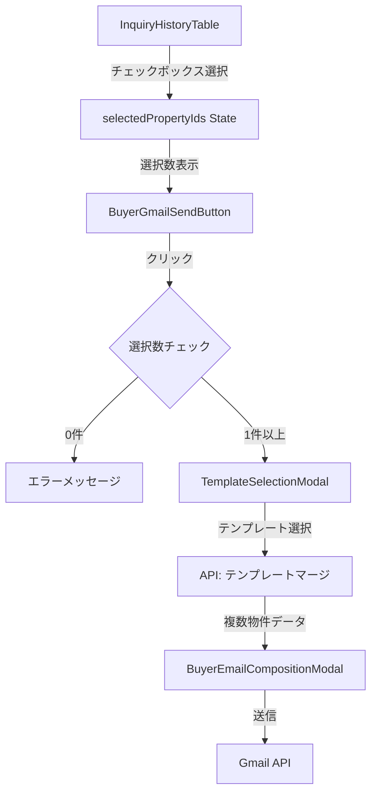

# Design Document

## Overview

買主詳細ページの問合せ履歴テーブルにチェックボックス機能を追加し、選択した物件を直接Gmail作成画面に渡すことで、ユーザー体験を向上させます。現在の二段階選択プロセス（チェックボックス選択→物件選択モーダル）を排除し、ワンステップでメール作成に進めるようにします。

## Architecture

### 現在のフロー
```
1. ユーザーがGmail送信ボタンをクリック
2. PropertySelectionModalが表示される
3. ユーザーが物件を選択
4. TemplateSelectionModalが表示される
5. ユーザーがテンプレートを選択
6. BuyerEmailCompositionModalが表示される
7. メール送信
```

### 新しいフロー
```
1. ユーザーが問合せ履歴テーブルでチェックボックスを使って物件を選択
2. ユーザーがGmail送信ボタンをクリック
3. TemplateSelectionModalが表示される（PropertySelectionModalをスキップ）
4. ユーザーがテンプレートを選択
5. BuyerEmailCompositionModalが表示される（選択された複数物件の情報が含まれる）
6. メール送信
```

### アーキテクチャ図



## Components and Interfaces

### 1. InquiryHistoryTable（既存コンポーネントの拡張）

**現在の実装状態**: 既にチェックボックス機能が実装済み

**Props**:
```typescript
interface InquiryHistoryTableProps {
  inquiryHistory: InquiryHistoryItem[];
  selectedPropertyIds: Set<string>;  // 既存
  onSelectionChange: (propertyIds: Set<string>) => void;  // 既存
  onBuyerClick?: (buyerNumber: string) => void;
}
```

**変更点**: なし（既に必要な機能が実装済み）

### 2. BuyerGmailSendButton（大幅な変更）

**変更前のロジック**:
```typescript
const handleClick = () => {
  if (inquiryHistory.length === 1) {
    setSelectedPropertyId(inquiryHistory[0].propertyId);
    setTemplateModalOpen(true);
  } else {
    setPropertyModalOpen(true);  // 物件選択モーダルを表示
  }
};
```

**変更後のロジック**:
```typescript
interface BuyerGmailSendButtonProps {
  buyerId: string;
  buyerEmail: string;
  buyerName: string;
  inquiryHistory: InquiryHistoryItem[];
  selectedPropertyIds: Set<string>;  // 新規追加
  size?: 'small' | 'medium' | 'large';
  variant?: 'text' | 'outlined' | 'contained';
}

const handleClick = () => {
  // チェックボックスで選択された物件IDsを使用
  if (selectedPropertyIds.size === 0) {
    setErrorMessage('物件を選択してください');
    return;
  }
  
  // 直接テンプレート選択へ
  setTemplateModalOpen(true);
};
```

**State管理**:
```typescript
// 削除するstate
const [propertyModalOpen, setPropertyModalOpen] = useState(false);
const [selectedPropertyId, setSelectedPropertyId] = useState<string | null>(null);

// 新規追加するstate
const [selectedPropertyListingIds, setSelectedPropertyListingIds] = useState<string[]>([]);
```

### 3. BuyerEmailCompositionModal（複数物件対応）

**変更前**:
```typescript
interface BuyerEmailCompositionModalProps {
  propertyId?: string;  // 単一物件
  // ...
}
```

**変更後**:
```typescript
interface BuyerEmailCompositionModalProps {
  propertyIds: string[];  // 複数物件対応
  mergedContent: MergedEmailContent;  // 複数物件の情報が含まれる
  // ...
}
```

### 4. PropertySelectionModal（削除対象）

このコンポーネントは完全に削除します。関連するimport、state、ハンドラーもすべて削除します。

## Data Models

### InquiryHistoryItem（既存）
```typescript
interface InquiryHistoryItem {
  buyerNumber: string;
  propertyNumber: string;
  propertyAddress: string;
  inquiryDate: string;
  status: 'current' | 'past';
  propertyId: string;
  propertyListingId: string;
}
```

### MergedEmailContent（拡張）
```typescript
interface MergedEmailContent {
  subject: string;
  body: string;  // 複数物件の情報がフォーマットされて含まれる
  properties: PropertyDetail[];  // 新規追加
}

interface PropertyDetail {
  propertyNumber: string;
  propertyAddress: string;
  price: number;
  propertyType: string;
  landArea?: number;
  buildingArea?: number;
}
```

## Correctness Properties

*プロパティとは、システムのすべての有効な実行において真であるべき特性や動作のことです。これらは人間が読める仕様と機械で検証可能な正確性保証の橋渡しとなります。*

### Property 1: チェックボックス選択状態の一貫性
*For any* 問合せ履歴テーブルの状態において、チェックボックスで選択された物件IDsのセットは、親コンポーネントのselectedPropertyIds stateと常に一致している必要があります。

**Validates: Requirements 1.2, 2.1, 2.2**

### Property 2: Gmail送信ボタンの有効/無効状態
*For any* selectedPropertyIds stateにおいて、セットが空の場合はGmail送信ボタンが無効化され、1つ以上の要素がある場合は有効化されている必要があります。

**Validates: Requirements 1.4, 1.5**

### Property 3: 物件選択モーダルのスキップ
*For any* Gmail送信ボタンのクリックイベントにおいて、selectedPropertyIds.size > 0の場合、PropertySelectionModalは表示されず、直接TemplateSelectionModalが表示される必要があります。

**Validates: Requirements 3.1, 3.2**

### Property 4: 複数物件情報のメール本文挿入
*For any* 選択された物件のセットにおいて、BuyerEmailCompositionModalに渡されるmergedContent.bodyには、すべての選択された物件の詳細情報（物件番号、住所、価格など）がフォーマットされて含まれている必要があります。

**Validates: Requirements 4.1, 4.2, 4.3, 4.4**

### Property 5: テンプレート選択機能の保持
*For any* テンプレート選択操作において、既存のテンプレート選択機能は変更前と同じように動作し、選択されたテンプレートが複数物件の情報とマージされる必要があります。

**Validates: Requirements 5.1, 5.3**

### Property 6: エラーハンドリングの完全性
*For any* エラー状態（選択物件なし、API失敗、データ欠損）において、システムは適切なエラーメッセージをユーザーに表示し、エラーログを記録する必要があります。

**Validates: Requirements 6.1, 6.2, 6.3, 6.4**

## Error Handling

### 1. 選択物件なしエラー
```typescript
if (selectedPropertyIds.size === 0) {
  setErrorMessage('メールを送信する物件を選択してください');
  return;
}
```

### 2. API通信エラー
```typescript
try {
  const response = await api.post('/api/email-templates/merge-multiple', {
    templateId,
    propertyIds: Array.from(selectedPropertyIds),
    buyer: { buyerName, email: buyerEmail }
  });
} catch (err: any) {
  console.error('Failed to merge template with multiple properties:', err);
  setErrorMessage(err.response?.data?.error || 'テンプレートの準備に失敗しました');
}
```

### 3. 物件データ欠損エラー
```typescript
const missingDataProperties = selectedProperties.filter(p => 
  !p.propertyNumber || !p.propertyAddress
);

if (missingDataProperties.length > 0) {
  setErrorMessage(
    `一部の物件データが不完全です: ${missingDataProperties.map(p => p.propertyNumber).join(', ')}`
  );
}
```

### 4. Gmail API送信エラー
```typescript
try {
  await api.post('/api/gmail/send', emailData);
  setSuccessMessage('メールを送信しました');
} catch (err: any) {
  throw new Error(err.response?.data?.error || 'メールの送信に失敗しました');
}
```

## Testing Strategy

### Unit Tests

#### InquiryHistoryTable
- チェックボックスのクリックでonSelectionChangeが正しく呼ばれる
- 全選択チェックボックスが正しく動作する
- 選択状態が視覚的に表示される

#### BuyerGmailSendButton
- selectedPropertyIds.size === 0の場合、ボタンが無効化される
- selectedPropertyIds.size > 0の場合、ボタンが有効化される
- クリック時にPropertySelectionModalが表示されない
- クリック時にTemplateSelectionModalが表示される
- 選択数が正しく表示される

#### BuyerEmailCompositionModal
- 複数物件のデータが正しくmergedContentに含まれる
- メール本文に全物件の情報が含まれる

### Property-Based Tests

各プロパティに対して、最低100回の反復テストを実行します。

#### Property Test 1: チェックボックス選択状態の一貫性
```typescript
// Feature: buyer-detail-inquiry-checkbox-gmail, Property 1: チェックボックス選択状態の一貫性
test('checkbox selection state consistency', () => {
  fc.assert(
    fc.property(
      fc.array(fc.record({
        propertyListingId: fc.string(),
        propertyNumber: fc.string(),
        propertyAddress: fc.string(),
        inquiryDate: fc.date(),
        status: fc.constantFrom('current', 'past')
      })),
      fc.set(fc.string()),
      (inquiryHistory, selectedIds) => {
        // テーブルの選択状態と親のstateが一致することを検証
        const tableSelectedIds = new Set(selectedIds);
        expect(tableSelectedIds).toEqual(selectedIds);
      }
    ),
    { numRuns: 100 }
  );
});
```

#### Property Test 2: Gmail送信ボタンの有効/無効状態
```typescript
// Feature: buyer-detail-inquiry-checkbox-gmail, Property 2: Gmail送信ボタンの有効/無効状態
test('gmail button enabled/disabled state', () => {
  fc.assert(
    fc.property(
      fc.set(fc.string()),
      (selectedIds) => {
        const isEnabled = selectedIds.size > 0;
        const expectedDisabled = selectedIds.size === 0;
        expect(!isEnabled).toBe(expectedDisabled);
      }
    ),
    { numRuns: 100 }
  );
});
```

#### Property Test 3: 物件選択モーダルのスキップ
```typescript
// Feature: buyer-detail-inquiry-checkbox-gmail, Property 3: 物件選択モーダルのスキップ
test('property selection modal is skipped', () => {
  fc.assert(
    fc.property(
      fc.set(fc.string(), { minLength: 1 }),
      (selectedIds) => {
        // selectedIds.size > 0の場合、PropertySelectionModalは表示されない
        const shouldShowPropertyModal = false;
        const shouldShowTemplateModal = true;
        expect(shouldShowPropertyModal).toBe(false);
        expect(shouldShowTemplateModal).toBe(true);
      }
    ),
    { numRuns: 100 }
  );
});
```

#### Property Test 4: 複数物件情報のメール本文挿入
```typescript
// Feature: buyer-detail-inquiry-checkbox-gmail, Property 4: 複数物件情報のメール本文挿入
test('multiple properties in email body', () => {
  fc.assert(
    fc.property(
      fc.array(fc.record({
        propertyNumber: fc.string(),
        propertyAddress: fc.string(),
        price: fc.integer({ min: 0 })
      }), { minLength: 1 }),
      (properties) => {
        const mergedBody = generateEmailBody(properties);
        // すべての物件情報が本文に含まれることを検証
        properties.forEach(prop => {
          expect(mergedBody).toContain(prop.propertyNumber);
          expect(mergedBody).toContain(prop.propertyAddress);
        });
      }
    ),
    { numRuns: 100 }
  );
});
```

### Integration Tests

- 問合せ履歴テーブルでチェックボックスを選択→Gmail送信ボタンクリック→テンプレート選択→メール作成画面表示の一連のフローが正しく動作する
- 複数物件を選択した場合、すべての物件情報がメール本文に含まれる
- エラー発生時に適切なエラーメッセージが表示される

## Implementation Notes

### Phase 1: BuyerGmailSendButtonの変更
1. PropertySelectionModal関連のコードを削除
2. selectedPropertyIds propsを追加
3. handleClickロジックを変更（直接テンプレート選択へ）
4. 選択数表示を追加

### Phase 2: テンプレートマージAPIの拡張
1. `/api/email-templates/:id/merge-multiple`エンドポイントを作成
2. 複数物件のデータを受け取り、フォーマットされたメール本文を生成
3. 各物件の情報を適切にフォーマット

### Phase 3: BuyerEmailCompositionModalの更新
1. propertyId → propertyIds（配列）に変更
2. 複数物件の情報を表示

### Phase 4: PropertySelectionModalの削除
1. コンポーネントファイルを削除
2. すべてのimportを削除
3. 関連するstateとハンドラーを削除

### Phase 5: 統合テスト
1. エンドツーエンドのフローをテスト
2. エラーケースをテスト
3. 既存機能（テンプレート選択、送信者選択）が正常に動作することを確認

## Backward Compatibility

- テンプレート選択機能は変更なし
- 送信者選択機能は変更なし
- Gmail API統合は変更なし
- 既存のメールテンプレートは引き続き使用可能

## Performance Considerations

- 複数物件のデータ取得は並列処理で実行
- 大量の物件選択時のパフォーマンスを考慮（最大選択数の制限を検討）
- メール本文の生成は効率的なテンプレートエンジンを使用

## Security Considerations

- 選択された物件IDsのバリデーション
- ユーザーが閲覧権限を持つ物件のみ選択可能
- Gmail API認証の維持
- XSS対策（メール本文のサニタイズ）
