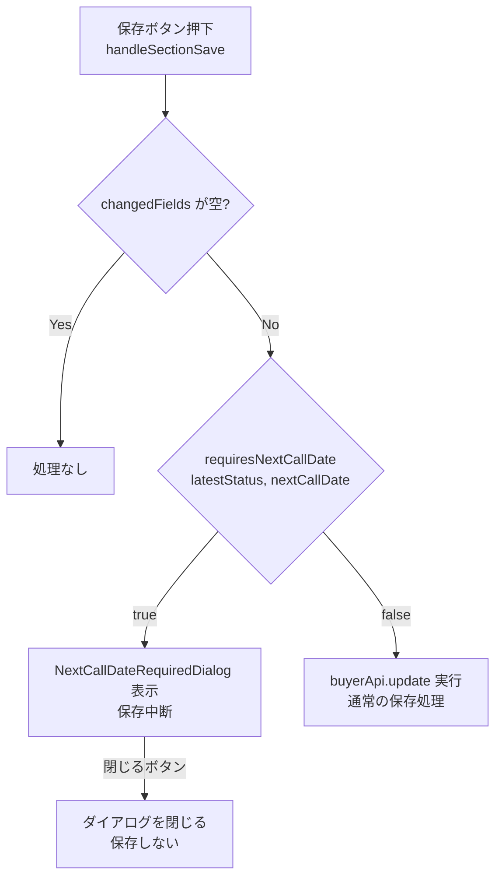

# デザインドキュメント：買主詳細画面 次電日必須バリデーション

## 概要

`BuyerDetailPage` の保存処理に、次電日（`next_call_date`）の必須チェックを追加する。

保存ボタン押下時に `latest_status` を評価し、「A」または「B」を含むステータス（ただし「AZ」「BZ」で始まるものを除く）が選択されており、かつ `next_call_date` が未設定の場合、保存を中断して `NextCallDateRequiredDialog` を表示する。

---

## アーキテクチャ

### 変更対象ファイル

- `frontend/frontend/src/pages/BuyerDetailPage.tsx` — バリデーションロジックと `handleSectionSave` への組み込み
- 新規コンポーネント `NextCallDateRequiredDialog`（`BuyerDetailPage.tsx` 内に定義、または `frontend/frontend/src/components/NextCallDateRequiredDialog.tsx` として切り出し）

### 設計方針

既存の `ValidationWarningDialog` パターンを参考に、シンプルな「閉じるのみ」ダイアログとして実装する。保存を強制する手段は提供しない（必ず修正してから保存させる）。



---

## コンポーネントとインターフェース

### requiresNextCallDate（純粋関数）

バリデーション判定ロジックを純粋関数として切り出す。

```typescript
/**
 * 次電日の設定が必須かどうかを判定する
 * @param latestStatus - 最新状況の値（保存済み + 編集中の最終値）
 * @param nextCallDate - 次電日の値（保存済み + 編集中の最終値）
 * @returns true = 次電日必須（ダイアログ表示）、false = チェック不要
 */
export function requiresNextCallDate(
  latestStatus: string | null | undefined,
  nextCallDate: string | null | undefined
): boolean {
  // latest_status が未設定の場合はチェック不要
  if (!latestStatus || latestStatus.trim() === '') return false;

  // 「AZ」または「BZ」で始まる場合はチェック不要
  if (latestStatus.startsWith('AZ') || latestStatus.startsWith('BZ')) return false;

  // 「A」または「B」を含まない場合はチェック不要
  if (!latestStatus.includes('A') && !latestStatus.includes('B')) return false;

  // 上記条件を通過 = A系またはB系ステータス
  // next_call_date が未設定の場合のみ true
  return !nextCallDate || nextCallDate.trim() === '';
}
```

### NextCallDateRequiredDialog

新規コンポーネント。「閉じる」ボタンのみを持つシンプルな警告ダイアログ。

```typescript
interface NextCallDateRequiredDialogProps {
  open: boolean;
  onClose: () => void;
}

function NextCallDateRequiredDialog({ open, onClose }: NextCallDateRequiredDialogProps) {
  return (
    <Dialog open={open} onClose={onClose} maxWidth="sm" fullWidth>
      <DialogTitle sx={{ display: 'flex', alignItems: 'center', gap: 1 }}>
        <WarningAmberIcon color="warning" />
        次電日が未設定です
      </DialogTitle>
      <DialogContent>
        <Typography variant="body2">
          最新状況がAやBの場合は次電日の設定は必須です。
          次電日の設定不要の場合はAZもしくはBZを選択してください。
        </Typography>
      </DialogContent>
      <DialogActions sx={{ px: 3, pb: 2 }}>
        <Button variant="contained" color="warning" onClick={onClose}>
          閉じる
        </Button>
      </DialogActions>
    </Dialog>
  );
}
```

### handleSectionSave への組み込み

```typescript
const handleSectionSave = async (sectionTitle: string) => {
  const changedFields = sectionChangedFields[sectionTitle] || {};
  if (Object.keys(changedFields).length === 0) return;

  // 次電日必須バリデーション
  // 最終値 = 編集中の値があればそれを優先、なければ保存済みの値
  const latestStatus = 'latest_status' in changedFields
    ? changedFields.latest_status
    : buyer?.latest_status;
  const nextCallDate = 'next_call_date' in changedFields
    ? changedFields.next_call_date
    : buyer?.next_call_date;

  if (requiresNextCallDate(latestStatus, nextCallDate)) {
    setNextCallDateDialogOpen(true);
    return; // 保存中断
  }

  // 以降は既存の保存処理
  setSectionSavingStates(prev => ({ ...prev, [sectionTitle]: true }));
  // ...
};
```

### 状態管理

```typescript
// NextCallDateRequiredDialog の開閉状態
const [nextCallDateDialogOpen, setNextCallDateDialogOpen] = useState(false);
```

---

## データモデル

### 最終値の計算ルール

保存ボタン押下時のバリデーションでは、「保存済みデータ（`buyer`）」と「編集中データ（`changedFields`）」を合わせた最終値を使用する。

```typescript
// フィールドの最終値を取得するヘルパー
const getFinalValue = (fieldName: string): any => {
  const changedFields = sectionChangedFields[sectionTitle] || {};
  return fieldName in changedFields ? changedFields[fieldName] : buyer?.[fieldName];
};
```

### バリデーション判定表

| `latest_status` | `next_call_date` | ダイアログ表示 |
|---|---|---|
| `A:この物件を気に入っている...` | NULL / 空文字 | ✅ 表示 |
| `B:1年以内に引っ越し希望...` | NULL / 空文字 | ✅ 表示 |
| `AB`（AとBを両方含む） | NULL / 空文字 | ✅ 表示 |
| `A:この物件を気に入っている...` | `2026-05-01` | ❌ 表示しない |
| `AZ:Aだが次電日不要` | NULL / 空文字 | ❌ 表示しない |
| `BZ：Bだが次電日不要` | NULL / 空文字 | ❌ 表示しない |
| `C:検討中` | NULL / 空文字 | ❌ 表示しない |
| NULL / 空文字 | NULL / 空文字 | ❌ 表示しない |

---

## 正確性プロパティ

*プロパティとは、システムの全ての有効な実行において真であるべき特性や振る舞いのことです。プロパティは人間が読める仕様と機械で検証可能な正確性保証の橋渡しをします。*

### Property 1: バリデーション判定ロジックの正確性

*任意の* `latestStatus` 文字列と `nextCallDate` 文字列の組み合わせに対して、`requiresNextCallDate(latestStatus, nextCallDate)` は以下の条件が全て成立する場合かつその場合に限り `true` を返す：

1. `latestStatus` が NULL でも空文字でもない
2. `latestStatus` が「AZ」で始まらない
3. `latestStatus` が「BZ」で始まらない
4. `latestStatus` に「A」または「B」が含まれる
5. `nextCallDate` が NULL または空文字

**Validates: Requirements 1.2, 1.3, 1.4, 1.5, 1.6, 3.1, 3.2, 3.3, 3.4**

---

## エラーハンドリング

- `requiresNextCallDate` は例外を投げない。`null` / `undefined` は空文字として扱う。
- `NextCallDateRequiredDialog` は `open: false` の場合は何もレンダリングしない（MUI Dialog の標準動作）。
- 保存処理中（`sectionSavingStates[sectionTitle]: true`）は保存ボタンが無効化されるため、二重送信は発生しない。
- バリデーションチェックは保存処理の最初に行うため、API呼び出し前に中断される。

---

## テスト戦略

### PBT適用判断

`requiresNextCallDate` は純粋関数であり、入力の組み合わせが多様（任意の文字列 × 任意の文字列）なため、プロパティベーステストが適用可能。

### ユニットテスト（例ベース）

**`requiresNextCallDate` の具体例テスト**

| `latestStatus` | `nextCallDate` | 期待結果 |
|---|---|---|
| `'A:この物件を気に入っている...'` | `null` | `true` |
| `'B:1年以内に引っ越し希望...'` | `''` | `true` |
| `'AZ:Aだが次電日不要'` | `null` | `false` |
| `'BZ：Bだが次電日不要'` | `null` | `false` |
| `'A:この物件を気に入っている...'` | `'2026-05-01'` | `false` |
| `'C:検討中'` | `null` | `false` |
| `null` | `null` | `false` |
| `''` | `null` | `false` |

**`NextCallDateRequiredDialog` のレンダリングテスト**

- `open=true` の時に警告メッセージが表示されること
- `open=true` の時に「閉じる」ボタンが表示されること
- `open=true` の時に `WarningAmberIcon` が表示されること
- 「閉じる」ボタン押下時に `onClose` が呼ばれること

**`handleSectionSave` の統合テスト**

- A系ステータス + 次電日未設定 → ダイアログが開き、API呼び出しが行われないこと
- A系ステータス + 次電日設定済み → ダイアログが開かず、API呼び出しが行われること
- AZ系ステータス + 次電日未設定 → ダイアログが開かず、API呼び出しが行われること

### プロパティベーステスト（fast-check 使用）

最小100イテレーション。

**Property 1 のテスト実装方針**：

```typescript
// Feature: buyer-detail-next-call-date-required, Property 1: バリデーション判定ロジックの正確性
fc.assert(fc.property(
  fc.oneof(
    fc.constant(null),
    fc.constant(''),
    fc.constant('AZ:Aだが次電日不要'),
    fc.constant('BZ：Bだが次電日不要'),
    fc.constant('A:この物件を気に入っている（こちらからの一押しが必要）'),
    fc.constant('B:1年以内に引っ越し希望だが、この物件ではない。'),
    fc.constant('AB'),
    fc.string(),  // 任意の文字列
  ),
  fc.oneof(
    fc.constant(null),
    fc.constant(''),
    fc.constant('2026-05-01'),
    fc.string(),
  ),
  (latestStatus, nextCallDate) => {
    const result = requiresNextCallDate(latestStatus, nextCallDate);

    // 期待値を独立して計算
    const isBlankStatus = !latestStatus || latestStatus.trim() === '';
    const isAZPrefix = latestStatus?.startsWith('AZ') ?? false;
    const isBZPrefix = latestStatus?.startsWith('BZ') ?? false;
    const containsAorB = (latestStatus?.includes('A') || latestStatus?.includes('B')) ?? false;
    const isBlankDate = !nextCallDate || nextCallDate.trim() === '';

    const expected =
      !isBlankStatus &&
      !isAZPrefix &&
      !isBZPrefix &&
      containsAorB &&
      isBlankDate;

    return result === expected;
  }
), { numRuns: 100 });
```
