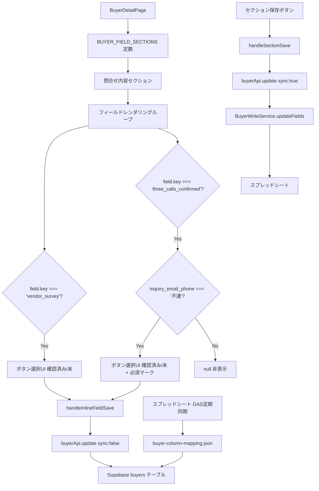

# 設計ドキュメント: buyer-detail-phone-response-fields

## 概要

買主詳細画面（`BuyerDetailPage.tsx`）および新規登録画面（`NewBuyerPage.tsx`）に2つのフィールドを追加する。

**機能1**: `inquiry_email_phone`（【問合メール】電話対応）が「不通」の場合のみ、`three_calls_confirmed`（3回架電確認済み）フィールドをボタン選択UIで条件付き必須表示する。

**機能2**: `vendor_survey`（業者向けアンケート）フィールドを `inquiry_hearing`（問合時ヒアリング）の直上に常時表示する。

両フィールドともスプレッドシートとの相互同期が必要。`three_calls_confirmed` は既存カラム・既存マッピング済み。`vendor_survey` は新規カラム追加とマッピング追加が必要。

---

## アーキテクチャ



### 変更対象ファイル

| ファイル | 変更内容 |
|---------|---------|
| `frontend/frontend/src/pages/BuyerDetailPage.tsx` | `BUYER_FIELD_SECTIONS` に `vendor_survey` 追加、`three_calls_confirmed` の条件付き表示ロジック変更 |
| `frontend/src/pages/NewBuyerPage.tsx` | `vendor_survey` フィールドの追加 |
| `backend/src/config/buyer-column-mapping.json` | `「業者向けアンケート」→ vendor_survey` マッピング追加 |
| DBマイグレーション | `buyers` テーブルに `vendor_survey` カラム追加（TEXT型） |

---

## コンポーネントとインターフェース

### BuyerDetailPage の変更

#### 1. `BUYER_FIELD_SECTIONS` の問合せ内容セクション

`vendor_survey` を `inquiry_hearing` の直前に追加し、`three_calls_confirmed` の `fieldType` を `buttonSelect` に変更する。

```typescript
// 変更後の問合せ内容セクション（抜粋）
{ key: 'vendor_survey', label: '業者向けアンケート', inlineEditable: true, fieldType: 'buttonSelect' },
{ key: 'inquiry_hearing', label: '問合時ヒアリング', multiline: true, inlineEditable: true },
// ...
{ key: 'inquiry_email_phone', label: '【問合メール】電話対応', inlineEditable: true, fieldType: 'dropdown' },
{ key: 'three_calls_confirmed', label: '3回架電確認済み', inlineEditable: true, fieldType: 'buttonSelect' },
```

#### 2. `vendor_survey` フィールドのレンダリング

`button-select-layout-rule.md` に従ったボタン選択UI（横並び・均等幅）で実装する。

```tsx
if (field.key === 'vendor_survey') {
  const VENDOR_SURVEY_BTNS = ['確認済み', '未'];
  return (
    <Grid item xs={12} key={`${section.title}-${field.key}`}>
      <Box sx={{ display: 'flex', alignItems: 'center', gap: 1 }}>
        <Typography variant="caption" color="text.secondary"
          sx={{ whiteSpace: 'nowrap', flexShrink: 0 }}>
          {field.label}
        </Typography>
        <Box sx={{ display: 'flex', gap: 0.5, flex: 1 }}>
          {VENDOR_SURVEY_BTNS.map((opt) => {
            const isSelected = buyer[field.key] === opt;
            return (
              <Button
                key={opt}
                size="small"
                variant={isSelected ? 'contained' : 'outlined'}
                color="primary"
                onClick={async () => {
                  const newValue = isSelected ? '' : opt;
                  setBuyer((prev: any) => prev ? { ...prev, [field.key]: newValue } : prev);
                  handleFieldChange(section.title, field.key, newValue);
                  handleInlineFieldSave(field.key, newValue).catch(console.error);
                }}
                sx={{ flex: 1, py: 0.5, fontWeight: isSelected ? 'bold' : 'normal', borderRadius: 1 }}
              >
                {opt}
              </Button>
            );
          })}
        </Box>
      </Box>
    </Grid>
  );
}
```

#### 3. `three_calls_confirmed` フィールドのレンダリング変更

現在の実装（常時表示・3択）を、条件付き表示（`inquiry_email_phone === '不通'` のときのみ）・2択（「確認済み」「未」）・必須マーク付きに変更する。

```tsx
if (field.key === 'three_calls_confirmed') {
  // inquiry_email_phone が「不通」の場合のみ表示
  if (buyer.inquiry_email_phone !== '不通') {
    return null;
  }

  const THREE_CALLS_BTNS = ['確認済み', '未'];
  return (
    <Grid item xs={12} key={`${section.title}-${field.key}`}>
      <Box sx={{ display: 'flex', alignItems: 'center', gap: 1 }}>
        <Typography variant="caption" color="error"
          sx={{ whiteSpace: 'nowrap', flexShrink: 0, fontWeight: 'bold' }}>
          {field.label} *
        </Typography>
        <Box sx={{ display: 'flex', gap: 0.5, flex: 1 }}>
          {THREE_CALLS_BTNS.map((opt) => {
            const isSelected = buyer[field.key] === opt;
            return (
              <Button
                key={opt}
                size="small"
                variant={isSelected ? 'contained' : 'outlined'}
                color="primary"
                onClick={async () => {
                  const newValue = isSelected ? '' : opt;
                  setBuyer((prev: any) => prev ? { ...prev, [field.key]: newValue } : prev);
                  handleFieldChange(section.title, field.key, newValue);
                  handleInlineFieldSave(field.key, newValue).catch(console.error);
                }}
                sx={{ flex: 1, py: 0.5, fontWeight: isSelected ? 'bold' : 'normal', borderRadius: 1 }}
              >
                {opt}
              </Button>
            );
          })}
        </Box>
      </Box>
    </Grid>
  );
}
```

### NewBuyerPage の変更

`vendor_survey` フィールドを `inquiry_hearing` の直前に追加する。既存の `three_calls_confirmed` の条件付き表示ロジック（`inquiry_email_phone === '不通'` のとき表示）は既に実装済みのため、選択肢を「確認済み」「未」に変更するのみ。

---

## データモデル

### DBスキーマ変更

`vendor_survey` カラムを `buyers` テーブルに追加する。

```sql
ALTER TABLE buyers ADD COLUMN IF NOT EXISTS vendor_survey TEXT;
```

### 既存カラム確認

`three_calls_confirmed` は既存カラム（TEXT型）。`buyer-column-mapping.json` の `spreadsheetToDatabaseExtended` に `"3回架電確認済み": "three_calls_confirmed"` として既にマッピング済み。

### buyer-column-mapping.json への追加

`spreadsheetToDatabaseExtended` セクションに以下を追加する。

```json
"業者向けアンケート": "vendor_survey"
```

### フィールド仕様

| DBカラム名 | スプレッドシートカラム名 | 型 | 選択肢 | 表示条件 |
|-----------|---------------------|-----|--------|---------|
| `three_calls_confirmed` | `3回架電確認済み` | TEXT | 「確認済み」「未」 | `inquiry_email_phone === '不通'` のときのみ |
| `vendor_survey` | `業者向けアンケート` | TEXT | 「確認済み」「未」 | 常時表示 |

### 同期フロー

**DB → スプレッドシート（即時）**:
- ボタンクリック時: `handleInlineFieldSave` → `buyerApi.update({ sync: false })` → DBのみ更新
- セクション保存時: `handleSectionSave` → `buyerApi.update({ sync: true })` → DB更新 + `BuyerWriteService.updateFields` → スプレッドシート更新

**スプレッドシート → DB（GAS定期同期）**:
- GASの定期トリガーが `buyer-column-mapping.json` のマッピングを使用してDBを更新
- `three_calls_confirmed`: 既存マッピングで対応済み
- `vendor_survey`: 新規マッピング追加後に対応

---

## Correctness Properties

*A property is a characteristic or behavior that should hold true across all valid executions of a system—essentially, a formal statement about what the system should do. Properties serve as the bridge between human-readable specifications and machine-verifiable correctness guarantees.*

### Property 1: inquiry_email_phone の値による three_calls_confirmed の表示制御

*For any* buyer オブジェクトに対して、`inquiry_email_phone === '不通'` のとき `three_calls_confirmed` フィールドが表示され、それ以外（空文字・他の値）のとき非表示になること。

**Validates: Requirements 1.1, 1.2, 1.8**

### Property 2: ボタンクリック時に handleInlineFieldSave が呼ばれる

*For any* `vendor_survey` または `three_calls_confirmed` フィールドの選択値に対して、ボタンをクリックしたとき `handleInlineFieldSave(fieldKey, newValue)` が対応するフィールドキーと選択値で呼び出されること。

**Validates: Requirements 1.4, 2.3**

### Property 3: セクション保存時に BuyerWriteService が呼ばれる

*For any* `vendor_survey` または `three_calls_confirmed` を含む変更データに対して、セクション保存ボタンを押したとき `BuyerWriteService.updateFields` が買主番号と変更データを引数として呼び出されること。

**Validates: Requirements 1.5, 2.4**

### Property 4: vendor_survey のラウンドトリップ保存

*For any* 有効な `vendor_survey` の値（「確認済み」「未」または空文字）に対して、DBに保存してから取得したとき同じ値が返ること。

**Validates: Requirements 3.1, 3.2**

### Property 5: BUYER_FIELD_SECTIONS における vendor_survey の配置

`BUYER_FIELD_SECTIONS` の問合せ内容セクションにおいて、`vendor_survey` キーが `inquiry_hearing` キーの直前に配置されていること。

**Validates: Requirements 2.1, 2.2**

---

## エラーハンドリング

- `vendor_survey` / `three_calls_confirmed` の保存失敗は既存の `handleInlineFieldSave` のエラーハンドリングに委ねる（スナックバー表示）
- `buyer.inquiry_email_phone` が `undefined` の場合は「不通」以外として扱い、`three_calls_confirmed` を非表示にする（`=== '不通'` の厳密比較で自然に対応）
- `vendor_survey` カラムが存在しない場合、APIレスポンスで `undefined` になるため `|| ''` でフォールバックする
- スプレッドシート同期失敗時は `syncStatus: 'pending'` として保留キューに追加される（既存の RetryHandler が処理）

---

## テスト戦略

### ユニットテスト（具体例・エッジケース）

- `inquiry_email_phone === undefined` のとき `three_calls_confirmed` が非表示（エッジケース）
- `inquiry_email_phone === ''` のとき `three_calls_confirmed` が非表示（エッジケース）
- `inquiry_email_phone === '不通'` のとき `three_calls_confirmed` が表示され、ラベルに「*」が含まれること
- `BUYER_FIELD_SECTIONS` の問合せ内容セクションで `vendor_survey` が `inquiry_hearing` の直前に存在すること（Property 5）
- `buyer-column-mapping.json` に `"業者向けアンケート": "vendor_survey"` が存在すること（要件 2.5, 2.8）
- `buyer-column-mapping.json` に `"3回架電確認済み": "three_calls_confirmed"` が存在すること（要件 1.6）

### プロパティベーステスト（fast-check を使用）

各プロパティテストは最低100回実行する。

**Property 1 のテスト**:
```typescript
// Feature: buyer-detail-phone-response-fields, Property 1: inquiry_email_phone による three_calls_confirmed 表示制御
fc.assert(fc.property(
  fc.record({
    inquiry_email_phone: fc.oneof(
      fc.constant('不通'),
      fc.constant('済'),
      fc.constant('未'),
      fc.constant(''),
      fc.constant(undefined)
    )
  }),
  (buyer) => {
    const { queryByText } = render(<BuyerDetailPage buyer={buyer} ... />);
    if (buyer.inquiry_email_phone === '不通') {
      expect(queryByText('3回架電確認済み')).toBeInTheDocument();
    } else {
      expect(queryByText('3回架電確認済み')).not.toBeInTheDocument();
    }
  }
), { numRuns: 100 });
```

**Property 2 のテスト**:
```typescript
// Feature: buyer-detail-phone-response-fields, Property 2: ボタンクリック時に handleInlineFieldSave が呼ばれる
fc.assert(fc.property(
  fc.record({
    fieldKey: fc.constantFrom('vendor_survey', 'three_calls_confirmed'),
    value: fc.constantFrom('確認済み', '未')
  }),
  ({ fieldKey, value }) => {
    const mockSave = jest.fn().mockResolvedValue({ success: true });
    // ボタンをクリックしたとき mockSave(fieldKey, value) が呼ばれることを確認
    expect(mockSave).toHaveBeenCalledWith(fieldKey, value);
  }
), { numRuns: 100 });
```

**Property 4 のテスト**:
```typescript
// Feature: buyer-detail-phone-response-fields, Property 4: vendor_survey ラウンドトリップ保存
fc.assert(fc.property(
  fc.constantFrom('確認済み', '未', ''),
  async (value) => {
    await buyerService.update(testBuyerNumber, { vendor_survey: value });
    const result = await buyerService.getByBuyerNumber(testBuyerNumber);
    expect(result.vendor_survey).toBe(value || null);
  }
), { numRuns: 100 });
```

### 手動確認項目

- `inquiry_email_phone` を「不通」に切り替えたとき、ページリロードなしで `three_calls_confirmed` が即座に表示されること
- 「不通」以外に切り替えたとき、`three_calls_confirmed` が即座に非表示になること（DBの値は保持）
- `vendor_survey` が `inquiry_hearing` の直上に表示されること
- 両フィールドのボタンをクリックして保存後、スプレッドシートに反映されること
- NewBuyerPage でも同様の動作が確認できること
