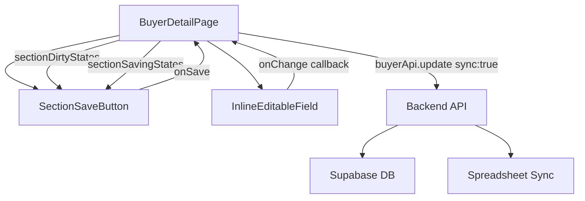

# 設計ドキュメント: 買主詳細画面 保存UX改善

## Overview

買主詳細画面（BuyerDetailPage）では、現在フィールドを編集するたびに即座にAPIが呼び出される。特にドロップダウン（配信種別・メール種別等）を選択すると「編集中」状態が長く続き、保存完了まで時間がかかる問題がある。

本機能では、**セクション別保存ボタン（SectionSaveButton）**を導入する。各セクションのヘッダー右端に保存ボタンを配置し、フィールドが変更されたときにボタンをハイライト表示する。ユーザーは任意のタイミングでセクション単位の保存を実行できる。

### 解決する問題

- ドロップダウン選択後に「編集中」が長時間表示される
- フィールドごとに個別API呼び出しが発生し、スプレッドシート同期が頻繁に走る
- 変更があるセクションが一目でわからない

### 設計方針

- バックエンドの変更は不要（既存の `buyerApi.update` + `sync: true` で対応）
- `InlineEditableField` に `onChange` コールバックを追加して変更検知を行う
- セクションごとに DirtyState・変更フィールド・保存中状態を管理する

---

## Architecture



### データフロー

1. ユーザーがフィールドを変更 → `InlineEditableField.onChange` が呼ばれる
2. `BuyerDetailPage` が `sectionChangedFields` と `sectionDirtyStates` を更新
3. 対象セクションの `SectionSaveButton` がハイライト表示に切り替わる
4. ユーザーが保存ボタンをクリック → `handleSectionSave(sectionTitle)` が実行される
5. 変更フィールドのみを `buyerApi.update({ sync: true })` で送信
6. 成功後、DirtyState・changedFields をリセット、スナックバーで通知

---

## Components and Interfaces

### 1. SectionSaveButton（新規コンポーネント）

**ファイル**: `frontend/frontend/src/components/SectionSaveButton.tsx`

```typescript
interface SectionSaveButtonProps {
  isDirty: boolean;      // ハイライト表示の切り替え
  isSaving: boolean;     // ローディング状態
  onSave: () => void;    // 保存ハンドラー
}
```

**表示仕様**:
- `isDirty: false` → 通常の非ハイライト状態（`variant="outlined"`, `color="inherit"`）
- `isDirty: true` → ハイライト状態（`variant="contained"`, `color="warning"` + pulse アニメーション）
- `isSaving: true` → `CircularProgress` を表示し、ボタンを `disabled`

### 2. InlineEditableField（既存コンポーネントへの追加）

**ファイル**: `frontend/frontend/src/components/InlineEditableField.tsx`

追加するプロパティ:

```typescript
interface InlineEditableFieldProps {
  // ... 既存プロパティ
  onChange?: (fieldName: string, newValue: any) => void;  // 追加
}
```

`onChange` は値が変更されたタイミング（ドロップダウン選択・テキスト入力）で呼び出す。`onSave` とは独立して動作する。

### 3. BuyerDetailPage（既存ページへの変更）

**追加するstate**:

```typescript
// セクションごとのDirtyState
const [sectionDirtyStates, setSectionDirtyStates] = useState<Record<string, boolean>>({});

// セクションごとの変更フィールド追跡
const [sectionChangedFields, setSectionChangedFields] = useState<Record<string, Record<string, any>>>({});

// セクションごとの保存中状態
const [sectionSavingStates, setSectionSavingStates] = useState<Record<string, boolean>>({});
```

**追加するハンドラー**:

```typescript
// フィールド変更検知
const handleFieldChange = (sectionTitle: string, fieldName: string, newValue: any) => void;

// セクション保存
const handleSectionSave = async (sectionTitle: string) => Promise<void>;
```

---

## Data Models

### SectionDirtyState

```typescript
// キー: セクションタイトル（'問合せ内容' | '基本情報' | 'その他'）
type SectionDirtyStates = Record<string, boolean>;

// 例
{
  '問合せ内容': true,   // 変更あり（ハイライト）
  '基本情報': false,    // 変更なし
  'その他': false,
}
```

### SectionChangedFields

```typescript
// キー: セクションタイトル → フィールド名 → 新しい値
type SectionChangedFields = Record<string, Record<string, any>>;

// 例
{
  '問合せ内容': {
    'distribution_type': '一括',
    'email_type': 'HTML',
  },
  '基本情報': {},
  'その他': {},
}
```

### DirtyState判定ロジック

フィールドの変更判定は、`buyer` state（APIレスポンスの値）と現在の入力値を比較する。

```typescript
// 元の値と同じ場合はDirtyStateをfalseに戻す
const isDirty = newValue !== buyer[fieldName];
```

セクション全体のDirtyStateは、そのセクションの `sectionChangedFields` が空でないかで判定する。

---

## Correctness Properties

*A property is a characteristic or behavior that should hold true across all valid executions of a system—essentially, a formal statement about what the system should do. Properties serve as the bridge between human-readable specifications and machine-verifiable correctness guarantees.*

### Property 1: DirtyState はフィールド変更後に true になる

*For any* セクションとそのセクション内の任意のフィールドについて、フィールドの値が元の値（保存済みの値）と異なる値に変更された場合、そのセクションの DirtyState は true になる。

**Validates: Requirements 1.2, 4.1, 4.2**

### Property 2: DirtyState は元の値に戻したとき false になる

*For any* セクションとそのセクション内の任意のフィールドについて、変更後に元の値（保存済みの値）に戻した場合、そのセクションの DirtyState は false になる（変更フィールドが空になる）。

**Validates: Requirements 4.3**

### Property 3: 保存時は変更フィールドのみが送信される

*For any* セクションについて、保存ボタンをクリックしたとき、APIに送信されるオブジェクトは `sectionChangedFields[sectionTitle]` に記録されたフィールドのみを含む。変更されていないフィールドは含まれない。

**Validates: Requirements 2.1, 5.1, 5.2**

### Property 4: 保存成功後に DirtyState がリセットされる

*For any* セクションについて、保存が成功した場合、そのセクションの DirtyState は false になり、`sectionChangedFields` は空オブジェクトになる。

**Validates: Requirements 2.3**

### Property 5: 保存中はボタンが無効化される

*For any* セクションについて、保存処理が進行中（`isSaving: true`）の間、そのセクションの SectionSaveButton は disabled 状態になり、再クリックを受け付けない。

**Validates: Requirements 3.1**

### Property 6: 保存完了後（成功・失敗問わず）isSaving がリセットされる

*For any* セクションについて、保存処理が完了した場合（成功・失敗どちらの結果でも）、そのセクションの `sectionSavingStates` は false になる。

**Validates: Requirements 3.2**

### Property 7: 保存失敗時は DirtyState が維持される

*For any* セクションについて、保存が失敗した場合、そのセクションの DirtyState は true のまま維持され、`sectionChangedFields` もリセットされない。

**Validates: Requirements 2.5**

---

## Error Handling

### API エラー

- `buyerApi.update` が失敗した場合、`catch` ブロックでエラーをキャッチする
- スナックバーにエラーメッセージを表示する（`severity: 'error'`）
- DirtyState と changedFields はリセットしない（ユーザーが再試行できるようにする）
- `sectionSavingStates` は必ず `finally` でリセットする

```typescript
const handleSectionSave = async (sectionTitle: string) => {
  setSectionSavingStates(prev => ({ ...prev, [sectionTitle]: true }));
  try {
    const changedFields = sectionChangedFields[sectionTitle] || {};
    if (Object.keys(changedFields).length === 0) return;

    const result = await buyerApi.update(buyer_number!, changedFields, { sync: true });
    setBuyer(result.buyer);
    setSectionDirtyStates(prev => ({ ...prev, [sectionTitle]: false }));
    setSectionChangedFields(prev => ({ ...prev, [sectionTitle]: {} }));
    setSnackbar({ open: true, message: '保存しました', severity: 'success' });
  } catch (error: any) {
    setSnackbar({
      open: true,
      message: error.response?.data?.error || '保存に失敗しました',
      severity: 'error',
    });
    // DirtyState は維持（リセットしない）
  } finally {
    setSectionSavingStates(prev => ({ ...prev, [sectionTitle]: false }));
  }
};
```

### 変更なしで保存ボタンをクリック

- `sectionChangedFields[sectionTitle]` が空の場合は早期リターン
- API呼び出しは行わない

### スプレッドシート同期競合

- 既存の競合検知ロジック（`result.conflicts`）はそのまま活用
- 競合がある場合は `severity: 'warning'` のスナックバーを表示

---

## Testing Strategy

### Unit Tests（具体例・エッジケース）

- `SectionSaveButton` のレンダリングテスト
  - `isDirty: false` のとき通常スタイルで表示される
  - `isDirty: true` のときハイライトスタイルで表示される
  - `isSaving: true` のとき disabled かつ CircularProgress が表示される
- `handleFieldChange` のロジックテスト
  - 元の値と同じ値を入力したとき DirtyState が false になる
  - 異なる値を入力したとき DirtyState が true になる
- `handleSectionSave` のエラーハンドリングテスト
  - API失敗時に DirtyState が維持される
  - `finally` で `isSaving` が必ず false になる

### Property-Based Tests（普遍的性質）

プロパティベーステストには **fast-check**（TypeScript/JavaScript向け）を使用する。各テストは最低 **100回** 実行する。

各テストには以下のタグコメントを付与する:
```
// Feature: buyer-detail-save-ux-improvement, Property {N}: {property_text}
```

#### Property 1: DirtyState はフィールド変更後に true になる

```typescript
// Feature: buyer-detail-save-ux-improvement, Property 1: DirtyState はフィールド変更後に true になる
fc.assert(
  fc.property(
    fc.string(), // sectionTitle
    fc.string(), // fieldName
    fc.anything(), // originalValue
    fc.anything(), // newValue（originalValueと異なる）
    (sectionTitle, fieldName, originalValue, newValue) => {
      fc.pre(newValue !== originalValue);
      const result = computeDirtyState(sectionTitle, fieldName, originalValue, newValue, {});
      return result.sectionDirtyStates[sectionTitle] === true;
    }
  ),
  { numRuns: 100 }
);
```

#### Property 2: DirtyState は元の値に戻したとき false になる

```typescript
// Feature: buyer-detail-save-ux-improvement, Property 2: DirtyState は元の値に戻したとき false になる
fc.assert(
  fc.property(
    fc.string(), // sectionTitle
    fc.string(), // fieldName
    fc.anything(), // value
    (sectionTitle, fieldName, value) => {
      // 変更後に元の値に戻す
      const afterChange = computeDirtyState(sectionTitle, fieldName, value, 'changed', {});
      const afterRevert = computeDirtyState(sectionTitle, fieldName, 'changed', value, afterChange.sectionChangedFields);
      return afterRevert.sectionDirtyStates[sectionTitle] === false;
    }
  ),
  { numRuns: 100 }
);
```

#### Property 3: 保存時は変更フィールドのみが送信される

```typescript
// Feature: buyer-detail-save-ux-improvement, Property 3: 保存時は変更フィールドのみが送信される
fc.assert(
  fc.property(
    fc.dictionary(fc.string(), fc.anything()), // changedFields
    fc.dictionary(fc.string(), fc.anything()), // allBuyerFields
    (changedFields, allBuyerFields) => {
      const payload = buildSavePayload(changedFields);
      // ペイロードのキーは changedFields のキーのみ
      return Object.keys(payload).every(key => key in changedFields);
    }
  ),
  { numRuns: 100 }
);
```

#### Property 4: 保存成功後に DirtyState がリセットされる

```typescript
// Feature: buyer-detail-save-ux-improvement, Property 4: 保存成功後に DirtyState がリセットされる
fc.assert(
  fc.property(
    fc.string(), // sectionTitle
    fc.dictionary(fc.string(), fc.anything()), // changedFields
    (sectionTitle, changedFields) => {
      const afterSave = applySuccessfulSave(sectionTitle, changedFields);
      return (
        afterSave.sectionDirtyStates[sectionTitle] === false &&
        Object.keys(afterSave.sectionChangedFields[sectionTitle] || {}).length === 0
      );
    }
  ),
  { numRuns: 100 }
);
```

#### Property 5: 保存失敗時は DirtyState が維持される

```typescript
// Feature: buyer-detail-save-ux-improvement, Property 5: 保存失敗時は DirtyState が維持される
fc.assert(
  fc.property(
    fc.string(), // sectionTitle
    fc.dictionary(fc.string(), fc.anything()), // changedFields（非空）
    (sectionTitle, changedFields) => {
      fc.pre(Object.keys(changedFields).length > 0);
      const afterFailure = applyFailedSave(sectionTitle, changedFields);
      return (
        afterFailure.sectionDirtyStates[sectionTitle] === true &&
        Object.keys(afterFailure.sectionChangedFields[sectionTitle] || {}).length > 0
      );
    }
  ),
  { numRuns: 100 }
);
```

#### Property 6: 保存完了後（成功・失敗問わず）isSaving がリセットされる

```typescript
// Feature: buyer-detail-save-ux-improvement, Property 6: 保存完了後（成功・失敗問わず）isSaving がリセットされる
fc.assert(
  fc.property(
    fc.string(), // sectionTitle
    fc.boolean(), // saveSucceeded
    (sectionTitle, saveSucceeded) => {
      const afterSave = saveSucceeded
        ? applySuccessfulSave(sectionTitle, {})
        : applyFailedSave(sectionTitle, { someField: 'value' });
      return afterSave.sectionSavingStates[sectionTitle] === false;
    }
  ),
  { numRuns: 100 }
);
```
