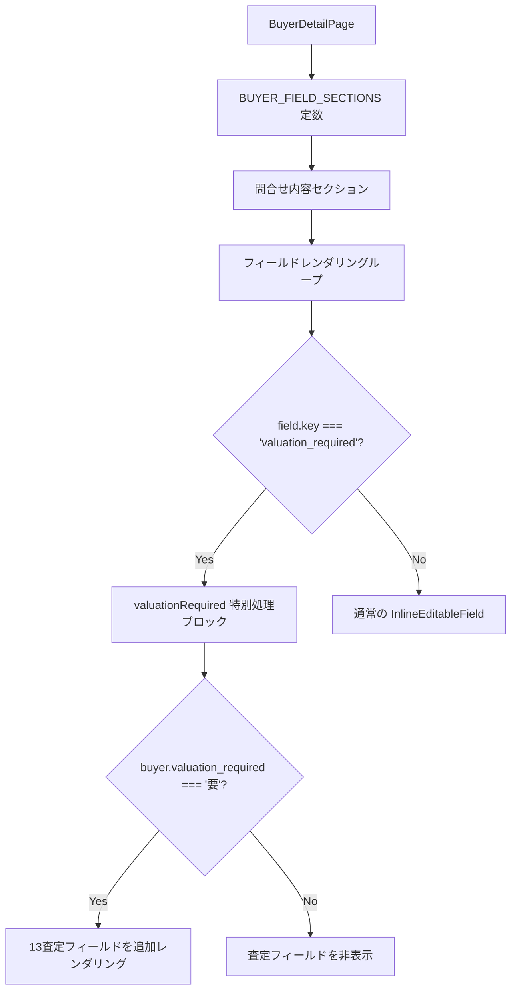

# 設計ドキュメント: buyer-detail-valuation-fields

## 概要

買主詳細画面（`BuyerDetailPage.tsx`）の「問合せ内容」セクションに対して2つの変更を行う。

1. `owned_home_hearing`（持家ヒアリング）フィールドを `BUYER_FIELD_SECTIONS` から削除し、`next_call_date`（次電日）を `distribution_type` の直後に移動する
2. `valuation_required`（要査定）が「要」の場合に、査定関連の13フィールドを `valuation_required` フィールドの直後に条件付きで表示する

変更はフロントエンドのみ（`frontend/frontend/src/pages/BuyerDetailPage.tsx`）で完結し、バックエンド変更は不要。

---

## アーキテクチャ



変更点は2箇所に集約される：

- **`BUYER_FIELD_SECTIONS` 定数**（静的構造の変更）
- **`valuation_required` 特別処理ブロック**（動的レンダリングの追加）

---

## コンポーネントとインターフェース

### 変更対象コンポーネント

**`BuyerDetailPage`**（`frontend/frontend/src/pages/BuyerDetailPage.tsx`）

#### 変更1: `BUYER_FIELD_SECTIONS` の問合せ内容セクション

```typescript
// 変更前
{ key: 'distribution_type', ... },
{ key: 'owned_home_hearing', ... },  // ← 削除
{ key: 'owned_home_hearing_inquiry', ... },
{ key: 'owned_home_hearing_result', ... },
{ key: 'valuation_required', ... },
{ key: 'next_call_date', ... },       // ← 末尾にある

// 変更後
{ key: 'distribution_type', ... },
{ key: 'next_call_date', ... },       // ← owned_home_hearing の位置に移動
{ key: 'owned_home_hearing_inquiry', ... },
{ key: 'owned_home_hearing_result', ... },
{ key: 'valuation_required', ... },
// next_call_date はここから削除
```

#### 変更2: `valuation_required` 特別処理ブロック内への査定フィールド追加

既存の `if (field.key === 'valuation_required')` ブロックの return 文内、ボタン UI の直後に以下を追加する：

```typescript
// buyer.valuation_required === '要' の場合に13フィールドを追加レンダリング
{buyer.valuation_required === '要' && VALUATION_FIELDS.map((vField) => (
  <Grid item xs={12} key={vField.key}>
    <InlineEditableField
      label={vField.label}
      value={buyer[vField.key] || ''}
      fieldName={vField.key}
      fieldType="text"
      onSave={async (newValue) => {
        await handleInlineFieldSave(vField.key, newValue);
      }}
      onChange={(fieldName, newValue) => handleFieldChange(section.title, fieldName, newValue)}
      buyerId={buyer_number}
      enableConflictDetection={true}
      showEditIndicator={true}
    />
  </Grid>
))}
```

### 新規定数: `VALUATION_FIELDS`

`BUYER_FIELD_SECTIONS` の近くに定義する：

```typescript
const VALUATION_FIELDS = [
  { key: 'property_type', label: '種別' },
  { key: 'location', label: '所在地' },
  { key: 'current_status', label: '現況' },
  { key: 'land_area', label: '土地面積（不明の場合は空欄）' },
  { key: 'building_area', label: '建物面積（不明の場合は空欄）' },
  { key: 'floor_plan', label: '間取り' },
  { key: 'build_year', label: '築年（西暦）' },
  { key: 'renovation_history', label: 'リフォーム履歴（その他太陽光等も）' },
  { key: 'other_valuation_done', label: '他に査定したことある？' },
  { key: 'owner_name', label: '名義人' },
  { key: 'loan_balance', label: 'ローン残' },
  { key: 'visit_desk', label: '訪問/机上' },
  { key: 'seller_list_copy', label: '売主リストコピー' },
];
```

---

## データモデル

### 既存の `buyer` オブジェクト

変更はフロントエンドの表示ロジックのみ。バックエンドのデータモデルは変更しない。

`buyer` オブジェクトには既に以下のフィールドが含まれている（DBカラムとして存在）：

| フィールドキー | 型 | 説明 |
|---|---|---|
| `valuation_required` | string | 「要」または「不要」または空文字 |
| `property_type` | string | 種別 |
| `location` | string | 所在地 |
| `current_status` | string | 現況 |
| `land_area` | string | 土地面積 |
| `building_area` | string | 建物面積 |
| `floor_plan` | string | 間取り |
| `build_year` | string | 築年（西暦） |
| `renovation_history` | string | リフォーム履歴 |
| `other_valuation_done` | string | 他査定経験 |
| `owner_name` | string | 名義人 |
| `loan_balance` | string | ローン残 |
| `visit_desk` | string | 訪問/机上 |
| `seller_list_copy` | string | 売主リストコピー |

保存時は既存の `handleInlineFieldSave(fieldKey, newValue)` を呼び出すため、保存フローの変更は不要。

---

## Correctness Properties

*A property is a characteristic or behavior that should hold true across all valid executions of a system—essentially, a formal statement about what the system should do. Properties serve as the bridge between human-readable specifications and machine-verifiable correctness guarantees.*

### Property 1: 問合せ内容セクションの静的構造

`BUYER_FIELD_SECTIONS` の問合せ内容セクションにおいて、`owned_home_hearing` キーが存在せず、`next_call_date` が `distribution_type` の直後に配置され、`owned_home_hearing_inquiry` および `owned_home_hearing_result` が引き続き存在すること。

**Validates: Requirements 1.1, 1.2, 1.3**

### Property 2: 要査定=要のとき13フィールドが表示される

*For any* buyer オブジェクトで `valuation_required === '要'` の場合、`valuation_required` フィールドの直後に `VALUATION_FIELDS` で定義された13フィールドが全て表示されること。

**Validates: Requirements 2.1, 2.4**

### Property 3: 要査定=要以外のとき13フィールドが非表示になる

*For any* buyer オブジェクトで `valuation_required` が「要」以外（空文字または「不要」）の場合、`VALUATION_FIELDS` の13フィールドが一切表示されないこと。

**Validates: Requirements 2.2, 2.3**

### Property 4: 査定フィールドは InlineEditableField として描画される

*For any* buyer オブジェクトで `valuation_required === '要'` の場合、表示される13フィールドはそれぞれ `fieldType="text"` の `InlineEditableField` コンポーネントとして描画されること。

**Validates: Requirements 2.5**

### Property 5: 査定フィールド保存時に handleInlineFieldSave が呼ばれる

*For any* 査定フィールドキーと新しい値に対して、`onSave` が呼ばれたとき `handleInlineFieldSave` が対応するDBカラム名と新しい値で呼び出されること。

**Validates: Requirements 2.6**

---

## エラーハンドリング

- 査定フィールドの保存失敗は既存の `handleInlineFieldSave` のエラーハンドリングに委ねる（スナックバー表示）
- `buyer.valuation_required` が `undefined` の場合は「要」以外として扱い、13フィールドを非表示にする（`=== '要'` の厳密比較で自然に対応）
- `VALUATION_FIELDS` のキーに対応する `buyer` プロパティが存在しない場合は `|| ''` でフォールバックする

---

## テスト戦略

### ユニットテスト（具体例・エッジケース）

- `BUYER_FIELD_SECTIONS` の問合せ内容セクションに `owned_home_hearing` が含まれないこと（Property 1）
- `distribution_type` の次のフィールドが `next_call_date` であること（Property 1）
- `valuation_required === undefined` のとき13フィールドが非表示（エッジケース）
- `valuation_required === ''` のとき13フィールドが非表示（エッジケース）

### プロパティベーステスト（fast-check を使用）

各プロパティテストは最低100回実行する。

**Property 2 のテスト**:
```
// Feature: buyer-detail-valuation-fields, Property 2: 要査定=要のとき13フィールドが表示される
fc.assert(fc.property(
  fc.record({ ...buyerArbitrary, valuation_required: fc.constant('要') }),
  (buyer) => {
    render(<BuyerDetailPage ... />);
    VALUATION_FIELDS.forEach(f => {
      expect(screen.getByLabelText(f.label)).toBeInTheDocument();
    });
  }
), { numRuns: 100 });
```

**Property 3 のテスト**:
```
// Feature: buyer-detail-valuation-fields, Property 3: 要査定=要以外のとき13フィールドが非表示
fc.assert(fc.property(
  fc.record({ ...buyerArbitrary, valuation_required: fc.oneof(fc.constant(''), fc.constant('不要')) }),
  (buyer) => {
    render(<BuyerDetailPage ... />);
    VALUATION_FIELDS.forEach(f => {
      expect(screen.queryByLabelText(f.label)).not.toBeInTheDocument();
    });
  }
), { numRuns: 100 });
```

**Property 5 のテスト**:
```
// Feature: buyer-detail-valuation-fields, Property 5: 査定フィールド保存時に handleInlineFieldSave が呼ばれる
fc.assert(fc.property(
  fc.record({ key: fc.constantFrom(...VALUATION_FIELDS.map(f => f.key)), value: fc.string() }),
  ({ key, value }) => {
    const mockSave = jest.fn();
    // onSave を呼び出したとき mockSave(key, value) が呼ばれることを確認
  }
), { numRuns: 100 });
```

### 手動確認項目

- `valuation_required` を「要」に切り替えたとき、ページリロードなしで13フィールドが即座に表示されること
- 「不要」または空に切り替えたとき、13フィールドが即座に非表示になること
- 各査定フィールドをインライン編集して保存できること
