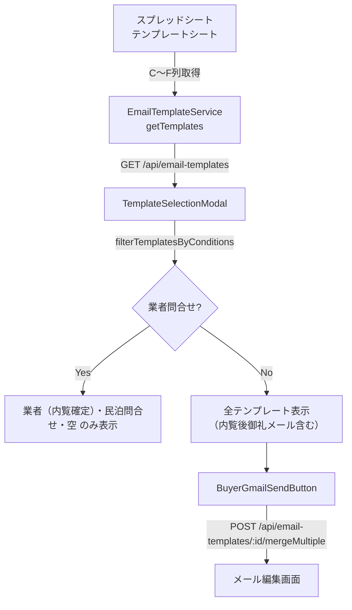

# 設計ドキュメント: 買主Gmail送信「内覧後御礼メール」テンプレート追加

## 概要

買主リストのGmail送信機能に「内覧後御礼メール」テンプレートを追加する。
現状、スプレッドシートのテンプレートシートに該当テンプレートが存在せず、
`filterTemplatesByConditions` 関数に内覧日による表示制御ロジックが実装されているため表示されない。

本機能では以下の2点を変更する：
1. スプレッドシートのテンプレートシートに「内覧後御礼メール」行を追加する
2. `filterTemplatesByConditions` 関数から内覧日チェックロジックを削除し、業者問合せ以外の全買主に表示する

---

## アーキテクチャ



変更箇所は2つのみ：
- **スプレッドシート**: テンプレートシートに行追加（コード変更なし）
- **フロントエンド**: `filterTemplatesByConditions` 関数の内覧日チェックロジック削除

---

## コンポーネントとインターフェース

### 変更対象: `filterTemplatesByConditions`

**ファイル**: `frontend/frontend/src/components/TemplateSelectionModal.tsx`

**現在の実装（削除対象ロジック）**:
```typescript
if (name === '内覧後御礼メール') {
  if (!viewingDate) return false;
  return viewingDate.getTime() <= today.getTime();
}
```

**変更後**: 上記ブロックを削除する。`内覧後御礼メール` は業者問合せ以外の全買主に表示される。

変更後の `filterTemplatesByConditions` のフィルタリングロジック：

| テンプレート名 | 業者問合せ | 非業者問合せ |
|---|---|---|
| `業者（内覧確定）` | 表示 | 非表示 |
| `民泊問合せ` | 表示 | 表示 |
| `空` | 表示 | 表示 |
| `内覧後御礼メール` | 非表示 | **常に表示**（内覧日不問） |
| `☆内覧前日通知メール` | 非表示 | 内覧日2日前以降のみ表示 |
| その他 | 非表示 | 表示 |

### 変更なし: `EmailTemplateService.getTemplates()`

**ファイル**: `backend/src/services/EmailTemplateService.ts`

スプレッドシートのC列が「買主」、D列が「内覧後御礼メール」の行を追加すれば、
既存の `getTemplates()` がそのまま取得・返却する。コード変更不要。

### 変更なし: `BuyerGmailSendButton`

テンプレート選択後の `mergeMultiple` API呼び出しフローは既存のまま動作する。

---

## データモデル

### スプレッドシート テンプレートシート 追加行

| 列 | 値 |
|---|---|
| C列（区分） | `買主` |
| D列（種別） | `内覧後御礼メール` |
| E列（件名） | `【御礼】先日のご内覧について` |
| F列（本文） | 下記参照 |

**本文テンプレート例**:
```
<<買主名>>様

先日は弊社物件のご内覧にお越しいただき、誠にありがとうございました。

ご内覧いただきました物件につきまして、ご不明な点やご質問がございましたら、
お気軽にお申し付けください。

物件番号：<<物件番号>>
物件住所：<<物件住所>>

引き続きご検討のほど、よろしくお願いいたします。

<<担当者署名>>
```

### EmailTemplate 型（変更なし）

```typescript
interface EmailTemplate {
  id: string;       // "buyer_sheet_{行番号}"
  name: string;     // D列: 種別（例: "内覧後御礼メール"）
  description: string;
  subject: string;  // E列: 件名
  body: string;     // F列: 本文
  placeholders: string[];
}
```

---

## 正確性プロパティ

*プロパティとは、システムの全ての有効な実行において成立すべき特性・振る舞いのことです。プロパティは人間が読める仕様と機械検証可能な正確性保証の橋渡しをします。*

### Property 1: 非業者問合せ・任意内覧日で内覧後御礼メールが表示される

*For any* 非「業者問合せ」の `brokerInquiry` 値（空文字・null・任意の文字列）と、任意の `latestViewingDate`（過去・未来・null）の組み合わせに対して、「内覧後御礼メール」を含むテンプレートリストを `filterTemplatesByConditions` に渡した場合、結果に「内覧後御礼メール」が含まれること。

**Validates: Requirements 1.2, 2.2, 2.3**

### Property 2: 業者問合せの場合は内覧後御礼メールが非表示

*For any* テンプレートリスト（「内覧後御礼メール」を含む）に対して `brokerInquiry === '業者問合せ'` で `filterTemplatesByConditions` を呼び出した場合、結果に「内覧後御礼メール」が含まれないこと。

**Validates: Requirements 2.1**

### Property 3: 区分「買主」のテンプレートが取得される

*For any* 区分「買主」・種別・件名・本文を持つスプレッドシート行に対して、`EmailTemplateService.getTemplates()` の結果にそのテンプレートが含まれること（件名・本文が空でない場合）。

**Validates: Requirements 1.1**

### Property 4: 件名または本文が空のテンプレートはスキップされる

*For any* 件名または本文が空文字のスプレッドシート行に対して、`EmailTemplateService.getTemplates()` の結果にそのテンプレートが含まれないこと。

**Validates: Requirements 3.4**

### Property 5: プレースホルダーが完全に置換される

*For any* 買主データと物件データの組み合わせに対して、`<<物件番号>>`・`<<物件住所>>`・`<<買主名>>` などのプレースホルダーを含むテンプレート本文を `mergeAngleBracketPlaceholders` で処理した場合、結果の文字列にプレースホルダー（`<<...>>`形式）が残らないこと。

**Validates: Requirements 3.2, 3.3**

---

## エラーハンドリング

| ケース | 対応 |
|---|---|
| スプレッドシートに「内覧後御礼メール」行が存在しない | テンプレート一覧に表示されないだけ（既存動作） |
| 件名・本文が空のテンプレート行 | `EmailTemplateService.getTemplates()` がスキップ（既存動作） |
| スプレッドシート取得失敗 | 既存のエラーハンドリングで `TemplateSelectionModal` にエラー表示 |
| `brokerInquiry` が undefined | 非業者問合せとして扱い、内覧後御礼メールを表示（既存動作） |

---

## テスト戦略

### ユニットテスト（例示ベース）

- `filterTemplatesByConditions` に `brokerInquiry === '業者問合せ'` を渡した場合、「内覧後御礼メール」が除外されること
- `filterTemplatesByConditions` に `brokerInquiry === undefined` を渡した場合、「内覧後御礼メール」が含まれること
- `filterTemplatesByConditions` に `latestViewingDate` が未来日付の場合でも「内覧後御礼メール」が含まれること（削除後の動作確認）
- `filterTemplatesByConditions` に `latestViewingDate` が null の場合でも「内覧後御礼メール」が含まれること

### プロパティベーステスト

プロパティベーステストには **fast-check** を使用する（既存テストで採用済み）。
各プロパティテストは最低100回のイテレーションで実行する。

**Property 1 のテスト実装方針**:
```typescript
// Feature: buyer-gmail-after-visit-template, Property 1: 非業者問合せ・任意内覧日で内覧後御礼メールが表示される
fc.assert(fc.property(
  fc.option(fc.string().filter(s => s !== '業者問合せ'), { nil: undefined }),
  fc.option(fc.string(), { nil: undefined }), // latestViewingDate
  (brokerInquiry, latestViewingDate) => {
    const templates = [{ id: '1', name: '内覧後御礼メール', ... }];
    const result = filterTemplatesByConditions(templates, brokerInquiry, latestViewingDate);
    return result.some(t => t.name === '内覧後御礼メール');
  }
), { numRuns: 100 });
```

**Property 2 のテスト実装方針**:
```typescript
// Feature: buyer-gmail-after-visit-template, Property 2: 業者問合せの場合は内覧後御礼メールが非表示
fc.assert(fc.property(
  fc.array(fc.record({ id: fc.string(), name: fc.string(), ... })),
  (templates) => {
    const withAfterVisit = [...templates, { id: 'x', name: '内覧後御礼メール', ... }];
    const result = filterTemplatesByConditions(withAfterVisit, '業者問合せ', undefined);
    return !result.some(t => t.name === '内覧後御礼メール');
  }
), { numRuns: 100 });
```

### 手動確認（スプレッドシート）

- スプレッドシートのテンプレートシートに「内覧後御礼メール」行が正しく追加されていること
- 件名・本文に適切なプレースホルダーが含まれていること
- 実際のGmail送信モーダルで「内覧後御礼メール」が表示されること（業者問合せ以外の買主）
- 業者問合せの買主では「内覧後御礼メール」が表示されないこと
