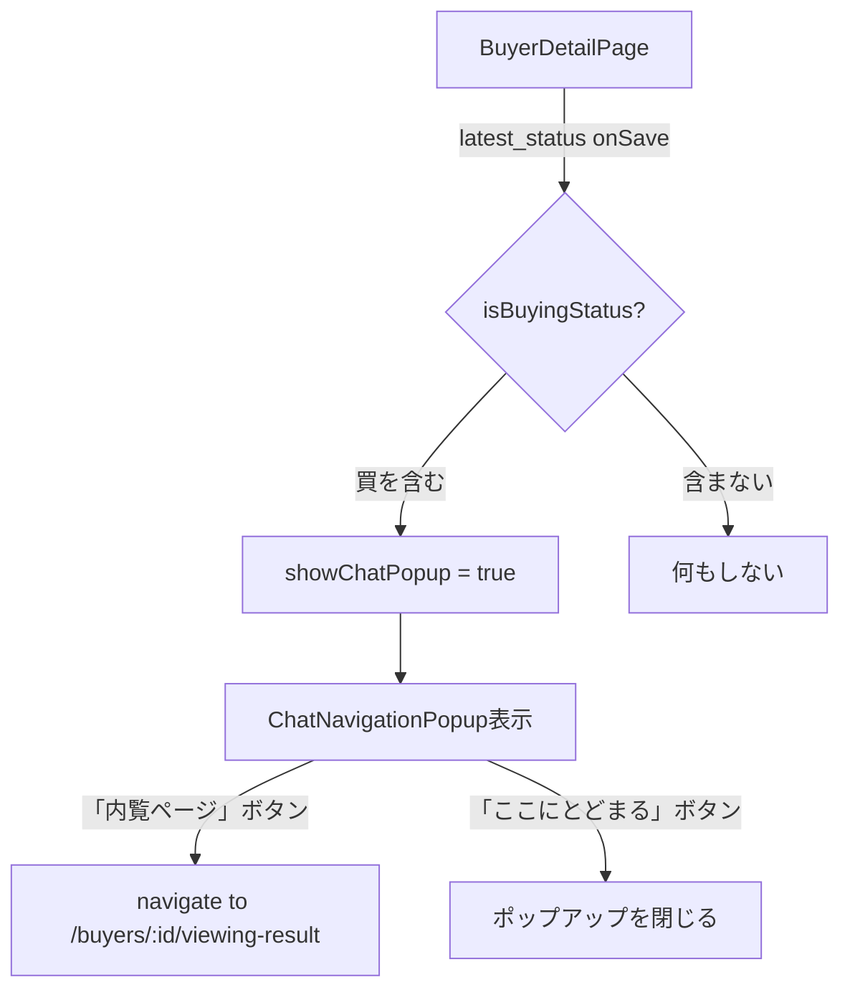

# 設計ドキュメント：buyer-latest-status-chat-popup

## 概要

買主詳細ページ（`BuyerDetailPage`）の「★最新状況」フィールドで"買"を含む選択肢が保存された際に、Chat送信を促すモーダルポップアップ（`ChatNavigationPopup`）を表示する機能。

ポップアップは「内覧ページ」（推奨ボタン）と「ここにとどまる」の2択を提示し、前者を選択すると `/buyers/:buyer_number/viewing-result` へ遷移する。

**変更範囲**: フロントエンドのみ（バックエンド変更なし）

---

## アーキテクチャ



### 変更ファイル一覧

| ファイル | 変更種別 | 内容 |
|---------|---------|------|
| `frontend/frontend/src/components/ChatNavigationPopup.tsx` | 新規作成 | モーダルコンポーネント |
| `frontend/frontend/src/pages/BuyerDetailPage.tsx` | 修正 | ポップアップ状態管理・表示ロジック追加 |

---

## コンポーネントとインターフェース

### ChatNavigationPopup

新規作成するモーダルコンポーネント。MUI の `Dialog` を使用する。

```typescript
interface ChatNavigationPopupProps {
  open: boolean;
  onNavigate: () => void;   // 「内覧ページ」ボタン押下時
  onClose: () => void;      // 「ここにとどまる」ボタン押下時
}
```

**UI仕様**:
- タイトル: なし（シンプルなメッセージのみ）
- メッセージ: 「Chat送信のため　内覧ページに飛んでください」
- ボタン1: 「内覧ページ」— `variant="contained"` / `color="primary"` で強調表示（推奨）
- ボタン2: 「ここにとどまる」— `variant="outlined"` / `color="inherit"` で控えめ表示
- `disableBackdropClick` / `disableEscapeKeyDown` は設定しない（デフォルト動作）

### BuyerDetailPage への変更

#### 追加する状態

```typescript
const [chatPopupOpen, setChatPopupOpen] = useState(false);
```

#### BuyingStatus判定関数

```typescript
const isBuyingStatus = (value: string): boolean => {
  return value.includes('買');
};
```

#### handleFieldSave の変更箇所

`latest_status` フィールドの `handleFieldSave` 内、`handleInlineFieldSave` 呼び出し後にポップアップ表示判定を追加する。

```typescript
const handleFieldSave = async (newValue: any) => {
  // 既存処理（楽観的更新・必須フィールド再チェック）
  setBuyer((prev: any) => prev ? { ...prev, [field.key]: newValue } : prev);
  handleFieldChange(section.title, field.key, newValue);
  setMissingRequiredFields(prev => { /* 既存処理 */ });

  // バックグラウンドで保存
  handleInlineFieldSave(field.key, newValue).catch(console.error);

  // 【追加】"買"を含む場合はポップアップを表示
  if (newValue && isBuyingStatus(String(newValue))) {
    setChatPopupOpen(true);
  }
};
```

#### ナビゲーションハンドラー

```typescript
const handleChatNavigate = () => {
  setChatPopupOpen(false);
  navigate(`/buyers/${buyer_number}/viewing-result`);
};
```

---

## データモデル

本機能はフロントエンドのUI状態のみを扱う。新規DBカラム・APIエンドポイントの追加は不要。

| 状態変数 | 型 | 初期値 | 説明 |
|---------|-----|--------|------|
| `chatPopupOpen` | `boolean` | `false` | ポップアップの表示/非表示 |

**BuyingStatus判定の対象値**（`LATEST_STATUS_OPTIONS` より）:
- `買（専任 両手）`
- `買（専任 片手）`
- `買（一般 両手）`
- `買（一般 片手）`
- `買付外れました`

判定ロジックは文字列に `"買"` が含まれるかどうかのシンプルな `includes` チェックとする。これにより将来的に選択肢が追加された場合も自動対応できる。

---

## 正確性プロパティ

*プロパティとは、システムの全ての有効な実行において真であるべき特性・振る舞いのことです。プロパティは人間が読める仕様と機械検証可能な正確性保証の橋渡しをします。*

### プロパティ1: BuyingStatus判定の正確性

*任意の* 文字列値に対して、`isBuyingStatus` 関数は「買」という文字を含む場合に `true` を返し、含まない場合に `false` を返す。

**Validates: 要件3.1, 3.2, 3.3**

### プロパティ2: ナビゲーション先の正確性

*任意の* 買主番号（`buyer_number`）に対して、「内覧ページ」ボタン押下時のナビゲーション先は必ず `/buyers/{buyer_number}/viewing-result` となる。

**Validates: 要件2.1**

---

## エラーハンドリング

| ケース | 対応 |
|--------|------|
| `handleInlineFieldSave` が失敗した場合 | 既存の `.catch(console.error)` で処理。ポップアップ表示はバックエンド保存の成否に関わらず行う（楽観的UI） |
| `navigate` 失敗 | React Router の標準エラーハンドリングに委ねる |
| `newValue` が `null` / `undefined` | `isBuyingStatus` 呼び出し前に `newValue &&` でガード済み |

---

## テスト戦略

### ユニットテスト

- `isBuyingStatus` 関数の境界値テスト
  - `"買（専任 両手）"` → `true`
  - `"買付外れました"` → `true`
  - `"他決"` → `false`
  - `""` → `false`
  - `"A:この物件を気に入っている"` → `false`

### プロパティベーステスト

本機能の中核ロジックは `isBuyingStatus` という純粋関数であり、PBTが適用可能。

**使用ライブラリ**: `fast-check`（プロジェクトのTypeScript/Vite環境に適合）

**プロパティテスト1: BuyingStatus判定の正確性**
- *任意の* 文字列に対して、`"買"` を含む場合は `true`、含まない場合は `false` を返す
- ジェネレーター: `fc.string()` で任意文字列を生成
- 最低100回実行
- タグ: `Feature: buyer-latest-status-chat-popup, Property 1: BuyingStatus判定の正確性`

**プロパティテスト2: ポップアップ表示条件**
- *任意の* `latest_status` 値に対して、`isBuyingStatus` が `true` を返す場合のみポップアップが開く
- ジェネレーター: `LATEST_STATUS_OPTIONS` の値からランダムサンプリング
- 最低100回実行
- タグ: `Feature: buyer-latest-status-chat-popup, Property 2: ポップアップ表示条件`

### 手動確認項目

1. 「買（専任 両手）」を選択・保存 → ポップアップが表示される
2. 「他決」を選択・保存 → ポップアップが表示されない
3. ポップアップで「内覧ページ」を押す → `/buyers/:buyer_number/viewing-result` に遷移
4. ポップアップで「ここにとどまる」を押す → ポップアップが閉じ、ページに留まる
5. ポップアップ表示中はバックグラウンドの操作が無効（モーダル動作）
