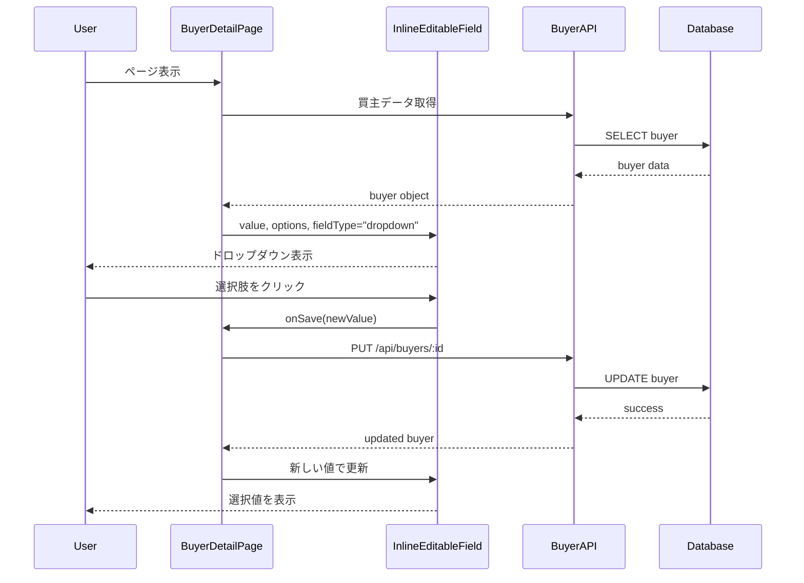

# Design Document: Buyer Latest Status Dropdown

## Overview

買主詳細ページの「★最新状況」フィールドを自由入力テキストからプルダウン選択式に変更する。既存のInlineEditableFieldコンポーネントのドロップダウン機能を活用し、新しいオプション定義ファイルを作成して実装する。

## Architecture

### 変更対象コンポーネント

```
frontend/
├── src/
│   ├── utils/
│   │   └── buyerLatestStatusOptions.ts  # 新規作成: 選択肢定義
│   └── pages/
│       └── BuyerDetailPage.tsx          # 変更: ドロップダウン使用
```

### データフロー



## Components and Interfaces

### 1. buyerLatestStatusOptions.ts

新しいユーティリティファイルで、最新状況の選択肢を定義する。

```typescript
export interface LatestStatusOption {
  value: string;
  label: string;
}

export const LATEST_STATUS_OPTIONS: LatestStatusOption[] = [
  { value: 'A:この物件を気に入っている（こちらからの一押しが必要）', label: 'A:この物件を気に入っている（こちらからの一押しが必要）' },
  { value: 'B:1年以内に引っ越し希望だが、この物件ではない。駐車場の要件や、日当たり等が合わない。', label: 'B:1年以内に引っ越し希望だが、この物件ではない。駐車場の要件や、日当たり等が合わない。' },
  { value: 'C:引っ越しは1年以上先', label: 'C:引っ越しは1年以上先' },
  { value: 'D:配信・追客不要案件（業者や確度が低く追客不要案件等）', label: 'D:配信・追客不要案件（業者や確度が低く追客不要案件等）' },
  { value: '買付外れました', label: '買付外れました' },
  { value: '買（一般 両手）', label: '買（一般 両手）' },
  { value: '買（一般 片手）', label: '買（一般 片手）' },
  { value: '買（専任 両手）', label: '買（専任 両手）' },
  { value: '買（専任 片手）', label: '買（専任 片手）' },
  { value: '買（他社、片手）', label: '買（他社、片手）' },
  { value: '他決', label: '他決' },
  { value: '2番手', label: '2番手' },
  { value: '3番手', label: '3番手' },
  { value: 'AZ:Aだが次電日不要', label: 'AZ:Aだが次電日不要' },
  { value: '2番手買付提出済み', label: '2番手買付提出済み' },
  { value: '3番手買付提出済み', label: '3番手買付提出済み' },
];
```

### 2. BuyerDetailPage.tsx の変更

BUYER_FIELD_SECTIONS内のlatest_statusフィールド定義を変更し、InlineEditableFieldにドロップダウンオプションを渡す。

変更前:
```typescript
{ key: 'latest_status', label: '★最新状況', inlineEditable: true },
```

変更後:
```typescript
{ key: 'latest_status', label: '★最新状況', inlineEditable: true, fieldType: 'dropdown' },
```

レンダリング部分で、latest_statusフィールドの場合にLATEST_STATUS_OPTIONSを渡す。

## Data Models

### 既存のBuyerモデル（変更なし）

```typescript
interface Buyer {
  id: string;
  buyer_number: string;
  latest_status: string | null;  // 既存のTEXT型カラム
  // ... other fields
}
```

データベーススキーマの変更は不要。latest_statusカラムは引き続きTEXT型として、選択された値をそのまま保存する。

## Correctness Properties

*A property is a characteristic or behavior that should hold true across all valid executions of a system-essentially, a formal statement about what the system should do. Properties serve as the bridge between human-readable specifications and machine-verifiable correctness guarantees.*

### Property 1: Options Definition Completeness
*For any* rendering of the Latest Status dropdown, all 16 predefined options SHALL be available in the exact order specified in the requirements.
**Validates: Requirements 1.1, 1.2**

### Property 2: Single Selection Constraint
*For any* user interaction with the dropdown, selecting one option SHALL result in exactly one value being stored, and any previous selection SHALL be replaced.
**Validates: Requirements 1.3**

### Property 3: Existing Value Display
*For any* buyer with an existing latest_status value, the dropdown SHALL display that value correctly, whether it matches a predefined option or not.
**Validates: Requirements 2.4, 4.1, 4.2**

### Property 4: Backward Compatibility
*For any* buyer with a latest_status value that does not match any predefined option, the system SHALL preserve the original value and allow the user to select a new value without automatic modification.
**Validates: Requirements 2.5, 4.3, 4.4**

### Property 5: Save and Update Consistency
*For any* selection of a new status option, the saved value SHALL equal the selected option value, and the UI SHALL immediately reflect the saved value.
**Validates: Requirements 3.1, 3.4**

## Error Handling

1. **保存失敗時**: エラーメッセージを表示し、前の値に戻す（既存のInlineEditableFieldの動作）
2. **同期競合時**: ConflictNotificationコンポーネントで競合を通知（既存の動作）
3. **無効な値**: 既存の値が選択肢にない場合でも表示し、新しい選択を許可

## Testing Strategy

### Unit Tests
- LATEST_STATUS_OPTIONSが16個の選択肢を正しい順序で含むことを確認
- 各選択肢のvalueとlabelが正しいことを確認

### Property-Based Tests
- Property 1: オプション配列の完全性と順序を検証
- Property 2: 選択操作後の値の一意性を検証
- Property 3: 様々な既存値での表示を検証
- Property 4: 非マッチング値の保持を検証
- Property 5: 保存と表示の一貫性を検証

### Integration Tests
- BuyerDetailPageでlatest_statusフィールドがドロップダウンとして表示されることを確認
- 選択→保存→表示の一連のフローを確認
- 既存データを持つ買主の表示を確認

### Property-Based Testing Configuration
- Testing Framework: Jest with fast-check
- Minimum iterations: 100 per property test
- Tag format: **Feature: buyer-latest-status-dropdown, Property {number}: {property_text}**
