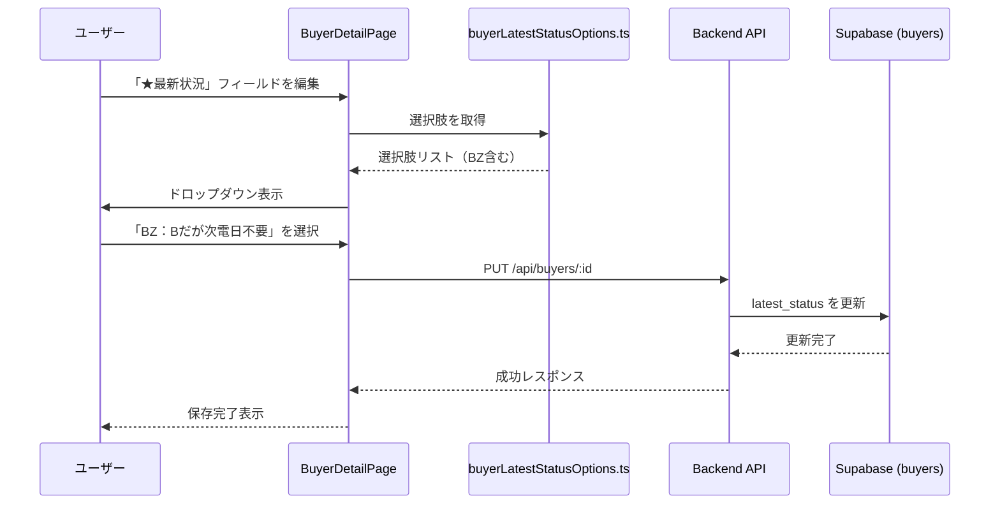

# 設計書: 買主「★最新状況」フィールド選択肢追加

## 概要

買主リストの詳細画面にある「★最新状況」フィールドに、新しい選択肢「BZ：Bだが次電日不要」を追加します。

## 主要アルゴリズム/ワークフロー



## コアインターフェース/型定義

```typescript
// frontend/frontend/src/utils/buyerLatestStatusOptions.ts

export interface LatestStatusOption {
  value: string;
  label: string;
}

export const LATEST_STATUS_OPTIONS: LatestStatusOption[] = [
  // 既存の選択肢...
  { value: 'AZ:Aだが次電日不要', label: 'AZ:Aだが次電日不要' },
  // 新規追加
  { value: 'BZ：Bだが次電日不要', label: 'BZ：Bだが次電日不要' },
  // その他の選択肢...
];
```

## 主要関数の形式仕様

### 関数1: LATEST_STATUS_OPTIONS配列

```typescript
export const LATEST_STATUS_OPTIONS: LatestStatusOption[]
```

**事前条件:**
- なし（定数配列）

**事後条件:**
- 配列に「BZ：Bだが次電日不要」が含まれる
- 既存の選択肢の順序は維持される
- 各要素は`value`と`label`プロパティを持つ

**ループ不変条件:** N/A（配列定義）

## アルゴリズム疑似コード

### 選択肢配列の更新

```pascal
ALGORITHM updateLatestStatusOptions()
INPUT: なし
OUTPUT: LATEST_STATUS_OPTIONS配列

BEGIN
  // 既存の選択肢配列を取得
  existingOptions ← LATEST_STATUS_OPTIONS
  
  // 新しい選択肢を追加
  newOption ← { value: 'BZ：Bだが次電日不要', label: 'BZ：Bだが次電日不要' }
  
  // 適切な位置に挿入（AZの後）
  azIndex ← findIndex(existingOptions, 'AZ:Aだが次電日不要')
  insertAt(existingOptions, azIndex + 1, newOption)
  
  RETURN existingOptions
END
```

**事前条件:**
- `LATEST_STATUS_OPTIONS`配列が存在する
- 'AZ:Aだが次電日不要'が配列に存在する

**事後条件:**
- 'BZ：Bだが次電日不要'が'AZ:Aだが次電日不要'の直後に挿入される
- 既存の選択肢は削除されない
- 配列の順序は論理的に正しい

**ループ不変条件:** N/A（単純な挿入操作）

## 使用例

```typescript
// 例1: BuyerDetailPageでの使用
import { LATEST_STATUS_OPTIONS } from '../utils/buyerLatestStatusOptions';

<InlineEditableField
  value={buyer.latest_status}
  fieldName="latest_status"
  fieldType="dropdown"
  options={LATEST_STATUS_OPTIONS}
  onSave={handleFieldSave}
/>

// 例2: NewBuyerPageでの使用
<Autocomplete
  fullWidth
  options={LATEST_STATUS_OPTIONS}
  getOptionLabel={(option) => option.label}
  value={LATEST_STATUS_OPTIONS.find(opt => opt.value === latestStatus) || null}
  onChange={(_, newValue) => setLatestStatus(newValue?.value || '')}
/>

// 例3: BuyerViewingResultPageでのフィルタリング使用
const getFilteredLatestStatusOptions = (): typeof LATEST_STATUS_OPTIONS => {
  const emptyOption = { value: '', label: '（空欄）' };
  return [emptyOption, ...LATEST_STATUS_OPTIONS];
};
```

## 正確性プロパティ

### プロパティ1: 選択肢の一意性

```typescript
∀ option1, option2 ∈ LATEST_STATUS_OPTIONS:
  option1 ≠ option2 ⟹ option1.value ≠ option2.value
```

**説明**: 全ての選択肢の`value`は一意である

### プロパティ2: 新規選択肢の存在

```typescript
∃ option ∈ LATEST_STATUS_OPTIONS:
  option.value = 'BZ：Bだが次電日不要'
```

**説明**: 配列に「BZ：Bだが次電日不要」が必ず含まれる

### プロパティ3: 既存選択肢の保持

```typescript
∀ existingValue ∈ ['AZ:Aだが次電日不要', '買（専任 両手）', '買（専任 片手）', ...]:
  ∃ option ∈ LATEST_STATUS_OPTIONS: option.value = existingValue
```

**説明**: 既存の全ての選択肢が保持される

### プロパティ4: データベース保存の整合性

```typescript
∀ selectedValue ∈ LATEST_STATUS_OPTIONS.map(o => o.value):
  saveToDatabase(selectedValue) ⟹ 
    retrieveFromDatabase() = selectedValue
```

**説明**: 選択した値がデータベースに正しく保存され、取得できる

## エラーハンドリング

### エラーシナリオ1: 無効な選択肢の保存

**条件**: ユーザーが存在しない選択肢を保存しようとする
**応答**: フロントエンドのドロップダウンで選択肢を制限しているため、発生しない
**復旧**: N/A

### エラーシナリオ2: データベース保存失敗

**条件**: APIリクエストが失敗する
**応答**: エラーメッセージを表示し、元の値を保持
**復旧**: ユーザーが再度保存を試みる

## テスト戦略

### 単体テスト

1. **選択肢配列のテスト**
   - 'BZ：Bだが次電日不要'が配列に含まれることを確認
   - 全ての選択肢が一意であることを確認
   - 既存の選択肢が全て保持されていることを確認

2. **型定義のテスト**
   - `LatestStatusOption`インターフェースが正しく定義されていることを確認

### プロパティベーステスト

**プロパティテストライブラリ**: fast-check

1. **プロパティ1: 選択肢の一意性**
   ```typescript
   fc.assert(
     fc.property(
       fc.constantFrom(...LATEST_STATUS_OPTIONS),
       fc.constantFrom(...LATEST_STATUS_OPTIONS),
       (option1, option2) => {
         return option1 === option2 || option1.value !== option2.value;
       }
     )
   );
   ```

2. **プロパティ2: 新規選択肢の存在**
   ```typescript
   expect(
     LATEST_STATUS_OPTIONS.some(opt => opt.value === 'BZ：Bだが次電日不要')
   ).toBe(true);
   ```

### 統合テスト

1. **BuyerDetailPageでの表示テスト**
   - ドロップダウンに'BZ：Bだが次電日不要'が表示されることを確認
   - 選択して保存できることを確認

2. **NewBuyerPageでの表示テスト**
   - Autocompleteに'BZ：Bだが次電日不要'が表示されることを確認

3. **BuyerViewingResultPageでのフィルタリングテスト**
   - フィルタリング後も'BZ：Bだが次電日不要'が表示されることを確認

## パフォーマンス考慮事項

- 選択肢配列は静的な定数であり、パフォーマンスへの影響はない
- ドロップダウンのレンダリングは既存の実装と同じ

## セキュリティ考慮事項

- 選択肢はフロントエンドで定義されているが、バックエンドでのバリデーションは不要（TEXT型で任意の値を受け入れる）
- XSS対策: Reactが自動的にエスケープするため、追加対策は不要

## 依存関係

- **フロントエンド**:
  - `frontend/frontend/src/utils/buyerLatestStatusOptions.ts` - 選択肢定義ファイル
  - `frontend/frontend/src/pages/BuyerDetailPage.tsx` - 買主詳細ページ
  - `frontend/frontend/src/pages/NewBuyerPage.tsx` - 新規買主登録ページ
  - `frontend/frontend/src/pages/BuyerViewingResultPage.tsx` - 内覧結果ページ

- **バックエンド**:
  - `backend/src/services/BuyerService.ts` - 買主サービス（変更不要）
  - Supabase `buyers`テーブル - `latest_status`カラム（TEXT型、変更不要）

- **データベース**:
  - `buyers.latest_status` - TEXT型（既存、変更不要）

## 実装ファイル

### 変更が必要なファイル

1. **frontend/frontend/src/utils/buyerLatestStatusOptions.ts**
   - `LATEST_STATUS_OPTIONS`配列に'BZ：Bだが次電日不要'を追加

### 変更が不要なファイル

- BuyerDetailPage.tsx - 既存の実装で自動的に新しい選択肢を表示
- NewBuyerPage.tsx - 既存の実装で自動的に新しい選択肢を表示
- BuyerViewingResultPage.tsx - 既存の実装で自動的に新しい選択肢を表示
- バックエンドAPI - TEXT型なので任意の値を受け入れる
- データベーススキーマ - 変更不要

## まとめ

この機能は、`buyerLatestStatusOptions.ts`ファイルに1行追加するだけで実装できます。既存のコンポーネントは全て自動的に新しい選択肢を表示します。データベーススキーマやバックエンドAPIの変更は不要です。
