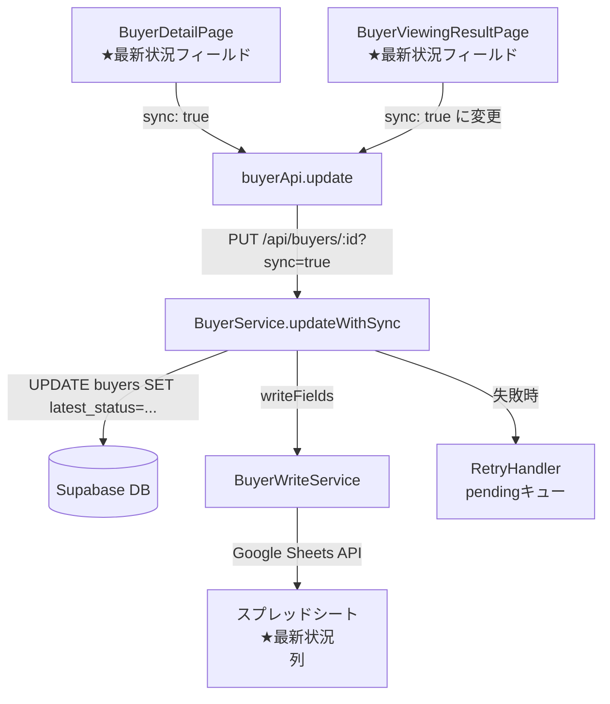

# 設計ドキュメント: buyer-latest-status-sync

## Overview

買主の「★最新状況」（`latest_status`）フィールドは、`BuyerDetailPage`（買主詳細画面）と`BuyerViewingResultPage`（内覧ページ）の2箇所に存在する。両画面とも同一のDBカラム（`buyers.latest_status`）を参照しているが、現状では`BuyerViewingResultPage`での保存が`sync: false`で行われているため、スプレッドシートへの即時同期が行われていない。

本設計では以下を実現する：
1. どちらの画面で保存しても、DBへの保存とスプレッドシートへの同期が確実に行われる
2. 後から保存した値が最終値として扱われる（後勝ちルール）
3. 保存成功後、同一ページ内のUI（ヘッダーChipなど）に即座に反映される

## Architecture



### 後勝ちルール

両画面から同時に保存が発生した場合、DBの`db_updated_at`タイムスタンプが新しい方が最終値となる。`BuyerService.updateWithSync`は保存時に`db_updated_at = NOW()`を設定するため、後から保存したリクエストが常に最新値として確定する。

## Components and Interfaces

### フロントエンド

#### BuyerViewingResultPage（変更対象）

**変更箇所**: `handleInlineFieldSave`内の`buyerApi.update`呼び出し

```typescript
// 変更前
const result = await buyerApi.update(
  buyer_number!,
  { [fieldName]: newValue },
  { sync: false }  // ← スプレッドシート同期なし
);

// 変更後（latest_statusの場合のみsync: trueに変更）
const isLatestStatus = fieldName === 'latest_status';
const result = await buyerApi.update(
  buyer_number!,
  { [fieldName]: newValue },
  { sync: isLatestStatus }  // ← latest_statusのみ即時同期
);
```

**保存成功後のUI更新**: `setBuyer(result.buyer)`により`buyer`ステートが更新され、ページ内の表示が即座に反映される（既存実装で対応済み）。

#### BuyerDetailPage（確認のみ）

`handleInlineFieldSave`は既に`sync: true`で呼び出しており、変更不要。保存成功後に`setBuyer(result.buyer)`でステートを更新し、ヘッダーChipの`latest_status`表示も即座に反映される（既存実装で対応済み）。

### バックエンド

#### BuyerService.updateWithSync（変更なし）

既存の`updateWithSync`メソッドが`latest_status`を含む任意のフィールドを同期する機能を持っている。`buyer-column-mapping.json`の`"★最新状況\n": "latest_status"`マッピングにより、スプレッドシートの正しい列に書き込まれる。

#### buyer-column-mapping.json（変更なし）

```json
"★最新状況\n": "latest_status"
```

このマッピングが既に存在するため、`BuyerWriteService.updateFields`は`latest_status`をスプレッドシートの「★最新状況」列に正しく書き込む。

## Data Models

### buyers テーブル（変更なし）

| カラム | 型 | 説明 |
|--------|-----|------|
| `buyer_number` | TEXT | 主キー |
| `latest_status` | TEXT | ★最新状況の値 |
| `db_updated_at` | TIMESTAMPTZ | 手動更新時刻（後勝ちルール用） |
| `last_synced_at` | TIMESTAMPTZ | 最終スプレッドシート同期時刻 |

### BuyerUpdateResult（変更なし）

```typescript
interface BuyerUpdateResult {
  buyer: any;
  syncStatus?: 'synced' | 'pending' | 'failed';
  syncError?: string;
  conflicts?: Array<{ ... }>;
}
```


## Correctness Properties

*A property is a characteristic or behavior that should hold true across all valid executions of a system-essentially, a formal statement about what the system should do. Properties serve as the bridge between human-readable specifications and machine-verifiable correctness guarantees.*

### Property 1: 保存ラウンドトリップ

*For any* 買主番号と任意の`latest_status`値に対して、`BuyerService.updateWithSync`でその値を保存した後にDBから読み取ると、保存した値と同じ値が返る。

**Validates: Requirements 1.1, 2.1**

### Property 2: 後勝ちルール

*For any* 買主番号と2つの異なる値A・Bに対して、値Aを保存した後に値Bを保存すると、DBの`latest_status`は値Bになる（後から保存した値が最終値として確定する）。

**Validates: Requirements 3.1, 3.2, 3.3**

### Property 3: スプレッドシート同期失敗時のDB保存成功

*For any* スプレッドシート同期が失敗する状況において、`BuyerService.updateWithSync`はDBへの保存を成功として扱い、`syncStatus: 'pending'`を返す（DBの値は正しく更新されている）。

**Validates: Requirements 4.2**

### Property 4: 保存後UIステート更新

*For any* `latest_status`の保存成功後、フロントエンドの`buyer`ステートが保存した値に更新される（`setBuyer(result.buyer)`が呼ばれ、ページ内の全表示箇所に最新値が反映される）。

**Validates: Requirements 5.1, 5.2**

## Error Handling

### スプレッドシート同期失敗

- DBへの保存は成功として扱う（ユーザーへの保存確認は行う）
- `syncStatus: 'pending'`をフロントエンドに返す
- `RetryHandler`が失敗した変更をpendingキューに追加し、後続の自動同期で再試行する
- フロントエンドは`syncStatus === 'pending'`の場合、警告Snackbarを表示する

### DB保存失敗

- フロントエンドはエラーSnackbarを表示する
- `buyer`ステートは変更しない（フィールドの値が保存前の値に戻る）
- `InlineEditableField`コンポーネントが`onSave`の戻り値`{ success: false }`を受け取り、表示値をロールバックする

### 競合検出

- `BuyerService.updateWithSync`の競合チェックは`force: true`オプションで無効化できる
- `BuyerViewingResultPage`の`handleSaveViewingResult`は既に`force: true`を使用している
- `latest_status`の保存では競合チェックを行わない（後勝ちルールを優先）

## Testing Strategy

### ユニットテスト（具体例・エッジケース）

- `BuyerService.updateWithSync`が`latest_status`フィールドを正しくDBに保存することを確認
- スプレッドシート同期失敗時に`syncStatus: 'pending'`が返ることを確認（モック使用）
- `BuyerWriteService.updateFields`が`latest_status`フィールドを正しいスプレッドシート列名（`★最新状況\n`）にマッピングして呼び出すことを確認
- `BuyerViewingResultPage`の`handleInlineFieldSave`が`latest_status`フィールドに対して`sync: true`オプションを渡すことを確認

### プロパティベーステスト（普遍的性質）

プロパティベーステストライブラリ: **fast-check**（TypeScript/Jest環境）

各テストは最低100回のランダム入力で実行する。

**Property 1: 保存ラウンドトリップ**
```typescript
// Feature: buyer-latest-status-sync, Property 1: 保存ラウンドトリップ
it.prop([fc.string(), fc.string()])('任意のlatest_status値を保存するとDBから同じ値が読み取れる', async (buyerNumber, statusValue) => {
  await buyerService.updateWithSync(buyerNumber, { latest_status: statusValue });
  const saved = await buyerService.getByBuyerNumber(buyerNumber);
  expect(saved.latest_status).toBe(statusValue);
});
```

**Property 2: 後勝ちルール**
```typescript
// Feature: buyer-latest-status-sync, Property 2: 後勝ちルール
it.prop([fc.string(), fc.string(), fc.string()])('後から保存した値が最終値になる', async (buyerNumber, valueA, valueB) => {
  await buyerService.updateWithSync(buyerNumber, { latest_status: valueA });
  await buyerService.updateWithSync(buyerNumber, { latest_status: valueB });
  const saved = await buyerService.getByBuyerNumber(buyerNumber);
  expect(saved.latest_status).toBe(valueB);
});
```

**Property 3: スプレッドシート同期失敗時のDB保存成功**
```typescript
// Feature: buyer-latest-status-sync, Property 3: スプレッドシート同期失敗時のDB保存成功
it.prop([fc.string(), fc.string()])('スプシ同期失敗でもDBへの保存は成功する', async (buyerNumber, statusValue) => {
  mockWriteService.updateFields.mockRejectedValue(new Error('Sheets API error'));
  const result = await buyerService.updateWithSync(buyerNumber, { latest_status: statusValue });
  expect(result.syncResult.syncStatus).toBe('pending');
  const saved = await buyerService.getByBuyerNumber(buyerNumber);
  expect(saved.latest_status).toBe(statusValue);
});
```

**Property 4: 保存後UIステート更新**
```typescript
// Feature: buyer-latest-status-sync, Property 4: 保存後UIステート更新
it.prop([fc.string()])('保存成功後にbuyerステートが更新される', async (statusValue) => {
  // BuyerViewingResultPageのhandleInlineFieldSaveをテスト
  // buyerApi.updateがresult.buyerを返し、setBuyerが呼ばれることを検証
  mockBuyerApi.update.mockResolvedValue({ buyer: { latest_status: statusValue }, syncStatus: 'synced' });
  await handleInlineFieldSave('latest_status', statusValue);
  expect(mockSetBuyer).toHaveBeenCalledWith(expect.objectContaining({ latest_status: statusValue }));
});
```
