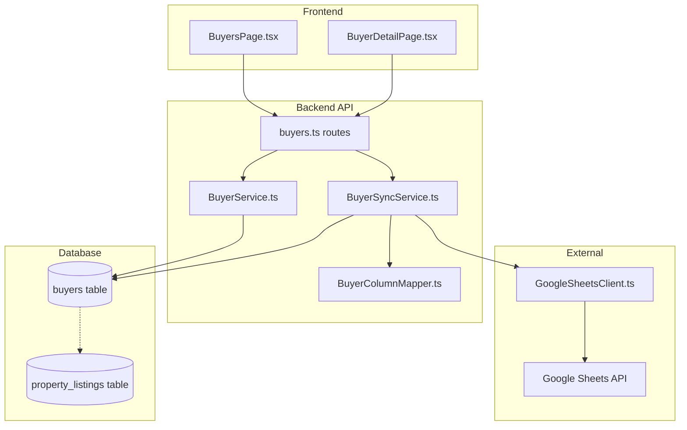
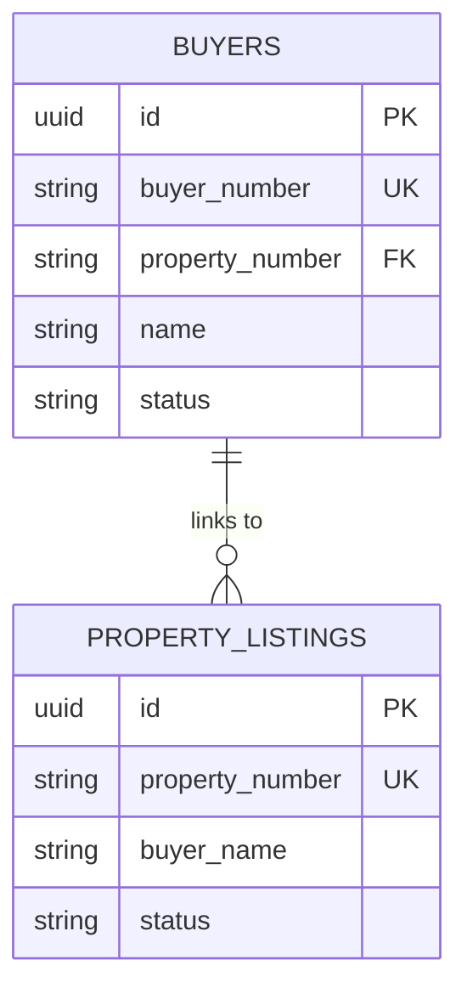

# Design Document: Buyer List Management

## Overview

買主リスト管理機能は、Google スプレッドシートから買主データを同期し、システム内で管理・表示する機能を提供する。既存の売主リスト（SellerService）および物件リスト（PropertyListingService）の設計パターンを踏襲し、181カラム・5000行以上のデータを効率的に処理する。

## Architecture



## Components and Interfaces

### 1. BuyerColumnMapper

スプレッドシートのカラム名とデータベースカラム名のマッピングを行う。

```typescript
interface BuyerColumnMapper {
  mapSpreadsheetToDatabase(row: Record<string, any>): BuyerRecord;
  mapDatabaseToSpreadsheet(buyer: BuyerRecord): Record<string, any>;
  convertType(value: any, type: string): any;
}
```

### 2. BuyerSyncService

スプレッドシートからのデータ同期を担当。

```typescript
interface BuyerSyncService {
  syncAll(): Promise<SyncResult>;
  syncBatch(rows: any[], batchSize: number): Promise<BatchResult>;
  getLastSyncTime(): Promise<Date | null>;
}

interface SyncResult {
  created: number;
  updated: number;
  failed: number;
  errors: SyncError[];
  duration: number;
}
```

### 3. BuyerService

買主データのCRUD操作を提供。

```typescript
interface BuyerService {
  getAll(options: QueryOptions): Promise<PaginatedResult<Buyer>>;
  getById(id: string): Promise<Buyer | null>;
  getByBuyerNumber(buyerNumber: string): Promise<Buyer | null>;
  search(query: string): Promise<Buyer[]>;
  getLinkedProperties(buyerId: string): Promise<PropertyListing[]>;
  update(id: string, data: Partial<Buyer>): Promise<Buyer>;
}

interface QueryOptions {
  page: number;
  limit: number;
  search?: string;
  status?: string;
  assignee?: string;
  dateFrom?: Date;
  dateTo?: Date;
  sortBy?: string;
  sortOrder?: 'asc' | 'desc';
}
```

### 4. API Routes

```typescript
// GET /api/buyers - 買主リスト取得
// GET /api/buyers/:id - 買主詳細取得
// GET /api/buyers/:id/properties - 紐づく物件リスト取得
// PUT /api/buyers/:id - 買主情報更新
// POST /api/buyers/sync - 同期実行
// GET /api/buyers/sync/status - 同期ステータス取得
// GET /api/buyers/export - CSVエクスポート
```

## Data Models

### Buyer Table Schema

```sql
CREATE TABLE buyers (
  id UUID PRIMARY KEY DEFAULT gen_random_uuid(),
  
  -- 基本情報 (A-F列)
  is_deleted VARCHAR(50),                    -- A: 削除
  created_datetime TIMESTAMPTZ,              -- B: 作成日時
  initial_assignee VARCHAR(100),             -- C: 初動担当
  buyer_id VARCHAR(50),                      -- D: 買主ID
  buyer_number VARCHAR(50) UNIQUE NOT NULL,  -- E: 買主番号 (PRIMARY KEY)
  reception_date DATE,                       -- F: 受付日
  
  -- 買主情報 (G-K列)
  name TEXT,                                 -- G: ●氏名・会社名
  building_name_price TEXT,                  -- H: 建物名/価格
  latest_viewing_date DATE,                  -- I: ●内覧日(最新）
  desired_timing VARCHAR(200),               -- J: ●希望時期
  follow_up_assignee VARCHAR(100),           -- K: 後続担当
  
  -- 問合せ・内覧情報 (L-P列)
  re_inquiry_viewing TEXT,                   -- L: 再問合（内覧）
  inquiry_hearing TEXT,                      -- M: ●問合時ヒアリング
  viewing_result_follow_up TEXT,             -- N: ★内覧結果・後続対応
  inquiry_confidence VARCHAR(50),            -- O: ●問合時確度
  latest_status TEXT,                        -- P: ★最新状況
  
  -- 配信・次電 (Q-R列)
  distribution_type VARCHAR(100),            -- Q: 配信種別
  next_call_date DATE,                       -- R: ★次電日
  
  -- Pinrich・希望条件 (S-AF列)
  pinrich VARCHAR(200),                      -- S: Pinrich
  desired_area TEXT,                         -- T: ★エリア
  desired_property_type VARCHAR(100),        -- U: ★希望種別
  post_viewing_seller_contact VARCHAR(100),  -- V: 内覧後売主連絡
  desired_building_age VARCHAR(50),          -- W: ★築年数
  desired_floor_plan VARCHAR(100),           -- X: ★間取り
  hot_spring_required VARCHAR(50),           -- Y: ★温泉あり
  parking_spaces VARCHAR(50),                -- Z: ●P台数
  monthly_parking_ok VARCHAR(50),            -- AA: ★月極でも可
  garden_required VARCHAR(50),               -- AB: ★庭付き
  good_view_required VARCHAR(50),            -- AC: ★眺望良好
  pet_allowed_required VARCHAR(50),          -- AD: ★ペット可
  high_floor_required VARCHAR(50),           -- AE: ★高層階
  corner_room_required VARCHAR(50),          -- AF: ★角部屋
  
  -- 内覧・連絡先 (AG-AM列)
  viewing_sheet TEXT,                        -- AG: 内覧シート
  line_id VARCHAR(200),                      -- AH: LINE
  nickname VARCHAR(100),                     -- AI: ニックネーム
  phone_number TEXT,                         -- AJ: ●電話番号
  email TEXT,                                -- AK: ●メアド
  inquiry_source VARCHAR(200),               -- AL: ●問合せ元
  current_residence TEXT,                    -- AM: 現住居
  
  -- URL・過去内覧 (AN-AQ列)
  athome_url TEXT,                           -- AN: athome URL
  past_viewing_1 TEXT,                       -- AO: 2度目以降過去内覧
  past_viewing_2 TEXT,                       -- AP: 2度目以降過去内覧
  past_viewing_3 TEXT,                       -- AQ: 2度目以降過去内覧
  
  -- キャンペーン・重複 (AR-AS列)
  campaign_date DATE,                        -- AR: キャンペーン　1500万円以上
  phone_duplicate_count INTEGER,             -- AS: 電話番号重複件数
  
  -- 物件関連 (AT-AZ列)
  property_number VARCHAR(50),               -- AT: 物件番号 (物件リストとの紐づけ)
  property_assignee VARCHAR(100),            -- AU: 物件担当者
  panorama_deleted VARCHAR(50),              -- AV: パノラマ削除
  column_a VARCHAR(100),                     -- AW: a
  email_confirmed VARCHAR(50),               -- AX: メアド確認
  property_address TEXT,                     -- AY: 物件所在地
  public_private VARCHAR(50),                -- AZ: 公開/非公開
  
  -- その他情報 (BA-FY列) - 残り121カラム
  day_of_week VARCHAR(50),                   -- BA: 曜日
  sale_chance TEXT,                          -- BB: 売却チャンス
  special_notes TEXT,                        -- BC: 特記事項
  viewing_survey_response TEXT,              -- BD: 内覧アンケート回答
  viewing_survey_confirmed VARCHAR(50),      -- BE: 内覧アンケート確認
  message_to_assignee TEXT,                  -- BF: 担当への伝言/質問事項
  chat_to_yamamoto VARCHAR(50),              -- BG: 山本へチャット送信
  chat_to_ura VARCHAR(50),                   -- BH: 裏へチャット送信
  viewing_type VARCHAR(100),                 -- BI: 内覧形態
  confirmation_to_assignee TEXT,             -- BJ: 担当への確認事項
  offer_comment TEXT,                        -- BK: 買付コメント（任意）
  price_range_house VARCHAR(100),            -- BL: 価格帯（戸建）
  price_range_apartment VARCHAR(100),        -- BM: 価格帯（マンション）
  price_range_land VARCHAR(100),             -- BN: 価格帯（土地）
  post_offer_lost_contact VARCHAR(50),       -- BO: 買付外れた後連絡未/済
  viewing_time VARCHAR(100),                 -- BP: ●時間
  display_address TEXT,                      -- BQ: 住居表示
  price DECIMAL(15,0),                       -- BR: 価格
  notification_sender VARCHAR(100),          -- BS: 通知送信者
  notification_datetime TIMESTAMPTZ,         -- BT: 通知送信日時
  first_view VARCHAR(100),                   -- BU: ●初見
  budget VARCHAR(200),                       -- BV: 予算
  offer_lost_chat VARCHAR(50),               -- BW: 買付外れチャット
  seller_viewing_contact VARCHAR(50),        -- BX: ●売主に内覧連絡　未/済
  buyer_viewing_contact VARCHAR(50),         -- BY: ●買主に内覧連絡　未/済
  past_buyer_list TEXT,                      -- BZ: 過去買主リスト
  past_inquiry_comment_property TEXT,        -- CA: 過去の問合時コメントと物件
  past_latest_confidence VARCHAR(50),        -- CB: 過去の最新確度
  past_viewing_properties TEXT,              -- CC: 過去の内覧物件
  past_personal_info TEXT,                   -- CD: 過去個人情報
  past_desired_conditions TEXT,              -- CE: 過去希望条件
  offer_lost_comment TEXT,                   -- CF: 買付外れコメント
  assignee_work_days VARCHAR(100),           -- CG: 担当出勤曜日
  pre_viewing_notes TEXT,                    -- CH: 内覧前伝達事項
  key_info TEXT,                             -- CI: 鍵等
  sale_reason TEXT,                          -- CJ: 売却理由
  price_reduction_history TEXT,              -- CK: 値下げ履歴
  viewing_notes TEXT,                        -- CL: 内覧の時の伝達事項
  parking TEXT,                              -- CM: 駐車場
  viewing_parking TEXT,                      -- CN: 内覧時駐車場
  offer_property_sheet VARCHAR(100),         -- CO: 買付（物件シート）
  pinrich_link TEXT,                         -- CP: Pinrichリンク
  viewing_unconfirmed VARCHAR(50),           -- CQ: 内覧未確定
  viewing_inquiry_progress VARCHAR(100),     -- CR: 内覧問合進捗
  inquiry_email_phone VARCHAR(50),           -- CS: 【問合メール】電話対応
  inquiry_email_reply VARCHAR(50),           -- CT: 【問合メール】メール返信
  email_type VARCHAR(100),                   -- CU: メール種別
  broker_inquiry VARCHAR(50),                -- CV: 業者問合せ
  viewing_calendar_note VARCHAR(50),         -- CW: 内覧時カレンダー追記
  document_request_email_house VARCHAR(50),  -- CX: 資料請求メール（戸、マ）
  document_request_email_land_no_permission VARCHAR(50), -- CY: 資料請求メール（土）許可不要
  document_request_email_land_permission VARCHAR(50),    -- CZ: 資料請求メール（土）売主へ要許可
  offer_exists_viewing_ng VARCHAR(50),       -- DA: 買付あり内覧NG
  offer_exists_viewing_ok VARCHAR(50),       -- DB: 買付あり内覧OK
  no_response_after_inquiry VARCHAR(50),     -- DC: 前回問合せ後反応なし
  no_response_offer_exists VARCHAR(50),      -- DD: 前回問合せ後反応なし（買付あり物件）
  no_property_inquiry_pinrich VARCHAR(50),   -- DE: 物件指定なし問合せ（Pinrich)
  email_confirmation_mail VARCHAR(50),       -- DF: メールアドレス確認メール
  minpaku_inquiry VARCHAR(50),               -- DG: 民泊問合せ
  viewing_promotion_sender VARCHAR(100),     -- DH: 内覧促進メール送信者
  email_confirmation_assignee VARCHAR(100),  -- DI: メアド確認メール担当
  other_company_property VARCHAR(50),        -- DJ: 他社物件
  offer_status VARCHAR(50),                  -- DK: 買付有無
  image_url TEXT,                            -- DL: 画像
  viewing_reason TEXT,                       -- DM: 内覧理由
  family_composition TEXT,                   -- DN: 家族構成
  must_have_points TEXT,                     -- DO: 購入する物件の譲れない点（優先順位）
  liked_points TEXT,                         -- DP: この物件の気に入っている点
  disliked_points TEXT,                      -- DQ: この物件のダメな点
  purchase_obstacles TEXT,                   -- DR: 購入時障害となる点
  closing TEXT,                              -- DS: クロージング
  preferred_contact_time TEXT,               -- DT: 連絡のつきやすい曜日・時間帯
  next_action TEXT,                          -- DU: 次のアクション
  pre_approval VARCHAR(100),                 -- DV: 仮審査
  inflow_source_phone VARCHAR(100),          -- DW: 流入元確認（電話）
  image_chat_sent VARCHAR(50),               -- DX: 画像チャット送信
  viewing_survey_result TEXT,                -- DY: 内覧アンケート結果
  b_customer_follow_up TEXT,                 -- DZ: b客の追客
  pdf_url TEXT,                              -- EA: PDF
  viewing_promotion_result TEXT,             -- EB: 内覧促進メール結果
  data_updated VARCHAR(50),                  -- EC: データ更新
  campaign_applicable VARCHAR(50),           -- ED: キャンペーン該当/未
  company_name TEXT,                         -- EE: 法人名
  other_property_hearing TEXT,               -- EF: 他気になる物件ヒアリング
  owned_home_hearing_inquiry TEXT,           -- EG: 問合時持家ヒアリング
  owned_home_hearing_result TEXT,            -- EH: 持家ヒアリング結果
  buyer_copy TEXT,                           -- EI: 買主コピー
  valuation_required VARCHAR(50),            -- EJ: 要査定
  property_type VARCHAR(100),                -- EK: 種別
  location TEXT,                             -- EL: 所在地
  current_status VARCHAR(100),               -- EM: 現況
  land_area VARCHAR(100),                    -- EN: 土地面積
  building_area VARCHAR(100),                -- EO: 建物面積
  floor_plan VARCHAR(100),                   -- EP: 間取り
  parking_valuation TEXT,                    -- EQ: 駐車場
  build_year VARCHAR(50),                    -- ER: 築年（西暦）
  renovation_history TEXT,                   -- ES: リフォーム履歴
  structure VARCHAR(100),                    -- ET: 構造
  floor_count VARCHAR(50),                   -- EU: 階数
  other_valuation_done VARCHAR(100),         -- EV: 他に査定したことある？
  owner_name TEXT,                           -- EW: 名義人
  loan_balance TEXT,                         -- EX: ローン残
  visit_desk VARCHAR(50),                    -- EY: 訪問/机上
  seller_list_copy TEXT,                     -- EZ: 売主リストコピー
  seller_copy TEXT,                          -- FA: 売主コピー
  other_company_name TEXT,                   -- FB: 他社名
  three_calls_confirmed VARCHAR(50),         -- FC: 3回架電確認済み
  property_search_reference VARCHAR(100),    -- FD: 物件探し/業者決めで参照
  viewing_promotion_not_needed VARCHAR(50),  -- FE: 内覧促進メール不要
  first_come_first_served TEXT,              -- FF: ①先着順…
  market_reference TEXT,                     -- FG: ②相場の参考に…
  smooth_process TEXT,                       -- FH: ③スムーズ…
  email_effect_verification VARCHAR(100),    -- FI: 【メアド】効果検証
  email_to_takeuchi VARCHAR(50),             -- FJ: 武内へメール送信
  email_to_kadoi VARCHAR(50),                -- FK: 角井へメール送信
  hirose_to_office VARCHAR(50),              -- FL: 廣瀬さんから事務へ
  valuation_not_needed_reason TEXT,          -- FM: 査定が不要な理由
  google_map_url TEXT,                       -- FN: GoogleMap
  viewing_comment_confirmed VARCHAR(50),     -- FO: 内覧コメント確認
  chat_to_kunihiro VARCHAR(50),              -- FP: 国広へチャット送信
  viewing_type_general VARCHAR(100),         -- FQ: 内覧形態_一般媒介
  pre_release_decision_text TEXT,            -- FR: 公開前に決定すること多いよ文言
  seller_viewing_date_contact VARCHAR(50),   -- FS: 売主内覧日連絡
  seller_cancel_contact VARCHAR(50),         -- FT: 売主キャンセル連絡
  owned_home_hearing VARCHAR(100),           -- FU: 持家ヒアリング
  valuation_survey VARCHAR(100),             -- FV: 査定アンケート
  valuation_survey_confirmed VARCHAR(50),    -- FW: 査定アンケート確認
  pre_viewing_hearing TEXT,                  -- FX: 内覧前ヒアリング
  pre_viewing_hearing_send VARCHAR(50),      -- FY: 内覧前ヒアリング送る？
  
  -- メタデータ
  db_created_at TIMESTAMPTZ DEFAULT NOW(),
  db_updated_at TIMESTAMPTZ DEFAULT NOW(),
  synced_at TIMESTAMPTZ DEFAULT NOW()
);

-- インデックス
CREATE INDEX idx_buyers_buyer_number ON buyers(buyer_number);
CREATE INDEX idx_buyers_property_number ON buyers(property_number);
CREATE INDEX idx_buyers_name ON buyers(name);
CREATE INDEX idx_buyers_latest_status ON buyers(latest_status);
CREATE INDEX idx_buyers_initial_assignee ON buyers(initial_assignee);
CREATE INDEX idx_buyers_follow_up_assignee ON buyers(follow_up_assignee);
CREATE INDEX idx_buyers_phone_number ON buyers(phone_number);
CREATE INDEX idx_buyers_next_call_date ON buyers(next_call_date);
CREATE INDEX idx_buyers_reception_date ON buyers(reception_date);
```

### Buyer-Property Relationship

買主と物件の関係は `property_number` カラムを通じて `property_listings` テーブルと紐づく。1買主に複数物件が紐づく場合、買主レコードが複数存在するか、または物件番号をカンマ区切りで保持する。




## Correctness Properties

*A property is a characteristic or behavior that should hold true across all valid executions of a system-essentially, a formal statement about what the system should do. Properties serve as the bridge between human-readable specifications and machine-verifiable correctness guarantees.*

### Property 1: Column Mapping Round Trip
*For any* valid spreadsheet row data, mapping to database format and back to spreadsheet format SHALL produce equivalent data (accounting for type normalization).
**Validates: Requirements 1.2, 6.3**

### Property 2: Sync Upsert Consistency
*For any* buyer_number in the spreadsheet, after sync completes, exactly one buyer record with that buyer_number SHALL exist in the database with the latest data.
**Validates: Requirements 1.3, 1.4**

### Property 3: Sync Result Accuracy
*For any* sync operation, the sum of created + updated + failed counts SHALL equal the total number of rows processed.
**Validates: Requirements 1.5**

### Property 4: Search Result Relevance
*For any* search query, all returned buyer records SHALL contain the search term in at least one of: buyer_number, name, phone_number, or property_number.
**Validates: Requirements 2.2**

### Property 5: Filter Result Correctness
*For any* filter criteria (status, assignee, date range), all returned buyer records SHALL match all applied filter conditions.
**Validates: Requirements 2.3**

### Property 6: Property Linkage Completeness
*For any* buyer with linked properties, the getLinkedProperties function SHALL return all property_listings records that match the buyer's property_number(s).
**Validates: Requirements 2.4, 3.2, 3.3, 4.1**

### Property 7: Reverse Linkage Consistency
*For any* property_listing with a buyer_name, querying buyers by that property_number SHALL return the corresponding buyer record.
**Validates: Requirements 4.3**

### Property 8: Batch Processing Integrity
*For any* dataset of N rows, sync SHALL process ceil(N/100) batches, and all rows SHALL be processed exactly once.
**Validates: Requirements 5.1**

### Property 9: Error Resilience
*For any* sync operation where K rows fail, the remaining (N-K) rows SHALL be successfully processed.
**Validates: Requirements 5.2**

### Property 10: Sync Timestamp Update
*For any* buyer record processed during sync, the synced_at timestamp SHALL be updated to a value >= sync start time.
**Validates: Requirements 5.4**

### Property 11: Type Conversion Correctness
*For any* spreadsheet value with a defined type conversion rule, the converted value SHALL be of the correct database type (date, number, or text).
**Validates: Requirements 6.3**

### Property 12: Update Preserves Unmodified Fields
*For any* buyer update operation with partial data, all fields not included in the update SHALL remain unchanged.
**Validates: Requirements 7.3**

### Property 13: Update Timestamp Correctness
*For any* successful buyer update, the db_updated_at timestamp SHALL be greater than or equal to the update request time.
**Validates: Requirements 7.4**

### Property 14: Export Completeness
*For any* export operation, the generated CSV SHALL contain all 181 columns and all selected buyer records.
**Validates: Requirements 8.1, 8.2**

## Error Handling

### Sync Errors
- **Connection Error**: スプレッドシートへの接続失敗時、リトライを3回実施後にエラーログを記録
- **Row Parse Error**: 個別行のパースエラー時、エラーをログに記録し次の行へ継続
- **Database Error**: データベース書き込みエラー時、トランザクションをロールバックしエラーを記録
- **Concurrent Sync**: 同時実行検出時、後発の同期リクエストを拒否

### API Errors
- **Not Found**: 存在しない買主IDへのアクセス時、404エラーを返却
- **Invalid Query**: 不正なクエリパラメータ時、400エラーと詳細メッセージを返却
- **Validation Error**: 不正なフィールド値での更新時、400エラーと検証エラー詳細を返却
- **Conflict Error**: 同時更新の競合時、409エラーを返却
- **Server Error**: 予期しないエラー時、500エラーとエラーIDを返却

## Testing Strategy

### Unit Testing
- BuyerColumnMapper: カラムマッピングと型変換のテスト
- BuyerService: CRUD操作と検索機能のテスト
- BuyerSyncService: 同期ロジックのテスト（モック使用）

### Property-Based Testing
Property-based testing library: **fast-check** (TypeScript)

各正確性プロパティに対してプロパティベーステストを実装:
- 最低100イテレーションで実行
- テストコメントに対応するプロパティ番号を明記

### Integration Testing
- Google Sheets API との接続テスト
- データベースとの統合テスト
- API エンドポイントのE2Eテスト

