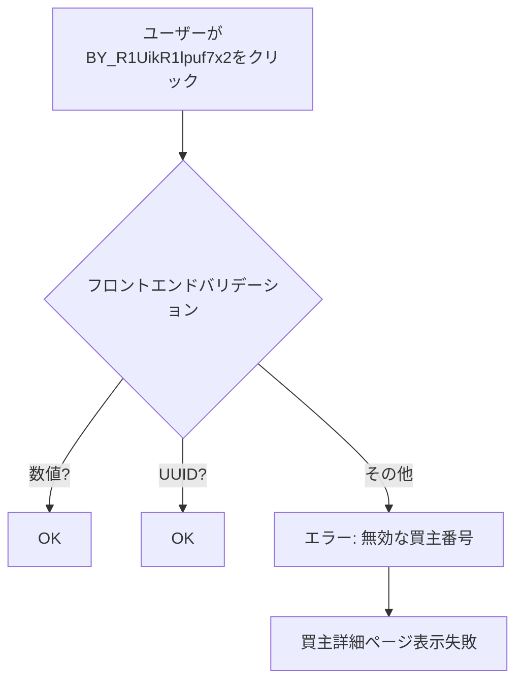
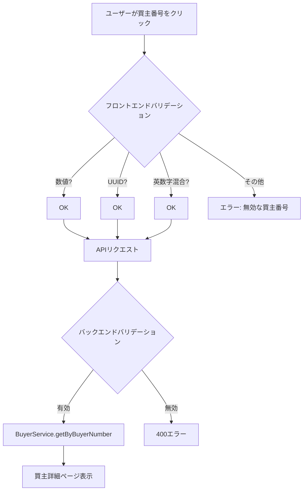

# Design Document: Buyer Number Format Support

## Overview

このドキュメントでは、買主番号（buyer_number）の英数字混合形式（例: `BY_R1UikR1lpuf7x2`）をサポートするための設計を記述する。現在のシステムは数値またはUUID形式のみを有効な買主番号として認識しているが、スプレッドシートには英数字混合形式の買主番号も存在するため、これらをサポートする必要がある。

## Architecture

### 現在の問題点



### 修正後のフロー



## Components and Interfaces

### 1. Frontend Validator (BuyerDetailPage.tsx)

現在のバリデーションロジック:
```typescript
const isUuid = buyer_number ? /^[0-9a-f]{8}-[0-9a-f]{4}-[0-9a-f]{4}-[0-9a-f]{4}-[0-9a-f]{12}$/i.test(buyer_number) : false;
const buyerNumberValue = buyer_number && !isUuid ? parseInt(buyer_number, 10) : NaN;
const isValidBuyerNumber = isUuid || (!isNaN(buyerNumberValue) && buyerNumberValue > 0);
```

修正後のバリデーションロジック:
```typescript
const isUuid = buyer_number ? /^[0-9a-f]{8}-[0-9a-f]{4}-[0-9a-f]{4}-[0-9a-f]{4}-[0-9a-f]{12}$/i.test(buyer_number) : false;
const isNumeric = buyer_number ? /^\d+$/.test(buyer_number) : false;
const isAlphanumeric = buyer_number ? /^[A-Za-z0-9_-]+$/.test(buyer_number) : false;
const isValidBuyerNumber = isUuid || isNumeric || isAlphanumeric;
```

### 2. Backend Validator (uuidValidator.ts)

現在のバリデーション:
```typescript
const BUYER_NUMBER_REGEX = /^\d+$/;
```

修正後のバリデーション:
```typescript
// 数値形式（例: 6647）
const NUMERIC_BUYER_NUMBER_REGEX = /^\d+$/;
// 英数字混合形式（例: BY_R1UikR1lpuf7x2）
const ALPHANUMERIC_BUYER_NUMBER_REGEX = /^[A-Za-z0-9_-]+$/;
```

### 3. BuyerService (既存)

`getByBuyerNumber` メソッドは既に存在し、`buyer_number` カラムで検索を実行している。追加の修正は不要。

## Data Models

変更なし。既存の `buyers` テーブルの `buyer_number` カラム（TEXT型）は既に英数字混合形式を格納可能。

## Correctness Properties

*A property is a characteristic or behavior that should hold true across all valid executions of a system-essentially, a formal statement about what the system should do. Properties serve as the bridge between human-readable specifications and machine-verifiable correctness guarantees.*

### Property 1: Frontend Valid Format Recognition

*For any* 買主番号文字列が以下の形式のいずれかに該当する場合、フロントエンドのバリデーション関数は `true` を返す:
- 数値形式（1桁以上の数字のみ）
- UUID形式（標準的なUUID v4形式）
- 英数字混合形式（英字、数字、アンダースコア、ハイフンのみで構成）

**Validates: Requirements 1.2, 3.1**

### Property 2: Backend Valid Format Recognition

*For any* 買主番号文字列が有効な形式（数値、UUID、英数字混合）の場合、バックエンドのバリデーション関数は `true` を返す。

**Validates: Requirements 1.3**

### Property 3: Invalid Format Rejection

*For any* 買主番号文字列が空文字、または特殊文字（`@`, `#`, `$`, `%`, `!`, スペースなど）を含む場合、バリデーション関数は `false` を返す。

**Validates: Requirements 1.4, 3.3**

## Error Handling

| エラーケース | フロントエンド | バックエンド |
|-------------|--------------|-------------|
| 無効な形式 | 「無効な買主番号です」表示 | 400 Bad Request |
| 買主が見つからない | 「買主が見つかりませんでした」表示 | 404 Not Found |
| サーバーエラー | 「エラーが発生しました」表示 | 500 Internal Server Error |

## Testing Strategy

### Unit Tests

1. フロントエンドバリデーション関数のテスト
   - 数値形式の検証
   - UUID形式の検証
   - 英数字混合形式の検証
   - 無効な形式の拒否

2. バックエンドバリデーションミドルウェアのテスト
   - 各形式の検証
   - エラーレスポンスの確認

### Property-Based Tests

- 有効な買主番号形式のランダム生成と検証
- 無効な形式の拒否確認

### Integration Tests

- 英数字混合形式の買主番号でAPIリクエストを実行
- 買主詳細ページの表示確認
