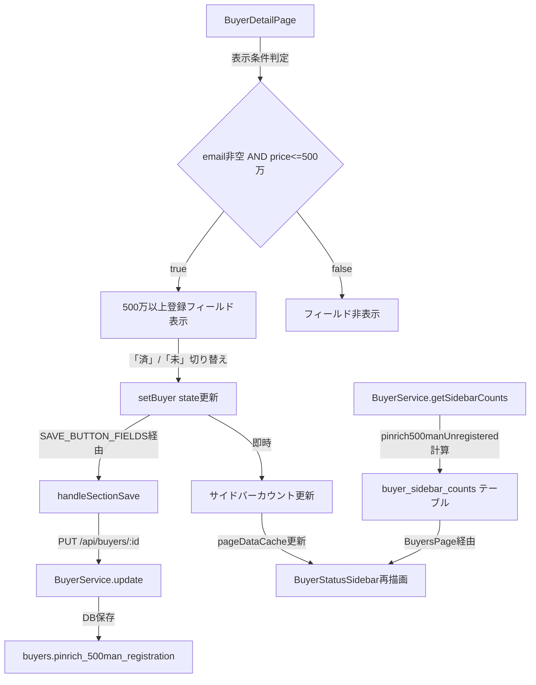

# 設計ドキュメント: buyer-pinrich-500man-registration

## 概要

買主詳細画面（BuyerDetailPage）において、Pinrichフィールドの隣に「500万以上登録」フィールドを追加する機能の設計。

表示条件（メールアドレスが空でない かつ 問合せ物件価格が500万以下）を満たす買主に対してのみフィールドを表示し、「済」「未」のButtonSelect UIで登録状況を管理する。また、サイドバーに「Pinrich500万以上登録未」カテゴリを追加して未対応買主を一覧表示する。

---

## アーキテクチャ



### 変更対象ファイル

| ファイル | 変更内容 |
|---------|---------|
| `backend/src/services/BuyerService.ts` | `pinrich500manUnregistered` カウント計算追加 |
| `frontend/frontend/src/components/BuyerStatusSidebar.tsx` | `CategoryCounts` に `pinrich500manUnregistered` 追加 |
| `frontend/frontend/src/pages/BuyersPage.tsx` | `categoryKeyToDisplayName` にマッピング追加 |
| `frontend/frontend/src/pages/BuyerDetailPage.tsx` | 500万以上登録フィールドUI追加 |
| DBマイグレーション | `buyers` テーブルに `pinrich_500man_registration` カラム追加 |

---

## コンポーネントとインターフェース

### 1. DBマイグレーション

`buyers` テーブルに以下のカラムを追加する：

```sql
ALTER TABLE buyers
ADD COLUMN pinrich_500man_registration TEXT;
```

### 2. BuyerDetailPage（フロントエンド）

#### 表示条件ヘルパー関数

```typescript
// 500万以上登録フィールドの表示条件を判定する
const isPinrich500manVisible = (buyer: Buyer | null, linkedProperties: PropertyListing[]): boolean => {
  if (!buyer) return false;
  if (!buyer.email || !String(buyer.email).trim()) return false;
  const price = linkedProperties[0]?.price;
  if (price === undefined || price === null) return false;
  return price <= 5000000;
};
```

#### SAVE_BUTTON_FIELDS への追加

```typescript
const SAVE_BUTTON_FIELDS = new Set([
  // ... 既存フィールド ...
  'pinrich_500man_registration',  // 追加
]);
```

#### BUYER_FIELD_SECTIONS への追加

`pinrich_link` フィールドの直後に追加：

```typescript
{ key: 'pinrich_500man_registration', label: '500万以上登録', inlineEditable: true, fieldType: 'buttonSelect' },
{ key: 'pinrich_500man_link', label: 'Pinrich500万以上登録方法', inlineEditable: true, fieldType: 'pinrich500manLink' },
```

#### フィールドレンダリング（特別処理）

`pinrich_link` の特別処理の直後に追加：

```tsx
// pinrich_500man_registrationフィールドは特別処理（表示条件付きButtonSelect）
if (field.key === 'pinrich_500man_registration') {
  if (!isPinrich500manVisible(buyer, linkedProperties)) return null;
  const PINRICH_500MAN_BTNS = ['済', '未'];
  const currentValue = buyer?.pinrich_500man_registration || '未';
  return (
    <Grid item xs={12} sm={6} key={`${section.title}-${field.key}`}>
      <Box sx={{ display: 'flex', alignItems: 'center', gap: 1 }}>
        <Typography variant="caption" sx={{ whiteSpace: 'nowrap', flexShrink: 0 }}>
          {field.label}
        </Typography>
        <Box sx={{ display: 'flex', gap: 0.5, flex: 1 }}>
          {PINRICH_500MAN_BTNS.map((opt) => {
            const isSelected = currentValue === opt;
            return (
              <Button
                key={opt}
                variant={isSelected ? 'contained' : 'outlined'}
                size="small"
                onClick={() => {
                  setBuyer((prev: any) => prev ? { ...prev, pinrich_500man_registration: opt } : prev);
                  handleFieldChange(section.title, field.key, opt);
                  // サイドバーカウントをリアルタイム更新
                  updatePinrich500manSidebarCount(opt);
                  // SAVE_BUTTON_FIELDS に含まれるため handleInlineFieldSave は呼ばない
                }}
                sx={{ flex: 1, py: 0.5 }}
              >
                {opt}
              </Button>
            );
          })}
        </Box>
      </Box>
    </Grid>
  );
}

// pinrich_500man_linkフィールドは特別処理（リンク表示、表示条件付き）
if (field.key === 'pinrich_500man_link') {
  if (!isPinrich500manVisible(buyer, linkedProperties)) return null;
  return (
    <Grid item xs={12} key={`${section.title}-${field.key}`}>
      <Link
        href="https://docs.google.com/spreadsheets/d/14gi7bEM1jLgMGA5iOes69DbcLkcRox2vZdKiUy-4_VU/edit?usp=sharing"
        target="_blank"
        rel="noopener noreferrer"
        sx={{ display: 'flex', alignItems: 'center', gap: 0.5, fontSize: '0.875rem' }}
      >
        Pinrich500万以上登録方法
        <LaunchIcon fontSize="small" />
      </Link>
    </Grid>
  );
}
```

#### サイドバーカウントのリアルタイム更新

BuyerDetailPage は独立したページコンポーネントであり、BuyersPage の `sidebarCounts` state に直接アクセスできない。既存の `pinrichUnregistered` カテゴリの更新方法を調査した結果、BuyerDetailPage からサイドバーカウントを直接更新する仕組みは現状存在しない（GASの定期同期に依存）。

本機能では、`pageDataCache` を介してサイドバーカウントをリアルタイム更新する方式を採用する：

```typescript
// サイドバーカウントのリアルタイム更新ヘルパー
const updatePinrich500manSidebarCount = (newValue: string) => {
  const prevValue = buyer?.pinrich_500man_registration || '未';
  const isVisible = isPinrich500manVisible(buyer, linkedProperties);
  if (!isVisible) return;
  
  // 「未」→「済」: カウント減算
  // 「済」→「未」: カウント加算
  const delta = (newValue === '済' && prevValue !== '済') ? -1
              : (newValue === '未' && prevValue === '済') ? 1
              : 0;
  if (delta === 0) return;
  
  // pageDataCacheのcategoryCountsを更新
  const cached = pageDataCache.get<{ categoryCounts: any; buyers: any[]; normalStaffInitials: string[] }>(CACHE_KEYS.BUYERS_WITH_STATUS);
  if (cached?.categoryCounts) {
    const updated = {
      ...cached,
      categoryCounts: {
        ...cached.categoryCounts,
        pinrich500manUnregistered: Math.max(0, (cached.categoryCounts.pinrich500manUnregistered || 0) + delta),
      },
    };
    pageDataCache.set(CACHE_KEYS.BUYERS_WITH_STATUS, updated);
  }
};
```

> **注意**: `pageDataCache` と `CACHE_KEYS` は BuyersPage で管理されているため、BuyerDetailPage からアクセスするには共有モジュールへの移動が必要。既存の `pinrichUnregistered` の更新方法を確認し、同じパターンに従う。もし `pageDataCache` が BuyerDetailPage からアクセスできない場合は、BuyersPage に戻った際に `/api/buyers/sidebar-counts` を再取得する方式（既存の `refetchTrigger` パターン）を使用する。

### 3. BuyerStatusSidebar（フロントエンド）

#### CategoryCounts インターフェース

```typescript
interface CategoryCounts {
  // ... 既存フィールド ...
  pinrichUnregistered?: number;  // ピンリッチ未登録（既存）
  pinrich500manUnregistered?: number;  // Pinrich500万以上登録未（新規追加）
}
```

#### getCategoryColor 関数

```typescript
case 'pinrich500manUnregistered':
  return '#d32f2f'; // 赤
```

#### getCategoryLabel 関数

```typescript
case 'pinrich500manUnregistered':
  return 'Pinrich500万以上登録未';
```

#### newCategories 配列

```typescript
const newCategories = [
  'inquiryEmailUnanswered',
  'brokerInquiry',
  'generalViewingSellerContactPending',
  'viewingPromotionRequired',
  'pinrichUnregistered',
  'pinrich500manUnregistered',  // 追加
];
```

### 4. BuyersPage（フロントエンド）

#### categoryKeyToDisplayName マッピング

```typescript
const categoryKeyToDisplayName: Record<string, string> = {
  // ... 既存マッピング ...
  'pinrichUnregistered': 'ピンリッチ未登録',
  'pinrich500manUnregistered': 'Pinrich500万以上登録未',  // 追加
};
```

### 5. BuyerService（バックエンド）

#### getSidebarCountsFallback の result オブジェクト

```typescript
const result: any = {
  // ... 既存フィールド ...
  pinrichUnregistered: 0,
  pinrich500manUnregistered: 0,  // 追加
};
```

#### カウント計算ロジック

```typescript
// 既存のpinrichUnregisteredカウントの後に追加
// Pinrich500万以上登録未: email非空 AND price<=500万 AND (pinrich_500man_registration が '未' または null/空)
if (
  buyer.email && String(buyer.email).trim() &&
  buyer.inquiry_property_price !== null &&
  buyer.inquiry_property_price !== undefined &&
  Number(buyer.inquiry_property_price) <= 5000000 &&
  (!buyer.pinrich_500man_registration || buyer.pinrich_500man_registration === '未')
) {
  result.pinrich500manUnregistered++;
}
```

#### getSidebarCounts（DBキャッシュ読み込み）

`buyer_sidebar_counts` テーブルから読み込む箇所にも `pinrich500manUnregistered` を追加：

```typescript
} else if (row.category === 'pinrich500manUnregistered') {
  categoryCounts.pinrich500manUnregistered = row.count || 0;
}
```

#### saveSidebarCounts（DBキャッシュ保存）

```typescript
rows.push({ category: 'pinrich500manUnregistered', count: categoryCounts.pinrich500manUnregistered || 0, label: null, assignee: null, updated_at: now });
```

---

## データモデル

### buyers テーブル（変更）

| カラム名 | 型 | デフォルト | 説明 |
|---------|---|---------|-----|
| `pinrich_500man_registration` | TEXT | NULL | 500万以上登録状況（「済」/「未」/NULL） |

### buyer_sidebar_counts テーブル（変更なし、新カテゴリ行が追加される）

| category | count | 説明 |
|---------|-------|-----|
| `pinrich500manUnregistered` | number | Pinrich500万以上登録未の買主数 |

### フロントエンドの状態

`buyer.pinrich_500man_registration` の値：
- `null` / `undefined` / `''` → デフォルト「未」として扱う
- `'済'` → 登録済み
- `'未'` → 未登録

---

## 正確性プロパティ

*プロパティとは、システムの全ての有効な実行において真であるべき特性や振る舞いのことです。プロパティは人間が読める仕様と機械で検証可能な正確性保証の橋渡しをします。*

### Property 1: 表示条件の正確性

*For any* 買主データ（email、inquiry_property_price の組み合わせ）に対して、`isPinrich500manVisible` 関数は「emailが空でない かつ priceが5,000,000以下」の場合にのみ `true` を返す

**Validates: Requirements 1.1, 1.2, 1.3**

### Property 2: デフォルト値の正確性

*For any* `pinrich_500man_registration` の未設定値（null、undefined、空文字列）に対して、表示されるButtonSelectのデフォルト選択は「未」である

**Validates: Requirements 2.2**

### Property 3: サイドバーカウントのラウンドトリップ

*For any* 表示条件を満たす買主に対して、「未」→「済」→「未」と切り替えた場合、サイドバーの `pinrich500manUnregistered` カウントは元の値に戻る

**Validates: Requirements 5.1, 5.2**

### Property 4: カウント計算の正確性

*For any* 買主データのリストに対して、`pinrich500manUnregistered` カウントは「emailが空でない かつ inquiry_property_priceが5,000,000以下 かつ pinrich_500man_registrationが'未'またはnull/空」の買主数と一致する

**Validates: Requirements 4.1**

### Property 5: リンク表示の連動性

*For any* 買主データに対して、`isPinrich500manVisible` が `true` の場合にのみ「Pinrich500万以上登録方法」リンクが表示される（フィールドとリンクの表示状態は常に一致する）

**Validates: Requirements 3.1, 3.4**

---

## エラーハンドリング

### 保存失敗時

既存の `handleSectionSave` のエラーハンドリングパターンに従う：

```typescript
} catch (error: any) {
  setSnackbar({
    open: true,
    message: error.response?.data?.error || '保存に失敗しました',
    severity: 'error',
  });
  // フィールドの値を保存前の状態に戻す
  setBuyer(prev => prev ? { ...prev, pinrich_500man_registration: prevValue } : prev);
}
```

### 物件価格が取得できない場合

`linkedProperties[0]?.price` が `undefined` または `null` の場合、表示条件を満たさないとして扱い、フィールドを非表示にする。

### inquiry_property_price カラムについて

要件定義書では `inquiry_property_price` カラムを参照しているが、調査の結果フロントエンドでは `linkedProperties[0]?.price`（`property_listings.price`）を使用する。バックエンドのカウント計算では `buyers` テーブルの `inquiry_property_price` カラムを使用する（既存の `BuyerCandidateListPage` で確認済み）。

---

## テスト戦略

### ユニットテスト

- `isPinrich500manVisible` 関数の境界値テスト（price = 5,000,000、5,000,001）
- デフォルト値ロジック（null/undefined/空文字列 → 「未」）
- リンクの属性確認（href、target、rel）

### プロパティベーステスト

本機能はプロパティベーステストが適用可能です。TypeScriptプロジェクトのため `fast-check` ライブラリを使用します。各プロパティテストは最低100回のイテレーションで実行します。

#### Property 1: 表示条件の正確性

```typescript
// Feature: buyer-pinrich-500man-registration, Property 1: 表示条件の正確性
fc.assert(fc.property(
  fc.record({
    email: fc.oneof(fc.constant(''), fc.constant(null), fc.emailAddress()),
    price: fc.oneof(fc.constant(null), fc.integer({ min: 0, max: 10000000 })),
  }),
  ({ email, price }) => {
    const buyer = { email } as Buyer;
    const linkedProperties = price !== null ? [{ price } as PropertyListing] : [];
    const result = isPinrich500manVisible(buyer, linkedProperties);
    const expected = !!email && !!String(email).trim() && price !== null && price <= 5000000;
    return result === expected;
  }
), { numRuns: 100 });
```

#### Property 2: デフォルト値の正確性

```typescript
// Feature: buyer-pinrich-500man-registration, Property 2: デフォルト値の正確性
fc.assert(fc.property(
  fc.oneof(fc.constant(null), fc.constant(undefined), fc.constant('')),
  (unsetValue) => {
    const displayValue = unsetValue || '未';
    return displayValue === '未';
  }
), { numRuns: 100 });
```

#### Property 3: サイドバーカウントのラウンドトリップ

```typescript
// Feature: buyer-pinrich-500man-registration, Property 3: サイドバーカウントのラウンドトリップ
fc.assert(fc.property(
  fc.integer({ min: 1, max: 1000 }),
  (initialCount) => {
    let count = initialCount;
    // 「未」→「済」: カウント減算
    count = Math.max(0, count - 1);
    // 「済」→「未」: カウント加算
    count = count + 1;
    return count === initialCount;
  }
), { numRuns: 100 });
```

#### Property 4: カウント計算の正確性

```typescript
// Feature: buyer-pinrich-500man-registration, Property 4: カウント計算の正確性
fc.assert(fc.property(
  fc.array(fc.record({
    email: fc.oneof(fc.constant(''), fc.emailAddress()),
    inquiry_property_price: fc.oneof(fc.constant(null), fc.integer({ min: 0, max: 10000000 })),
    pinrich_500man_registration: fc.oneof(fc.constant(null), fc.constant(''), fc.constant('未'), fc.constant('済')),
  })),
  (buyers) => {
    const expected = buyers.filter(b =>
      b.email && String(b.email).trim() &&
      b.inquiry_property_price !== null &&
      b.inquiry_property_price <= 5000000 &&
      (!b.pinrich_500man_registration || b.pinrich_500man_registration === '未')
    ).length;
    const actual = calculatePinrich500manUnregisteredCount(buyers);
    return actual === expected;
  }
), { numRuns: 100 });
```

### インテグレーションテスト

- DBマイグレーション後のカラム存在確認
- `/api/buyers/sidebar-counts` レスポンスに `pinrich500manUnregistered` が含まれることの確認
- 保存APIが `pinrich_500man_registration` フィールドを正しく保存することの確認
