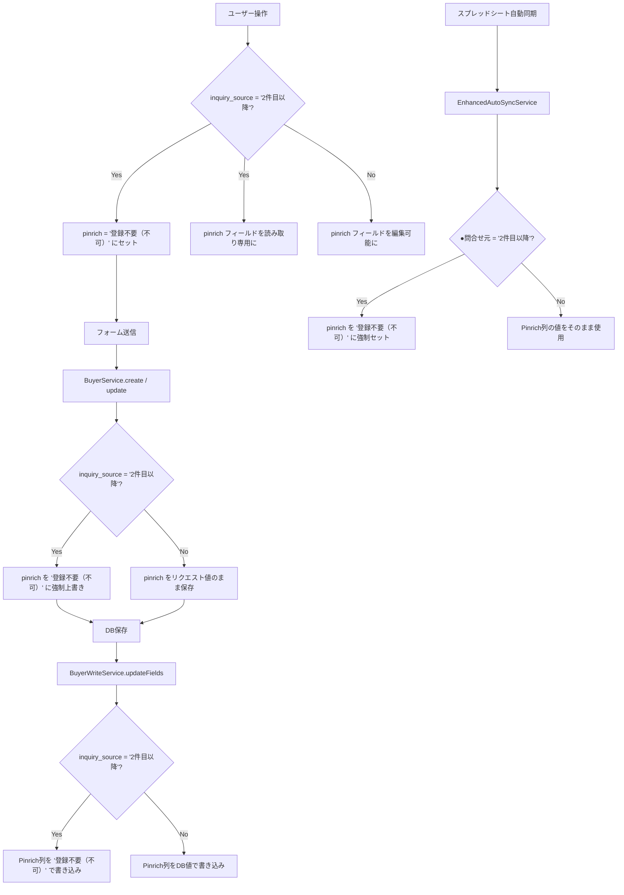

# デザインドキュメント：buyer-pinrich-auto-set-second-inquiry

## 概要

買主リストにおいて `inquiry_source`（●問合せ元）が `'2件目以降'` の場合、`pinrich`（Pinrich）フィールドを `'登録不要（不可）'` で自動セットし、編集不可（読み取り専用）にする機能。

この機能は以下の4つのレイヤーに適用される：
1. **フロントエンド表示時**：BuyerDetailPage / NewBuyerPage での初期表示
2. **フロントエンドリアルタイム**：inquiry_source 変更時の即時連動
3. **バックエンドAPI**：保存時の強制セット（フロントエンドをバイパスした更新にも対応）
4. **スプレッドシート同期**：スプシ→DB、DB→スプシの双方向同期

---

## アーキテクチャ



---

## コンポーネントとインターフェース

### フロントエンド

#### BuyerDetailPage（`frontend/frontend/src/pages/BuyerDetailPage.tsx`）

- `inquiry_source` の値を監視するロジックを追加
- `inquiry_source === '2件目以降'` のとき：
  - `pinrich` フィールドの値を `'登録不要（不可）'` に強制セット
  - `pinrich` フィールドの `disabled` / `readOnly` 属性を `true` に設定
- `inquiry_source !== '2件目以降'` のとき：
  - `pinrich` フィールドを通常の編集可能状態に戻す

**変更箇所**：
- `inquiry_source` の onChange ハンドラに連動ロジックを追加
- 初期表示時（useEffect）に既存データの `inquiry_source` を確認してpinrichを補完
- pinrich ドロップダウンの `disabled` 属性を動的に制御

#### NewBuyerPage（`frontend/src/pages/NewBuyerPage.tsx`）

- BuyerDetailPage と同様のロジックを適用
- `inquiry_source` の onChange ハンドラに連動ロジックを追加
- pinrich フィールドの `disabled` 属性を動的に制御

#### ヘルパー関数（共通ロジック）

```typescript
/**
 * inquiry_source が '2件目以降' かどうかを判定する
 */
export const isSecondInquiry = (inquirySource: string | null | undefined): boolean => {
  return inquirySource === '2件目以降';
};

/**
 * inquiry_source に基づいて pinrich の値を決定する
 * '2件目以降' の場合は '登録不要（不可）' を返す
 */
export const resolvePinrichValue = (
  inquirySource: string | null | undefined,
  currentPinrich: string | null | undefined
): string | null => {
  if (isSecondInquiry(inquirySource)) {
    return '登録不要（不可）';
  }
  return currentPinrich ?? null;
};
```

### バックエンド

#### BuyerService（`backend/src/services/BuyerService.ts`）

`create` メソッドと `update` / `updateWithSync` メソッドに以下のロジックを追加：

```typescript
/**
 * inquiry_source が '2件目以降' の場合、pinrich を強制セット
 */
private applySecondInquiryRule(data: Partial<any>): Partial<any> {
  if (data.inquiry_source === '2件目以降') {
    return { ...data, pinrich: '登録不要（不可）' };
  }
  return data;
}
```

- `create` メソッド：DB保存前に `applySecondInquiryRule` を適用
- `update` メソッド：`allowedData` 構築後に `applySecondInquiryRule` を適用
- `updateWithSync` メソッド：`allowedData` 構築後に `applySecondInquiryRule` を適用

#### BuyerWriteService（`backend/src/services/BuyerWriteService.ts`）

`updateFields` メソッドと `appendNewBuyer` メソッドに以下のロジックを追加：

```typescript
/**
 * スプレッドシートへの書き込み前に inquiry_source を確認し、
 * '2件目以降' の場合は pinrich を '登録不要（不可）' に強制セット
 */
private applySecondInquiryRule(updates: Record<string, any>): Record<string, any> {
  if (updates.inquiry_source === '2件目以降') {
    return { ...updates, pinrich: '登録不要（不可）' };
  }
  return updates;
}
```

#### EnhancedAutoSyncService（`backend/src/services/EnhancedAutoSyncService.ts`）

買主スプレッドシート→DB同期処理に以下のロジックを追加：

- スプレッドシート行データをDBレコードにマッピングする際、`inquiry_source`（`●問合せ元`）が `'2件目以降'` の場合は `pinrich` を `'登録不要（不可）'` に強制セット

---

## データモデル

### 既存DBカラム（変更なし）

| カラム名 | 型 | 説明 |
|---------|-----|------|
| `inquiry_source` | TEXT | 問合せ元（`'2件目以降'` を含む） |
| `pinrich` | TEXT | Pinrichフィールド（`'登録不要（不可）'` を含む） |

### スプレッドシートカラムマッピング（既存、変更なし）

| スプレッドシート列名 | DBカラム名 |
|-------------------|-----------|
| `●問合せ元` | `inquiry_source` |
| `Pinrich` | `pinrich` |

### ビジネスルール

```
IF inquiry_source = '2件目以降'
THEN pinrich = '登録不要（不可）'  // 強制、上書き不可
```

このルールは以下の全レイヤーで適用される：
- フロントエンド表示（読み取り専用化）
- バックエンドAPI保存時（強制上書き）
- スプシ→DB同期時（強制上書き）
- DB→スプシ同期時（強制上書き）

---

## 正確性プロパティ

*プロパティとは、システムの全ての有効な実行において成立すべき特性や振る舞いのことです。プロパティは人間が読める仕様と機械で検証可能な正確性保証の橋渡しをします。*

### Property 1: フロントエンドでの inquiry_source='2件目以降' 時の pinrich 自動セット

*For any* 買主データにおいて、`inquiry_source` が `'2件目以降'` の場合、フロントエンドで表示される `pinrich` フィールドの値は `'登録不要（不可）'` であり、かつ編集不可（読み取り専用）でなければならない。

**Validates: Requirements 1.1, 1.2, 1.3, 1.4**

### Property 2: フロントエンドでの inquiry_source≠'2件目以降' 時の pinrich 編集可能

*For any* 買主データにおいて、`inquiry_source` が `'2件目以降'` 以外の値の場合、フロントエンドで表示される `pinrich` フィールドは編集可能でなければならない。

**Validates: Requirements 1.5, 1.6**

### Property 3: inquiry_source 変更時のリアルタイム連動

*For any* フォームの状態において、`inquiry_source` を `'2件目以降'` に変更した場合、`pinrich` フィールドの値が即座に `'登録不要（不可）'` に更新され、かつ読み取り専用に切り替わらなければならない。また、`'2件目以降'` から他の値に変更した場合、`pinrich` フィールドは編集可能に戻らなければならない。

**Validates: Requirements 2.1, 2.2, 2.3, 2.4, 2.5**

### Property 4: バックエンドでの pinrich 強制セット（作成・更新）

*For any* 買主データの作成または更新リクエストにおいて、`inquiry_source` が `'2件目以降'` の場合、リクエストに含まれる `pinrich` の値に関わらず、DBに保存される `pinrich` の値は `'登録不要（不可）'` でなければならない。

**Validates: Requirements 3.1, 3.2, 3.4**

### Property 5: バックエンドでの pinrich 非干渉（inquiry_source≠'2件目以降'）

*For any* 買主データの作成または更新リクエストにおいて、`inquiry_source` が `'2件目以降'` 以外の値の場合、DBに保存される `pinrich` の値はリクエストの `pinrich` 値と一致しなければならない。

**Validates: Requirements 3.3**

### Property 6: スプシ→DB同期時の pinrich 強制セット

*For any* スプレッドシートの買主行データにおいて、`●問合せ元` が `'2件目以降'` の場合、DBに保存される `pinrich` の値は `'登録不要（不可）'` でなければならない（`Pinrich` 列の値に関わらず）。

**Validates: Requirements 5.1, 5.3**

### Property 7: DB→スプシ同期時の pinrich 強制セット

*For any* DBの買主データにおいて、`inquiry_source` が `'2件目以降'` の場合、スプレッドシートに書き込まれる `Pinrich` 列の値は `'登録不要（不可）'` でなければならない（DBの `pinrich` 値に関わらず）。

**Validates: Requirements 6.1, 6.3**

---

## エラーハンドリング

### フロントエンド

- `inquiry_source` の値が取得できない場合（null/undefined）：`pinrich` フィールドは通常の編集可能状態を維持する
- `pinrich` の選択肢に `'登録不要（不可）'` が存在しない場合：既存の `PINRICH_OPTIONS` に追加する（現在は存在しないため追加が必要）

**注意**：現在の `PINRICH_OPTIONS`（`buyerDetailFieldOptions.ts`）には `'登録不要（不可）'` が含まれていない。この値を追加する必要がある。

### バックエンド

- `applySecondInquiryRule` は純粋関数として実装し、例外を発生させない
- スプシ同期時にエラーが発生した場合、既存のエラーハンドリング（警告ログ）を踏襲する

---

## テスト戦略

### ユニットテスト

以下の具体的なケースをユニットテストでカバーする：

1. `isSecondInquiry` ヘルパー関数：`'2件目以降'`、null、undefined、空文字、他の値
2. `resolvePinrichValue` ヘルパー関数：各条件の組み合わせ
3. `BuyerService.applySecondInquiryRule`：`inquiry_source` が `'2件目以降'` の場合と他の値の場合
4. `BuyerWriteService.applySecondInquiryRule`：同上

### プロパティベーステスト

プロパティベーステストには **fast-check** ライブラリを使用する。各プロパティテストは最低100回のイテレーションを実行する。

#### Property 4 のテスト実装例

```typescript
// Feature: buyer-pinrich-auto-set-second-inquiry, Property 4: バックエンドでの pinrich 強制セット
it('Property 4: inquiry_source が 2件目以降 の場合、pinrich は常に 登録不要（不可） になる', () => {
  fc.assert(
    fc.property(
      fc.record({
        inquiry_source: fc.constant('2件目以降'),
        pinrich: fc.option(fc.string(), { nil: null }),
        name: fc.option(fc.string(), { nil: null }),
      }),
      (buyerData) => {
        const result = applySecondInquiryRule(buyerData);
        expect(result.pinrich).toBe('登録不要（不可）');
      }
    ),
    { numRuns: 100 }
  );
});
```

#### Property 5 のテスト実装例

```typescript
// Feature: buyer-pinrich-auto-set-second-inquiry, Property 5: inquiry_source≠'2件目以降' 時の非干渉
it('Property 5: inquiry_source が 2件目以降 以外の場合、pinrich はリクエスト値のまま', () => {
  const otherInquirySources = INQUIRY_SOURCE_OPTIONS
    .map(o => o.value)
    .filter(v => v !== '2件目以降');

  fc.assert(
    fc.property(
      fc.record({
        inquiry_source: fc.oneof(...otherInquirySources.map(v => fc.constant(v))),
        pinrich: fc.option(fc.string(), { nil: null }),
      }),
      (buyerData) => {
        const result = applySecondInquiryRule(buyerData);
        expect(result.pinrich).toBe(buyerData.pinrich);
      }
    ),
    { numRuns: 100 }
  );
});
```

### 統合テスト

- BuyerDetailPage の E2E テスト（手動確認）：`inquiry_source` を `'2件目以降'` に変更したときの UI 動作
- スプレッドシート同期の統合テスト（手動確認）：実際のスプシデータを使った同期動作

### 実装上の注意

- 日本語を含む `.tsx` ファイルの編集は Python スクリプト経由で UTF-8 書き込みを行うこと（`strReplace` は使用しない）
- バックエンドは `backend/src/` 配下のみを編集すること（`backend/api/` は公開物件サイト用なので触らない）
