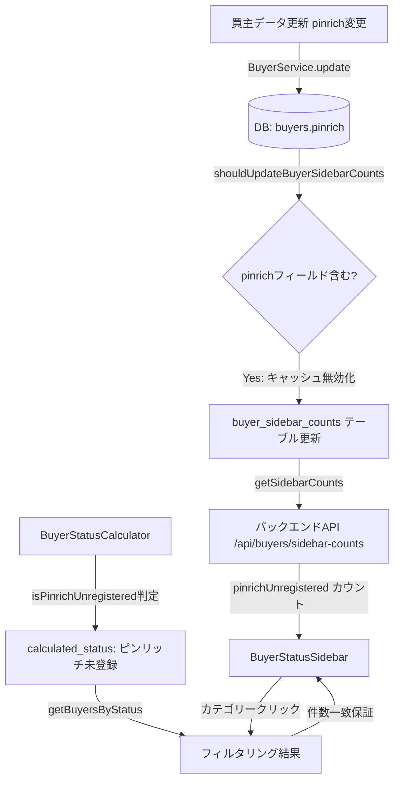

# 設計ドキュメント: buyer-pinrich-unregistered-sidebar

## 概要

買主リストのサイドバーに「Pinrich未登録」カテゴリーを追加する機能です。

- **表示条件**: `pinrich` が NULL・空文字・「登録無し」のいずれか、かつ `reception_date >= '2026-01-01'`
- **即時除外**: それ以外の値が入ったら即座にカテゴリーから消える（過去の問題再発防止）
- **整合性保証**: サイドバーの件数とクリック後の一覧件数が常に一致

### 現状の問題点

`BuyerStatusCalculator.ts` の「ピンリッチ未登録」判定（Priority 31）は以下の条件で動作しています：

```typescript
// 現状（修正前）
if (and(isBlank(buyer.pinrich), isNotBlank(buyer.email), isBlank(buyer.broker_inquiry))) {
  return { status: 'ピンリッチ未登録', ... };
}
```

**問題1**: `pinrich === '登録無し'` の場合が除外されている（要件では含める必要あり）  
**問題2**: `reception_date >= '2026-01-01'` の条件がない  
**問題3**: `getBuyersByStatus` で `pinrichUnregistered` カテゴリーのフィルタリングが未実装（空配列を返す）  
**問題4**: `shouldUpdateBuyerSidebarCounts` に `pinrich` フィールドが含まれていない

### 過去の失敗防止

過去の実装でサイドバーカテゴリーから表示が消えずにクリックするとデータなしとなる問題が発生しました。本設計では**カテゴリー表示とフィルタリング結果の常時一致**を最重要設計原則とします。

---

## アーキテクチャ



### 既存アーキテクチャとの関係

本機能は既存の実装を**最小限の変更で修正・拡張**する方針をとります。

| レイヤー | 既存ファイル | 変更内容 |
|---------|------------|---------|
| ステータス計算 | `BuyerStatusCalculator.ts` | Priority 31の条件に「登録無し」と `reception_date >= '2026-01-01'` を追加 |
| バックエンド | `BuyerService.ts` | `shouldUpdateBuyerSidebarCounts` に `pinrich` を追加、`getBuyersByStatus` の `pinrichUnregistered` フィルタを実装 |
| フロントエンド UI | `BuyerStatusSidebar.tsx` | 変更不要（既に `pinrichUnregistered` 対応済み） |
| フロントエンド ページ | `BuyersPage.tsx` | `pinrichUnregistered` のフィルタリングロジックを追加 |

---

## コンポーネントとインターフェース

### 1. バックエンド: `BuyerStatusCalculator.ts`

#### Priority 31: ピンリッチ未登録 判定条件の修正

**現状の問題**: `pinrich === '登録無し'` が除外されており、`reception_date` 条件もない。

```typescript
// 修正後
// Priority 31: ピンリッチ未登録
// 条件:
// - pinrich が NULL・空文字・「登録無し」のいずれか
// - email が存在する
// - broker_inquiry が空欄
// - reception_date >= '2026-01-01'
if (
  and(
    or(isBlank(buyer.pinrich), equals(buyer.pinrich, '登録無し')),
    isNotBlank(buyer.email),
    isBlank(buyer.broker_inquiry),
    isOnOrAfter(buyer.reception_date, '2026-01-01')
  )
) {
  const status = 'ピンリッチ未登録';
  return { status, priority: 31, matchedCondition: 'ピンリッチに未登録', color: getStatusColor(status) };
}
```

> **注意**: `isOnOrAfter` ヘルパー関数が存在しない場合は `buyer.reception_date >= '2026-01-01'` の直接比較を使用する。

### 2. バックエンド: `BuyerService.ts`

#### `shouldUpdateBuyerSidebarCounts` への `pinrich` 追加

**現状の問題**: `pinrich` フィールドが `sidebarFields` に含まれていないため、Pinrich変更時にキャッシュが更新されない。

```typescript
private shouldUpdateBuyerSidebarCounts(updateData: Partial<any>): boolean {
  // サイドバーカテゴリーに影響するフィールド（pinrich を追加）
  const sidebarFields = [
    'next_call_date',
    'follow_up_assignee',
    'viewing_date',
    'notification_sender',
    'inquiry_email_phone',
    'pinrich',  // ← 追加: Pinrich未登録カテゴリーに影響
  ];
  return sidebarFields.some(field => field in updateData);
}
```

#### `getBuyersByStatus` の `pinrichUnregistered` フィルタ実装

**現状の問題**: `pinrichUnregistered` カテゴリーが空配列を返す（フィルタリング未実装）。

```typescript
} else if (status === 'pinrichUnregistered') {
  // Pinrich未登録: pinrichが空欄・「登録無し」かつ reception_date >= '2026-01-01'
  console.log(`[getBuyersByStatus] pinrichUnregistered カテゴリー検出`);
  filteredBuyers = allBuyers.filter((buyer: any) => {
    const pinrich = buyer.pinrich ?? '';
    const isPinrichUnregistered = pinrich === '' || pinrich === null || pinrich === '登録無し';
    return (
      isPinrichUnregistered &&
      buyer.email && String(buyer.email).trim() &&
      (!buyer.broker_inquiry || buyer.broker_inquiry === '' || buyer.broker_inquiry === '0') &&
      buyer.reception_date && buyer.reception_date >= '2026-01-01'
    );
  });
  console.log(`[getBuyersByStatus] pinrichUnregistered フィルタ結果: ${filteredBuyers.length}件`);
```

> **重要**: このフィルタ条件は `BuyerStatusCalculator.ts` の Priority 31 条件と完全に一致させること。

### 3. フロントエンド: `BuyersPage.tsx`

#### `pinrichUnregistered` フィルタリングロジックの追加

**現状の問題**: `BuyersPage.tsx` のフロントエンドフィルタリングに `pinrichUnregistered` の処理がなく、`calculated_status === 'ピンリッチ未登録'` の比較に依存している。

`categoryKeyToDisplayName` マッピングに既に `'pinrichUnregistered': 'ピンリッチ未登録'` が定義されているため、`calculated_status` ベースのフィルタリングは機能します。ただし、`BuyerStatusCalculator.ts` の修正後に `calculated_status` が正しく「ピンリッチ未登録」を返すことを確認する必要があります。

```typescript
// BuyersPage.tsx の filterBuyersByCategory（既存のelse分岐）
// categoryKeyToDisplayName['pinrichUnregistered'] = 'ピンリッチ未登録' が既に定義済み
// → calculated_status === 'ピンリッチ未登録' でフィルタリングされる
// 追加変更不要（BuyerStatusCalculatorの修正後に自動的に機能する）
```

### 4. フロントエンド: `BuyerStatusSidebar.tsx`

変更不要。既に以下が実装済みです：

- `CategoryCounts.pinrichUnregistered?: number` フィールド定義済み
- `getCategoryColor('pinrichUnregistered')` → `'#d32f2f'`（赤）
- `getCategoryLabel('pinrichUnregistered')` → `'ピンリッチ未登録'`
- `newCategories` 配列に `'pinrichUnregistered'` が含まれている

---

## データモデル

### `buyers` テーブル（既存カラム）

| カラム名 | 型 | 説明 |
|---------|-----|------|
| `pinrich` | TEXT | Pinrichの登録状況（NULL・空文字・「登録無し」・「送信中」・「クローズ」等） |
| `reception_date` | DATE | 受付日（カテゴリーフィルター条件） |
| `email` | TEXT | メールアドレス（判定条件の一つ） |
| `broker_inquiry` | TEXT | 業者問合せフラグ（判定条件の一つ） |

### `buyer_sidebar_counts` テーブル（既存）

| カラム名 | 型 | 説明 |
|---------|-----|------|
| `category` | TEXT | カテゴリーキー（`'pinrichUnregistered'`） |
| `count` | INTEGER | カテゴリーの件数 |
| `assignee` | TEXT | 担当者イニシャル（NULL） |
| `updated_at` | TIMESTAMP | 更新日時 |

### フロントエンド型: `CategoryCounts`（既存、変更不要）

```typescript
interface CategoryCounts {
  // ...既存フィールド...
  pinrichUnregistered?: number;  // ← 既に定義済み
}
```

---

## 正確性プロパティ

*プロパティとは、システムの全ての有効な実行において成立すべき特性や振る舞いを表す形式的な記述です。プロパティは人間が読める仕様と機械で検証可能な正確性保証の橋渡しをします。*

### Property 1: isPinrichUnregistered の正確な判定

*任意の* 買主データに対して、`pinrich` が NULL・空文字・「登録無し」のいずれかであり、かつ `email` が存在し、かつ `broker_inquiry` が空欄であり、かつ `reception_date >= '2026-01-01'` の場合に限り、`BuyerStatusCalculator` が「ピンリッチ未登録」ステータスを返す（双方向一致）

**Validates: Requirements 1.1, 1.2, 1.3, 1.4, 4.1, 4.2, 4.4**

### Property 2: バックエンドカウントとフロントエンドフィルタの一致（モデルベーステスト）

*任意の* 買主データセットに対して、`BuyerService.getSidebarCountsFallback()` が返す `pinrichUnregistered` カウントと、同じデータに対して `getBuyersByStatus('pinrichUnregistered')` でフィルタリングした結果の件数が一致する

**Validates: Requirements 1.5, 1.6, 3.2, 3.4, 4.3, 5.3, 5.4**

### Property 3: pinrich変更時のキャッシュ無効化

*任意の* 買主更新データに対して、`pinrich` フィールドが含まれる場合、`shouldUpdateBuyerSidebarCounts` が `true` を返す

**Validates: Requirements 2.1, 2.2, 5.1**

---

## エラーハンドリング

### サイドバー再取得失敗時

要件2.4に対応。既存の `BuyersPage.tsx` のエラーハンドリングパターンに従います。

```typescript
// サイドバーカウント取得失敗時: 前回の表示状態を維持
api.get('/api/buyers/sidebar-counts')
  .then((sidebarRes) => {
    setSidebarCounts(sidebarResult.categoryCounts);
    setSidebarLoading(false);
  })
  .catch((err) => {
    console.error('[ERROR] Sidebar fetch failed:', err);
    setSidebarLoading(false);
    // sidebarCounts は前回の値を維持（setState を呼ばない）
  });
```

### `pinrich` の値処理

`pinrich` フィールドの値は以下のように処理します：

| 値 | 処理 |
|----|------|
| `NULL` | 「Pinrich未登録」に含める |
| `''`（空文字） | 「Pinrich未登録」に含める |
| `'登録無し'` | 「Pinrich未登録」に含める |
| `'送信中'`、`'クローズ'`、`'登録不要（不可）'` 等 | 「Pinrich未登録」に含めない |

---

## テスト戦略

### 単体テスト（例ベース）

| テスト対象 | テスト内容 |
|-----------|-----------|
| `BuyerStatusCalculator` | pinrich=null, email='a@b.com', broker_inquiry='', reception_date='2026-01-15' → 'ピンリッチ未登録' |
| `BuyerStatusCalculator` | pinrich='', email='a@b.com', broker_inquiry='', reception_date='2026-01-15' → 'ピンリッチ未登録' |
| `BuyerStatusCalculator` | pinrich='登録無し', email='a@b.com', broker_inquiry='', reception_date='2026-01-15' → 'ピンリッチ未登録' |
| `BuyerStatusCalculator` | pinrich='送信中', email='a@b.com', broker_inquiry='', reception_date='2026-01-15' → 'ピンリッチ未登録' でない |
| `BuyerStatusCalculator` | pinrich='', email='a@b.com', broker_inquiry='', reception_date='2025-12-31' → 'ピンリッチ未登録' でない |
| `BuyerStatusCalculator` | pinrich='', email='', broker_inquiry='', reception_date='2026-01-15' → 'ピンリッチ未登録' でない |
| `shouldUpdateBuyerSidebarCounts` | `{ pinrich: '送信中' }` → `true` |
| `shouldUpdateBuyerSidebarCounts` | `{ latest_status: '追客中' }` → `false` |
| `getSidebarCounts` | レスポンスに `pinrichUnregistered` フィールドが含まれる |

### プロパティベーステスト

プロパティベーステストには **fast-check**（TypeScript/JavaScript向け）を使用します。各テストは最低100回のランダム入力で実行します。

```typescript
// Property 1: isPinrichUnregistered の正確な判定
// Feature: buyer-pinrich-unregistered-sidebar, Property 1: isPinrichUnregistered の正確な判定
fc.assert(fc.property(
  fc.record({
    pinrich: fc.oneof(
      fc.constant(null),
      fc.constant(''),
      fc.constant('登録無し'),
      fc.constant('送信中'),
      fc.constant('クローズ'),
      fc.constant('登録不要（不可）'),
      fc.string()
    ),
    email: fc.oneof(fc.constant(''), fc.constant(null), fc.emailAddress()),
    broker_inquiry: fc.oneof(fc.constant(''), fc.constant(null), fc.constant('1')),
    reception_date: fc.oneof(
      fc.date({ min: new Date('2025-01-01'), max: new Date('2025-12-31') }).map(d => d.toISOString().split('T')[0]),
      fc.date({ min: new Date('2026-01-01'), max: new Date('2027-12-31') }).map(d => d.toISOString().split('T')[0])
    ),
    // 他のフィールドはデフォルト値（ピンリッチ未登録より高優先度のステータスに引っかからないよう設定）
  }),
  (buyer) => {
    const result = calculateBuyerStatus(buyer);
    const isPinrichUnregistered = result.status === 'ピンリッチ未登録';
    const pinrich = buyer.pinrich ?? '';
    const shouldBePinrichUnregistered =
      (pinrich === '' || pinrich === null || pinrich === '登録無し') &&
      buyer.email && String(buyer.email).trim() &&
      (!buyer.broker_inquiry || buyer.broker_inquiry === '') &&
      buyer.reception_date && buyer.reception_date >= '2026-01-01';
    return isPinrichUnregistered === !!shouldBePinrichUnregistered;
  }
), { numRuns: 100 });

// Property 2: バックエンドカウントとフロントエンドフィルタの一致
// Feature: buyer-pinrich-unregistered-sidebar, Property 2: バックエンドカウントとフロントエンドフィルタの一致
// ※ バックエンドのロジックをモック化してフロントエンドのフィルターと比較

// Property 3: pinrich変更時のキャッシュ無効化
// Feature: buyer-pinrich-unregistered-sidebar, Property 3: pinrich変更時のキャッシュ無効化
fc.assert(fc.property(
  fc.record({
    pinrich: fc.oneof(fc.constant(''), fc.constant('登録無し'), fc.constant('送信中'), fc.string()),
  }),
  (updateData) => {
    const result = shouldUpdateBuyerSidebarCounts(updateData);
    return result === true; // pinrichフィールドが含まれる場合は常にtrue
  }
), { numRuns: 100 });
```

### 手動確認チェックリスト（過去の失敗防止）

- [ ] 「Pinrich未登録」カテゴリーをクリックして、表示される全買主が条件を満たすことを確認
- [ ] 買主のpinrichを「登録無し」から「送信中」に変更して保存後、「Pinrich未登録」から即座に消えることを確認
- [ ] 買主のpinrichに値を入力して保存後、「Pinrich未登録」から即座に消えることを確認
- [ ] カテゴリーの件数表示とクリック後の一覧件数が一致することを確認
- [ ] reception_dateが2025-12-31の買主がカテゴリーに含まれないことを確認
- [ ] pinrich='登録無し'かつreception_date='2026-01-15'の買主がカテゴリーに含まれることを確認
