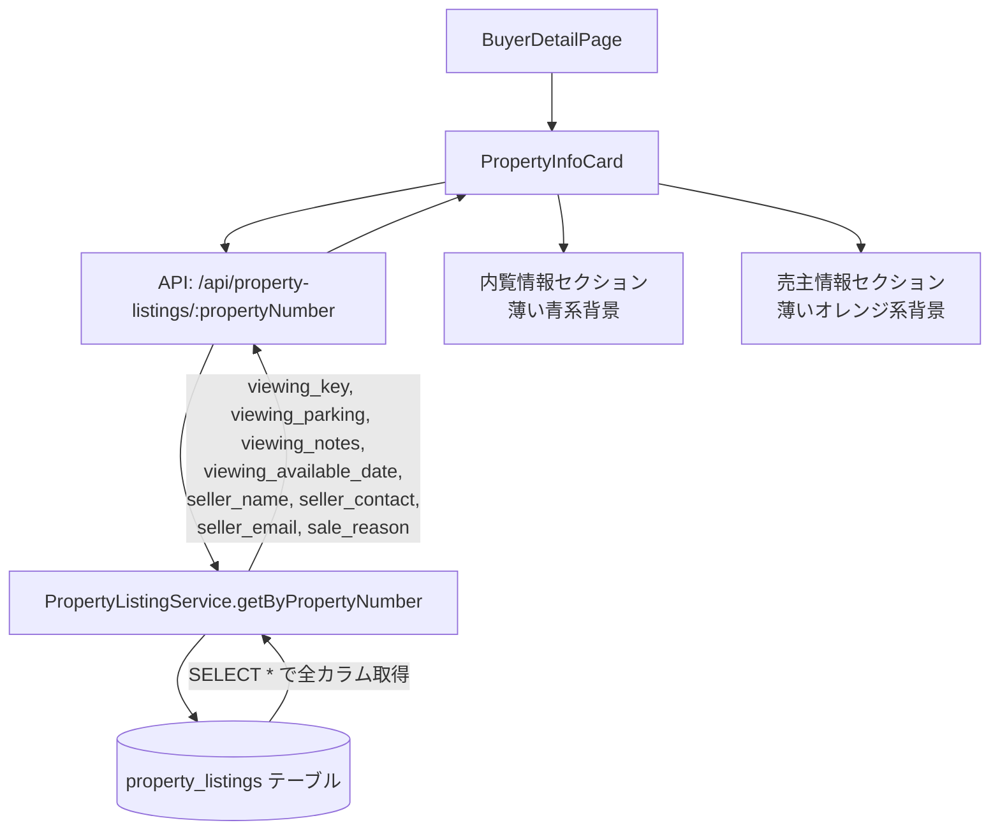

# 設計ドキュメント：物件詳細カードへの内覧情報・売主情報セクション追加

## Overview

買主詳細画面（`BuyerDetailPage`）の中央列に表示される `PropertyInfoCard` コンポーネントに、内覧情報セクションと売主情報セクションを追加する。

既存の「値下げ履歴」「理由」表示ブロックの直下に2つのセクションを追加する。データは `property_listings` テーブルから取得済みであり、バックエンドの変更は不要。フロントエンドの型定義追加とUIセクション追加のみで実装できる。

### 変更範囲

- **変更あり**: `frontend/frontend/src/components/PropertyInfoCard.tsx`
- **変更なし**: バックエンド全般（`SELECT *` により既存APIが必要フィールドを返す）

---

## Architecture



データフローは既存のまま変更なし。`PropertyInfoCard` がAPIから受け取るレスポンスに既に必要なフィールドが含まれているため、フロントエンドの型定義とUI表示ロジックのみを追加する。

---

## Components and Interfaces

### PropertyInfoCard コンポーネント

**ファイル**: `frontend/frontend/src/components/PropertyInfoCard.tsx`

#### 変更点1: `PropertyFullDetails` インターフェースへのフィールド追加

```typescript
interface PropertyFullDetails {
  // ... 既存フィールド ...

  // 内覧情報（新規追加）
  viewing_key?: string;             // 内覧時（鍵等）
  viewing_parking?: string;         // 内覧時駐車場
  viewing_notes?: string;           // 内覧の時の伝達事項
  viewing_available_date?: string;  // 内覧可能日

  // 売主情報（新規追加）
  seller_contact?: string;          // 連絡先
  // seller_name, seller_email は既存フィールドのため追加不要
  // sale_reason は既存フィールドのため追加不要
}
```

> **注意**: `seller_name` と `seller_email` は `PropertyFullDetails` に既存フィールドとして存在する。`sale_reason` も既存フィールド。追加が必要なのは `viewing_key`・`viewing_parking`・`viewing_notes`・`viewing_available_date`・`seller_contact` の5フィールド。

#### 変更点2: 内覧情報セクションの追加

「値下げ履歴」「理由」ブロックの直後に追加する。

```tsx
{/* 内覧情報セクション */}
{(property.viewing_key || property.viewing_parking ||
  property.viewing_notes || property.viewing_available_date) && (
  <Grid item xs={12}>
    <Box sx={{ p: 2, bgcolor: '#e3f2fd', borderRadius: 1, border: '1px solid #bbdefb' }}>
      <Typography variant="caption" color="text.secondary" fontWeight="bold">
        内覧情報
      </Typography>
      {/* 各フィールドを条件付き表示 */}
    </Box>
  </Grid>
)}
```

#### 変更点3: 売主情報セクションの追加

内覧情報セクションの直後に追加する。

```tsx
{/* 売主情報セクション */}
{(property.seller_name || property.seller_contact ||
  property.seller_email || property.sale_reason) && (
  <Grid item xs={12}>
    <Box sx={{ p: 2, bgcolor: '#fff3e0', borderRadius: 1, border: '1px solid #ffe0b2' }}>
      <Typography variant="caption" color="text.secondary" fontWeight="bold">
        売主情報
      </Typography>
      {/* 各フィールドを条件付き表示 */}
    </Box>
  </Grid>
)}
```

---

## Data Models

### property_listings テーブル（既存）

追加実装に関連するカラム（全て既存カラム）:

| カラム名 | 型 | 説明 |
|---|---|---|
| `viewing_key` | text \| null | 内覧時（鍵等）の情報 |
| `viewing_parking` | text \| null | 内覧時駐車場の情報 |
| `viewing_notes` | text \| null | 内覧の時の伝達事項 |
| `viewing_available_date` | text \| null | 内覧可能日 |
| `seller_name` | text \| null | 売主名前（復号済み） |
| `seller_contact` | text \| null | 売主連絡先（復号済み） |
| `seller_email` | text \| null | 売主メールアドレス（復号済み） |
| `sale_reason` | text \| null | 売却理由 |

`PropertyListingService.getByPropertyNumber()` は `SELECT *` を使用しているため、これらのカラムは既にAPIレスポンスに含まれている。

### フロントエンド型定義の変更

`PropertyFullDetails` インターフェースに以下を追加:

```typescript
viewing_key?: string;
viewing_parking?: string;
viewing_notes?: string;
viewing_available_date?: string;
seller_contact?: string;
```

---

## Correctness Properties

*A property is a characteristic or behavior that should hold true across all valid executions of a system—essentially, a formal statement about what the system should do. Properties serve as the bridge between human-readable specifications and machine-verifiable correctness guarantees.*

### Property 1: 内覧情報セクションの条件付き表示

*For any* `PropertyFullDetails` オブジェクトにおいて、`viewing_key`・`viewing_parking`・`viewing_notes`・`viewing_available_date` のうち少なくとも1つが非null・非空文字の場合、内覧情報セクションが表示され、全てがnullまたは空文字の場合は表示されない

**Validates: Requirements 1.1, 1.7**

### Property 2: 内覧情報フィールドのラベルと値の表示

*For any* 非null・非空文字の `viewing_key`・`viewing_parking`・`viewing_notes`・`viewing_available_date` の値に対して、内覧情報セクション内に対応するラベル（「内覧時（鍵等）」「内覧時駐車場」「内覧の時の伝達事項」「内覧可能日」）とその値が表示される

**Validates: Requirements 1.3, 1.4, 1.5, 1.6**

### Property 3: 売主情報セクションの条件付き表示

*For any* `PropertyFullDetails` オブジェクトにおいて、`seller_name`・`seller_contact`・`seller_email`・`sale_reason` のうち少なくとも1つが非null・非空文字の場合、売主情報セクションが表示され、全てがnullまたは空文字の場合は表示されない

**Validates: Requirements 2.1, 2.7**

### Property 4: 売主情報フィールドのラベルと値の表示

*For any* 非null・非空文字の `seller_name`・`seller_contact`・`seller_email`・`sale_reason` の値に対して、売主情報セクション内に対応するラベル（「売主名前」「連絡先」「メールアドレス」「売却理由」）とその値が表示される

**Validates: Requirements 2.3, 2.4, 2.5, 2.6**

---

## Error Handling

### フィールド値がnull/undefinedの場合

各フィールドは `string | undefined` 型として定義し、条件付きレンダリング（`{field && <Box>...</Box>}`）で表示する。nullや空文字の場合はそのフィールドの行自体を表示しない。

### セクション全体が空の場合

セクション表示条件（`viewing_key || viewing_parking || ...`）が全てfalsyの場合、セクション全体を非表示にする。これにより不要な空のセクションが表示されない。

### APIエラーの場合

既存の `PropertyInfoCard` のエラーハンドリング（`error` state）がそのまま適用される。新規フィールドの取得失敗は既存のエラー処理でカバーされる。

---

## Testing Strategy

### 単体テスト（Example-based）

- 内覧情報セクションに薄い青系背景色（`#e3f2fd`）が適用されていることを確認
- 売主情報セクションに薄いオレンジ系背景色（`#fff3e0`）が適用されていることを確認
- 全フィールドがnullの場合に各セクションが非表示になることを確認

### プロパティベーステスト（Property-based）

プロパティベーステストには **fast-check**（TypeScript/JavaScript向けPBTライブラリ）を使用する。各プロパティテストは最低100回のイテレーションで実行する。

#### Property 1 のテスト実装方針

```typescript
// fast-check を使用
fc.assert(
  fc.property(
    fc.record({
      viewing_key: fc.option(fc.string(), { nil: undefined }),
      viewing_parking: fc.option(fc.string(), { nil: undefined }),
      viewing_notes: fc.option(fc.string(), { nil: undefined }),
      viewing_available_date: fc.option(fc.string(), { nil: undefined }),
    }),
    (fields) => {
      const hasAnyValue = Object.values(fields).some(v => v && v.trim() !== '');
      // レンダリングして内覧情報セクションの表示/非表示を確認
      // hasAnyValue === セクションが表示されている
    }
  ),
  { numRuns: 100 }
);
// Feature: buyer-property-card-viewing-seller-info, Property 1: 内覧情報セクションの条件付き表示
```

#### Property 2 のテスト実装方針

```typescript
fc.assert(
  fc.property(
    fc.string({ minLength: 1 }), // 非空文字列
    fc.constantFrom('viewing_key', 'viewing_parking', 'viewing_notes', 'viewing_available_date'),
    (value, fieldName) => {
      // 対応するラベルと値がレンダリング結果に含まれることを確認
    }
  ),
  { numRuns: 100 }
);
// Feature: buyer-property-card-viewing-seller-info, Property 2: 内覧情報フィールドのラベルと値の表示
```

#### Property 3・4 も同様のパターンで実装

### 統合テスト

- `/api/property-listings/:propertyNumber` のレスポンスに `viewing_key`・`viewing_parking`・`viewing_notes`・`viewing_available_date`・`seller_name`・`seller_contact`・`seller_email`・`sale_reason` が含まれることを確認（1-2例）

### TypeScript型チェック

`getDiagnostics` ツールで型エラーがないことを確認する。`PropertyFullDetails` インターフェースへの追加フィールドが正しく型付けされていることをコンパイル時に検証する。
