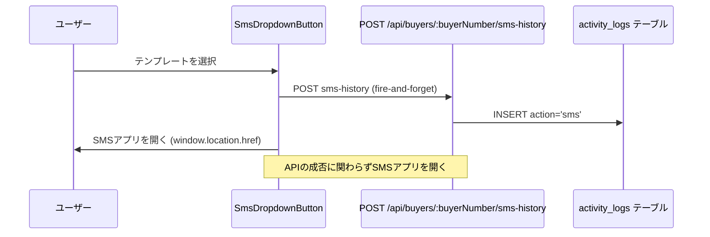

# 設計ドキュメント: buyer-sms-email-history

## 概要

買主詳細画面（BuyerDetailPage）において、SMS送信ボタン（SmsDropdownButton）からSMSを送信した際に、既存の「メール送信履歴」セクションにSMS送信の記録を残す機能。

### 背景

現状、メール送信（Gmail）は `activity_logs` テーブルに `action='email'` として記録され、買主詳細画面の「メール送信履歴」セクションに表示されている。SMS送信は端末のSMSアプリを開くだけで履歴が残らない。

本機能では、SMS送信操作時にバックエンドAPIを呼び出して `activity_logs` テーブルに `action='sms'` として記録し、「メール送信履歴」セクションにSMS送信履歴も表示する。

### 設計方針

- **既存テーブルを再利用**: 新テーブルは作成せず、既存の `activity_logs` テーブルに `action='sms'` で記録する
- **Fire-and-forget**: API呼び出しが失敗してもSMSアプリを開く処理は中断しない
- **最小変更**: フロントエンド・バックエンドともに既存コードへの変更を最小限に抑える

---

## アーキテクチャ



### 既存コードとの関係

```
backend/src/routes/buyers.ts
  └── POST /:buyerNumber/sms-history  ← 新規追加

backend/src/services/ActivityLogService.ts
  └── logActivity()  ← 既存メソッドを再利用

frontend/frontend/src/components/SmsDropdownButton.tsx
  └── sendSms()  ← API呼び出しを追加

frontend/frontend/src/pages/BuyerDetailPage.tsx
  └── メール送信履歴セクション  ← action='sms'も表示するよう変更
```

---

## コンポーネントとインターフェース

### バックエンド: SMS履歴記録エンドポイント

**ファイル**: `backend/src/routes/buyers.ts`

**エンドポイント**: `POST /api/buyers/:buyerNumber/sms-history`

**リクエストボディ**:
```typescript
{
  templateId: string;    // 必須: テンプレートID（例: 'land_no_permission'）
  templateName: string;  // 必須: テンプレート表示名（例: '資料請求（土）許可不要'）
  phoneNumber: string;   // 必須: 送信先電話番号
}
```

**レスポンス（成功）**:
```typescript
{
  success: true;
  logId: string;  // 作成されたactivity_logsのID
}
```

**エラーレスポンス**:
- `400 Bad Request`: 必須フィールド欠如
- `404 Not Found`: 買主番号が存在しない
- `500 Internal Server Error`: DB挿入失敗

### フロントエンド: SmsDropdownButton の変更

**ファイル**: `frontend/frontend/src/components/SmsDropdownButton.tsx`

`sendSms()` 関数内で、`window.location.href` を設定する前に非同期でAPIを呼び出す。

```typescript
const sendSms = async (templateId: string, templateName: string) => {
  handleClose();
  // ... メッセージ生成 ...

  if (message) {
    // fire-and-forget: 失敗してもSMSアプリを開く
    api.post(`/api/buyers/${buyerNumber}/sms-history`, {
      templateId,
      templateName,
      phoneNumber,
    }).catch(err => console.warn('SMS履歴記録失敗:', err));

    const smsLink = `sms:${phoneNumber}?body=${encodeURIComponent(message)}`;
    window.location.href = smsLink;
  }
};
```

**変更点**:
- `sendSms` の引数に `templateName` を追加
- 各 `MenuItem` の `onClick` に対応するテンプレート名を渡す
- `api` サービスをインポート

### フロントエンド: BuyerDetailPage のメール送信履歴セクション変更

**ファイル**: `frontend/frontend/src/pages/BuyerDetailPage.tsx`

**変更点**:
1. フィルタ条件を `action === 'email'` から `action === 'email' || action === 'sms'` に変更
2. SMS履歴レコードの表示内容を追加（SMSラベル、電話番号、テンプレート名）

---

## データモデル

### activity_logs テーブル（既存）

SMS送信履歴は既存の `activity_logs` テーブルに以下の形式で記録する。

| カラム | 型 | SMS送信時の値 |
|--------|-----|--------------|
| `id` | UUID | 自動生成 |
| `employee_id` | UUID | 認証ユーザーのID（なければシステムUUID） |
| `action` | VARCHAR(100) | `'sms'` |
| `target_type` | VARCHAR(50) | `'buyer'` |
| `target_id` | VARCHAR(255) | 買主番号（例: `'4370'`） |
| `metadata` | JSONB | 下記参照 |
| `created_at` | TIMESTAMP | サーバー時刻（自動） |

**metadataの構造**:
```json
{
  "templateId": "land_no_permission",
  "templateName": "資料請求（土）許可不要",
  "phoneNumber": "09012345678",
  "buyerNumber": "4370"
}
```

### テンプレートID・名称マッピング

| templateId | templateName |
|------------|-------------|
| `land_no_permission` | 資料請求（土）許可不要 |
| `minpaku` | 民泊問合せ |
| `land_need_permission` | 資料請求（土）売主要許可 |
| `house_mansion` | 資料請求（戸・マ） |
| `offer_no_viewing` | 買付あり内覧NG |
| `offer_ok_viewing` | 買付あり内覧OK |
| `no_response` | 前回問合せ後反応なし |
| `no_response_offer` | 反応なし（買付あり不適合） |
| `pinrich` | 物件指定なし（Pinrich） |

---

## 正確性プロパティ

*プロパティとは、システムのすべての有効な実行において成立すべき特性や振る舞いのことです。つまり、システムが何をすべきかについての形式的な記述です。プロパティは人間が読める仕様と機械で検証可能な正確性保証の橋渡しをします。*

### Property 1: SMS送信操作はAPIを呼び出す

*任意の* 有効なテンプレートIDと買主番号の組み合わせに対して、`sendSms()` が呼び出されたとき、`api.post('/api/buyers/:buyerNumber/sms-history', ...)` が呼び出されること

**Validates: Requirements 1.1**

### Property 2: SMS履歴レコードの挿入

*任意の* 有効なリクエスト（buyerNumber・templateId・templateName・phoneNumber）に対して、`POST /api/buyers/:buyerNumber/sms-history` を呼び出すと、`activity_logs` テーブルに `action='sms'` かつ `target_type='buyer'` かつ `target_id=buyerNumber` のレコードが1件挿入されること

**Validates: Requirements 1.2, 1.5, 3.2**

### Property 3: メタデータの完全性

*任意の* 有効なリクエストに対して、挿入されたレコードの `metadata` フィールドに `templateId`・`templateName`・`phoneNumber`・`buyerNumber` の4フィールドが全て含まれること

**Validates: Requirements 1.3**

### Property 4: APIエラー時のSMS送信継続

*任意の* APIエラー（ネットワークエラー・500エラー等）が発生した場合でも、`window.location.href` への代入（SMSアプリを開く処理）が実行されること

**Validates: Requirements 1.4**

### Property 5: 統合履歴の表示フィルタ

*任意の* `activities` リストに対して、`action='email'` と `action='sms'` の両方のレコードが「メール送信履歴」セクションの表示対象に含まれ、それ以外の `action` のレコードは含まれないこと

**Validates: Requirements 2.1**

### Property 6: SMS履歴レコードの表示内容

*任意の* `action='sms'` のアクティビティレコードに対して、レンダリング結果に送信日時・テンプレート名（`metadata.templateName`）・送信先電話番号（`metadata.phoneNumber`）・「SMS」ラベルが含まれること

**Validates: Requirements 2.2, 2.3**

### Property 7: 統合履歴の降順ソート

*任意の* メール・SMS混在の `activities` リストに対して、表示順が `created_at` の降順になっていること

**Validates: Requirements 2.4**

### Property 8: 必須フィールド欠如時の400エラー

*任意の* 必須フィールド（`templateId`・`templateName`・`phoneNumber` のいずれか）が欠けたリクエストに対して、`POST /api/buyers/:buyerNumber/sms-history` が HTTP 400 を返すこと

**Validates: Requirements 3.4**

---

## エラーハンドリング

### フロントエンド側

| エラー状況 | 対応 |
|-----------|------|
| API呼び出し失敗（ネットワークエラー） | `console.warn` でログ出力のみ。SMSアプリは開く |
| API呼び出し失敗（4xx/5xx） | 同上 |

**設計根拠**: SMS送信（SMSアプリを開く）はユーザーの主目的であり、履歴記録の失敗によって妨げるべきではない。

### バックエンド側

| エラー状況 | HTTPステータス | レスポンス |
|-----------|--------------|-----------|
| 必須フィールド欠如 | 400 | `{ error: '...' }` |
| 買主番号が存在しない | 404 | `{ error: 'Buyer not found' }` |
| DB挿入失敗 | 500 | `{ error: '...' }` |

---

## テスト戦略

### デュアルテストアプローチ

ユニットテストとプロパティベーステストの両方を使用する。

- **ユニットテスト**: 具体的な例・エッジケース・エラー条件を検証
- **プロパティテスト**: 全入力に対して成立すべき普遍的なプロパティを検証

### ユニットテスト

**バックエンド** (`backend/src/routes/__tests__/buyers.sms-history.test.ts`):
- 正常系: 有効なリクエストで200と`logId`が返ること
- 異常系: 必須フィールド欠如で400が返ること
- 異常系: 存在しない買主番号で404が返ること
- 異常系: 認証なしで401が返ること（要件3.5）

**フロントエンド** (`frontend/frontend/src/components/__tests__/SmsDropdownButton.test.tsx`):
- `sendSms()` 呼び出し時にAPIが呼び出されること
- APIエラー時でも `window.location.href` が設定されること
- 空メッセージの場合はAPIもSMSアプリも起動しないこと

### プロパティベーステスト

**使用ライブラリ**: `fast-check`（TypeScript/JavaScript向けPBTライブラリ）

**設定**: 各プロパティテストは最低100回実行する

**バックエンドプロパティテスト** (`backend/src/routes/__tests__/buyers.sms-history.property.test.ts`):

```typescript
// Feature: buyer-sms-email-history, Property 2: SMS履歴レコードの挿入
it('任意の有効なリクエストでactivity_logsにaction=smsのレコードが挿入される', () => {
  fc.assert(fc.asyncProperty(
    fc.record({
      templateId: fc.constantFrom('land_no_permission', 'house_mansion', 'no_response'),
      templateName: fc.string({ minLength: 1 }),
      phoneNumber: fc.string({ minLength: 10, maxLength: 11 }),
    }),
    async (body) => {
      const res = await request(app)
        .post(`/api/buyers/${validBuyerNumber}/sms-history`)
        .send(body);
      expect(res.status).toBe(200);
      // DBを確認してaction='sms'のレコードが存在することを検証
      const log = await getActivityLog(res.body.logId);
      expect(log.action).toBe('sms');
      expect(log.target_type).toBe('buyer');
      expect(log.target_id).toBe(validBuyerNumber);
    }
  ), { numRuns: 100 });
});

// Feature: buyer-sms-email-history, Property 3: メタデータの完全性
it('挿入されたレコードのmetadataに必須フィールドが全て含まれる', () => {
  fc.assert(fc.asyncProperty(
    fc.record({
      templateId: fc.string({ minLength: 1 }),
      templateName: fc.string({ minLength: 1 }),
      phoneNumber: fc.string({ minLength: 1 }),
    }),
    async (body) => {
      const res = await request(app)
        .post(`/api/buyers/${validBuyerNumber}/sms-history`)
        .send(body);
      const log = await getActivityLog(res.body.logId);
      expect(log.metadata).toMatchObject({
        templateId: body.templateId,
        templateName: body.templateName,
        phoneNumber: body.phoneNumber,
        buyerNumber: validBuyerNumber,
      });
    }
  ), { numRuns: 100 });
});

// Feature: buyer-sms-email-history, Property 8: 必須フィールド欠如時の400エラー
it('任意の必須フィールドが欠けたリクエストで400が返る', () => {
  fc.assert(fc.asyncProperty(
    fc.subarray(['templateId', 'templateName', 'phoneNumber'], { minLength: 1 }),
    async (missingFields) => {
      const body: any = {
        templateId: 'land_no_permission',
        templateName: '資料請求（土）許可不要',
        phoneNumber: '09012345678',
      };
      missingFields.forEach(f => delete body[f]);
      const res = await request(app)
        .post(`/api/buyers/${validBuyerNumber}/sms-history`)
        .send(body);
      expect(res.status).toBe(400);
    }
  ), { numRuns: 100 });
});
```

**フロントエンドプロパティテスト** (`frontend/frontend/src/components/__tests__/SmsDropdownButton.property.test.tsx`):

```typescript
// Feature: buyer-sms-email-history, Property 5: 統合履歴の表示フィルタ
it('email・sms両方のactionが表示対象に含まれ、それ以外は含まれない', () => {
  fc.assert(fc.property(
    fc.array(fc.record({
      id: fc.integer(),
      action: fc.constantFrom('email', 'sms', 'call', 'other'),
      created_at: fc.date().map(d => d.toISOString()),
      metadata: fc.constant({}),
    })),
    (activities) => {
      const displayed = activities.filter(a => a.action === 'email' || a.action === 'sms');
      const notDisplayed = activities.filter(a => a.action !== 'email' && a.action !== 'sms');
      // 表示対象はemail・smsのみ
      expect(displayed.every(a => ['email', 'sms'].includes(a.action))).toBe(true);
      expect(notDisplayed.every(a => !['email', 'sms'].includes(a.action))).toBe(true);
    }
  ), { numRuns: 100 });
});

// Feature: buyer-sms-email-history, Property 7: 統合履歴の降順ソート
it('任意のactivitiesリストが送信日時の降順でソートされる', () => {
  fc.assert(fc.property(
    fc.array(fc.record({
      id: fc.integer(),
      action: fc.constantFrom('email', 'sms'),
      created_at: fc.date().map(d => d.toISOString()),
      metadata: fc.constant({}),
    }), { minLength: 2 }),
    (activities) => {
      const sorted = [...activities].sort(
        (a, b) => new Date(b.created_at).getTime() - new Date(a.created_at).getTime()
      );
      for (let i = 0; i < sorted.length - 1; i++) {
        expect(new Date(sorted[i].created_at).getTime())
          .toBeGreaterThanOrEqual(new Date(sorted[i + 1].created_at).getTime());
      }
    }
  ), { numRuns: 100 });
});
```

### テスト設定

各プロパティテストは `fast-check` の `numRuns: 100` で設定し、ランダム入力を100回生成して検証する。

```typescript
// jest.config.ts に追加不要（既存設定を使用）
// fast-check のインストール
// npm install --save-dev fast-check
```

### ユニットテストとプロパティテストの役割分担

| テスト種別 | 対象 | 目的 |
|-----------|------|------|
| ユニットテスト | 具体的な例・エッジケース | 404/401などの特定ケースを確認 |
| プロパティテスト | 普遍的なルール | 任意の入力に対して成立すべき性質を検証 |
