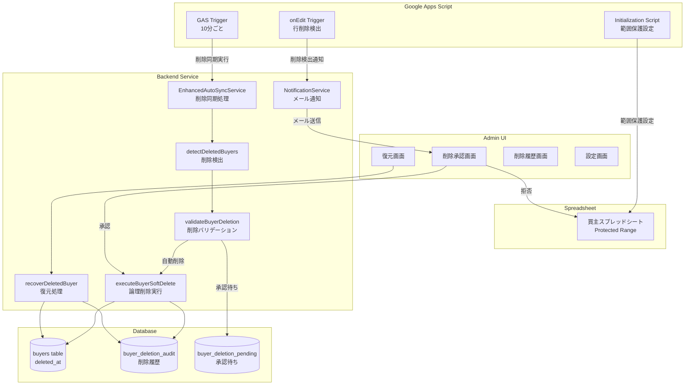

# Design Document: Buyer Spreadsheet Protection

## Overview

買主リストのスプレッドシートから手動で行が削除されると、10分ごとに実行される削除同期処理によってデータベースから物理削除されてしまう問題を解決します。この設計では、スプレッドシートの範囲保護、削除同期の安全性強化、論理削除への移行、削除承認フロー、復元機能を実装します。

### 主要な設計目標

1. **誤削除の防止**: スプレッドシートの範囲保護により、編集者が誤って行を削除できないようにする
2. **削除同期の安全性**: 大量削除や誤削除を検出し、自動削除を一時停止する
3. **データの復元可能性**: 論理削除により、誤削除されたデータを復元できるようにする
4. **削除の透明性**: 削除履歴を記録し、いつ誰が削除したか追跡できるようにする
5. **手動承認フロー**: 削除前に管理者が承認する仕組みを提供する

## Architecture

### システム構成図



### レイヤー構成

1. **Presentation Layer** (Admin UI)
   - 削除承認画面
   - 復元画面
   - 削除履歴画面
   - 設定画面

2. **Application Layer** (Backend Services)
   - `EnhancedAutoSyncService`: 削除同期のメインロジック
   - `BuyerDeletionService`: 削除・復元の専用サービス
   - `NotificationService`: メール通知サービス

3. **Data Layer** (Database)
   - `buyers` テーブル: 買主データ（`deleted_at`フィールド追加済み）
   - `buyer_deletion_audit` テーブル: 削除履歴（既存）
   - `buyer_deletion_pending` テーブル: 承認待ち削除（新規）

4. **External Layer** (Google Apps Script)
   - GAS Trigger: 定期実行トリガー
   - Initialization Script: 範囲保護設定
   - onEdit Trigger: 行削除検出

## Components and Interfaces

### 1. Google Apps Script Components

#### 1.1 Initialization Script (範囲保護設定)

**責務**: 買主スプレッドシートの全データ範囲に保護を設定する

**インターフェース**:
```javascript
/**
 * 買主スプレッドシートの範囲保護を初期化
 */
function initializeBuyerSheetProtection() {
  const sheet = SpreadsheetApp.getActiveSpreadsheet().getSheetByName('買主リスト');
  const lastRow = sheet.getLastRow();
  const range = sheet.getRange('A2:' + sheet.getLastColumn() + lastRow);
  
  // 既存の保護を削除
  const protections = range.getProtections(SpreadsheetApp.ProtectionType.RANGE);
  protections.forEach(p => p.remove());
  
  // 新しい保護を設定
  const protection = range.protect();
  protection.setDescription('買主データ保護（行削除禁止）');
  protection.setWarningOnly(false);
  
  // 管理者のみ編集可能
  const admins = ['admin@example.com']; // 環境変数から取得
  protection.removeEditors(protection.getEditors());
  protection.addEditors(admins);
}
```

#### 1.2 onEdit Trigger (行削除検出)

**責務**: スプレッドシートで行が削除されたことを検出し、即座に通知する

**インターフェース**:
```javascript
/**
 * 行削除を検出してバックエンドに通知
 */
function onEdit(e) {
  const sheet = e.source.getActiveSheet();
  if (sheet.getName() !== '買主リスト') return;
  
  // 行削除を検出
  if (e.changeType === 'REMOVE_ROW') {
    const deletedRows = e.range.getNumRows();
    const startRow = e.range.getRow();
    
    // バックエンドに通知
    const url = PropertiesService.getScriptProperties().getProperty('BACKEND_URL');
    UrlFetchApp.fetch(url + '/api/buyers/deletion-detected', {
      method: 'post',
      contentType: 'application/json',
      payload: JSON.stringify({
        deletedRows: deletedRows,
        startRow: startRow,
        deletedBy: Session.getActiveUser().getEmail(),
        timestamp: new Date().toISOString()
      })
    });
  }
}
```

### 2. Backend Services

#### 2.1 EnhancedAutoSyncService (拡張)

**既存メソッドの変更**:

```typescript
/**
 * 削除された買主を検出（既存メソッド - 変更なし）
 */
async detectDeletedBuyers(): Promise<string[]>

/**
 * 削除バリデーション（既存メソッド - 拡張）
 * 新しい安全ガードを追加
 */
private async validateBuyerDeletion(buyerNumber: string): Promise<ValidationResult>

/**
 * 論理削除を実行（新規メソッド）
 * ハードデリートから論理削除に変更
 */
private async executeBuyerSoftDelete(buyerNumber: string): Promise<DeletionResult>

/**
 * 削除同期のメインメソッド（既存メソッド - 拡張）
 * 承認フローを追加
 */
async syncDeletedBuyers(buyerNumbers: string[]): Promise<DeletionSyncResult>
```

**新規メソッド**:

```typescript
/**
 * 削除対象を承認待ちステータスに設定
 */
async createPendingDeletion(buyerNumbers: string[]): Promise<void> {
  for (const buyerNumber of buyerNumbers) {
    await this.supabase
      .from('buyer_deletion_pending')
      .insert({
        buyer_number: buyerNumber,
        detected_at: new Date().toISOString(),
        status: 'pending',
        reason: 'Removed from spreadsheet'
      });
  }
}

/**
 * 承認待ちの削除を取得
 */
async getPendingDeletions(): Promise<PendingDeletion[]> {
  const { data, error } = await this.supabase
    .from('buyer_deletion_pending')
    .select('*')
    .eq('status', 'pending')
    .order('detected_at', { ascending: false });
  
  if (error) throw error;
  return data;
}

/**
 * 削除を承認して実行
 */
async approveDeletion(pendingId: string, approvedBy: string): Promise<void> {
  const { data: pending } = await this.supabase
    .from('buyer_deletion_pending')
    .select('*')
    .eq('id', pendingId)
    .single();
  
  if (!pending) throw new Error('Pending deletion not found');
  
  // 論理削除を実行
  await this.executeBuyerSoftDelete(pending.buyer_number);
  
  // 承認待ちステータスを更新
  await this.supabase
    .from('buyer_deletion_pending')
    .update({
      status: 'approved',
      approved_by: approvedBy,
      approved_at: new Date().toISOString()
    })
    .eq('id', pendingId);
}

/**
 * 削除を拒否してスプレッドシートに復元
 */
async rejectDeletion(pendingId: string, rejectedBy: string): Promise<void> {
  const { data: pending } = await this.supabase
    .from('buyer_deletion_pending')
    .select('*')
    .eq('id', pendingId)
    .single();
  
  if (!pending) throw new Error('Pending deletion not found');
  
  // スプレッドシートに復元
  await this.restoreBuyerToSpreadsheet(pending.buyer_number);
  
  // 承認待ちステータスを更新
  await this.supabase
    .from('buyer_deletion_pending')
    .update({
      status: 'rejected',
      rejected_by: rejectedBy,
      rejected_at: new Date().toISOString()
    })
    .eq('id', pendingId);
}

/**
 * 買主をスプレッドシートに復元
 */
private async restoreBuyerToSpreadsheet(buyerNumber: string): Promise<void> {
  // DBから買主データを取得
  const { data: buyer } = await this.supabase
    .from('buyers')
    .select('*')
    .eq('buyer_number', buyerNumber)
    .single();
  
  if (!buyer) throw new Error('Buyer not found in database');
  
  // スプレッドシートに追加
  await this.buyerSheetsClient!.appendRow('買主リスト', [
    buyer.buyer_number,
    buyer.name,
    buyer.phone_number,
    // ... 他のフィールド
  ]);
}
```

#### 2.2 BuyerDeletionService (新規)

**責務**: 削除・復元の専用ロジックを提供

```typescript
export class BuyerDeletionService {
  constructor(
    private supabase: SupabaseClient,
    private sheetsClient: GoogleSheetsClient
  ) {}

  /**
   * 論理削除を実行
   */
  async softDelete(buyerNumber: string, deletedBy: string): Promise<void> {
    const { data: buyer } = await this.supabase
      .from('buyers')
      .select('*')
      .eq('buyer_number', buyerNumber)
      .is('deleted_at', null)
      .single();
    
    if (!buyer) throw new Error('Buyer not found');
    
    const deletedAt = new Date();
    
    // 1. 監査ログにバックアップ
    await this.supabase
      .from('buyer_deletion_audit')
      .insert({
        buyer_id: buyer.id,
        buyer_number: buyerNumber,
        deleted_at: deletedAt.toISOString(),
        deleted_by: deletedBy,
        reason: 'Removed from spreadsheet',
        buyer_data: buyer,
        can_recover: true
      });
    
    // 2. 論理削除
    await this.supabase
      .from('buyers')
      .update({ deleted_at: deletedAt.toISOString() })
      .eq('buyer_number', buyerNumber);
  }

  /**
   * 復元を実行
   */
  async recover(buyerNumber: string, recoveredBy: string): Promise<void> {
    // 1. 論理削除を解除
    await this.supabase
      .from('buyers')
      .update({ deleted_at: null })
      .eq('buyer_number', buyerNumber);
    
    // 2. 監査ログを更新
    await this.supabase
      .from('buyer_deletion_audit')
      .update({
        recovered_at: new Date().toISOString(),
        recovered_by: recoveredBy
      })
      .eq('buyer_number', buyerNumber)
      .is('recovered_at', null);
    
    // 3. スプレッドシートに復元
    const { data: buyer } = await this.supabase
      .from('buyers')
      .select('*')
      .eq('buyer_number', buyerNumber)
      .single();
    
    if (buyer) {
      await this.sheetsClient.appendRow('買主リスト', [
        buyer.buyer_number,
        buyer.name,
        // ... 他のフィールド
      ]);
    }
  }

  /**
   * 削除履歴を取得
   */
  async getDeletionHistory(limit: number = 100): Promise<DeletionAudit[]> {
    const { data, error } = await this.supabase
      .from('buyer_deletion_audit')
      .select('*')
      .order('deleted_at', { ascending: false })
      .limit(limit);
    
    if (error) throw error;
    return data;
  }
}
```

#### 2.3 NotificationService (拡張)

**責務**: 削除検出時のメール通知

```typescript
export class NotificationService {
  /**
   * 削除検出通知を送信
   */
  async sendDeletionDetectedNotification(
    buyerNumbers: string[],
    approvalUrl: string
  ): Promise<void> {
    const subject = buyerNumbers.length > 10
      ? `【緊急】買主削除検出: ${buyerNumbers.length}件`
      : `買主削除検出: ${buyerNumbers.length}件`;
    
    const body = `
      以下の買主がスプレッドシートから削除されました：
      
      ${buyerNumbers.slice(0, 10).join(', ')}
      ${buyerNumbers.length > 10 ? `... 他${buyerNumbers.length - 10}件` : ''}
      
      削除を承認する場合は以下のリンクをクリックしてください：
      ${approvalUrl}
      
      削除を拒否する場合は、上記リンクから拒否を選択してください。
    `;
    
    await this.sendEmail({
      to: 'admin@example.com',
      subject,
      body
    });
  }

  /**
   * 行削除即時通知を送信
   */
  async sendRowDeletionNotification(
    deletedRows: number,
    deletedBy: string
  ): Promise<void> {
    const subject = `【警告】スプレッドシートで行削除: ${deletedRows}行`;
    const body = `
      買主スプレッドシートで${deletedRows}行が削除されました。
      
      削除者: ${deletedBy}
      削除日時: ${new Date().toISOString()}
      
      10分後の自動同期で削除が実行されます。
      削除を取り消す場合は、すぐにスプレッドシートを復元してください。
    `;
    
    await this.sendEmail({
      to: 'admin@example.com',
      subject,
      body
    });
  }
}
```

### 3. Admin UI Components

#### 3.1 削除承認画面

**パス**: `/admin/buyers/deletion-approval`

**機能**:
- 承認待ちの削除リストを表示
- 各削除を承認または拒否
- 削除対象の買主情報を表示

**コンポーネント**:
```typescript
export function BuyerDeletionApprovalPage() {
  const [pendingDeletions, setPendingDeletions] = useState<PendingDeletion[]>([]);
  
  const handleApprove = async (pendingId: string) => {
    await fetch('/api/buyers/deletion/approve', {
      method: 'POST',
      body: JSON.stringify({ pendingId, approvedBy: 'admin' })
    });
    // リストを更新
  };
  
  const handleReject = async (pendingId: string) => {
    await fetch('/api/buyers/deletion/reject', {
      method: 'POST',
      body: JSON.stringify({ pendingId, rejectedBy: 'admin' })
    });
    // リストを更新
  };
  
  return (
    <div>
      <h1>削除承認</h1>
      <table>
        <thead>
          <tr>
            <th>買主番号</th>
            <th>検出日時</th>
            <th>理由</th>
            <th>操作</th>
          </tr>
        </thead>
        <tbody>
          {pendingDeletions.map(pending => (
            <tr key={pending.id}>
              <td>{pending.buyer_number}</td>
              <td>{pending.detected_at}</td>
              <td>{pending.reason}</td>
              <td>
                <button onClick={() => handleApprove(pending.id)}>承認</button>
                <button onClick={() => handleReject(pending.id)}>拒否</button>
              </td>
            </tr>
          ))}
        </tbody>
      </table>
    </div>
  );
}
```

#### 3.2 復元画面

**パス**: `/admin/buyers/recovery`

**機能**:
- 論理削除された買主のリストを表示
- 買主を復元
- 削除履歴を表示

#### 3.3 削除履歴画面

**パス**: `/admin/buyers/deletion-history`

**機能**:
- 削除履歴を表示
- 削除理由、削除者、削除日時を表示
- 復元履歴を表示

#### 3.4 設定画面

**パス**: `/admin/settings/deletion-sync`

**機能**:
- 削除同期の自動実行を有効/無効にする
- 削除同期の実行間隔を設定（10分、30分、1時間、手動のみ）
- 削除承認フローを有効/無効にする

## Data Models

### 1. buyers テーブル（既存 - 拡張済み）

```sql
ALTER TABLE buyers
ADD COLUMN IF NOT EXISTS deleted_at TIMESTAMP WITH TIME ZONE DEFAULT NULL;

CREATE INDEX IF NOT EXISTS idx_buyers_deleted_at ON buyers(deleted_at);
```

**フィールド**:
- `deleted_at`: 論理削除日時（NULLの場合はアクティブ）

### 2. buyer_deletion_audit テーブル（既存）

```sql
CREATE TABLE IF NOT EXISTS buyer_deletion_audit (
  id UUID PRIMARY KEY DEFAULT uuid_generate_v4(),
  buyer_id UUID,
  buyer_number TEXT NOT NULL,
  deleted_at TIMESTAMP WITH TIME ZONE NOT NULL,
  deleted_by TEXT NOT NULL,
  reason TEXT,
  buyer_data JSONB NOT NULL,
  can_recover BOOLEAN DEFAULT TRUE,
  recovered_at TIMESTAMP WITH TIME ZONE,
  recovered_by TEXT,
  created_at TIMESTAMP WITH TIME ZONE DEFAULT NOW()
);
```

**フィールド**:
- `id`: 監査ログID
- `buyer_id`: 買主ID（UUID）
- `buyer_number`: 買主番号
- `deleted_at`: 削除日時
- `deleted_by`: 削除実行者
- `reason`: 削除理由
- `buyer_data`: 削除時の買主データ（JSONB）
- `can_recover`: 復元可能フラグ
- `recovered_at`: 復元日時
- `recovered_by`: 復元実行者

### 3. buyer_deletion_pending テーブル（新規）

```sql
CREATE TABLE IF NOT EXISTS buyer_deletion_pending (
  id UUID PRIMARY KEY DEFAULT uuid_generate_v4(),
  buyer_number TEXT NOT NULL,
  detected_at TIMESTAMP WITH TIME ZONE NOT NULL,
  status TEXT NOT NULL CHECK (status IN ('pending', 'approved', 'rejected')),
  reason TEXT,
  approved_by TEXT,
  approved_at TIMESTAMP WITH TIME ZONE,
  rejected_by TEXT,
  rejected_at TIMESTAMP WITH TIME ZONE,
  created_at TIMESTAMP WITH TIME ZONE DEFAULT NOW()
);

CREATE INDEX IF NOT EXISTS idx_buyer_deletion_pending_status ON buyer_deletion_pending(status);
CREATE INDEX IF NOT EXISTS idx_buyer_deletion_pending_buyer_number ON buyer_deletion_pending(buyer_number);
```

**フィールド**:
- `id`: 承認待ちID
- `buyer_number`: 買主番号
- `detected_at`: 削除検出日時
- `status`: ステータス（pending, approved, rejected）
- `reason`: 削除理由
- `approved_by`: 承認者
- `approved_at`: 承認日時
- `rejected_by`: 拒否者
- `rejected_at`: 拒否日時

### 4. deletion_sync_config テーブル（新規）

```sql
CREATE TABLE IF NOT EXISTS deletion_sync_config (
  id UUID PRIMARY KEY DEFAULT uuid_generate_v4(),
  auto_sync_enabled BOOLEAN DEFAULT TRUE,
  sync_interval_minutes INTEGER DEFAULT 30,
  approval_required BOOLEAN DEFAULT TRUE,
  max_auto_delete_count INTEGER DEFAULT 10,
  updated_at TIMESTAMP WITH TIME ZONE DEFAULT NOW(),
  updated_by TEXT
);

-- デフォルト設定を挿入
INSERT INTO deletion_sync_config (auto_sync_enabled, sync_interval_minutes, approval_required, max_auto_delete_count)
VALUES (TRUE, 30, TRUE, 10)
ON CONFLICT DO NOTHING;
```

**フィールド**:
- `auto_sync_enabled`: 自動同期有効フラグ
- `sync_interval_minutes`: 同期間隔（分）
- `approval_required`: 承認必須フラグ
- `max_auto_delete_count`: 自動削除の最大件数
- `updated_at`: 更新日時
- `updated_by`: 更新者

## Error Handling

### 1. スプレッドシート範囲保護のエラー

**エラーケース**:
- 範囲保護の設定に失敗
- 管理者アカウントの設定に失敗

**対処**:
- エラーログを記録
- 管理者にメール通知
- 手動で範囲保護を設定するよう指示

### 2. 削除同期のエラー

**エラーケース**:
- スプレッドシートの取得に失敗
- データベースの更新に失敗
- 監査ログの作成に失敗

**対処**:
- エラーログを記録
- 削除処理をロールバック
- 管理者にメール通知
- 次回の同期で再試行

### 3. 復元処理のエラー

**エラーケース**:
- 監査ログが見つからない
- スプレッドシートへの追加に失敗
- データベースの更新に失敗

**対処**:
- エラーログを記録
- 部分的な復元を許可（DBのみ復元、スプレッドシートは手動）
- 管理者にメール通知

### 4. 承認フローのエラー

**エラーケース**:
- 承認待ちレコードが見つからない
- 承認/拒否の実行に失敗

**対処**:
- エラーログを記録
- ユーザーにエラーメッセージを表示
- 管理者にメール通知

## Testing Strategy

この機能は以下の要素が混在しています：
- **インフラ設定**（Google Apps Script、スプレッドシート保護）
- **バックエンドロジック**（削除同期、承認フロー、復元処理）
- **UI操作**（承認画面、復元画面）

### Property-Based Testing の適用範囲

Property-Based Testing（PBT）は、**バックエンドロジックの一部**にのみ適用します。

**PBTが適用可能な部分**:
- 削除検出ロジック（`detectDeletedBuyers`）
- 削除バリデーション（`validateBuyerDeletion`）
- 論理削除の実行（`executeBuyerSoftDelete`）
- 復元処理（`recoverDeletedBuyer`）

**PBTが適用不可能な部分**:
- Google Apps Scriptの範囲保護設定（インフラ設定）
- スプレッドシートへの書き込み（外部サービス）
- メール通知（外部サービス）
- UI操作（ユーザーインタラクション）

### テスト戦略の内訳

#### 1. Property-Based Tests（バックエンドロジック）

**対象**: 削除検出、バリデーション、論理削除、復元処理

**ライブラリ**: `fast-check`（TypeScript用）

**テスト設定**:
- 最小100回の反復実行
- 各テストは設計ドキュメントのプロパティを参照

#### 2. Unit Tests（具体例とエッジケース）

**対象**:
- 安全ガードの動作確認（0件、50%未満、10件超）
- 承認フローの状態遷移
- エラーハンドリング

#### 3. Integration Tests（外部サービス連携）

**対象**:
- スプレッドシートとの連携（モック使用）
- データベースとの連携（実際のDB使用）
- メール通知（モック使用）

#### 4. Manual Tests（インフラ設定とUI）

**対象**:
- Google Apps Scriptの範囲保護設定
- 承認画面の操作
- 復元画面の操作
- 設定画面の操作

### Correctness Properties

この機能では、バックエンドロジックの一部にのみProperty-Based Testingを適用します。


*A property is a characteristic or behavior that should hold true across all valid executions of a system-essentially, a formal statement about what the system should do. Properties serve as the bridge between human-readable specifications and machine-verifiable correctness guarantees.*

### Property Reflection

prework分析の結果、以下のプロパティが特定されました。冗長性を排除するため、統合可能なプロパティを確認します：

**統合可能なプロパティ**:
- 3.1と3.2: 論理削除の実装（deleted_atフィールドの設定）は同じテストで確認可能
- 4.1、4.2、4.3: 監査ログの記録は、全てのフィールドを一度にテストすることで統合可能
- 8.2と10.4: 自動実行の無効化は同じロジック

**最終的なプロパティリスト**:
1. 削除件数による安全ガード（10件超で一時停止）
2. 件数比率による安全ガード（50%未満でスキップ）
3. 論理削除の実行（deleted_atフィールドの設定と物理削除の回避）
4. アクティブな買主のクエリ（deleted_at IS NULLの条件）
5. 論理削除された買主の同期除外
6. 監査ログの記録（全フィールド含む）
7. 承認待ちレコードの作成
8. 承認時の論理削除実行
9. 拒否時のスプレッドシート復元（モック使用）
10. 復元時のdeleted_atのNULL設定
11. 復元時のスプレッドシート追加（モック使用）
12. 復元時の監査ログ更新
13. メール件名の条件分岐（10件超で「緊急」）
14. 自動実行の無効化

### Property 1: 削除件数による安全ガード

*For any* 削除対象の買主リスト、削除対象が10件以下の場合は自動削除を実行し、11件以上の場合は削除処理を一時停止して管理者に通知する

**Validates: Requirements 2.1**

### Property 2: 件数比率による安全ガード

*For any* スプレッドシートの買主数とDBの買主数の組み合わせ、スプレッドシートの買主数がDBの50%未満の場合は削除処理をスキップし、50%以上の場合は削除処理を実行する

**Validates: Requirements 2.2**

### Property 3: 論理削除の実行

*For any* 買主、削除時にdeleted_atフィールドに現在時刻が設定され、buyersテーブルから物理削除されない

**Validates: Requirements 3.1, 3.2**

### Property 4: アクティブな買主のクエリ

*For any* buyersテーブルの状態（アクティブな買主と削除済み買主が混在）、deleted_at IS NULLの条件でクエリを実行すると、アクティブな買主のみが取得される

**Validates: Requirements 3.3**

### Property 5: 論理削除された買主の同期除外

*For any* buyersテーブルの状態（アクティブな買主と削除済み買主が混在）、スプレッドシート同期時に論理削除された買主（deleted_at IS NOT NULL）は同期されない

**Validates: Requirements 3.4**

### Property 6: 監査ログの記録

*For any* 買主、削除時にbuyer_deletion_auditテーブルに以下の全てのフィールドを含むレコードが作成される：buyer_number、deleted_at、deleted_by、reason、buyer_data（JSONB形式）

**Validates: Requirements 4.1, 4.2, 4.3**

### Property 7: 承認待ちレコードの作成

*For any* 削除対象の買主、削除検出時にbuyer_deletion_pendingテーブルにstatus='pending'のレコードが作成される

**Validates: Requirements 5.1**

### Property 8: 承認時の論理削除実行

*For any* 承認待ちレコード（status='pending'）、承認時に対応する買主が論理削除され、承認待ちレコードのstatusが'approved'に更新される

**Validates: Requirements 5.3**

### Property 9: 拒否時のスプレッドシート復元

*For any* 承認待ちレコード（status='pending'）、拒否時にスプレッドシート復元処理が呼び出され、承認待ちレコードのstatusが'rejected'に更新される（スプレッドシート書き込みはモック使用）

**Validates: Requirements 5.4**

### Property 10: 復元時のdeleted_atのNULL設定

*For any* 論理削除された買主（deleted_at IS NOT NULL）、復元時にdeleted_atフィールドがNULLに設定される

**Validates: Requirements 6.2**

### Property 11: 復元時のスプレッドシート追加

*For any* 論理削除された買主、復元時にスプレッドシート追加処理が呼び出される（スプレッドシート書き込みはモック使用）

**Validates: Requirements 6.3**

### Property 12: 復元時の監査ログ更新

*For any* 論理削除された買主、復元時にbuyer_deletion_auditテーブルのrecovered_atフィールドとrecovered_byフィールドが更新される

**Validates: Requirements 6.4**

### Property 13: メール件名の条件分岐

*For any* 削除対象の買主リスト、削除件数が10件以下の場合はメール件名に「緊急」を含まず、11件以上の場合はメール件名に「緊急」を含む

**Validates: Requirements 7.3**

### Property 14: 自動実行の無効化

*For any* deletion_sync_configの設定、auto_sync_enabled=falseの場合は削除同期処理がスキップされ、auto_sync_enabled=trueの場合は削除同期処理が実行される

**Validates: Requirements 8.2, 10.4**

## Testing Strategy (詳細)

### 1. Property-Based Tests

**ライブラリ**: `fast-check` (TypeScript用)

**設定**:
- 最小100回の反復実行
- 各テストは上記のプロパティを参照
- タグ形式: `Feature: buyer-spreadsheet-protection, Property {number}: {property_text}`

**テストファイル構成**:
```
backend/src/services/__tests__/
  buyer-deletion-safety-guards.property.test.ts  # Property 1, 2
  buyer-soft-deletion.property.test.ts           # Property 3, 4, 5
  buyer-deletion-audit.property.test.ts          # Property 6
  buyer-deletion-approval.property.test.ts       # Property 7, 8, 9
  buyer-recovery.property.test.ts                # Property 10, 11, 12
  buyer-deletion-notification.property.test.ts   # Property 13
  buyer-deletion-config.property.test.ts         # Property 14
```

**テスト例**:
```typescript
// buyer-deletion-safety-guards.property.test.ts
import * as fc from 'fast-check';
import { EnhancedAutoSyncService } from '../EnhancedAutoSyncService';

describe('Feature: buyer-spreadsheet-protection, Property 1: 削除件数による安全ガード', () => {
  it('削除対象が10件以下の場合は自動削除、11件以上の場合は一時停止', async () => {
    await fc.assert(
      fc.asyncProperty(
        fc.array(fc.string(), { minLength: 0, maxLength: 20 }), // 削除対象の買主番号リスト
        async (buyerNumbers) => {
          const service = new EnhancedAutoSyncService();
          const result = await service.syncDeletedBuyers(buyerNumbers);
          
          if (buyerNumbers.length <= 10) {
            // 10件以下の場合は自動削除が実行される
            expect(result.successfullyDeleted).toBeGreaterThan(0);
          } else {
            // 11件以上の場合は一時停止（承認待ちに設定）
            expect(result.requiresManualReview).toBe(buyerNumbers.length);
          }
        }
      ),
      { numRuns: 100 }
    );
  });
});
```

### 2. Unit Tests

**対象**:
- エッジケース（スプレッドシート0件）
- エラーハンドリング
- 承認フローの状態遷移

**テストファイル構成**:
```
backend/src/services/__tests__/
  buyer-deletion-edge-cases.test.ts
  buyer-deletion-error-handling.test.ts
  buyer-deletion-approval-flow.test.ts
```

### 3. Integration Tests

**対象**:
- スプレッドシートとの連携（モック使用）
- データベースとの連携（実際のDB使用）
- メール通知（モック使用）
- Google Apps Scriptの範囲保護設定

**テストファイル構成**:
```
backend/src/services/__tests__/
  buyer-deletion-spreadsheet-integration.test.ts
  buyer-deletion-database-integration.test.ts
  buyer-deletion-notification-integration.test.ts
```

### 4. Manual Tests

**対象**:
- Google Apps Scriptの範囲保護設定
- 承認画面の操作
- 復元画面の操作
- 設定画面の操作

**テストチェックリスト**:
- [ ] GASスクリプトで範囲保護が正しく設定される
- [ ] 編集者アカウントで行削除が禁止される
- [ ] 管理者アカウントで行削除が許可される
- [ ] 承認画面で承認待ちリストが表示される
- [ ] 承認ボタンをクリックすると削除が実行される
- [ ] 拒否ボタンをクリックするとスプレッドシートに復元される
- [ ] 復元画面で論理削除された買主のリストが表示される
- [ ] 復元ボタンをクリックすると買主が復元される
- [ ] 設定画面で自動実行の有効/無効を切り替えられる
- [ ] 設定画面で実行間隔を変更できる

### テストカバレッジ目標

- **Property-Based Tests**: 全14プロパティをカバー
- **Unit Tests**: エッジケースとエラーハンドリングをカバー
- **Integration Tests**: 外部サービス連携をカバー
- **Manual Tests**: UI操作とGAS設定をカバー

### テスト実行順序

1. Unit Tests（最も高速）
2. Property-Based Tests（中速）
3. Integration Tests（低速）
4. Manual Tests（最も低速、リリース前のみ）

---

**設計ドキュメント完成日**: 2026年4月6日
