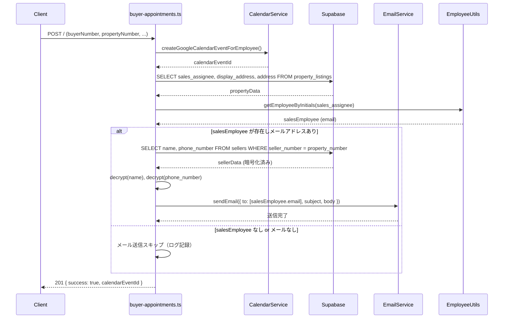
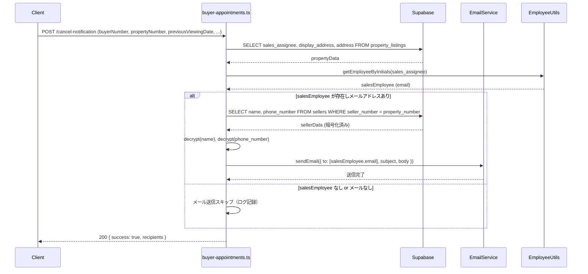

# 設計書：買主内覧メール通知

## 概要

買主リストで内覧日を入力してカレンダー送信した際、または保存済みの内覧日が空欄になった際に、物件担当者へメール通知を送信する機能の設計書です。

### 対象ファイル

- `backend/src/routes/buyer-appointments.ts`（社内管理システム用バックエンド、ポート3000）

### 修正の概要

既存の `POST /` および `POST /cancel-notification` エンドポイントのメール送信ロジックを要件定義書に合わせて修正します。主な変更点は以下の通りです：

1. **宛先の変更**：後続担当・固定メールアドレスへの送信を廃止し、物件担当（`sales_assignee`）のみに送信
2. **件名の修正**：`display_address` フォールバックロジックを追加
3. **本文の修正**：要件定義書に記載の形式に変更
4. **キャンセルメールの修正**：キャンセル前の内覧日を本文に含める
5. **`display_address` の取得**：`property_listings` テーブルから `display_address` カラムを SELECT に追加

---

## アーキテクチャ

### 処理フロー

#### 内覧確定メール（POST /）



#### 内覧キャンセルメール（POST /cancel-notification）



---

## コンポーネントとインターフェース

### 既存コンポーネント（変更なし）

| コンポーネント | ファイル | 役割 |
|---|---|---|
| `EmailService` | `backend/src/services/EmailService.ts` | Gmail API経由でメール送信 |
| `EmployeeUtils` | `backend/src/utils/employeeUtils.ts` | イニシャルから従業員情報を取得 |
| `decrypt` | `backend/src/utils/encryption.ts` | 暗号化フィールドの復号 |
| `CalendarService` | `backend/src/services/CalendarService.supabase.ts` | Googleカレンダーイベント作成 |

### 修正対象コンポーネント

#### `buyer-appointments.ts` - POST / エンドポイント

**変更前の宛先ロジック**：
- 後続担当（`assignedTo`）のメールアドレス
- 物件担当（`sales_assignee`）のメールアドレス（重複除外）

**変更後の宛先ロジック**：
- 物件担当（`sales_assignee`）のメールアドレスのみ

**変更前の件名**：
```
${propertyAddress || '物件住所未設定'}の内覧入りました！内覧担当：${assignedEmployee.name}
```

**変更後の件名**：
```
${displayAddress}の内覧入りました！
```
（`displayAddress` は `display_address` → `address` → `（住所未設定）` のフォールバック）

**変更前の本文**：後続担当名、内覧形態、物件所在地、内覧日時（startTime/endTime から計算）、問合時コメント、売主情報、買主番号、物件番号

**変更後の本文**：
```
内覧担当は<<follow_up_assignee>>です。
<<viewing_mobile または viewing_type_general>>
物件所在地<<display_address（なければaddress）>>
内覧日<<viewing_date>><<viewing_time>>
問合時コメント：<<inquiry_hearing>>
売主様：<<sellers.name（復号済み）>>様
所有者連絡先<<sellers.phone_number（復号済み）>>
買主番号：<<buyer_number>>
物件番号：<<property_number>>
```

#### `buyer-appointments.ts` - POST /cancel-notification エンドポイント

**変更前の宛先ロジック**：
- 後続担当（`assignedTo`）のメールアドレス
- 物件担当（`sales_assignee`）のメールアドレス（重複除外）
- 固定メールアドレス（`tomoko.kunihiro@ifoo-oita.com`）

**変更後の宛先ロジック**：
- 物件担当（`sales_assignee`）のメールアドレスのみ

**変更前の件名**：
```
【キャンセル】${propertyAddress || '物件住所未設定'}の内覧がキャンセルされました
```

**変更後の件名**：
```
${displayAddress}の内覧キャンセルです
```

**変更前の本文**：キャンセル前の内覧日が含まれていない

**変更後の本文**：
```
内覧担当は<<follow_up_assignee>>でした。
<<viewing_mobile または viewing_type_general>>
物件所在地<<display_address（なければaddress）>>
内覧日<<viewing_date（キャンセル前の値）>>の予定でしたがキャンセルとなりました。報告書記入の際はお気をつけください。
問合時コメント：<<inquiry_hearing>>
売主様：<<sellers.name（復号済み）>>様
所有者連絡先<<sellers.phone_number（復号済み）>>
買主番号：<<buyer_number>>
物件番号：<<property_number>>
```

---

## データモデル

### リクエストボディ

#### POST / （内覧確定）

既存のリクエストボディに以下のフィールドを追加・確認：

| フィールド | 型 | 説明 | 変更 |
|---|---|---|---|
| `buyerNumber` | string | 買主番号 | 既存 |
| `propertyNumber` | string | 物件番号 | 既存 |
| `assignedTo` | string | 後続担当イニシャル | 既存（カレンダー用） |
| `viewingMobile` | string | 内覧形態（BI列） | 既存 |
| `viewingTypeGeneral` | string | 内覧形態_一般媒介（FQ列） | **新規追加** |
| `viewingDate` | string | 内覧日（I列） | **新規追加** |
| `viewingTime` | string | 内覧時間（BP列） | **新規追加** |
| `followUpAssignee` | string | 後続担当イニシャル | **新規追加**（メール本文用） |
| `inquiryHearing` | string | 問合時コメント | 既存 |
| `startTime` | string | カレンダー開始時刻（ISO8601） | 既存（カレンダー用） |
| `endTime` | string | カレンダー終了時刻（ISO8601） | 既存（カレンダー用） |

#### POST /cancel-notification （内覧キャンセル）

| フィールド | 型 | 説明 | 変更 |
|---|---|---|---|
| `buyerNumber` | string | 買主番号 | 既存 |
| `propertyNumber` | string | 物件番号 | 既存 |
| `previousViewingDate` | string | キャンセル前の内覧日 | **新規追加** |
| `viewingMobile` | string | 内覧形態（BI列） | **新規追加** |
| `viewingTypeGeneral` | string | 内覧形態_一般媒介（FQ列） | **新規追加** |
| `followUpAssignee` | string | 後続担当イニシャル | 既存（`assignedTo` から改名） |
| `inquiryHearing` | string | 問合時コメント | 既存 |

### データベースクエリ

#### property_listings テーブル

```sql
SELECT sales_assignee, display_address, address
FROM property_listings
WHERE property_number = :propertyNumber
```

**変更点**：`display_address` カラムを SELECT に追加

#### sellers テーブル

```sql
SELECT name, phone_number
FROM sellers
WHERE seller_number = :propertyNumber
```

変更なし（既存と同じ）

### 住居表示フォールバックロジック

```typescript
// display_address → address → '（住所未設定）' のフォールバック
const displayAddress = propertyData?.display_address 
  || propertyData?.address 
  || '（住所未設定）';
```

### 内覧形態の選択ロジック

```typescript
// viewing_mobile が存在すればそちらを優先、なければ viewing_type_general
const viewingFormat = viewingMobile || viewingTypeGeneral || '';
```

---

## 正確性プロパティ

*プロパティとは、システムの全ての有効な実行において真であるべき特性または振る舞いです。プロパティは人間が読める仕様と機械で検証可能な正確性保証の橋渡しをします。*

本機能はメール送信（Gmail API）と Supabase（外部サービス）に強く依存しており、エンドポイント全体のプロパティベーステストは適切ではありません。ただし、純粋なロジック部分（住居表示フォールバック、本文生成）は入力の変化によって出力が変わる関数として切り出せるため、プロパティベーステストが有効です。

### プロパティ1：住居表示フォールバックの一貫性

*任意の* `display_address`（存在する/空/null）と `address`（存在する/空/null）の組み合わせに対して、件名と本文に埋め込まれる物件の場所は常に同じフォールバックロジック（`display_address` → `address` → `（住所未設定）`）の結果と一致し、件名と本文で異なる値が使われることはない

**Validates: Requirements 1.3, 2.3, 4.1, 4.2, 4.3**

### プロパティ2：内覧確定メール本文の完全性

*任意の* 有効な入力値（`followUpAssignee`, `viewingMobile`, `viewingTypeGeneral`, `viewingDate`, `viewingTime`, `inquiryHearing`, `sellerName`, `sellerPhone`, `buyerNumber`, `propertyNumber`）に対して、生成された本文には全てのフィールドが含まれており、いずれかのフィールドが欠落することはない

**Validates: Requirements 1.4**

### プロパティ3：内覧キャンセルメール本文の完全性

*任意の* 有効な入力値（`followUpAssignee`, `viewingMobile`, `viewingTypeGeneral`, `previousViewingDate`, `inquiryHearing`, `sellerName`, `sellerPhone`, `buyerNumber`, `propertyNumber`）に対して、生成されたキャンセルメール本文には全てのフィールドが含まれており、特に `previousViewingDate`（キャンセル前の内覧日）が必ず含まれる

**Validates: Requirements 2.4, 2.5**

---

## エラーハンドリング

### 内覧確定メール（POST /）

| エラーケース | 対応 | カレンダー登録への影響 |
|---|---|---|
| `sales_assignee` が空 | メール送信スキップ、ログ記録 | なし（成功レスポンス返却） |
| 従業員マスタに該当なし | メール送信スキップ、ログ記録 | なし（成功レスポンス返却） |
| 従業員のメールアドレス未設定 | メール送信スキップ、ログ記録 | なし（成功レスポンス返却） |
| 売主情報が取得できない | 売主氏名「なし」、連絡先「なし」でメール送信 | なし（成功レスポンス返却） |
| メール送信失敗（Gmail APIエラー） | エラーログ記録 | なし（成功レスポンス返却） |

**設計方針**：メール送信の失敗はカレンダー登録の成功に影響させない（try-catch で囲む）

### 内覧キャンセルメール（POST /cancel-notification）

| エラーケース | 対応 | レスポンス |
|---|---|---|
| `sales_assignee` が空 | メール送信スキップ、ログ記録 | 200 `{ success: true, recipients: [] }` |
| 従業員マスタに該当なし | メール送信スキップ、ログ記録 | 200 `{ success: true, recipients: [] }` |
| 従業員のメールアドレス未設定 | メール送信スキップ、ログ記録 | 200 `{ success: true, recipients: [] }` |
| 売主情報が取得できない | 売主氏名「なし」、連絡先「なし」でメール送信 | 200 `{ success: true }` |
| メール送信失敗（Gmail APIエラー） | エラーログ記録、エラーレスポンス返却 | 500 `{ error: ... }` |

---

## テスト戦略

### ユニットテスト

以下のケースをユニットテストで検証します：

1. **住居表示フォールバック**
   - `display_address` あり → `display_address` を使用
   - `display_address` なし、`address` あり → `address` を使用
   - 両方なし → `（住所未設定）` を使用

2. **内覧形態の選択**
   - `viewing_mobile` あり → `viewing_mobile` を使用
   - `viewing_mobile` なし、`viewing_type_general` あり → `viewing_type_general` を使用
   - 両方なし → 空文字

3. **売主情報の取得**
   - 売主情報あり → 復号した名前・電話番号を使用
   - 売主情報なし → 「なし」を使用

4. **物件担当メールアドレス解決**
   - `sales_assignee` あり、従業員マスタに存在、メールあり → メール送信
   - `sales_assignee` なし → スキップ
   - 従業員マスタに存在しない → スキップ
   - メールアドレス未設定 → スキップ

### 統合テスト

実際のエンドポイントに対して以下を検証します：

1. `POST /` でカレンダー登録成功後にメールが送信されること
2. `POST /cancel-notification` でキャンセルメールが送信されること
3. メール送信失敗時もカレンダー登録が成功レスポンスを返すこと

### 注意事項

本機能はメール送信（外部サービス）と Supabase（データベース）に依存するため、プロパティベーステストは適用しません。代わりに、純粋なロジック部分（フォールバック処理、本文生成）をユニットテストで検証し、エンドツーエンドの動作は統合テストで確認します。
