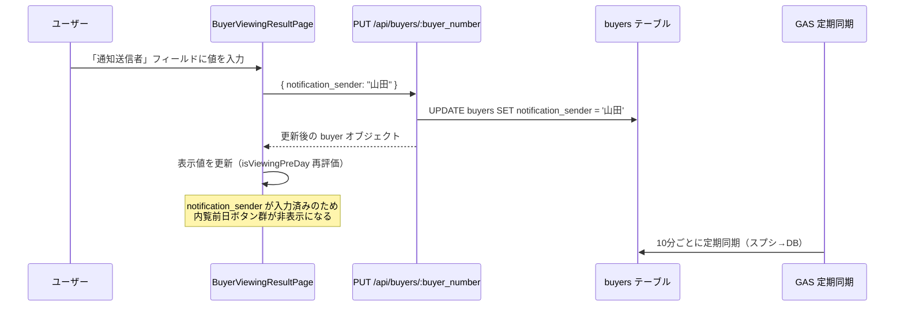

# 設計ドキュメント：内覧ページへの「通知送信者」フィールド追加

## 概要

買主リストの内覧ページ（`BuyerViewingResultPage`）に「通知送信者」（`notification_sender`）フィールドを追加する。

このフィールドはスプレッドシートのBS列に対応し、`buyer-column-mapping.json` の `spreadsheetToDatabaseExtended` には既に `"通知送信者": "notification_sender"` が定義済みである。また、`BuyerDetailPage.tsx` の `BUYER_FIELD_SECTIONS` にも既に `notification_sender` が存在する。

本機能の実装範囲は**内覧ページへの入力フィールド追加のみ**であり、既存の同期ロジック・型定義・ステータス計算ロジックは変更しない。

---

## アーキテクチャ

### システム全体の構成

```
フロントエンド（BuyerViewingResultPage）
  ↓ PUT /api/buyers/:buyer_number
バックエンド（BuyerService）
  ↓ UPDATE buyers SET notification_sender = ?
Supabase（buyers テーブル）
  ↓ GAS 定期同期（10分ごと）
スプレッドシート（BS列：通知送信者）
```

### データフロー



---

## コンポーネントとインターフェース

### 変更対象ファイル

| ファイル | 変更内容 |
|---------|---------|
| `frontend/frontend/src/pages/BuyerViewingResultPage.tsx` | 「通知送信者」フィールドの追加（`InlineEditableField` 使用） |
| `backend/supabase/migrations/20260328_add_notification_sender_to_buyers.sql` | `notification_sender` カラムの追加（冪等マイグレーション） |

### 変更不要なファイル（既存実装を維持）

| ファイル | 理由 |
|---------|------|
| `backend/src/config/buyer-column-mapping.json` | `spreadsheetToDatabaseExtended` に既に定義済み |
| `frontend/frontend/src/pages/BuyerDetailPage.tsx` | `BUYER_FIELD_SECTIONS` に既に定義済み |
| `frontend/frontend/src/types/index.ts` | `Buyer` 型に `notification_sender?: string` が既に定義済み |
| `backend/src/services/BuyerService.ts` | `notification_sender` が許可フィールドリストに既に含まれている |
| `backend/src/services/BuyerStatusCalculator.ts` | `isBlank(buyer.notification_sender)` の判定ロジックが既に実装済み |

### フロントエンド実装詳細

#### 追加するフィールド

内覧情報セクション（内覧日・時間・後続担当・内覧未確定が並ぶ `Box` 内）に `InlineEditableField` を追加する。

```tsx
{/* 通知送信者 */}
<Box sx={{ width: '200px', flexShrink: 0 }}>
  <InlineEditableField
    label="通知送信者"
    fieldName="notification_sender"
    value={buyer.notification_sender || ''}
    onSave={(newValue) => handleInlineFieldSave('notification_sender', newValue)}
    fieldType="text"
    placeholder="例: 山田"
  />
</Box>
```

#### 保存ハンドラー

既存の `handleInlineFieldSave` を使用する（新規コールバック不要）。`notification_sender` は `latest_status` と異なり、スプレッドシートへの即時同期は不要（GAS の定期同期に任せる）。

```typescript
// 既存の handleInlineFieldSave がそのまま使用可能
// sync: false（デフォルト）で高速保存
await buyerApi.update(buyer_number!, { notification_sender: newValue }, { sync: false });
```

#### isViewingPreDay との連携

`isViewingPreDay` 関数は既に `notification_sender` を参照している。フィールドを保存すると `setBuyer(result.buyer)` が呼ばれ、`buyer` ステートが更新されるため、内覧前日ボタン群の表示/非表示が自動的に再評価される。

---

## データモデル

### buyers テーブル

| カラム名 | 型 | 説明 |
|---------|-----|------|
| `notification_sender` | TEXT | 通知送信者（スプレッドシートBS列に対応） |

### マイグレーション

```sql
-- backend/supabase/migrations/20260328_add_notification_sender_to_buyers.sql
ALTER TABLE buyers ADD COLUMN IF NOT EXISTS notification_sender TEXT;
```

`IF NOT EXISTS` を使用することで冪等性を保証する。

### スプレッドシートとのマッピング

| 方向 | スプレッドシート列 | DBカラム | 定義場所 |
|------|-----------------|---------|---------|
| スプシ→DB | BS列「通知送信者」 | `notification_sender` | `buyer-column-mapping.json` の `spreadsheetToDatabaseExtended`（既定義） |
| DB→スプシ | BS列「通知送信者」 | `notification_sender` | GAS の `BUYER_COLUMN_MAPPING`（既定義） |

---

## 正確性プロパティ

*プロパティとは、システムの全ての有効な実行において成立すべき特性や振る舞いのことである。プロパティは人間が読める仕様と機械で検証可能な正確性保証の橋渡しとなる。*

### プロパティ 1: 通知送信者の保存ラウンドトリップ

*任意の* 有効な文字列値（空文字を含む）を `notification_sender` として保存した場合、その後 `GET /api/buyers/:buyer_number` で取得した買主データの `notification_sender` フィールドが保存した値と一致すること。

**Validates: Requirements 1.3, 1.4, 1.5, 2.1**

### プロパティ 2: 通知送信者入力済みの場合は内覧前日判定が false

*任意の* 非空文字列を `notification_sender` として持つ買主に対して、`isViewingPreDay` 関数が `false` を返すこと（内覧日・`broker_inquiry` の値に関わらず）。

**Validates: Requirements 5.1, 5.2, 5.4**

### プロパティ 3: 通知送信者空欄かつ内覧前日条件を満たす場合は内覧前日判定が true

*任意の* `notification_sender` が空欄（null または空文字）で、`broker_inquiry` が「業者問合せ」以外で、内覧日が翌日（木曜内覧の場合は2日後）である買主に対して、`isViewingPreDay` 関数が `true` を返すこと。

**Validates: Requirements 5.3**

---

## エラーハンドリング

### フロントエンド

| エラーケース | 対応 |
|------------|------|
| API 保存失敗 | `InlineEditableField` の既存エラーハンドリングにより、エラーメッセージを表示して編集前の値に戻す |
| ネットワークエラー | 同上 |

### バックエンド

| エラーケース | 対応 |
|------------|------|
| `notification_sender` カラムが存在しない | マイグレーション実行で解決 |
| 不正な値（型エラー等） | `BuyerService` の既存バリデーションで処理 |

---

## テスト戦略

### ユニットテスト（例示テスト）

以下の具体的なケースを確認する：

- 内覧ページに「通知送信者」ラベルが表示されること
- `buyer-column-mapping.json` の `spreadsheetToDatabaseExtended` に `"通知送信者": "notification_sender"` が定義されていること
- `BuyerDetailPage.tsx` の `BUYER_FIELD_SECTIONS` に `notification_sender` が定義されていること
- `frontend/frontend/src/types/index.ts` の `Buyer` 型に `notification_sender` が定義されていること
- マイグレーションファイルが `backend/supabase/migrations/` に存在すること
- マイグレーションが `ADD COLUMN IF NOT EXISTS` を使用していること

### プロパティベーステスト

各プロパティに対して最低 100 回のランダム入力でテストを実施する。

**使用ライブラリ**: `fast-check`（既存プロジェクトで使用済み）

#### プロパティ 1 の実装方針

```typescript
// Feature: buyer-viewing-notification-sender-field, Property 1: 通知送信者の保存ラウンドトリップ
fc.assert(
  fc.asyncProperty(
    fc.string(), // 任意の文字列（空文字含む）
    async (notificationSender) => {
      // 保存
      await buyerApi.update(buyerNumber, { notification_sender: notificationSender });
      // 取得
      const result = await buyerApi.get(buyerNumber);
      // 検証
      expect(result.notification_sender).toBe(notificationSender);
    }
  ),
  { numRuns: 100 }
);
```

#### プロパティ 2 の実装方針

```typescript
// Feature: buyer-viewing-notification-sender-field, Property 2: 通知送信者入力済みの場合は内覧前日判定が false
fc.assert(
  fc.property(
    fc.string({ minLength: 1 }), // 非空文字列
    fc.option(fc.string()),       // 任意の broker_inquiry
    fc.option(fc.string()),       // 任意の latest_viewing_date
    (notificationSender, brokerInquiry, latestViewingDate) => {
      const buyer = {
        notification_sender: notificationSender,
        broker_inquiry: brokerInquiry,
        latest_viewing_date: latestViewingDate,
      };
      expect(isViewingPreDay(buyer)).toBe(false);
    }
  ),
  { numRuns: 100 }
);
```

#### プロパティ 3 の実装方針

```typescript
// Feature: buyer-viewing-notification-sender-field, Property 3: 通知送信者空欄かつ内覧前日条件を満たす場合は内覧前日判定が true
fc.assert(
  fc.property(
    fc.constantFrom(null, ''), // 空欄の notification_sender
    fc.string().filter(s => s !== '業者問合せ'), // 業者問合せ以外の broker_inquiry
    (notificationSender, brokerInquiry) => {
      const tomorrowDate = getTomorrowDateString(); // 木曜日以外の翌日
      const buyer = {
        notification_sender: notificationSender,
        broker_inquiry: brokerInquiry,
        latest_viewing_date: tomorrowDate,
      };
      expect(isViewingPreDay(buyer)).toBe(true);
    }
  ),
  { numRuns: 100 }
);
```

### デュアルテストアプローチ

- **ユニットテスト**: 具体的な例・エッジケース・エラー条件を検証
- **プロパティテスト**: 全入力に対して成立すべき普遍的な性質を検証
- 両者は補完的であり、どちらも必要
