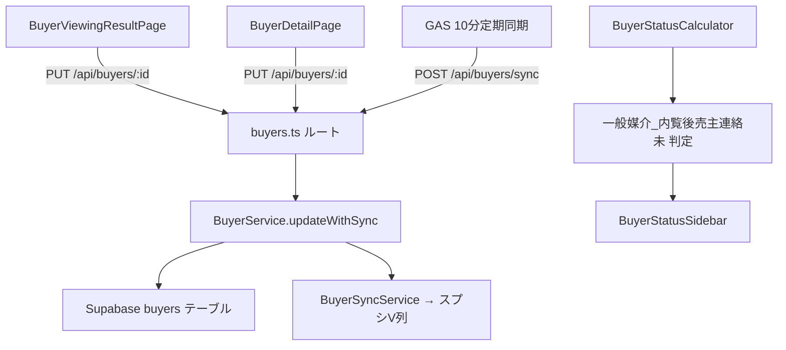

# 設計書：内覧後売主連絡フィールド（buyer-viewing-notification-sender-field）

## 概要

買主リストの内覧ページ（`BuyerViewingResultPage`）および買主詳細ページ（`BuyerDetailPage`）に「内覧後売主連絡」フィールドを追加する。スプレッドシートのV列に対応し、一般媒介物件の内覧後における売主への連絡状況をシステム上で管理できるようにする。

あわせて、`BuyerStatusCalculator` に「一般媒介_内覧後売主連絡未」サイドバーカテゴリーを追加し、対応漏れを防ぐ。

---

## アーキテクチャ



変更は既存のアーキテクチャパターンに完全に準拠する。新しいAPIエンドポイントは不要で、既存の `PUT /api/buyers/:id` を使用する。

---

## コンポーネントとインターフェース

### フロントエンド

#### BuyerViewingResultPage.tsx

`post_viewing_seller_contact` フィールドを表示・編集するボタン選択UIを追加する。

**表示条件**:
```typescript
const showPostViewingSellerContact =
  (buyer.viewing_mobile && buyer.viewing_mobile.includes('一般')) ||
  (buyer.viewing_type_general && buyer.viewing_type_general.includes('一般'));
```

**必須条件判定**:
```typescript
const isPostViewingSellerContactRequired = (buyer: Buyer): boolean => {
  // mediation_type === "一般・公開中"
  // latest_viewing_date >= "2025-07-05"
  // latest_viewing_date <= today
  // viewing_result_follow_up が非空
};
```

**UIレイアウト**（`button-select-layout-rule.md` 準拠）:
```tsx
<Box sx={{ display: 'flex', alignItems: 'center', gap: 1 }}>
  <Typography variant="caption" color="text.secondary"
    sx={{ whiteSpace: 'nowrap', flexShrink: 0 }}>
    内覧後売主連絡{isRequired ? '*' : ''}
  </Typography>
  <Box sx={{ display: 'flex', gap: 0.5, flex: 1 }}>
    {['済', '未', '不要'].map((option) => (
      <Button key={option} size="small"
        variant={buyer.post_viewing_seller_contact === option ? 'contained' : 'outlined'}
        sx={{ flex: 1, py: 0.5 }}
        onClick={() => handleSelect(option)}
      >
        {option}
      </Button>
    ))}
  </Box>
</Box>
```

#### BuyerDetailPage.tsx

`BUYER_FIELD_SECTIONS` の「問合せ内容」セクションに追加する。

```typescript
{ key: 'post_viewing_seller_contact', label: '内覧後売主連絡', inlineEditable: true, fieldType: 'buttonSelect' },
```

#### BuyerStatusSidebar.tsx

変更不要。`BuyerStatusCalculator` が返すステータス文字列をそのまま表示する既存の仕組みで対応できる。

### バックエンド

#### BuyerStatusCalculator.ts

既存の Priority 8 の条件を要件定義書の仕様に合わせて更新する。

**条件A**（`latest_viewing_date >= "2025-08-01"` AND `< today` AND `viewing_result_follow_up` 空 AND `viewing_type_general` 非空）:
```typescript
and(
  isNotBlank(buyer.viewing_type_general),
  isNotBlank(buyer.latest_viewing_date),
  isPast(buyer.latest_viewing_date),
  isAfterOrEqual(buyer.latest_viewing_date, '2025-08-01'),
  isBlank(buyer.viewing_result_follow_up)
)
```

**条件B**（`post_viewing_seller_contact === "未"`）:
```typescript
equals(buyer.post_viewing_seller_contact, '未')
```

最終的な判定: `or(条件A, 条件B)`

#### buyer-column-mapping.json

`spreadsheetToDatabaseExtended` セクションに追加（既に `spreadsheetToDatabase` に存在するため、重複しないよう確認済み）:

> 注意: 調査の結果、`spreadsheetToDatabase` セクションに `"内覧後売主連絡": "post_viewing_seller_contact"` が既に存在する。追加作業は不要。

#### GAS BUYER_COLUMN_MAPPING

```javascript
'内覧後売主連絡': 'post_viewing_seller_contact'
```

---

## データモデル

### buyers テーブル

```sql
ALTER TABLE buyers ADD COLUMN IF NOT EXISTS post_viewing_seller_contact TEXT;
```

**有効な値**: `'済'` / `'未'` / `'不要'` / `NULL`（未選択）

### BuyerData インターフェース（BuyerStatusCalculator.ts）

既に `post_viewing_seller_contact?: string | null` が定義済みであることを確認済み。

---

## 正確性プロパティ

*プロパティとは、システムの全ての有効な実行において成立すべき特性・振る舞いのことである。人間が読める仕様と機械で検証可能な正確性保証の橋渡しとなる形式的な記述である。*

### Property 1: 表示条件の正確性

*For any* 買主データに対して、`viewing_mobile` または `viewing_type_general` に「一般」が含まれる場合かつその場合に限り、`post_viewing_seller_contact` フィールドが表示される。

**Validates: Requirements 1.1, 1.2, 5.2**

### Property 2: 保存ラウンドトリップ

*For any* 有効な値（`'済'`・`'未'`・`'不要'`・空文字）に対して、`PUT /api/buyers/:id` で `post_viewing_seller_contact` を保存した後に `GET /api/buyers/:id` で取得した値が保存した値と一致する。

**Validates: Requirements 1.6, 1.7, 4.5, 5.3, 5.4**

### Property 3: ボタン選択トグル

*For any* 現在の選択状態と選択操作に対して、既に選択済みのボタンを再クリックすると値が空になり、未選択のボタンをクリックするとその値が選択される。

**Validates: Requirements 1.4, 1.5**

### Property 4: 必須判定ロジックの正確性

*For any* 買主データに対して、`mediation_type === "一般・公開中"` AND `latest_viewing_date >= "2025-07-05"` AND `latest_viewing_date <= today` AND `viewing_result_follow_up` が非空、の全条件を満たす場合かつその場合に限り、`post_viewing_seller_contact` が必須と判定される。

**Validates: Requirements 2.1, 2.4**

### Property 5: サイドバーカテゴリー件数の正確性

*For any* 買主データセットに対して、サイドバーに表示される「一般媒介_内覧後売主連絡未」の件数が、条件A（`latest_viewing_date >= "2025-08-01"` AND `< today` AND `viewing_result_follow_up` 空 AND `viewing_type_general` 非空）または条件B（`post_viewing_seller_contact === "未"`）を満たす買主の実際の件数と一致する。件数が0の場合はカテゴリーが表示されない。

**Validates: Requirements 3.2, 3.3, 3.5**

### Property 6: サイドバーフィルタリングの正確性

*For any* 買主データセットに対して、「一般媒介_内覧後売主連絡未」カテゴリーを選択した場合、表示される買主が全て条件A または条件B を満たし、かつ条件を満たす全ての買主が表示される。

**Validates: Requirements 3.4**

---

## エラーハンドリング

### フロントエンド

- **保存失敗時**: 既存の `snackbar` 機構でエラーメッセージを表示する（`severity: 'error'`）
- **必須バリデーション**: 必須条件を満たす状態で空欄のまま保存操作が行われた場合、エラーメッセージを表示する
- **表示条件未満足**: フィールド自体を非表示にする（エラーなし）

### バックエンド

- `post_viewing_seller_contact` は TEXT 型で `NULL` 許容。不正な値が渡された場合は既存の `BuyerService.update` のバリデーション機構に委ねる
- `BuyerStatusCalculator` 内の条件判定は既存の `and`/`or`/`isBlank`/`isNotBlank` ヘルパーを使用し、例外が発生しても `try/catch` で `''` を返す既存の安全機構が適用される

---

## テスト戦略

### ユニットテスト

以下の具体的なケースをユニットテストで検証する:

- `BuyerStatusCalculator` の「一般媒介_内覧後売主連絡未」判定
  - 条件Aのみ満たす場合 → ステータスが「一般媒介_内覧後売主連絡未」
  - 条件Bのみ満たす場合 → ステータスが「一般媒介_内覧後売主連絡未」
  - 両条件を満たさない場合 → ステータスが「一般媒介_内覧後売主連絡未」でない
  - `latest_viewing_date` が `"2025-07-31"` の場合（境界値）→ 条件Aを満たさない
  - `latest_viewing_date` が `"2025-08-01"` の場合（境界値）→ 条件Aを満たす
- 必須判定ヘルパー関数
  - `latest_viewing_date` が `"2025-07-04"` の場合 → 必須でない
  - `latest_viewing_date` が `"2025-07-05"` の場合 → 必須条件の一つを満たす
  - `viewing_result_follow_up` が空の場合 → 必須でない

### プロパティベーステスト

各プロパティを `fast-check`（TypeScript）を使用してプロパティベーステストとして実装する。最低100回のイテレーションを実行する。

**テストタグ形式**: `Feature: buyer-viewing-notification-sender-field, Property {番号}: {プロパティ名}`

```typescript
// Property 1: 表示条件の正確性
// Feature: buyer-viewing-notification-sender-field, Property 1: 表示条件の正確性
fc.assert(fc.property(
  fc.record({
    viewing_mobile: fc.option(fc.string()),
    viewing_type_general: fc.option(fc.string()),
  }),
  (buyer) => {
    const shouldShow = shouldShowPostViewingSellerContact(buyer);
    const hasGeneral =
      (buyer.viewing_mobile?.includes('一般') ?? false) ||
      (buyer.viewing_type_general?.includes('一般') ?? false);
    return shouldShow === hasGeneral;
  }
), { numRuns: 100 });

// Property 2: 保存ラウンドトリップ
// Feature: buyer-viewing-notification-sender-field, Property 2: 保存ラウンドトリップ
fc.assert(fc.property(
  fc.constantFrom('済', '未', '不要', ''),
  async (value) => {
    await api.put(`/api/buyers/${testBuyerNumber}`, { post_viewing_seller_contact: value });
    const result = await api.get(`/api/buyers/${testBuyerNumber}`);
    return result.data.post_viewing_seller_contact === (value || null);
  }
), { numRuns: 100 });

// Property 4: 必須判定ロジックの正確性
// Feature: buyer-viewing-notification-sender-field, Property 4: 必須判定ロジックの正確性
fc.assert(fc.property(
  fc.record({
    mediation_type: fc.string(),
    latest_viewing_date: fc.option(fc.string()),
    viewing_result_follow_up: fc.option(fc.string()),
  }),
  (buyer) => {
    const isRequired = isPostViewingSellerContactRequired(buyer);
    const expected =
      buyer.mediation_type === '一般・公開中' &&
      isDateOnOrAfter(buyer.latest_viewing_date, '2025-07-05') &&
      isDateOnOrBefore(buyer.latest_viewing_date, today()) &&
      !!buyer.viewing_result_follow_up?.trim();
    return isRequired === expected;
  }
), { numRuns: 100 });

// Property 5: サイドバーカテゴリー件数の正確性
// Feature: buyer-viewing-notification-sender-field, Property 5: サイドバーカテゴリー件数の正確性
fc.assert(fc.property(
  fc.array(fc.record({
    viewing_type_general: fc.option(fc.string()),
    latest_viewing_date: fc.option(fc.string()),
    viewing_result_follow_up: fc.option(fc.string()),
    post_viewing_seller_contact: fc.option(fc.constantFrom('済', '未', '不要')),
  })),
  (buyers) => {
    const expected = buyers.filter(b =>
      matchesConditionA(b) || matchesConditionB(b)
    ).length;
    const categories = calculateStatusCategories(buyers);
    const category = categories.find(c => c.status === '一般媒介_内覧後売主連絡未');
    return expected === 0
      ? category === undefined
      : category?.count === expected;
  }
), { numRuns: 100 });
```

### 統合テスト

- `PUT /api/buyers/:id` で `post_viewing_seller_contact` を更新後、`GET /api/buyers/:id` で値が反映されていることを確認
- `GET /api/buyers/status-categories` のレスポンスに「一般媒介_内覧後売主連絡未」が含まれることを確認（該当データが存在する場合）
