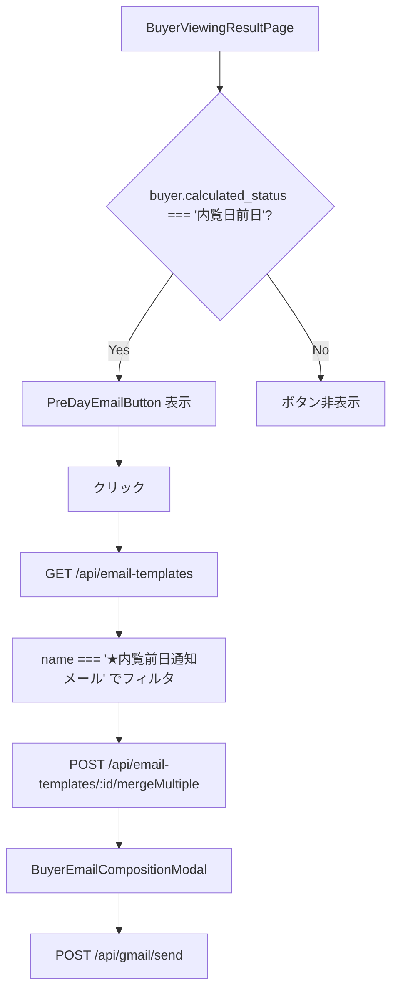
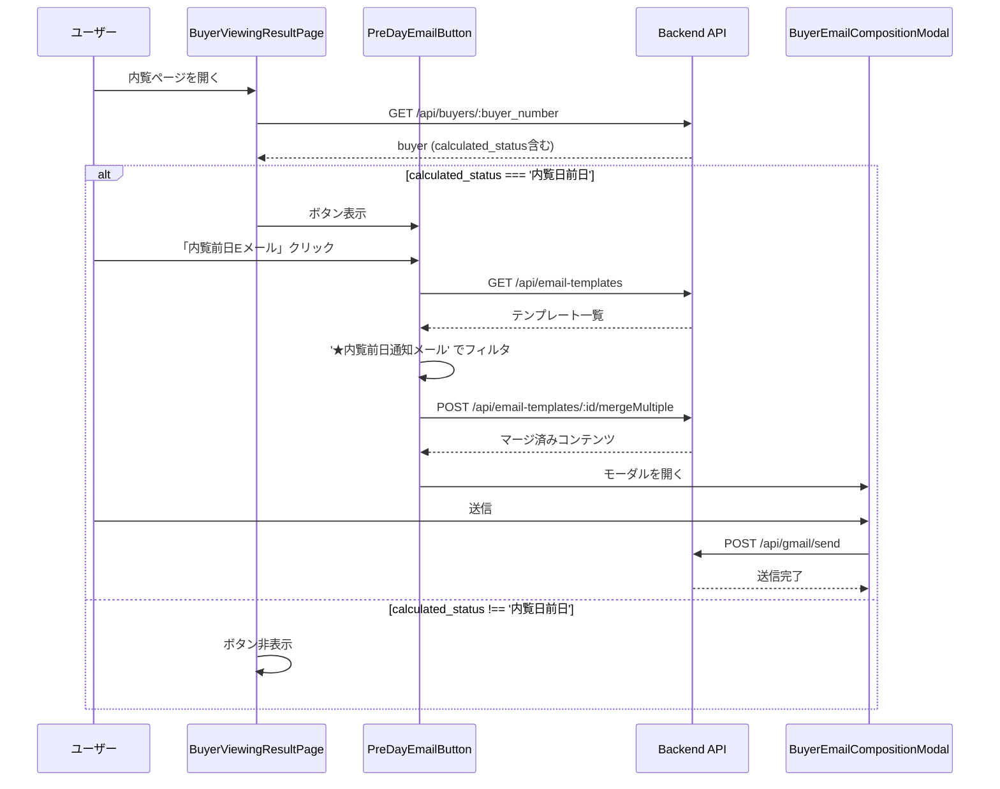

# Design Document: buyer-viewing-pre-day-email

## Overview

買主リストの内覧ページ（`BuyerViewingResultPage`）に「内覧前日Eメール」ボタンを追加する。
ボタンは `buyer.calculated_status === '内覧日前日'` の場合のみ表示され、クリックすると「★内覧前日通知メール」テンプレートのみを使ったGmail送信フローを起動する。

## Architecture



## Components and Interfaces

### Component 1: PreDayEmailButton（新規コンポーネント）

**Purpose**: 内覧前日Eメール送信ボタン。BuyerGmailSendButtonをベースに、テンプレートを「★内覧前日通知メール」のみに絞り込む。

**Interface**:
```typescript
interface PreDayEmailButtonProps {
  buyerId: string;
  buyerEmail: string;
  buyerName: string;
  buyerCompanyName?: string;
  buyerNumber?: string;
  preViewingNotes?: string;
  inquiryHistory: InquiryHistoryItem[];
  selectedPropertyIds: Set<string>;
  size?: 'small' | 'medium' | 'large';
  onEmailSent?: () => void;
}
```

**Responsibilities**:
- `GET /api/email-templates` でテンプレート一覧を取得
- `name === '★内覧前日通知メール'` のテンプレートのみ使用
- テンプレートが見つかった場合は `mergeMultiple` → `BuyerEmailCompositionModal` を開く
- テンプレートが見つからない場合はエラーメッセージを表示

### Component 2: BuyerViewingResultPage（既存・修正）

**Purpose**: 内覧前日Eメールボタンの表示制御を追加する。

**追加ロジック**:
- `buyer.calculated_status === '内覧日前日'` の場合のみ `PreDayEmailButton` を表示
- フロントエンドで独自に日付計算する必要はない（APIレスポンスの `calculated_status` を直接使用）

## Data Models

### calculated_status の利用

`GET /api/buyers/:buyer_number` のレスポンスには `calculated_status` フィールドが含まれる（`BuyerService` が `BuyerStatusCalculator.calculateBuyerStatus()` を呼び出して計算）。

フロントエンドは `buyer.calculated_status === '内覧日前日'` を直接チェックするだけでよい。これにより、サイドバーの「内覧日前日」カテゴリーと完全に同じ判定になる。

### EmailTemplate

```typescript
interface EmailTemplate {
  id: string;
  name: string;       // '★内覧前日通知メール' でフィルタ
  description: string;
  subject: string;
  body: string;
  placeholders: string[];
}
```

## Sequence Diagrams



## Key Functions with Formal Specifications

### PreDayEmailButton.handleClick()

**Preconditions:**
- `buyerEmail` が空でない
- `selectedPropertyIds.size > 0`（物件が選択されている）

**Postconditions:**
- `GET /api/email-templates` を呼び出す
- レスポンスから `name === '★内覧前日通知メール'` のテンプレートを抽出
- テンプレートが存在する場合: `mergeMultiple` → `BuyerEmailCompositionModal` を開く
- テンプレートが存在しない場合: エラーメッセージ「★内覧前日通知メールテンプレートが見つかりません」を表示

### BuyerViewingResultPage の表示制御

**Preconditions:**
- `buyer` が取得済み

**Postconditions:**
- `buyer.calculated_status === '内覧日前日'` の場合のみ `PreDayEmailButton` をレンダリング
- それ以外の場合は `null` を返す

## Error Handling

### テンプレートが見つからない場合

**Condition**: `GET /api/email-templates` のレスポンスに `★内覧前日通知メール` が含まれない
**Response**: Snackbar で「★内覧前日通知メールテンプレートが見つかりません」を表示
**Recovery**: ユーザーは手動でBuyerDetailPageのGmail送信ボタンを使用できる

### 物件未選択の場合

**Condition**: `selectedPropertyIds.size === 0`
**Response**: ボタンを disabled 状態にする（BuyerGmailSendButtonと同じ挙動）

## Testing Strategy

### Unit Testing Approach

- `PreDayEmailButton` のレンダリングテスト
- テンプレートフィルタリングロジックのテスト（`★内覧前日通知メール` のみ抽出）
- `calculated_status === '内覧日前日'` の場合のみボタンが表示されることのテスト

### Property-Based Testing Approach

**Property Test Library**: fast-check

- 任意の `calculated_status` に対して、`'内覧日前日'` の場合のみボタンが表示されることを検証
- テンプレート一覧の任意のサブセットに対して、`★内覧前日通知メール` のみが選択されることを検証

## Correctness Properties

*A property is a characteristic or behavior that should hold true across all valid executions of a system-essentially, a formal statement about what the system should do. Properties serve as the bridge between human-readable specifications and machine-verifiable correctness guarantees.*

### Property 1: ステータスによるボタン表示の排他性

*For any* 買主データに対して、`calculated_status === '内覧日前日'` の場合のみ `PreDayEmailButton` が表示され、それ以外の全ての `calculated_status` 値に対してはボタンが表示されない

**Validates: Requirements 1.1, 1.2**

### Property 2: テンプレートフィルタリングの正確性

*For any* テンプレート一覧（任意の名前・数のテンプレートを含む）に対して、`PreDayEmailButton` が使用するテンプレートは `name === '★内覧前日通知メール'` のものだけである

**Validates: Requirements 2.2**

### Property 3: 物件未選択時のボタン無効化

*For any* `selectedPropertyIds` が空の Set である場合、`PreDayEmailButton` は disabled 状態になる

**Validates: Requirements 2.5**

### Property 4: テンプレート不在時のエラー表示

*For any* `★内覧前日通知メール` を含まないテンプレート一覧に対して、`PreDayEmailButton` はエラーメッセージを表示する

**Validates: Requirements 3.1**

### Property 5: 送信完了後のコールバック呼び出し

*For any* `onEmailSent` コールバックが指定されている場合、メール送信が成功した後に必ずそのコールバックが呼び出される

**Validates: Requirements 4.4**

## Dependencies

- `BuyerGmailSendButton` コンポーネント（参考実装）
- `BuyerEmailCompositionModal` コンポーネント（再利用）
- `GET /api/email-templates` エンドポイント（既存）
- `POST /api/email-templates/:id/mergeMultiple` エンドポイント（既存）
- `POST /api/gmail/send` エンドポイント（既存）
- `BuyerStatusCalculator` の `calculated_status` フィールド（既存、APIレスポンスに含まれる）

## 実装ファイル

| ファイル | 変更種別 | 内容 |
|---------|---------|------|
| `frontend/frontend/src/components/PreDayEmailButton.tsx` | 新規作成 | 内覧前日Eメール送信ボタンコンポーネント |
| `frontend/frontend/src/pages/BuyerViewingResultPage.tsx` | 修正 | `buyer.calculated_status === '内覧日前日'` の場合に `PreDayEmailButton` を表示 |
