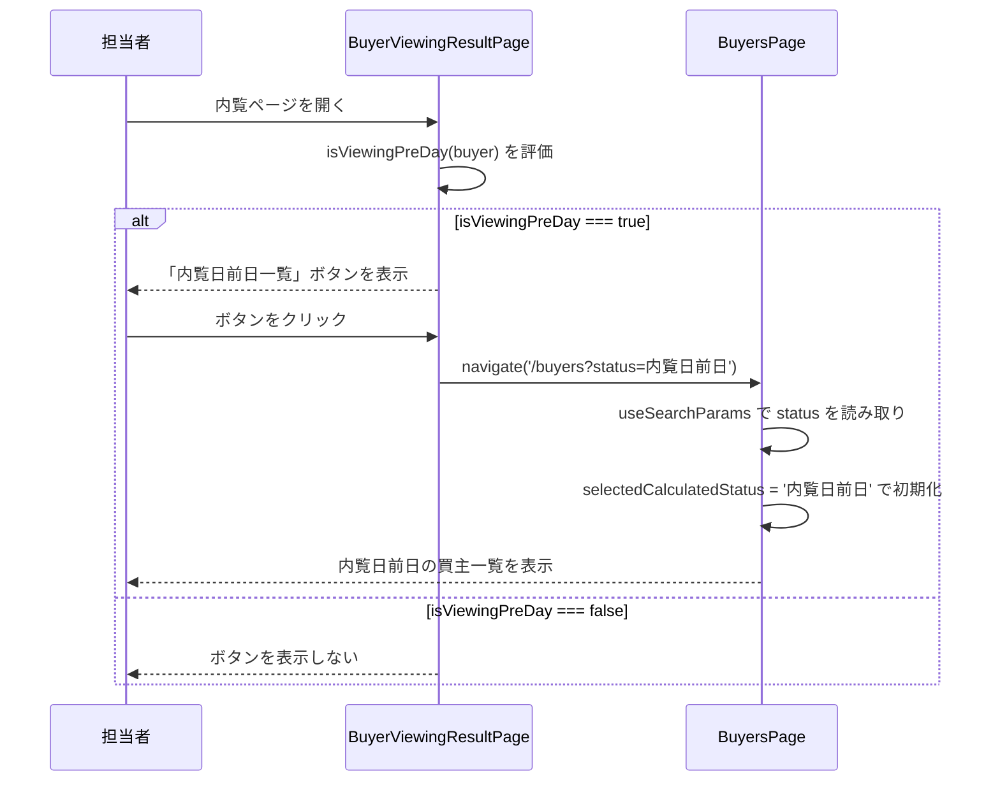

# 設計ドキュメント：buyer-viewing-pre-day-header-button

## Overview

内覧ページ（`BuyerViewingResultPage`）のヘッダーに「内覧日前日一覧」ボタンを追加する。このボタンは `isViewingPreDay(buyer) === true` の場合のみ表示され、クリックすると `/buyers?status=内覧日前日` に遷移する。`BuyersPage` 側では URL クエリパラメータ `status` を読み取り、`selectedCalculatedStatus` の初期値として使用することで、内覧日前日の買主一覧がフィルタリングされた状態で表示される。

変更対象ファイルは2つのみ（最小限の変更）：
- `frontend/frontend/src/pages/BuyerViewingResultPage.tsx`
- `frontend/frontend/src/pages/BuyersPage.tsx`

## Architecture



## Components and Interfaces

### BuyerViewingResultPage.tsx の変更

`isViewingPreDay(buyer)` が true の場合のヘッダーボタン群（`<Box sx={{ ml: 'auto', ... }}>` 内）に「内覧日前日一覧」ボタンを追加する。

既存のメール/SMSボタンと並べて配置し、`navigate('/buyers?status=内覧日前日')` を呼び出す。

```tsx
{isViewingPreDay(buyer) && (
  <Box sx={{ ml: 'auto', display: 'flex', gap: 1, alignItems: 'center' }}>
    {/* 既存: メールボタン or SMSボタン */}
    {/* 新規追加 */}
    <Button
      variant="outlined"
      color="success"
      size="medium"
      onClick={() => navigate('/buyers?status=内覧日前日')}
    >
      内覧日前日一覧
    </Button>
  </Box>
)}
```

### BuyersPage.tsx の変更

`useSearchParams` を追加し、URL クエリパラメータ `status` を読み取って `selectedCalculatedStatus` の初期値として使用する。

```tsx
import { useNavigate, useSearchParams } from 'react-router-dom';

// ...

const [searchParams] = useSearchParams();
const initialStatus = searchParams.get('status');
const [selectedCalculatedStatus, setSelectedCalculatedStatus] = useState<string | null>(initialStatus);
```

## Data Models

新規データモデルの追加はなし。既存の状態管理を活用する。

| 項目 | 型 | 説明 |
|------|-----|------|
| `selectedCalculatedStatus` | `string \| null` | 選択中のステータスフィルター。URL クエリパラメータ `status` から初期化される |

URL クエリパラメータ：
- キー: `status`
- 値: `内覧日前日`（`BuyerStatusCalculator` が計算する `calculated_status` の値と一致）

## Correctness Properties

*A property is a characteristic or behavior that should hold true across all valid executions of a system-essentially, a formal statement about what the system should do. Properties serve as the bridge between human-readable specifications and machine-verifiable correctness guarantees.*

### Property 1: 条件付きボタン表示

*For any* buyer オブジェクトに対して、`isViewingPreDay(buyer)` が true のとき「内覧日前日一覧」ボタンが DOM に存在し、false のときボタンが DOM に存在しない。

**Validates: Requirements 1.1, 1.2**

### Property 2: ナビゲーション先の正確性

*For any* `isViewingPreDay(buyer) === true` の状態で「内覧日前日一覧」ボタンをクリックしたとき、`navigate` が `/buyers?status=内覧日前日` を引数として呼び出される。

**Validates: Requirements 2.1**

### Property 3: クエリパラメータによる初期ステータス設定

*For any* `status` クエリパラメータを持つ URL で `BuyersPage` がレンダリングされたとき、`selectedCalculatedStatus` の初期値がそのパラメータ値と等しい。

**Validates: Requirements 2.2, 2.3**

## Error Handling

- `useSearchParams` で `status` パラメータが存在しない場合（`null`）: `selectedCalculatedStatus` は `null` のまま（既存の全件表示動作を維持）
- `status` パラメータに不正な値が渡された場合: フィルタリング結果が0件になるが、エラーは発生しない（既存の `filter` ロジックがそのまま適用される）

## Testing Strategy

### Unit Tests（例・エッジケース）

- `isViewingPreDay` が false の buyer でボタンが表示されないこと（例）
- `status` クエリパラメータなしで BuyersPage を開いたとき `selectedCalculatedStatus` が `null` であること（エッジケース）

### Property-Based Tests

プロパティベーステストには **fast-check**（既存プロジェクトで使用中）を使用する。各テストは最低 100 回実行する。

**Property 1 のテスト**:
```
// Feature: buyer-viewing-pre-day-header-button, Property 1: 条件付きボタン表示
// isViewingPreDay が true/false の buyer を生成し、ボタンの存在を検証
```

**Property 2 のテスト**:
```
// Feature: buyer-viewing-pre-day-header-button, Property 2: ナビゲーション先の正確性
// isViewingPreDay=true の buyer を生成し、ボタンクリック後の navigate 呼び出しを検証
```

**Property 3 のテスト**:
```
// Feature: buyer-viewing-pre-day-header-button, Property 3: クエリパラメータによる初期ステータス設定
// 任意の status 文字列を生成し、BuyersPage の selectedCalculatedStatus 初期値を検証
```

各プロパティテストは対応する設計ドキュメントのプロパティ番号をコメントで参照すること。
