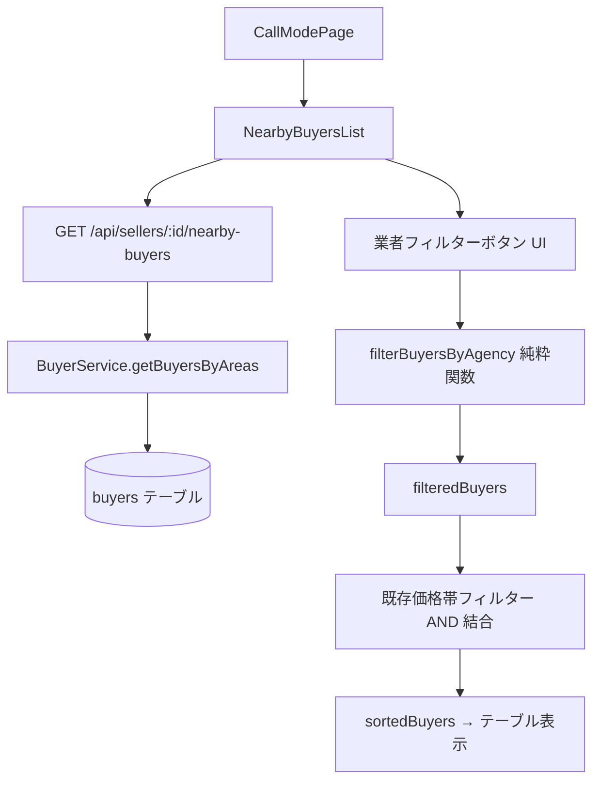

# デザインドキュメント: 通話モードページ「近隣買主」タブへの業者向けフィルタリングボタン追加

## 概要

通話モードページ（CallModePage）の「近隣買主」タブに表示される `NearbyBuyersList` コンポーネントに、業者（両手）向けの買主フィルタリングボタンを追加する。

物件種別に応じて「業者_土地」「業者_戸建」「業者_マンション」の3種類のボタンを表示し、担当者が業者向け買主候補を素早く絞り込めるようにする。

### 調査結果の重要な発見

コードベース調査の結果、以下が判明した：

- **`desired_type`（要件書記載）は実際には `desired_property_type`（DBカラム名）**  
  スプレッドシートU列「★希望種別」は `buyer-column-mapping.json` で `desired_property_type` にマッピング済み
- **`broker_inquiry`** は `buyers` テーブルに既存カラムとして存在し、`getBuyersByAreas()` の SELECT クエリに含まれている
- **`distribution_type`** は `buyers` テーブルに既存カラムとして存在するが、`getBuyersByAreas()` では DBレベルで `distribution_type = '要'` にフィルタリング済みのため、フロントエンドには `distribution_type = '要'` の買主のみが返される
- **`desired_property_type`** は `getBuyersByAreas()` の SELECT クエリに含まれているが、フロントエンドの `NearbyBuyer` インターフェースには未定義

---

## アーキテクチャ



### 変更範囲

| レイヤー | ファイル | 変更内容 |
|---------|---------|---------|
| フロントエンド | `NearbyBuyersList.tsx` | インターフェース拡張、フィルターボタン追加、フィルタリングロジック追加 |
| バックエンド | `BuyerService.ts` | `getBuyersByAreas()` の SELECT に `desired_property_type` を追加（`broker_inquiry` は既存） |

---

## コンポーネントとインターフェース

### NearbyBuyer インターフェース（拡張後）

```typescript
interface NearbyBuyer {
  // 既存フィールド（変更なし）
  buyer_number: string;
  name: string;
  distribution_areas: string[];
  latest_status: string;
  viewing_date: string;
  reception_date?: string;
  inquiry_hearing?: string;
  viewing_result_follow_up?: string;
  email?: string;
  phone_number?: string;
  property_address?: string | null;
  inquiry_property_type?: string | null;
  inquiry_price?: number | null;
  price_range_house?: string | null;
  price_range_apartment?: string | null;
  price_range_land?: string | null;

  // 新規追加フィールド
  desired_type?: string | null;      // desired_property_type のエイリアス（U列「★希望種別」）
  broker_inquiry?: string | null;    // CV列「業者問合せ」（既存DBカラム）
  distribution_type?: string | null; // Q列「配信種別」（既存DBカラム、APIでは常に「要」）
}
```

> **注意**: バックエンドの `desired_property_type` をフロントエンドでは `desired_type` として受け取る。
> これは要件書の命名に合わせるためであり、バックエンドのマッピング時に `desired_type: buyer.desired_property_type` として変換する。

### 業者フィルター状態

```typescript
type AgencyFilterType = '土地' | '戸建' | 'マンション' | null;

// NearbyBuyersList コンポーネント内の state
const [activeAgencyFilter, setActiveAgencyFilter] = useState<AgencyFilterType>(null);
```

### ボタン表示制御ロジック

```typescript
// propertyType に基づくボタン表示判定
const showLandAndHouseButtons = propertyType === '土地' || propertyType === '戸建て';
const showApartmentButton = propertyType === 'マンション';
```

---

## データモデル

### バックエンド: getBuyersByAreas() の変更

`BuyerService.ts` の `getBuyersByAreas()` メソッドの SELECT クエリに `desired_property_type` を追加し、戻り値のマッピングで `desired_type` として返す。

```typescript
// SELECT クエリに追加
desired_property_type,  // ← 追加

// 戻り値マッピングに追加
return sortedBuyers.map(buyer => ({
  ...buyer,
  distribution_areas: this.parseDistributionAreas(buyer.distribution_areas || buyer.desired_area),
  inquiry_property_type: buyer.desired_property_type ?? null,
  inquiry_price: buyer.price ?? null,
  property_address: propertyAddressMap[buyer.property_number] ?? null,
  desired_type: buyer.desired_property_type ?? null,  // ← 追加
}));
```

> **`broker_inquiry` と `distribution_type` について**:
> - `broker_inquiry` は既に SELECT クエリに含まれており、`...buyer` スプレッドで自動的に返される
> - `distribution_type` は DBレベルで `= '要'` にフィルタリング済みのため、フロントエンドに届く全買主は `distribution_type = '要'` である。ただし、要件の「空欄も許容」に対応するため、フロントエンドのフィルタリングロジックでは `distribution_type` の値を確認せず、APIから返ってきた買主は全員「配信種別条件を満たす」とみなす。

### フロントエンド: フィルタリング純粋関数

```typescript
// 業者フィルタリング純粋関数
const filterBuyersByAgency = (
  buyers: NearbyBuyer[],
  filterType: AgencyFilterType
): NearbyBuyer[] => {
  if (filterType === null) return buyers;

  return buyers.filter(buyer => {
    // broker_inquiry が "業者（両手）" と完全一致することが共通条件
    if (buyer.broker_inquiry !== '業者（両手）') return false;

    const desiredType = (buyer.desired_type || '').trim();

    switch (filterType) {
      case '土地':
        // desired_type が空欄 or "土地" を含む
        return !desiredType || desiredType.includes('土地');
      case '戸建':
        // desired_type が "戸建" と完全一致（複合値NG）
        return desiredType === '戸建';
      case 'マンション':
        // desired_type が "マンション" と完全一致
        return desiredType === 'マンション';
      default:
        return true;
    }
  });
};
```

---

## 正確性プロパティ

*プロパティとは、システムの全ての有効な実行において真であるべき特性や振る舞いのことであり、人間が読める仕様と機械で検証可能な正確性保証の橋渡しをする正式な記述である。*

### Property 1: 業者_土地フィルターの包含条件

*For any* 買主リストに対して「業者_土地」フィルターを適用した場合、結果に含まれる全ての買主は `broker_inquiry === '業者（両手）'` かつ `desired_type` が空欄または "土地" を含む文字列でなければならない

**Validates: Requirements 2.1**

### Property 2: 業者_戸建フィルターの排他条件

*For any* 買主リストに対して「業者_戸建」フィルターを適用した場合、結果に含まれる全ての買主は `desired_type === '戸建'`（完全一致）でなければならず、"土地、戸建" のような複合値を持つ買主は含まれない

**Validates: Requirements 2.2**

### Property 3: 業者_マンションフィルターの完全一致条件

*For any* 買主リストに対して「業者_マンション」フィルターを適用した場合、結果に含まれる全ての買主は `desired_type === 'マンション'`（完全一致）でなければならない

**Validates: Requirements 2.3**

### Property 4: フィルター非適用時の不変性

*For any* 買主リストに対して `activeAgencyFilter === null` の場合、`filterBuyersByAgency` の結果は入力と同一でなければならない

**Validates: Requirements 2.5**

### Property 5: 業者フィルターと価格帯フィルターのAND結合

*For any* 買主リストと業者フィルター・価格帯フィルターの組み合わせに対して、両方のフィルターが適用された場合の結果は、業者フィルターのみを適用した結果と価格帯フィルターのみを適用した結果の積集合と等しくなければならない

**Validates: Requirements 2.4**

### Property 6: トグル動作の冪等性

*For any* アクティブなフィルターに対して同じボタンを2回押した場合、フィルターは元の非アクティブ状態（null）に戻らなければならない

**Validates: Requirements 4.1, 4.2**

### Property 7: 排他制御の正確性

*For any* アクティブなフィルターが存在する状態で別のフィルターボタンを押した場合、以前のフィルターは解除され、新しいフィルターのみがアクティブになる

**Validates: Requirements 4.3**

---

## エラーハンドリング

### バックエンド

- `desired_property_type` が `null` の場合: `desired_type: null` として返す（既存の `?? null` パターンに従う）
- `broker_inquiry` が `null` の場合: フロントエンドのフィルタリングで `broker_inquiry !== '業者（両手）'` として除外される

### フロントエンド

- `desired_type` が `undefined` または `null` の場合: 空文字列として扱い、「業者_土地」フィルターでは「空欄」条件に該当（表示対象）
- `broker_inquiry` が `undefined` または `null` の場合: `'業者（両手）'` と一致しないため、全ての業者フィルターで除外される
- `propertyType` が `null` または未知の値の場合: ボタンを表示しない（`showLandAndHouseButtons` と `showApartmentButton` が両方 `false`）

---

## テスト戦略

### ユニットテスト（例示ベース）

- `filterBuyersByAgency('土地')`: `desired_type = null`、`desired_type = '土地'`、`desired_type = '土地、戸建'` の買主が含まれることを確認
- `filterBuyersByAgency('戸建')`: `desired_type = '戸建'` のみ含まれ、`desired_type = '土地、戸建'` は除外されることを確認
- `filterBuyersByAgency('マンション')`: `desired_type = 'マンション'` のみ含まれることを確認
- `filterBuyersByAgency(null)`: 入力と同一の配列が返ることを確認
- ボタン表示制御: `propertyType = '土地'` で土地・戸建ボタンが表示、マンションボタンが非表示
- ボタン表示制御: `propertyType = 'マンション'` でマンションボタンが表示、土地・戸建ボタンが非表示

### プロパティベーステスト（fast-check 使用）

各プロパティに対して最低100回のイテレーションを実行する。

**Property 1: 業者_土地フィルターの包含条件**
```typescript
// Feature: call-mode-agency-buyer-filter-buttons, Property 1: 業者_土地フィルターの包含条件
fc.assert(
  fc.property(fc.array(arbitraryNearbyBuyer()), (buyers) => {
    const result = filterBuyersByAgency(buyers, '土地');
    return result.every(b =>
      b.broker_inquiry === '業者（両手）' &&
      (!b.desired_type || b.desired_type.includes('土地'))
    );
  }),
  { numRuns: 100 }
);
```

**Property 2: 業者_戸建フィルターの排他条件**
```typescript
// Feature: call-mode-agency-buyer-filter-buttons, Property 2: 業者_戸建フィルターの排他条件
fc.assert(
  fc.property(fc.array(arbitraryNearbyBuyer()), (buyers) => {
    const result = filterBuyersByAgency(buyers, '戸建');
    return result.every(b =>
      b.broker_inquiry === '業者（両手）' &&
      b.desired_type === '戸建'
    );
  }),
  { numRuns: 100 }
);
```

**Property 4: フィルター非適用時の不変性**
```typescript
// Feature: call-mode-agency-buyer-filter-buttons, Property 4: フィルター非適用時の不変性
fc.assert(
  fc.property(fc.array(arbitraryNearbyBuyer()), (buyers) => {
    const result = filterBuyersByAgency(buyers, null);
    return result === buyers;
  }),
  { numRuns: 100 }
);
```

**Property 5: AND結合の正確性**
```typescript
// Feature: call-mode-agency-buyer-filter-buttons, Property 5: 業者フィルターと価格帯フィルターのAND結合
fc.assert(
  fc.property(
    fc.array(arbitraryNearbyBuyer()),
    fc.constantFrom('土地', '戸建', 'マンション' as const),
    fc.set(fc.constantFrom(...PRICE_RANGE_KEYS)),
    (buyers, agencyFilter, priceRanges) => {
      const agencyOnly = filterBuyersByAgency(buyers, agencyFilter);
      const priceOnly = filterBuyersByPrice(buyers, new Set(priceRanges), undefined);
      const combined = filterBuyersByPrice(filterBuyersByAgency(buyers, agencyFilter), new Set(priceRanges), undefined);
      const intersection = agencyOnly.filter(b => priceOnly.includes(b));
      return combined.length === intersection.length &&
        combined.every(b => intersection.includes(b));
    }
  ),
  { numRuns: 100 }
);
```

### 統合テスト

- バックエンド: `GET /api/sellers/:id/nearby-buyers` のレスポンスに `desired_type`、`broker_inquiry`、`distribution_type` が含まれることを確認
- フロントエンド: ボタンクリック後に件数表示が更新されることを確認（E2E）
