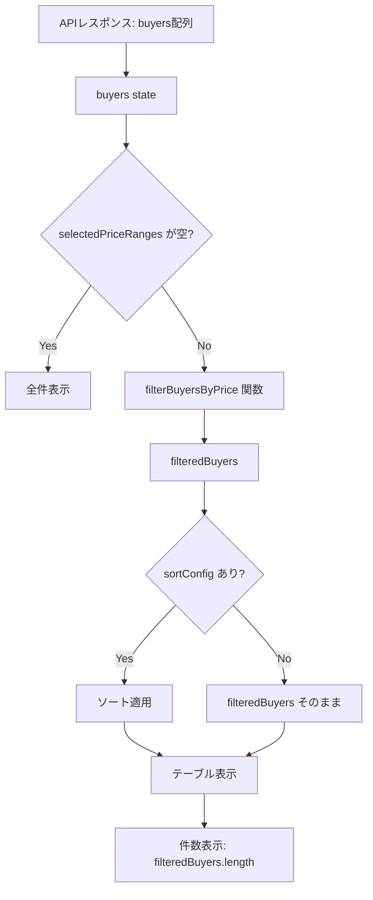

# 設計ドキュメント: 近隣買主リスト 価格帯フィルター機能

## 概要

`NearbyBuyersList` コンポーネントのヘッダー部分に価格帯フィルターボタン行を追加する。
フロントエンドのみの変更であり、バックエンドへの変更は不要。

既存の `buyers` 配列（APIから取得済み）をクライアントサイドでフィルタリングする。
価格帯は `inquiry_price`（万円単位の数値）を基準に9段階に分類する。

---

## アーキテクチャ

### 変更対象

- **ファイル**: `frontend/frontend/src/components/NearbyBuyersList.tsx`
- **変更種別**: 既存コンポーネントへの機能追加（state追加 + UI追加 + フィルタリングロジック追加）
- **バックエンド変更**: なし

### データフロー



### 状態管理

新たに追加する state は1つのみ：

```typescript
const [selectedPriceRanges, setSelectedPriceRanges] = useState<Set<string>>(new Set());
```

`Set<string>` で選択済み価格帯キーを管理する。キーは後述の `PRICE_RANGES` 定数で定義する。

---

## コンポーネントとインターフェース

### 価格帯定義（定数）

```typescript
const PRICE_RANGES = [
  { key: 'under1000',  label: '1000万未満',   min: null,  max: 1000  },
  { key: '1000s',      label: '1000万円台',   min: 1000,  max: 2000  },
  { key: '2000s',      label: '2000万円台',   min: 2000,  max: 3000  },
  { key: '3000s',      label: '3000万円台',   min: 3000,  max: 4000  },
  { key: '4000s',      label: '4000万円台',   min: 4000,  max: 5000  },
  { key: '5000s',      label: '5000万円台',   min: 5000,  max: 6000  },
  { key: '6000s',      label: '6000万円台',   min: 6000,  max: 7000  },
  { key: '7000s',      label: '7000万円台',   min: 7000,  max: 8000  },
  { key: '8000plus',   label: '8000万円台以上', min: 8000,  max: null  },
] as const;
```

`min: null` は下限なし（0以上）、`max: null` は上限なし（無限大）を意味する。

### フィルタリング関数

```typescript
// 買主が指定した価格帯に該当するか判定
const isInPriceRange = (
  price: number | null | undefined,
  min: number | null,
  max: number | null
): boolean => {
  if (price == null) return false;
  if (min !== null && price < min) return false;
  if (max !== null && price >= max) return false;
  return true;
};

// 選択済み価格帯でフィルタリング
const filteredBuyers = React.useMemo(() => {
  if (selectedPriceRanges.size === 0) return buyers;
  return buyers.filter(buyer =>
    PRICE_RANGES.some(range =>
      selectedPriceRanges.has(range.key) &&
      isInPriceRange(buyer.inquiry_price, range.min, range.max)
    )
  );
}, [buyers, selectedPriceRanges]);
```

### ソートとの統合

既存の `sortedBuyers` は `buyers` を参照しているため、`filteredBuyers` を参照するよう変更する：

```typescript
// 変更前
const sortedBuyers = React.useMemo(() => {
  if (!sortConfig.key) return buyers;
  return [...buyers].sort(...);
}, [buyers, sortConfig]);

// 変更後
const sortedBuyers = React.useMemo(() => {
  if (!sortConfig.key) return filteredBuyers;
  return [...filteredBuyers].sort(...);
}, [filteredBuyers, sortConfig]);
```

### 価格帯トグルハンドラー

```typescript
const handlePriceRangeToggle = (key: string) => {
  setSelectedPriceRanges(prev => {
    const next = new Set(prev);
    if (next.has(key)) {
      next.delete(key);
    } else {
      next.add(key);
    }
    return next;
  });
};
```

### UIコンポーネント（価格帯フィルターボタン行）

アクションボタン行の直下に追加する：

```tsx
{/* 価格帯フィルターボタン行 */}
<Box sx={{ mb: 2, display: 'flex', gap: 0.5, flexWrap: 'wrap' }}>
  {PRICE_RANGES.map(range => (
    <Button
      key={range.key}
      size="small"
      variant={selectedPriceRanges.has(range.key) ? 'contained' : 'outlined'}
      color="primary"
      onClick={() => handlePriceRangeToggle(range.key)}
    >
      {range.label}
    </Button>
  ))}
</Box>
```

---

## データモデル

### 既存の NearbyBuyer インターフェース（変更なし）

```typescript
interface NearbyBuyer {
  buyer_number: string;
  name: string;
  distribution_areas: string[];
  latest_status: string;
  viewing_date: string;
  reception_date?: string;
  inquiry_hearing?: string;
  viewing_result_follow_up?: string;
  email?: string;
  phone_number?: string;
  property_address?: string | null;
  inquiry_property_type?: string | null;
  inquiry_price?: number | null;  // 万円単位
}
```

`inquiry_price` は万円単位の数値（例: 3500 = 3500万円）。`null` または `undefined` の場合はフィルター選択中に非表示となる。

### 価格帯の境界値

| ボタンラベル | min | max | 条件 |
|------------|-----|-----|------|
| 1000万未満 | null | 1000 | price < 1000 |
| 1000万円台 | 1000 | 2000 | 1000 ≤ price < 2000 |
| 2000万円台 | 2000 | 3000 | 2000 ≤ price < 3000 |
| 3000万円台 | 3000 | 4000 | 3000 ≤ price < 4000 |
| 4000万円台 | 4000 | 5000 | 4000 ≤ price < 5000 |
| 5000万円台 | 5000 | 6000 | 5000 ≤ price < 6000 |
| 6000万円台 | 6000 | 7000 | 6000 ≤ price < 7000 |
| 7000万円台 | 7000 | 8000 | 7000 ≤ price < 8000 |
| 8000万円台以上 | 8000 | null | 8000 ≤ price |

---

## 正確性プロパティ

*プロパティとは、システムの全ての有効な実行において成立すべき特性や振る舞いのことです。プロパティは人間が読める仕様と機械で検証可能な正確性保証の橋渡しをします。*

### Property 1: フィルター未選択時は全件表示

*For any* 買主リスト（任意の件数・任意の inquiry_price 値）に対して、selectedPriceRanges が空のとき、filteredBuyers は buyers と同じ要素を全て含む

**Validates: Requirements 2.4**

### Property 2: フィルタリングの完全性（包含と排除）

*For any* 買主リストと任意の非空の selectedPriceRanges に対して、filteredBuyers に含まれる全ての買主は selectedPriceRanges のいずれかの価格帯に該当し、かつ filteredBuyers に含まれない買主は selectedPriceRanges のいずれの価格帯にも該当しない（inquiry_price が null の買主を含む）

**Validates: Requirements 3.1, 3.2, 3.3**

### Property 3: 価格帯トグルのラウンドトリップ

*For any* selectedPriceRanges の状態と任意の価格帯キーに対して、handlePriceRangeToggle を2回連続で呼び出すと、selectedPriceRanges は元の状態に戻る

**Validates: Requirements 2.1, 2.2**

### Property 4: フィルターとソートの独立性

*For any* 買主リスト、selectedPriceRanges、sortConfig に対して、filteredBuyers にソートを適用した結果は、ソートを先に適用してからフィルタリングした結果と同じ要素集合を持つ（順序はソート設定に従う）

**Validates: Requirements 3.4**

### Property 5: 件数表示の正確性

*For any* フィルター設定に対して、「N件の買主が見つかりました」に表示される N は filteredBuyers.length と常に等しい

**Validates: Requirements 3.5**

---

## エラーハンドリング

この機能はクライアントサイドのフィルタリングのみであり、APIエラーは既存の処理に委ねる。

- `inquiry_price` が `null` / `undefined` の場合: フィルター選択中は非表示（`isInPriceRange` が `false` を返す）
- `inquiry_price` が `0` の場合: 「1000万未満」に該当する（`0 < 1000`）
- 負の値: 「1000万未満」に該当する（実データでは発生しない想定だが安全に処理される）

---

## テスト戦略

### ユニットテスト（例ベース）

`isInPriceRange` 関数と `filteredBuyers` の計算ロジックを対象とする：

- 各価格帯の境界値（例: 999, 1000, 1999, 2000）で正しく分類されること
- `inquiry_price` が `null` のとき `false` を返すこと
- `min: null`（下限なし）と `max: null`（上限なし）が正しく動作すること

### プロパティベーステスト

プロパティベーステストライブラリとして **fast-check**（TypeScript向け）を使用する。
各プロパティテストは最低100回のイテレーションで実行する。

**Property 1: フィルター未選択時は全件表示**
```typescript
// Feature: call-mode-nearby-buyer-price-filter, Property 1: フィルター未選択時は全件表示
fc.assert(fc.property(
  fc.array(arbitraryNearbyBuyer()),
  (buyers) => {
    const filtered = filterBuyersByPrice(buyers, new Set());
    return filtered.length === buyers.length;
  }
), { numRuns: 100 });
```

**Property 2: フィルタリングの完全性**
```typescript
// Feature: call-mode-nearby-buyer-price-filter, Property 2: フィルタリングの完全性
fc.assert(fc.property(
  fc.array(arbitraryNearbyBuyer()),
  fc.set(fc.constantFrom(...PRICE_RANGES.map(r => r.key)), { minLength: 1 }),
  (buyers, selectedKeys) => {
    const selectedSet = new Set(selectedKeys);
    const filtered = filterBuyersByPrice(buyers, selectedSet);
    // 含まれる全員が該当価格帯に属する
    const allIncludedMatch = filtered.every(b =>
      PRICE_RANGES.some(r => selectedSet.has(r.key) && isInPriceRange(b.inquiry_price, r.min, r.max))
    );
    // 除外された全員が該当価格帯に属さない
    const excluded = buyers.filter(b => !filtered.includes(b));
    const allExcludedDontMatch = excluded.every(b =>
      !PRICE_RANGES.some(r => selectedSet.has(r.key) && isInPriceRange(b.inquiry_price, r.min, r.max))
    );
    return allIncludedMatch && allExcludedDontMatch;
  }
), { numRuns: 100 });
```

**Property 3: トグルのラウンドトリップ**
```typescript
// Feature: call-mode-nearby-buyer-price-filter, Property 3: 価格帯トグルのラウンドトリップ
fc.assert(fc.property(
  fc.set(fc.constantFrom(...PRICE_RANGES.map(r => r.key))),
  fc.constantFrom(...PRICE_RANGES.map(r => r.key)),
  (initialKeys, toggleKey) => {
    const initial = new Set(initialKeys);
    const after1 = togglePriceRange(initial, toggleKey);
    const after2 = togglePriceRange(after1, toggleKey);
    return setsEqual(initial, after2);
  }
), { numRuns: 100 });
```

### 統合テスト（手動確認）

- 実際の CallModePage で価格帯ボタンをクリックし、テーブルが正しく絞り込まれること
- ソートと組み合わせて正しく動作すること
- 件数表示が正しく更新されること
