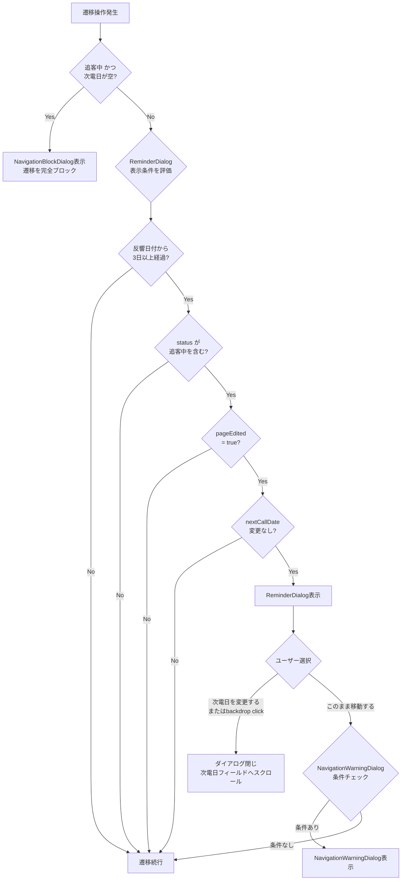

# 設計書：次電日変更確認ポップアップ

## 概要

通話モードページ（`/sellers/:id/call`）において、ユーザーが別ページへ遷移しようとした際に「次電日は変更しましたか？」という確認ポップアップを表示する機能を追加する。

対象条件：
1. 反響日付から3日以上経過している（JST基準）
2. 状況（当社）が「追客中」を含む
3. ページで何らかの編集操作が行われた（`pageEdited` フラグが `true`）
4. 次電日が変更されていない（`editedNextCallDate === savedNextCallDate`）

既存の `NavigationBlockDialog`（追客中かつ次電日が空の場合に遷移を完全ブロック）とは独立した、注意喚起のみを目的とした確認ダイアログとして実装する。

---

## アーキテクチャ

### 変更対象ファイル

| ファイル | 変更内容 |
|---------|---------|
| `frontend/frontend/src/pages/CallModePage.tsx` | `pageEdited` state追加、`savedNextCallDate` 追跡、遷移判定ロジック追加、`nextCallDateRef` 活用 |
| `frontend/frontend/src/components/NextCallDateReminderDialog.tsx` | 新規作成：確認ポップアップコンポーネント |

バックエンドへの変更は不要。

### 遷移判定フロー



---

## コンポーネントとインターフェース

### NextCallDateReminderDialog（新規）

```typescript
interface NextCallDateReminderDialogProps {
  open: boolean;
  onGoToNextCallDate: () => void;  // 「次電日を変更する」またはbackdrop click
  onProceed: () => void;           // 「このまま移動する」
}
```

既存の `NavigationBlockDialog` のスタイルに倣い、MUI `Dialog` を使用する。`onClose`（backdrop click）は `onGoToNextCallDate` と同じ動作にする。

### CallModePage への追加 state

```typescript
// 編集フラグ
const [pageEdited, setPageEdited] = useState<boolean>(false);

// 次電日変更確認ダイアログ用の状態
const [nextCallDateReminderDialog, setNextCallDateReminderDialog] = useState<{
  open: boolean;
  onProceed: (() => void) | null;
}>({ open: false, onProceed: null });
```

`savedNextCallDate` は既に存在するため追加不要。

---

## データモデル

### 編集フラグ（pageEdited）

| 操作 | フラグの変化 |
|-----|------------|
| ページ初期化 | `false` に初期化 |
| 別の売主IDに切り替わり（`id` 変更） | `false` にリセット |
| コメント欄の変更 | `true` に設定 |
| 不通ステータスの変更 | `true` に設定 |
| メール送信実行 | `true` に設定 |
| SMS送信実行 | `true` に設定 |
| ステータス変更 | `true` に設定 |
| 確度変更 | `true` に設定 |
| 物件情報保存 | `true` に設定 |
| 売主情報保存 | `true` に設定 |
| 訪問予約保存 | `true` に設定 |
| 追客ログ（通話メモ）保存 | `true` に設定 |

### 経過日数計算（isInquiryDateElapsed3Days）

```typescript
/**
 * 反響日付から3日以上経過しているか判定する（JST基準）
 * 翌日を1日目として数える
 * @param inquiryDate 反響日付
 * @returns 3日以上経過していれば true、未設定または3日未満なら false
 */
export function isInquiryDateElapsed3Days(inquiryDate: string | Date | null | undefined): boolean {
  if (!inquiryDate) return false;
  
  // JST基準で今日の日付を取得
  const nowJST = new Date(new Date().toLocaleString('en-US', { timeZone: 'Asia/Tokyo' }));
  const todayJST = new Date(nowJST.getFullYear(), nowJST.getMonth(), nowJST.getDate());
  
  // 反響日付をJST基準で取得
  const inquiry = new Date(inquiryDate);
  const inquiryJST = new Date(inquiry.toLocaleString('en-US', { timeZone: 'Asia/Tokyo' }));
  const inquiryDateJST = new Date(inquiryJST.getFullYear(), inquiryJST.getMonth(), inquiryJST.getDate());
  
  // 翌日を1日目として経過日数を計算
  const diffMs = todayJST.getTime() - inquiryDateJST.getTime();
  const diffDays = Math.floor(diffMs / (1000 * 60 * 60 * 24));
  
  return diffDays >= 3;
}
```

---

## 正確性プロパティ

*プロパティとは、システムの全ての有効な実行において成立すべき特性や振る舞いのことです。プロパティは人間が読める仕様と機械で検証可能な正確性保証の橋渡しをします。*

### プロパティ1：経過日数判定の境界値

*任意の* 反響日付に対して、`isInquiryDateElapsed3Days` 関数は、翌日を1日目として3日以上経過している場合のみ `true` を返す。すなわち、経過日数が2日以下の場合は `false`、3日以上の場合は `true` を返す。

**Validates: Requirements 5.2**

### プロパティ2：4条件の複合判定

*任意の* 4条件（経過日数、ステータス、編集フラグ、次電日変更有無）の組み合わせに対して、`shouldShowReminderDialog` 関数は、全条件が `true` の場合のみ `true` を返し、1つでも `false` の条件があれば `false` を返す。

**Validates: Requirements 2.1, 2.2, 2.3**

### プロパティ3：NavigationBlockDialog の優先

*任意の* 状態において、追客中かつ次電日が空の条件が満たされる場合、`navigateWithWarningCheck` は `NavigationBlockDialog` を表示し、`NextCallDateReminderDialog` を表示しない。

**Validates: Requirements 2.4**

### プロパティ4：遷移先コールバックの保持

*任意の* 遷移先コールバック関数に対して、`NextCallDateReminderDialog` が表示された後も、「このまま移動する」ボタンをクリックすると元のコールバックが正確に実行される。

**Validates: Requirements 4.1, 4.2**

---

## エラーハンドリング

| ケース | 対応 |
|-------|------|
| 反響日付が `null` / `undefined` | `isInquiryDateElapsed3Days` が `false` を返す → ダイアログ非表示 |
| 反響日付が不正な日付文字列 | `isNaN` チェックで `false` を返す → ダイアログ非表示 |
| `nextCallDateRef.current` が `null` | スクロール/フォーカス処理をスキップ（既存の `handleGoToNextCallDate` と同様） |
| 遷移先コールバックが `null` | 「このまま移動する」クリック時に何もしない（ダイアログのみ閉じる） |

---

## テスト戦略

### 単体テスト（example-based）

**`isInquiryDateElapsed3Days` 関数**
- 反響日付が `null` → `false`
- 反響日付が今日 → `false`（0日経過）
- 反響日付が昨日 → `false`（1日経過）
- 反響日付が2日前 → `false`（2日経過）
- 反響日付が3日前 → `true`（3日経過、境界値）
- 反響日付が4日前 → `true`（4日経過）

**`NextCallDateReminderDialog` コンポーネント**
- `open=true` 時に「次電日は変更しましたか？」テキストが表示される
- 「次電日を変更する」ボタンが表示される
- 「このまま移動する」ボタンが表示される
- 「次電日を変更する」クリック → `onGoToNextCallDate` が呼ばれる
- 「このまま移動する」クリック → `onProceed` が呼ばれる
- backdrop click → `onGoToNextCallDate` が呼ばれる

**`navigateWithWarningCheck` の拡張ロジック**
- NavigationBlockDialog条件（追客中かつ次電日空）が優先される
- ReminderDialog条件が全て揃った場合にダイアログが表示される
- ReminderDialogの「このまま移動する」後にNavigationWarningDialogの判定が続く

### プロパティテスト（property-based）

使用ライブラリ：**fast-check**（TypeScript/React プロジェクトの標準的な PBT ライブラリ）

各プロパティテストは最低100回のイテレーションで実行する。

**プロパティ1のテスト実装方針**
```typescript
// Feature: call-mode-next-call-date-reminder, Property 1: 経過日数判定の境界値
fc.assert(fc.property(
  fc.integer({ min: 0, max: 365 }),  // 経過日数
  (daysAgo) => {
    const inquiryDate = new Date();
    inquiryDate.setDate(inquiryDate.getDate() - daysAgo);
    const result = isInquiryDateElapsed3Days(inquiryDate);
    return daysAgo >= 3 ? result === true : result === false;
  }
), { numRuns: 100 });
```

**プロパティ2のテスト実装方針**
```typescript
// Feature: call-mode-next-call-date-reminder, Property 2: 4条件の複合判定
fc.assert(fc.property(
  fc.boolean(),  // isElapsed
  fc.boolean(),  // isFollowingUp
  fc.boolean(),  // pageEdited
  fc.boolean(),  // nextCallDateUnchanged
  (isElapsed, isFollowingUp, pageEdited, nextCallDateUnchanged) => {
    const result = shouldShowReminderDialog(isElapsed, isFollowingUp, pageEdited, nextCallDateUnchanged);
    const expected = isElapsed && isFollowingUp && pageEdited && nextCallDateUnchanged;
    return result === expected;
  }
), { numRuns: 100 });
```

### 統合テスト

- 各遷移トリガー（戻るボタン、サイドバー別売主クリック、ブラウザ戻るボタン）でダイアログが表示されることを確認
- ダイアログ表示後に「このまま移動する」を選択した場合、正しい遷移先へ移動することを確認
