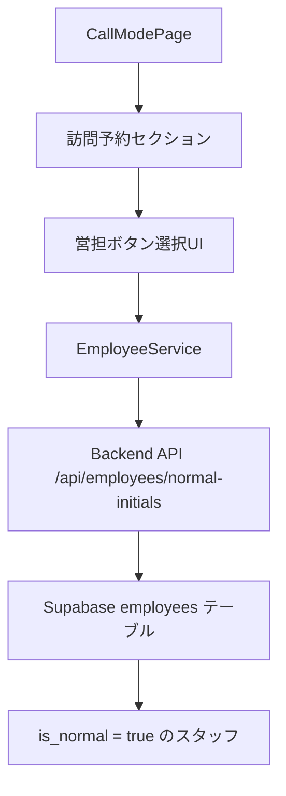

# 設計書: 通話モードページ訪問査定セクション「営担」フィールドのボタン選択式変更

## 概要

通話モードページ（`/sellers/:id/call`）の訪問査定セクションにある「営担」フィールドを、テキスト入力からボタン選択式に変更します。選択肢はスタッフ管理シート（`employees`テーブル）の`is_normal = true`のスタッフのイニシャルから取得します。

## アーキテクチャ



## コンポーネントと インターフェース

### 1. フロントエンド: CallModePage.tsx

**目的**: 訪問予約セクションの営担フィールドをボタン選択式に変更

**変更箇所**:
```typescript
// 現在のテキスト入力
<TextField
  label="営担"
  value={editedAssignedTo}
  onChange={(e) => setEditedAssignedTo(e.target.value)}
/>

// ↓ ボタン選択式に変更

<Box>
  <Typography variant="subtitle2">営担</Typography>
  <Box sx={{ display: 'flex', flexWrap: 'wrap', gap: 1, mt: 1 }}>
    {normalInitials.map((initial) => (
      <Button
        key={initial}
        variant={editedAssignedTo === initial ? 'contained' : 'outlined'}
        onClick={() => setEditedAssignedTo(initial)}
        size="small"
      >
        {initial}
      </Button>
    ))}
    <Button
      variant={editedAssignedTo === '' ? 'contained' : 'outlined'}
      onClick={() => setEditedAssignedTo('')}
      size="small"
      color="secondary"
    >
      クリア
    </Button>
  </Box>
</Box>
```

**状態管理**:
```typescript
const [normalInitials, setNormalInitials] = useState<string[]>([]);
```

**データ取得**:
```typescript
useEffect(() => {
  const fetchNormalInitials = async () => {
    try {
      const response = await api.get<{ initials: string[] }>('/api/employees/normal-initials');
      setNormalInitials(response.data.initials);
    } catch (error) {
      console.error('通常スタッフのイニシャル取得エラー:', error);
    }
  };
  fetchNormalInitials();
}, []);
```

---

### 2. バックエンド: /api/employees/normal-initials

**目的**: `is_normal = true`のスタッフのイニシャル一覧を返す

**エンドポイント**: `GET /api/employees/normal-initials`

**実装場所**: `backend/src/routes/employees.ts`

**既存実装の確認**:
```typescript
// 既に実装済み（backend/src/routes/employees.ts:219）
router.get('/normal-initials', async (req: Request, res: Response) => {
  // 実装内容を確認する必要あり
});
```

**期待されるレスポンス**:
```typescript
{
  "initials": ["Y", "I", "K", "M", "T"]
}
```

**SQLクエリ**:
```sql
SELECT initials
FROM employees
WHERE is_normal = true
  AND is_active = true
  AND initials IS NOT NULL
ORDER BY name;
```

---

### 3. データモデル

#### employeesテーブル

| カラム名 | 型 | 説明 |
|---------|-----|------|
| `id` | UUID | 主キー |
| `name` | VARCHAR | スタッフ名 |
| `initials` | VARCHAR | イニシャル（例: Y, I, K） |
| `is_normal` | BOOLEAN | 通常スタッフフラグ（TRUE = 通常スタッフ） |
| `is_active` | BOOLEAN | アクティブフラグ |

#### sellersテーブル（visit_assignee）

| カラム名 | 型 | 説明 |
|---------|-----|------|
| `visit_assignee` | VARCHAR | 営担イニシャル（例: Y, I, K） |

---

## 主要アルゴリズム

### アルゴリズム1: 通常スタッフイニシャル取得

```typescript
ALGORITHM fetchNormalInitials
INPUT: なし
OUTPUT: initials: string[]

BEGIN
  // Step 1: APIリクエスト
  response ← GET /api/employees/normal-initials
  
  // Step 2: レスポンス検証
  IF response.status !== 200 THEN
    THROW Error("通常スタッフ取得失敗")
  END IF
  
  // Step 3: イニシャル配列を返す
  RETURN response.data.initials
END
```

**事前条件**:
- APIエンドポイント `/api/employees/normal-initials` が実装されている
- `employees` テーブルに `is_normal = true` のスタッフが存在する

**事後条件**:
- イニシャル配列が返される（例: `["Y", "I", "K"]`）
- 配列は空でない（最低1つのイニシャルが含まれる）

---

### アルゴリズム2: 営担選択

```typescript
ALGORITHM selectVisitAssignee
INPUT: initial: string
OUTPUT: なし（状態更新）

BEGIN
  // Step 1: 選択されたイニシャルを状態に設定
  setEditedAssignedTo(initial)
  
  // Step 2: UIを更新（選択されたボタンをハイライト）
  // React の再レンダリングで自動的に反映される
END
```

**事前条件**:
- `initial` は `normalInitials` 配列に含まれる値である

**事後条件**:
- `editedAssignedTo` 状態が更新される
- 選択されたボタンが `contained` スタイルで表示される

---

### アルゴリズム3: 営担クリア

```typescript
ALGORITHM clearVisitAssignee
INPUT: なし
OUTPUT: なし（状態更新）

BEGIN
  // Step 1: 営担を空文字列に設定
  setEditedAssignedTo('')
  
  // Step 2: UIを更新（クリアボタンをハイライト）
  // React の再レンダリングで自動的に反映される
END
```

**事前条件**:
- なし

**事後条件**:
- `editedAssignedTo` 状態が空文字列になる
- クリアボタンが `contained` スタイルで表示される

---

## 使用例

### 例1: 通常スタッフイニシャルの取得

```typescript
// コンポーネントマウント時
useEffect(() => {
  const fetchNormalInitials = async () => {
    try {
      const response = await api.get<{ initials: string[] }>('/api/employees/normal-initials');
      setNormalInitials(response.data.initials);
      console.log('通常スタッフイニシャル:', response.data.initials);
      // 出力例: ['Y', 'I', 'K', 'M', 'T']
    } catch (error) {
      console.error('通常スタッフのイニシャル取得エラー:', error);
    }
  };
  fetchNormalInitials();
}, []);
```

---

### 例2: 営担の選択

```typescript
// ユーザーが「Y」ボタンをクリック
<Button
  variant={editedAssignedTo === 'Y' ? 'contained' : 'outlined'}
  onClick={() => setEditedAssignedTo('Y')}
  size="small"
>
  Y
</Button>

// 結果: editedAssignedTo = 'Y'
```

---

### 例3: 営担のクリア

```typescript
// ユーザーが「クリア」ボタンをクリック
<Button
  variant={editedAssignedTo === '' ? 'contained' : 'outlined'}
  onClick={() => setEditedAssignedTo('')}
  size="small"
  color="secondary"
>
  クリア
</Button>

// 結果: editedAssignedTo = ''
```

---

## 正確性プロパティ

*プロパティとは、システムの全ての有効な実行において真であるべき特性または動作です。プロパティは、人間が読める仕様と機械で検証可能な正確性保証の橋渡しとなります。*

### プロパティ1: 通常スタッフイニシャル取得の正確性

*任意の* APIレスポンスにおいて、返されるイニシャルは全て `is_normal = true` かつ `is_active = true` のスタッフのものであり、スタッフ名順にソートされている

**検証対象要件**: 要件1.4, 1.5

---

### プロパティ2: ボタン表示とスタイルの一貫性

*任意の* 状態において、選択されているイニシャルのボタンは `contained` スタイルで表示され、選択されていないボタンは全て `outlined` スタイルで表示される

**検証対象要件**: 要件2.3, 2.5, 3.2, 3.3

---

### プロパティ3: 選択状態の一意性

*任意の* 時点において、選択されている営担は1つのみである（または空文字列）

**検証対象要件**: 要件3.1, 4.1

---

### プロパティ4: イニシャル選択時の状態更新

*任意の* イニシャルボタンをクリックした場合、そのイニシャルが営担として設定され、選択されたボタンが `contained` スタイルになり、他の全てのボタンが `outlined` スタイルになる

**検証対象要件**: 要件3.1, 3.2, 3.3, 3.4

---

### プロパティ5: キャッシュの有効性

*任意の* キャッシュが有効な場合（5分以内）、APIリクエストは送信されず、キャッシュからイニシャルが取得される

**検証対象要件**: 要件7.2

---

### プロパティ6: 保存時のデータ整合性

*任意の* 営担が空文字列でない場合、それは通常スタッフのイニシャルである

**検証対象要件**: 要件5.2, 6.1, 6.2

---

### プロパティ7: エラー時の状態管理

*任意の* APIリクエストが失敗した場合、エラーがコンソールに出力され、状態は空配列に設定される

**検証対象要件**: 要件1.3, 8.2, 8.3

---

### プロパティ8: キーボードナビゲーション

*任意の* ボタンにフォーカスがある場合、Tabキーでフォーカスを移動でき、Enterキーまたはスペースキーでそのボタンを選択できる

**検証対象要件**: 要件9.1, 9.2

---

## エラーハンドリング

### エラーシナリオ1: API取得失敗

**条件**: `/api/employees/normal-initials` のリクエストが失敗

**対応**:
```typescript
try {
  const response = await api.get<{ initials: string[] }>('/api/employees/normal-initials');
  setNormalInitials(response.data.initials);
} catch (error) {
  console.error('通常スタッフのイニシャル取得エラー:', error);
  // フォールバック: 空配列を設定（ボタンが表示されない）
  setNormalInitials([]);
}
```

**リカバリ**: ユーザーに手動入力を許可する（既存のテキスト入力に戻す）

---

### エラーシナリオ2: 通常スタッフが存在しない

**条件**: `is_normal = true` のスタッフが0人

**対応**:
```typescript
if (normalInitials.length === 0) {
  // 警告メッセージを表示
  return (
    <Alert severity="warning">
      通常スタッフが登録されていません。管理者に連絡してください。
    </Alert>
  );
}
```

**リカバリ**: 管理者がスタッフ管理シートで `is_normal = true` を設定

---

## テスト戦略

### 単体テスト

**テストケース1**: 通常スタッフイニシャル取得
```typescript
test('通常スタッフのイニシャルを取得できる', async () => {
  const response = await api.get('/api/employees/normal-initials');
  expect(response.status).toBe(200);
  expect(response.data.initials).toBeInstanceOf(Array);
  expect(response.data.initials.length).toBeGreaterThan(0);
});
```

**テストケース2**: 営担選択
```typescript
test('営担を選択できる', () => {
  const { result } = renderHook(() => useState(''));
  const [, setEditedAssignedTo] = result.current;
  
  act(() => {
    setEditedAssignedTo('Y');
  });
  
  expect(result.current[0]).toBe('Y');
});
```

**テストケース3**: 営担クリア
```typescript
test('営担をクリアできる', () => {
  const { result } = renderHook(() => useState('Y'));
  const [, setEditedAssignedTo] = result.current;
  
  act(() => {
    setEditedAssignedTo('');
  });
  
  expect(result.current[0]).toBe('');
});
```

---

### プロパティベーステスト

**プロパティテスト1**: 選択されたイニシャルは常に通常スタッフのイニシャルである
```typescript
test('選択されたイニシャルは常に通常スタッフのイニシャルである', () => {
  fc.assert(
    fc.property(
      fc.constantFrom('Y', 'I', 'K', 'M', 'T'),
      (initial) => {
        const normalInitials = ['Y', 'I', 'K', 'M', 'T'];
        expect(normalInitials).toContain(initial);
      }
    )
  );
});
```

---

### 統合テスト

**テストケース1**: エンドツーエンドフロー
```typescript
test('営担選択のエンドツーエンドフロー', async () => {
  // 1. ページをレンダリング
  render(<CallModePage />);
  
  // 2. 通常スタッフイニシャルが表示されるまで待機
  await waitFor(() => {
    expect(screen.getByText('Y')).toBeInTheDocument();
  });
  
  // 3. 「Y」ボタンをクリック
  fireEvent.click(screen.getByText('Y'));
  
  // 4. 選択状態を確認
  expect(screen.getByText('Y')).toHaveClass('MuiButton-contained');
  
  // 5. 保存ボタンをクリック
  fireEvent.click(screen.getByText('保存'));
  
  // 6. APIリクエストを確認
  await waitFor(() => {
    expect(mockApi.put).toHaveBeenCalledWith(
      expect.stringContaining('/api/sellers/'),
      expect.objectContaining({ visitAssignee: 'Y' })
    );
  });
});
```

---

## パフォーマンス考慮事項

### 1. イニシャル取得のキャッシュ

**問題**: 毎回APIリクエストを送信するとパフォーマンスが低下

**解決策**: `employeeService.ts` のキャッシュ機構を利用
```typescript
// employeeService.ts は既に5分間のキャッシュを実装している
export const getActiveEmployees = async (): Promise<Employee[]> => {
  // キャッシュチェック（5分間有効）
  const cached = localStorage.getItem(CACHE_KEY);
  if (cached) {
    const { data, timestamp } = JSON.parse(cached);
    if (Date.now() - timestamp < CACHE_DURATION) {
      return data;
    }
  }
  // APIから取得してキャッシュ
  const response = await api.get('/api/employees/active');
  localStorage.setItem(CACHE_KEY, JSON.stringify({ data, timestamp: Date.now() }));
  return data;
};
```

**新しいエンドポイント用のキャッシュ**:
```typescript
// 同様のキャッシュ機構を実装
const NORMAL_INITIALS_CACHE_KEY = 'normal_initials_cache';
const CACHE_DURATION = 5 * 60 * 1000; // 5分

export const getNormalInitials = async (): Promise<string[]> => {
  const cached = localStorage.getItem(NORMAL_INITIALS_CACHE_KEY);
  if (cached) {
    const { data, timestamp } = JSON.parse(cached);
    if (Date.now() - timestamp < CACHE_DURATION) {
      return data;
    }
  }
  const response = await api.get<{ initials: string[] }>('/api/employees/normal-initials');
  const initials = response.data.initials;
  localStorage.setItem(NORMAL_INITIALS_CACHE_KEY, JSON.stringify({ data: initials, timestamp: Date.now() }));
  return initials;
};
```

---

### 2. ボタンレンダリングの最適化

**問題**: 多数のボタンをレンダリングするとパフォーマンスが低下

**解決策**: `React.memo` を使用してボタンコンポーネントをメモ化
```typescript
const AssigneeButton = React.memo(({ 
  initial, 
  selected, 
  onClick 
}: { 
  initial: string; 
  selected: boolean; 
  onClick: () => void;
}) => (
  <Button
    variant={selected ? 'contained' : 'outlined'}
    onClick={onClick}
    size="small"
  >
    {initial}
  </Button>
));
```

---

## セキュリティ考慮事項

### 1. 認証・認可

**要件**: ログインユーザーのみが営担を変更できる

**実装**: 既存の認証ミドルウェアを使用
```typescript
// backend/src/routes/employees.ts
router.get('/normal-initials', authenticateToken, async (req, res) => {
  // 認証済みユーザーのみアクセス可能
});
```

---

### 2. 入力検証

**要件**: 選択されたイニシャルが通常スタッフのイニシャルであることを検証

**実装**:
```typescript
// フロントエンド検証
const handleSave = async () => {
  if (editedAssignedTo !== '' && !normalInitials.includes(editedAssignedTo)) {
    alert('無効な営担が選択されています');
    return;
  }
  // 保存処理
};

// バックエンド検証
router.put('/sellers/:id', async (req, res) => {
  const { visitAssignee } = req.body;
  if (visitAssignee) {
    const { data: employee } = await supabase
      .from('employees')
      .select('initials')
      .eq('initials', visitAssignee)
      .eq('is_normal', true)
      .eq('is_active', true)
      .single();
    
    if (!employee) {
      return res.status(400).json({ error: '無効な営担です' });
    }
  }
  // 更新処理
});
```

---

## 依存関係

### フロントエンド

- `@mui/material` - ボタンコンポーネント
- `react` - 状態管理
- `axios` - APIリクエスト

### バックエンド

- `express` - ルーティング
- `@supabase/supabase-js` - データベースアクセス

### データベース

- `employees` テーブル（`is_normal`, `is_active`, `initials` カラム）
- `sellers` テーブル（`visit_assignee` カラム）

---

## 実装チェックリスト

- [ ] バックエンド: `/api/employees/normal-initials` エンドポイントの実装確認
- [ ] フロントエンド: `CallModePage.tsx` の営担フィールドをボタン選択式に変更
- [ ] フロントエンド: 通常スタッフイニシャル取得ロジックの実装
- [ ] フロントエンド: キャッシュ機構の実装
- [ ] テスト: 単体テスト作成
- [ ] テスト: 統合テスト作成
- [ ] ドキュメント: ユーザーマニュアル更新

---

**最終更新日**: 2026年4月1日  
**作成者**: KIRO AI Assistant
