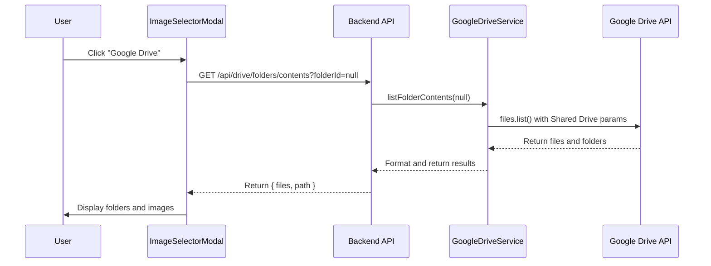

# Design Document

## Overview

This feature fixes the critical issue where the ImageSelectorModal fails to load images from Google Drive folders, resulting in "画像が見つかりません" (Images not found) errors. The root cause is that the `listFolderContents` API call is not properly configured to access Shared Drive contents.

## Root Cause Analysis

### Current Behavior
1. User clicks "Google Drive" button in ImageSelectorModal
2. Frontend calls `GET /api/drive/folders/contents?folderId=null`
3. Backend calls `drive.files.list()` with parent folder ID
4. API returns 0 files even though seller folders exist
5. User sees empty folder

### Identified Issues

**Issue 1: Missing Shared Drive Parameters**
The `drive.files.list()` call in `GoogleDriveService.listFolderContents()` is missing required parameters for Shared Drive access:
- `supportsAllDrives: true` - Required for Shared Drive operations
- `includeItemsFromAllDrives: true` - Required to include Shared Drive items
- `corpora: 'drive'` - Specifies to search within a specific drive
- `driveId` - The Shared Drive ID

**Issue 2: Incorrect Query Construction**
The current query `'${targetFolderId}' in parents` may not work correctly for Shared Drive root folders.

**Issue 3: Service Account Permissions**
The service account may not have proper permissions to list Shared Drive contents.

## Architecture

### System Flow



## Components and Interfaces

### 1. GoogleDriveService.listFolderContents()

**Current Implementation Issues:**
```typescript
// ❌ Missing Shared Drive parameters
const response = await drive.files.list({
  q: `'${targetFolderId}' in parents and trashed = false`,
  fields: 'files(id, name, mimeType, size, modifiedTime, webViewLink, thumbnailLink)',
  orderBy: 'folder,name',
  pageSize: 100,
});
```

**Fixed Implementation:**
```typescript
// ✅ With Shared Drive support
const response = await drive.files.list({
  q: `'${targetFolderId}' in parents and trashed = false`,
  fields: 'files(id, name, mimeType, size, modifiedTime, webViewLink, thumbnailLink)',
  orderBy: 'folder,name',
  pageSize: 100,
  supportsAllDrives: true,
  includeItemsFromAllDrives: true,
  corpora: 'drive',
  driveId: this.parentFolderId, // The Shared Drive ID
});
```

### 2. Error Handling Enhancement

**Add Detailed Logging:**
```typescript
try {
  console.log('📂 Listing folder contents:', {
    folderId,
    targetFolderId,
    parentFolderId: this.parentFolderId,
    isSharedDrive: true,
  });
  
  const response = await drive.files.list({
    // ... parameters
  });
  
  console.log('✅ API Response:', {
    filesCount: response.data.files?.length || 0,
    files: response.data.files?.map(f => ({ id: f.id, name: f.name, type: f.mimeType })),
  });
  
} catch (error: any) {
  console.error('❌ Drive API Error:', {
    message: error.message,
    code: error.code,
    errors: error.errors,
    details: error.response?.data,
  });
  throw error;
}
```

### 3. Validation and Fallback

**Add Folder ID Validation:**
```typescript
// Validate folder ID format
if (folderId && !this.isValidFolderId(folderId)) {
  throw new Error('Invalid folder ID format');
}

// Check if folder exists and is accessible
const folderExists = await this.checkFolderAccess(targetFolderId);
if (!folderExists) {
  throw new Error('Folder not found or not accessible');
}
```

## Data Models

No changes to existing data models required.

## Correctness Properties

*A property is a characteristic or behavior that should hold true across all valid executions of a system-essentially, a formal statement about what the system should do. Properties serve as the bridge between human-readable specifications and machine-verifiable correctness guarantees.*

### Property 1: Shared Drive Access
*For all* folder listing operations on Shared Drives, the API call SHALL include `supportsAllDrives: true` and `includeItemsFromAllDrives: true`
**Validates: Requirements 1.2, 4.2**

### Property 2: Non-Empty Result for Valid Folders
*For all* valid folder IDs that contain files, the `listFolderContents` method SHALL return at least one file or folder
**Validates: Requirements 1.3**

### Property 3: Error Message Clarity
*For all* API errors, the system SHALL log detailed error information including folder ID, error type, and error message
**Validates: Requirements 2.1, 2.5**

### Property 4: Folder ID Validation
*For all* folder ID inputs, the system SHALL validate the format before making API calls
**Validates: Requirements 3.1, 3.2, 3.3**

## Error Handling

### 1. Shared Drive Access Errors

**Error Cases:**
- Service account not added to Shared Drive
- Insufficient permissions (needs "Content Manager" or "Manager" role)
- Shared Drive ID incorrect

**Response:**
```typescript
{
  error: {
    code: 'SHARED_DRIVE_ACCESS_DENIED',
    message: 'サービスアカウントが共有ドライブにアクセスできません',
    details: 'サービスアカウントを共有ドライブに追加し、適切な権限を付与してください',
    driveId: '0AJd1KlohTQaTUk9PVA'
  }
}
```

### 2. Folder Not Found

**Error Cases:**
- Folder ID doesn't exist
- Folder was deleted
- Folder is in trash

**Response:**
```typescript
{
  error: {
    code: 'FOLDER_NOT_FOUND',
    message: 'フォルダが見つかりません',
    folderId: 'abc123'
  }
}
```

### 3. Permission Errors

**Error Cases:**
- Service account lacks read permissions
- Folder is private

**Response:**
```typescript
{
  error: {
    code: 'PERMISSION_DENIED',
    message: 'フォルダへのアクセス権限がありません',
    folderId: 'abc123'
  }
}
```

## Testing Strategy

### Unit Tests

**GoogleDriveService.listFolderContents:**
- Test with null folder ID (root folder)
- Test with valid folder ID
- Test with invalid folder ID
- Test with non-existent folder ID
- Test Shared Drive parameter inclusion
- Test error handling

### Integration Tests

**API Endpoint:**
- Test `GET /api/drive/folders/contents` with no folderId
- Test with valid folderId
- Test with invalid folderId
- Test authentication
- Test error responses

### Manual Testing

**Browser Testing:**
1. Open ImageSelectorModal
2. Click "Google Drive" tab
3. Verify folders and files are displayed
4. Click on a folder
5. Verify folder contents are displayed
6. Navigate back using breadcrumbs
7. Select images and confirm

## Security Considerations

### 1. Service Account Security

- Service account credentials stored securely in environment variables
- Credentials never exposed to frontend
- Minimum required permissions (read-only for listing)

### 2. Folder ID Validation

- Validate folder ID format before API calls
- Prevent injection attacks
- Sanitize error messages

### 3. Access Control

- Verify user authentication before Drive API calls
- Log all Drive API access attempts
- Rate limiting on API endpoints

## Performance Optimization

### 1. Caching Strategy

- Cache folder contents for 5 minutes
- Invalidate cache on folder changes
- Use Redis for distributed caching

### 2. Pagination

- Implement pagination for large folders (>100 items)
- Load thumbnails lazily
- Use virtual scrolling for large lists

### 3. Parallel Requests

- Fetch folder contents and path in parallel
- Batch thumbnail requests
- Use connection pooling

## Implementation Priority

### Phase 1: Critical Fix (Immediate)
1. Add Shared Drive parameters to `listFolderContents()`
2. Test with actual Shared Drive
3. Verify folders are displayed
4. Deploy to production

### Phase 2: Error Handling (High Priority)
1. Add detailed error logging
2. Implement folder ID validation
3. Add user-friendly error messages
4. Test error scenarios

### Phase 3: Optimization (Medium Priority)
1. Implement caching
2. Add pagination
3. Optimize thumbnail loading
4. Performance testing

## Deployment Plan

### Pre-Deployment Checklist
- [ ] Verify service account has Shared Drive access
- [ ] Test with actual Shared Drive data
- [ ] Verify error handling works
- [ ] Test in staging environment
- [ ] Review logs for any issues

### Deployment Steps
1. Deploy backend changes
2. Verify API endpoint works
3. Deploy frontend changes (if any)
4. Monitor logs for errors
5. Test in production

### Rollback Plan
- Keep previous version ready
- Monitor error rates
- Rollback if error rate > 5%
- Investigate and fix issues

## Success Criteria

1. ✅ Users can see folders and files in Google Drive tab
2. ✅ Users can navigate folder hierarchy
3. ✅ Users can select images from any folder
4. ✅ Error messages are clear and actionable
5. ✅ No 404 errors on folder contents endpoint
6. ✅ Performance is acceptable (<2s for folder listing)
