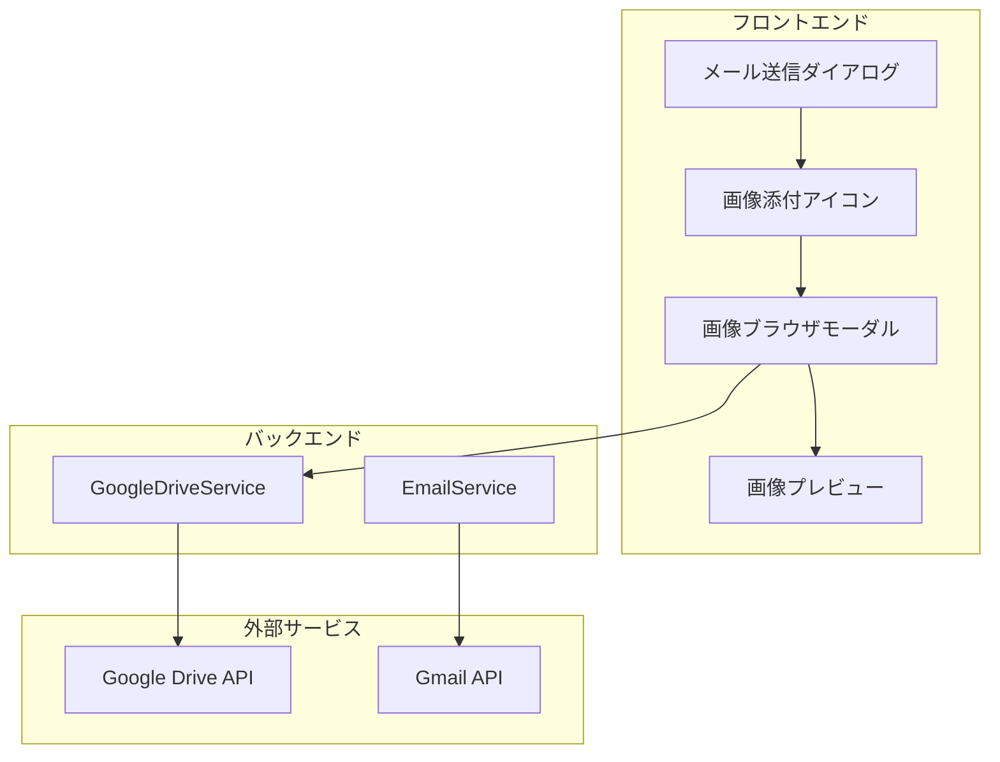

# 設計文書

## 概要

本機能は、売主リストのEmail送信機能を拡張し、ユーザーがGoogle Drive上の任意の画像を手動で選択してメールに添付できる機能を提供します。

主要機能：
- メール送信ダイアログに画像添付アイコンを常に表示
- 複数ソース対応の画像選択モーダル（Google Drive、ローカルファイル、URL）
- Google Drive: フォルダ階層の移動機能
- ローカルファイル: ファイル選択とドラッグ&ドロップ
- URL: 画像URL入力とプレビュー
- 複数画像の選択機能（枚数制限なし）
- 画像プレビュー機能
- 選択した画像のHTML埋め込み
- 活動ログへの記録

## アーキテクチャ

### システム構成



### 技術スタック

- フロントエンド: React 18, TypeScript, Material-UI
- バックエンド: Node.js 20, Express 4, TypeScript
- API統合: Google Drive API v3, Gmail API
- 既存サービス: GoogleDriveService (拡張), EmailService (拡張)

## コンポーネントとインターフェース

### 1. フロントエンド - 画像選択モーダル (ImageSelectorModal)

```typescript
interface ImageSelectorModalProps {
  open: boolean
  onConfirm: (selectedImages: ImageFile[]) => void
  onCancel: () => void
}

// 統一された画像ファイル型
interface ImageFile {
  id: string
  name: string
  source: 'drive' | 'local' | 'url'
  size: number
  mimeType: string
  thumbnailUrl?: string
  previewUrl: string
  // ソース固有の情報
  driveFileId?: string      // Google Drive用
  localFile?: File          // ローカルファイル用
  url?: string              // URL用
}

interface ImageSelectorState {
  activeTab: 'drive' | 'local' | 'url'
  selectedImages: ImageFile[]
  loading: boolean
  error: string | null
  previewImage: ImageFile | null
  
  // Google Drive用
  currentFolderId: string | null
  folderPath: FolderPathItem[]
  driveFiles: DriveFile[]
  
  // ローカルファイル用
  localFiles: File[]
  
  // URL用
  urlInput: string
  urlImages: ImageFile[]
}

interface DriveFile {
  id: string
  name: string
  mimeType: string
  size: number
  modifiedTime: string
  thumbnailLink?: string
  webViewLink: string
  isFolder: boolean
}

interface FolderPathItem {
  id: string
  name: string
}
```

**主要機能:**
- タブ切り替え（Google Drive / ローカルファイル / URL）
- Google Drive: フォルダ移動、サムネイル表示
- ローカルファイル: ファイル選択、ドラッグ&ドロップ
- URL: URL入力、プレビュー表示
- 画像ファイルの選択（複数選択可能）
- 画像プレビュー（ダブルクリック）
- 選択確定とキャンセル

### 2. バックエンド - Google Drive API拡張

```typescript
interface GoogleDriveService {
  // 既存メソッド
  getOrCreateSellerFolder(...)
  listImagesWithThumbnails(...)
  getImageData(...)
  
  // 新規メソッド
  listFolderContents(folderId: string | null): Promise<DriveFile[]>
  getFolderPath(folderId: string): Promise<FolderPathItem[]>
  getFileMetadata(fileId: string): Promise<DriveFile>
}
```

**新規実装:**
- `listFolderContents`: 指定フォルダ内のファイルとサブフォルダを取得
- `getFolderPath`: フォルダIDからルートまでのパスを取得
- `getFileMetadata`: ファイルの詳細情報を取得

### 3. バックエンド - Email Service拡張

```typescript
interface EmailWithImagesParams {
  sellerId: string
  to: string
  subject: string
  body: string
  from: string
  images: ImageAttachment[]
}

interface ImageAttachment {
  source: 'drive' | 'local' | 'url'
  name: string
  mimeType: string
  size: number
  // ソース別のデータ
  driveFileId?: string      // Google Drive用
  base64Data?: string       // ローカルファイル用（フロントエンドでエンコード済み）
  url?: string              // URL用
}

interface EmailService {
  // 既存メソッド
  sendValuationEmail(...)
  sendFollowUpEmail(...)
  sendTemplateEmail(...)
  
  // 拡張メソッド
  sendEmailWithImages(params: EmailWithImagesParams): Promise<EmailResult>
  
  // 画像取得ヘルパー
  fetchImageFromDrive(fileId: string): Promise<Buffer>
  fetchImageFromUrl(url: string): Promise<Buffer>
  decodeBase64Image(base64: string): Buffer
}
```

**実装詳細:**
- Google Drive: ファイルIDから画像データを取得
- ローカルファイル: フロントエンドからBase64データを受け取る
- URL: URLから画像をダウンロード
- すべての画像をBase64エンコード
- HTMLメールとして画像をインライン埋め込み
- 画像サイズチェック（5MB/枚、合計10MB）
- 活動ログに記録

## データモデル

### ImageFile (統一画像ファイル情報)

```typescript
interface ImageFile {
  id: string                // 一意のID
  name: string              // ファイル名
  source: 'drive' | 'local' | 'url'  // 画像ソース
  size: number              // ファイルサイズ（バイト）
  mimeType: string          // MIMEタイプ
  thumbnailUrl?: string     // サムネイルURL
  previewUrl: string        // プレビューURL
  driveFileId?: string      // Google Drive file ID
  localFile?: File          // ローカルファイルオブジェクト
  url?: string              // 画像URL
}
```

### DriveFile (Google Drive ファイル情報)

```typescript
interface DriveFile {
  id: string                // Google Drive file ID
  name: string              // ファイル名
  mimeType: string          // MIMEタイプ
  size: number              // ファイルサイズ（バイト）
  modifiedTime: string      // 最終更新日時
  thumbnailLink?: string    // サムネイルURL
  webViewLink: string       // プレビューURL
  isFolder: boolean         // フォルダかどうか
}
```

### FolderPathItem (フォルダパス情報)

```typescript
interface FolderPathItem {
  id: string    // フォルダID
  name: string  // フォルダ名
}
```

### ImageAttachment (メール添付用)

```typescript
interface ImageAttachment {
  source: 'drive' | 'local' | 'url'
  name: string
  mimeType: string
  size: number
  driveFileId?: string
  base64Data?: string
  url?: string
}
```

### EmailAttachmentLog (活動ログ用)

```typescript
interface EmailAttachmentLog {
  hasAttachments: boolean
  imageCount: number
  imageFileNames: string[]
  imageSources: ('drive' | 'local' | 'url')[]
  totalSizeBytes: number
}
```

## 正確性プロパティ

*プロパティは、システムのすべての有効な実行において真であるべき特性または動作です。プロパティは、人間が読める仕様と機械で検証可能な正確性保証の橋渡しとなります。*

### プロパティ1: 画像添付アイコンの表示

*すべての*メール送信ダイアログにおいて、画像添付アイコンが表示されなければならない
**検証: 要件 1.1**

### プロパティ2: ソース切り替えの一貫性

*すべての*ソースタブ切り替え操作において、対応するUIが正しく表示されなければならない
**検証: 要件 2.1, 2.2, 2.3**

### プロパティ3: フォルダ移動の一貫性

*すべての*Google Driveフォルダ移動操作において、パンくずリストが現在のフォルダパスを正確に反映しなければならない
**検証: 要件 2.1.2, 2.1.3**

### プロパティ4: 画像選択の可逆性

*すべての*画像選択操作において、選択済みの画像を再度クリックすると選択が解除されなければならない
**検証: 要件 3.3**

### プロパティ5: ファイルサイズ制限

*すべての*画像選択において、個別ファイルサイズが5MB以下、合計サイズが10MB以下でなければならない
**検証: 要件 6.1, 6.4**

### プロパティ6: 画像埋め込みの順序保持

*すべての*画像埋め込み操作において、選択した順序で画像がメール本文に配置されなければならない
**検証: 要件 5.4**

### プロパティ7: キャンセル操作の安全性

*すべての*キャンセル操作において、選択状態がリセットされ、モーダルが閉じられなければならない
**検証: 要件 8.2, 8.3, 8.4**

### プロパティ8: 活動ログの完全性

*すべての*画像付きメール送信において、添付画像の情報（ソース含む）が活動ログに記録されなければならない
**検証: 要件 9.1, 9.2, 9.3**

### プロパティ9: URL画像の検証

*すべての*URL入力において、有効な画像URLのみが受け入れられなければならない
**検証: 要件 2.3.2, 2.3.4**

## エラーハンドリング

### 1. Google Drive API エラー

**エラーケース:**
- 認証エラー
- フォルダアクセス権限エラー
- ネットワークエラー
- レート制限エラー

**対応:**
- ユーザーにわかりやすいエラーメッセージを表示
- リトライ可能なエラーの場合は再試行ボタンを表示
- エラー詳細をコンソールログに記録

### 2. 画像サイズエラー

**エラーケース:**
- 個別ファイルが5MBを超える
- 合計サイズが10MBを超える

**対応:**
- 警告ダイアログを表示
- 選択をキャンセルするか、他の画像を選択するよう促す
- 現在の合計サイズを表示

### 3. メール送信エラー

**エラーケース:**
- Gmail API エラー
- 画像データ取得エラー
- Base64エンコードエラー

**対応:**
- エラーメッセージを表示
- 「画像なしで送信」オプションを提供
- エラー詳細を活動ログに記録

## テスト戦略

### ユニットテスト

**GoogleDriveService:**
- `listFolderContents`: フォルダ内容の取得
- `getFolderPath`: フォルダパスの取得
- `getFileMetadata`: ファイルメタデータの取得

**EmailService:**
- `sendEmailWithImages`: 画像付きメール送信
- 画像データ取得とBase64エンコード
- HTMLメール生成

### 統合テスト

**画像選択フロー:**
1. 画像添付アイコンをクリック
2. モーダルが開く
3. フォルダを移動
4. 画像を選択
5. 選択を確定
6. メール送信

**エラーハンドリング:**
1. サイズ超過エラー
2. API エラー
3. キャンセル操作

### E2Eテスト

**完全なメール送信フロー:**
1. ログイン
2. 売主を選択
3. メール送信ダイアログを開く
4. 画像添付アイコンをクリック
5. Google Driveから画像を選択
6. メールを送信
7. 活動ログを確認

## セキュリティ考慮事項

### 1. 認証と認可

- Google Drive APIアクセスにはサービスアカウントを使用
- ユーザーは認証済みセッションが必要
- フォルダアクセス権限を確認

### 2. データ検証

- ファイルサイズの検証
- MIMEタイプの検証（画像ファイルのみ）
- ファイルIDの検証

### 3. エラー情報の保護

- エラーメッセージに機密情報を含めない
- 詳細なエラーはサーバーログのみに記録

## パフォーマンス最適化

### 1. サムネイル表示

- Google DriveのサムネイルURLを使用
- 遅延読み込み（Lazy Loading）
- キャッシュ戦略

### 2. 画像データ取得

- 必要な画像のみを取得
- 並列ダウンロード
- プログレスインジケーター表示

### 3. メール送信

- 画像のBase64エンコードを非同期処理
- タイムアウト設定
- リトライロジック

## 実装の優先順位

### Phase 1: 基本機能（MVP）
1. 画像添付アイコンの追加
2. 画像選択モーダルの基本実装
3. タブ切り替え機能（Google Drive / ローカル / URL）
4. Google Drive: フォルダ移動機能
5. ローカルファイル: ファイル選択機能
6. URL: URL入力機能
7. 画像選択機能（複数選択）
8. 画像付きメール送信

### Phase 2: UX改善
1. 画像プレビュー機能
2. サムネイル表示
3. ドラッグ&ドロップ機能
4. ローディング状態の改善
5. エラーハンドリングの強化

### Phase 3: 最適化
1. パフォーマンス最適化
2. キャッシュ戦略
3. 活動ログの詳細化
4. URL画像のキャッシング
