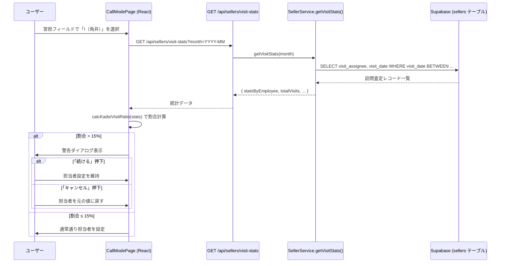
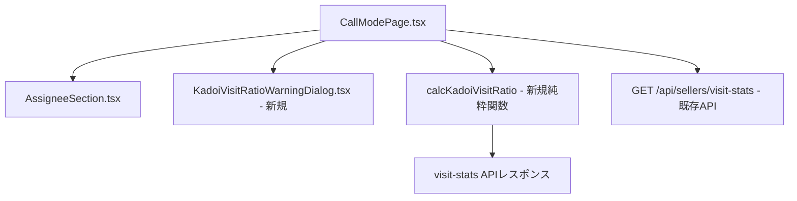

# 設計書：角井訪問査定割合警告機能

## Overview

通話モードページ（`/sellers/:id/call`）において、訪問査定の営業担当フィールドで「I（角井）」が選択された際に、当月の訪問査定割合が15%を超えている場合に警告ダイアログを表示する機能。

### 目的
- 特定担当者（角井）への訪問査定集中を防ぐための注意喚起
- 警告はあくまで確認を促すものであり、担当者の保存をブロックしない（フェイルオープン設計）

### 対象メンバーと除外ルール
- **計算対象**: I（角井）、林（林田）、U（裏）、Y（麻生）、K
- **除外**: 山本マネージャー（イニシャル「Y」）
- **識別方法**: `visit_assignee` カラムのイニシャル値で判定。山本マネージャーは従業員テーブルの `name` フィールドに「山本」を含む従業員として識別する

### 割合計算式
```
I件数 ÷ (I + 林 + U + Y（麻生） + K の合計件数) × 100
```

---

## Architecture



### コンポーネント間の依存関係



---

## Components and Interfaces

### 1. 新規コンポーネント: `KadoiVisitRatioWarningDialog`

**ファイル**: `frontend/frontend/src/components/KadoiVisitRatioWarningDialog.tsx`

```typescript
interface KadoiVisitRatioWarningDialogProps {
  open: boolean;
  ratio: number;          // 現在の割合（%）
  onContinue: () => void; // 「続ける」押下時
  onCancel: () => void;   // 「キャンセル」押下時
}
```

**表示メッセージ**: `今月の角井の訪問査定割合が15%を超えています（現在XX.X%）。このまま登録しますか？`

### 2. 新規純粋関数: `calcKadoiVisitRatio`

**ファイル**: `frontend/frontend/src/utils/visitRatioCalculator.ts`

```typescript
/** 訪問統計APIのレスポンス型（statsByEmployee の各要素） */
interface VisitStatEntry {
  initials: string;
  name: string;
  count: number;
  employeeId: string;
}

/** 訪問統計APIのレスポンス型 */
interface VisitStatsResponse {
  month: string;
  totalVisits: number;
  statsByEmployee: VisitStatEntry[];
  yamamotoStats: { count: number; rate: number; name: string; initials: string } | null;
}

/**
 * 角井（I）の訪問査定割合を計算する純粋関数
 * 山本マネージャー（Y）の件数を分母から除外する
 *
 * @param stats - visit-stats APIのレスポンス
 * @param yamomotoInitials - 山本マネージャーのイニシャル（デフォルト: 'Y'）
 * @returns 割合（0〜100）。対象メンバーの合計が0件の場合は0を返す
 */
export function calcKadoiVisitRatio(
  stats: VisitStatsResponse,
  yamamotoInitials: string = 'Y'
): number;
```

**計算ロジック**:
1. `statsByEmployee` から山本マネージャー（`yamamotoStats` が示すイニシャル）の件数を除外
2. 残りの合計件数（分母）を計算
3. 分母が0の場合は0を返す
4. `I` のイニシャルを持つエントリの件数 ÷ 分母 × 100 を返す

### 3. `CallModePage.tsx` への変更

**追加する状態**:
```typescript
// 角井割合警告ダイアログ用の状態
const [kadoiWarningOpen, setKadoiWarningOpen] = useState(false);
const [kadoiCurrentRatio, setKadoiCurrentRatio] = useState(0);
const [pendingVisitAssignee, setPendingVisitAssignee] = useState<string | null>(null);
const [previousVisitAssignee, setPreviousVisitAssignee] = useState<string>('');
```

**追加するハンドラ**:
```typescript
// 営担フィールド変更時のハンドラ（既存の変更ハンドラを拡張）
const handleVisitAssigneeChange = async (newValue: string) => {
  if (newValue === 'I') {
    // visit-stats APIを呼び出して割合を確認
    const ratio = await fetchKadoiRatio();
    if (ratio > 15) {
      setPreviousVisitAssignee(editedAssignedTo);
      setPendingVisitAssignee(newValue);
      setKadoiCurrentRatio(ratio);
      setKadoiWarningOpen(true);
      return; // ダイアログ表示中は担当者を変更しない
    }
  }
  setEditedAssignedTo(newValue);
};
```

---

## Data Models

### visit-stats API レスポンス（既存）

`GET /api/sellers/visit-stats?month=YYYY-MM` は以下を返す：

```typescript
{
  month: string;                    // "2025-12"
  totalVisits: number;              // 全担当者の合計訪問数
  statsByEmployee: Array<{
    count: number;                  // 訪問件数
    name: string;                   // 従業員名
    initials: string;               // イニシャル（"I", "Y", "U" など）
    employeeId: string;             // 従業員ID
  }>;
  yamamotoStats: {                  // 山本マネージャーの統計（null の場合あり）
    count: number;
    rate: number;
    name: string;
    initials: string;
  } | null;
}
```

### 山本マネージャーの識別

既存の `getVisitStats` 実装では、`yamamotoStats` として山本マネージャーの統計が返される。識別条件：
- `name.includes('山本')` または `initials === 'Y'`

フロントエンドの `calcKadoiVisitRatio` では、`yamamotoStats` が存在する場合にそのイニシャルを分母から除外する。

### 割合計算の詳細

```
対象メンバー合計 = totalVisits - (yamamotoStats?.count ?? 0)
I件数 = statsByEmployee.find(e => e.initials === 'I')?.count ?? 0
割合 = 対象メンバー合計 > 0 ? (I件数 / 対象メンバー合計) * 100 : 0
```

---

## Correctness Properties

*A property is a characteristic or behavior that should hold true across all valid executions of a system—essentially, a formal statement about what the system should do. Properties serve as the bridge between human-readable specifications and machine-verifiable correctness guarantees.*

### Property 1: 割合の値域不変条件（ゼロ除算安全性を包含）

*For any* 訪問統計データ（I件数 ≥ 0、全体件数 ≥ I件数、山本件数 ≥ 0）において、`calcKadoiVisitRatio` の計算結果は常に 0 以上 100 以下の値を返す。対象メンバーの合計が0件の場合も含む（ゼロ除算が発生しない）。

**Validates: Requirements 1.3, 1.5**

### Property 2: 山本除外後の割合増加不変条件

*For any* 訪問統計データにおいて、山本マネージャーの件数（1件以上）を分母から除外した場合の割合は、除外しない場合の割合以上の値になる。

**Validates: Requirements 1.2**

### Property 3: ダイアログメッセージへの割合値の埋め込み

*For any* 割合値（0〜100の数値）を `KadoiVisitRatioWarningDialog` に渡した場合、レンダリングされたメッセージ文字列にその割合値（小数点以下1桁）が含まれる。

**Validates: Requirements 2.4**

---

## Error Handling

### APIエラー時のフェイルオープン

`visit-stats` APIの呼び出しが失敗した場合（ネットワークエラー、タイムアウト等）：
- 警告ダイアログを表示しない
- 通常通り担当者を設定する
- コンソールにエラーをログ出力する

```typescript
try {
  const stats = await api.get(`/sellers/visit-stats?month=${currentMonth}`);
  const ratio = calcKadoiVisitRatio(stats.data);
  if (ratio > 15) {
    // 警告ダイアログ表示
  }
} catch (error) {
  console.error('[KadoiWarning] visit-stats API error:', error);
  // フェイルオープン: 通常通り担当者を設定
  setEditedAssignedTo(newValue);
}
```

### ローディング状態

API呼び出し中は視覚的フィードバックを表示する：
- 営担フィールドの変更ハンドラ内でローディング状態を管理
- `CircularProgress` または `Backdrop` を使用

---

## Testing Strategy

### ユニットテスト（例ベース）

`calcKadoiVisitRatio` 関数に対して以下のケースをテスト：
- I件数=2、全体=10、山本=0 → 20%
- I件数=1、全体=10、山本=2 → 12.5%（山本除外後の分母=8）
- I件数=0、全体=0 → 0%（ゼロ除算なし）
- I件数=0、全体=5 → 0%

### プロパティベーステスト

**ライブラリ**: `fast-check`（既存プロジェクトで使用中）

**最小100イテレーション**で以下のプロパティを検証：

#### Property 1: 割合の値域不変条件（ゼロ除算安全性を包含）
```typescript
// Feature: kadoi-visit-ratio-warning, Property 1: 割合は常に0以上100以下（ゼロ除算含む）
fc.assert(fc.property(
  fc.nat(100),  // I件数 (0〜100)
  fc.nat(100),  // 山本件数 (0〜100)
  fc.nat(100),  // その他件数 (0〜100)
  (kadoiCount, yamamotoCount, otherCount) => {
    const stats = buildMockStats(kadoiCount, yamamotoCount, otherCount);
    const ratio = calcKadoiVisitRatio(stats);
    return ratio >= 0 && ratio <= 100;
  }
), { numRuns: 100 });
```

#### Property 2: 山本除外後の割合増加不変条件
```typescript
// Feature: kadoi-visit-ratio-warning, Property 2: 山本除外で割合が増加または同値
fc.assert(fc.property(
  fc.nat(50),                              // I件数
  fc.integer({ min: 1, max: 50 }),         // 山本件数（1以上）
  fc.nat(50),                              // その他件数
  (kadoiCount, yamamotoCount, otherCount) => {
    const statsWithYamamoto = buildMockStats(kadoiCount, yamamotoCount, otherCount);
    const statsWithoutYamamoto = buildMockStats(kadoiCount, 0, otherCount);
    const ratioWith = calcKadoiVisitRatio(statsWithYamamoto);
    const ratioWithout = calcKadoiVisitRatio(statsWithoutYamamoto);
    // 山本を除外すると分母が小さくなるため、割合は増加または同値
    return ratioWith <= ratioWithout;
  }
), { numRuns: 100 });
```

#### Property 3: ダイアログメッセージへの割合値の埋め込み
```typescript
// Feature: kadoi-visit-ratio-warning, Property 3: ダイアログに割合値が含まれる
fc.assert(fc.property(
  fc.float({ min: 0, max: 100, noNaN: true }),  // 任意の割合値
  (ratio) => {
    const { getByText } = render(
      <KadoiVisitRatioWarningDialog open ratio={ratio} onContinue={() => {}} onCancel={() => {}} />
    );
    const expectedText = ratio.toFixed(1) + '%';
    return !!document.body.textContent?.includes(expectedText);
  }
), { numRuns: 100 });
```

### 統合テスト（例ベース）

- `KadoiVisitRatioWarningDialog` の「続ける」「キャンセル」ボタン動作
- `CallModePage` での営担変更フロー（モックAPI使用）
  - 「I」選択 → API呼び出し → 割合15%超 → ダイアログ表示
  - 「I」選択 → API呼び出し → 割合15%以下 → ダイアログ非表示
  - 「I」選択 → APIエラー → フェイルオープン（ダイアログ非表示）
  - 「I」以外を選択 → API呼び出しなし
