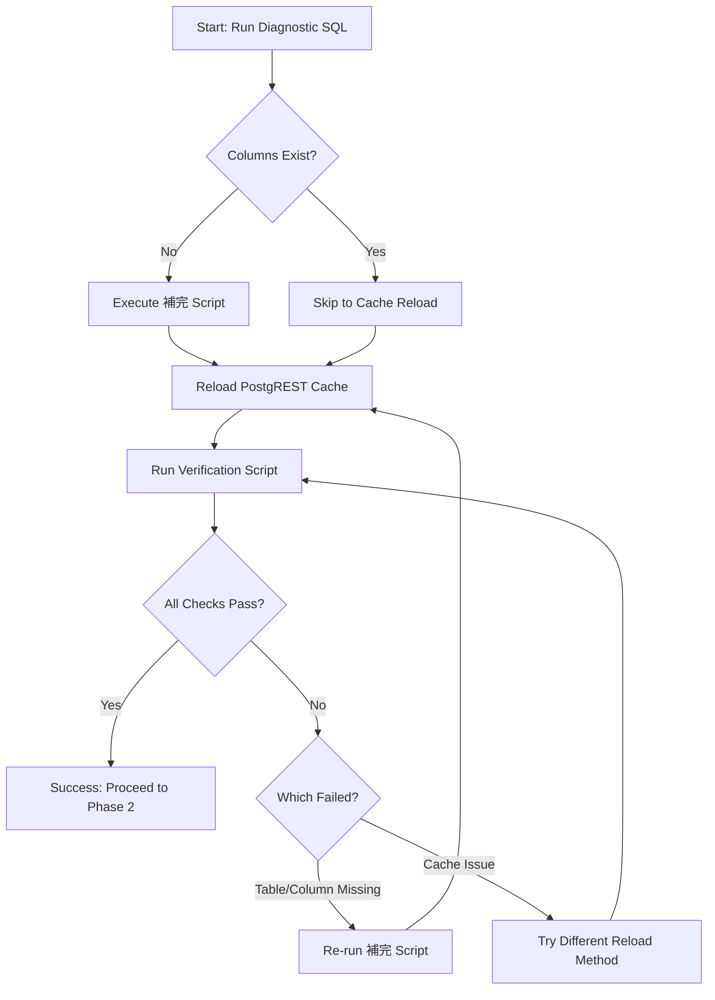

# Migration 081 Completion - Design

## Architecture Overview

This design document outlines the diagnostic and resolution approach for completing Migration 081, which creates the database schema for Phase 2 (Properties & Valuations).

## System Components

### 1. Diagnostic SQL Queries
**Purpose**: Verify actual database state  
**Location**: Executed in Supabase SQL Editor  
**Output**: List of columns and their data types

```sql
-- Properties table diagnostic
SELECT column_name, data_type, is_nullable, column_default
FROM information_schema.columns 
WHERE table_schema = 'public' AND table_name = 'properties' 
ORDER BY ordinal_position;

-- Valuations table diagnostic
SELECT column_name, data_type, is_nullable, column_default
FROM information_schema.columns 
WHERE table_schema = 'public' AND table_name = 'valuations' 
ORDER BY ordinal_position;
```

### 2. 補完 (Completion) Script
**Purpose**: Add missing columns idempotently  
**Location**: `backend/migrations/081_補完_add_missing_columns.sql`  
**Execution**: Via Supabase SQL Editor

**Design Principles:**
- Idempotent: Safe to run multiple times
- Defensive: Check before adding each column
- Informative: Provide NOTICE messages for each operation
- Complete: Add all missing columns, indexes, and triggers

**Structure:**
```sql
DO $$
BEGIN
  -- Check and add each column
  IF NOT EXISTS (SELECT 1 FROM information_schema.columns 
                 WHERE table_name='properties' AND column_name='construction_year') THEN
    ALTER TABLE properties ADD COLUMN construction_year INTEGER;
    RAISE NOTICE 'Added construction_year column to properties';
  ELSE
    RAISE NOTICE 'construction_year column already exists in properties';
  END IF;
  
  -- Repeat for all columns...
END $$;
```

### 3. PostgREST Cache Reload
**Purpose**: Make schema changes visible to REST API  
**Methods**:

#### Method 1: Project Pause/Resume (Most Reliable)
1. Navigate to Supabase Dashboard → Project Settings
2. Click "Pause project"
3. Wait for confirmation
4. Click "Resume project"
5. Wait for services to restart

#### Method 2: NOTIFY Command
```sql
NOTIFY pgrst, 'reload schema';
```

#### Method 3: Manual Restart
- Via Supabase Dashboard → Database → Extensions
- Restart PostgREST service

### 4. Verification Script
**Purpose**: Programmatically verify migration completion  
**Location**: `backend/migrations/verify-081-migration.ts`  
**Execution**: `npx ts-node backend/migrations/verify-081-migration.ts`

**Verification Strategy:**
```typescript
// 1. Check table existence via REST API
const { error } = await supabase.from('properties').select('*').limit(0);

// 2. Check column existence via SELECT
for (const column of expectedColumns) {
  const { error } = await supabase.from('properties').select(column).limit(0);
  if (error) missingColumns.push(column);
}

// 3. Report results
if (allPassed) {
  console.log('✅ All verifications passed!');
  process.exit(0);
} else {
  console.log('❌ Some verifications failed!');
  process.exit(1);
}
```

## Data Model

### Properties Table Schema

```typescript
interface Property {
  // Primary Key
  id: string; // UUID
  
  // Foreign Key
  seller_id: string; // UUID, NOT NULL
  
  // Property Type
  property_type: '戸建て' | '土地' | 'マンション';
  
  // Area Information (square meters)
  land_area?: number; // DECIMAL(10,2)
  building_area?: number; // DECIMAL(10,2)
  land_area_verified?: number; // 土地（当社調べ）
  building_area_verified?: number; // 建物（当社調べ）
  
  // Construction Information
  construction_year?: number; // INTEGER
  structure?: '木造' | '軽量鉄骨' | '鉄骨' | '他';
  
  // Address Information
  property_address: string; // TEXT, NOT NULL
  property_address_ieul_apartment?: string; // イエウール・マンション専用
  
  // Current Status
  current_status?: '居住中' | '空き家' | '賃貸中' | '古屋あり' | '更地';
  
  // Fixed Asset Tax Road Price
  fixed_asset_tax_road_price?: number; // DECIMAL(15,2)
  
  // Floor Plan
  floor_plan?: string; // TEXT
  
  // Metadata
  created_at: Date;
  updated_at: Date;
  created_by?: string; // UUID
  updated_by?: string; // UUID
  version: number; // For optimistic locking
}
```

### Valuations Table Schema

```typescript
interface Valuation {
  // Primary Key
  id: string; // UUID
  
  // Foreign Key
  property_id: string; // UUID, NOT NULL
  
  // Valuation Type
  valuation_type: 'automatic' | 'manual' | 'post_visit';
  
  // Valuation Amounts (in Japanese Yen)
  valuation_amount_1: number; // BIGINT, NOT NULL (Minimum)
  valuation_amount_2: number; // BIGINT, NOT NULL (Medium)
  valuation_amount_3: number; // BIGINT, NOT NULL (Maximum)
  
  // Calculation Details
  calculation_method?: string;
  calculation_parameters?: Record<string, any>; // JSONB
  
  // Valuation Report URL
  valuation_report_url?: string; // つながるオンライン査定書URL
  
  // Metadata
  valuation_date: Date;
  created_by?: string; // UUID
  notes?: string;
  created_at: Date;
}
```

## Decision Flow



## Error Handling

### Scenario 1: 補完 Script Fails
**Symptoms**: SQL error during execution  
**Diagnosis**: Check error message for specific column/constraint  
**Resolution**:
1. Note which operation failed
2. Check if column/constraint already exists
3. Manually add missing item if needed
4. Re-run script

### Scenario 2: PostgREST Cache Won't Reload
**Symptoms**: Verification script still reports missing columns  
**Diagnosis**: Cache is stuck  
**Resolution**:
1. Try pause/resume project (most reliable)
2. Wait 5-10 minutes for cache to expire naturally
3. Contact Supabase support if issue persists

### Scenario 3: Verification Script Connection Error
**Symptoms**: "Missing required environment variables"  
**Diagnosis**: .env file not configured  
**Resolution**:
1. Check `backend/.env` exists
2. Verify SUPABASE_URL and SUPABASE_SERVICE_ROLE_KEY are set
3. Restart terminal/IDE to reload environment

## Performance Considerations

### Index Strategy
- **seller_id**: Most common join/filter operation
- **property_type**: Frequent filter in property searches
- **created_at**: For chronological queries
- **construction_year**: For age-based filtering
- **current_status**: For status-based filtering

### Query Optimization
```sql
-- Efficient property lookup by seller
SELECT * FROM properties WHERE seller_id = $1;
-- Uses idx_properties_seller_id

-- Efficient valuation history
SELECT * FROM valuations 
WHERE property_id = $1 
ORDER BY valuation_date DESC;
-- Uses idx_valuations_property_id and idx_valuations_valuation_date
```

## Security Considerations

### Row Level Security (RLS)
To be implemented in future migration:
```sql
-- Enable RLS
ALTER TABLE properties ENABLE ROW LEVEL SECURITY;
ALTER TABLE valuations ENABLE ROW LEVEL SECURITY;

-- Policy: Users can only see properties of sellers they have access to
CREATE POLICY properties_access ON properties
  FOR SELECT
  USING (
    seller_id IN (
      SELECT id FROM sellers 
      WHERE created_by = auth.uid() OR updated_by = auth.uid()
    )
  );
```

### Data Encryption
- Sensitive fields (addresses) should be encrypted at application layer
- Use existing encryption utilities from Phase 1

## Testing Strategy

### Unit Tests
```typescript
describe('Migration 081 Verification', () => {
  it('should verify properties table exists', async () => {
    const result = await verifyTableExists('properties');
    expect(result.passed).toBe(true);
  });
  
  it('should verify all properties columns exist', async () => {
    const result = await verifyColumns('properties', expectedColumns);
    expect(result.passed).toBe(true);
  });
  
  it('should verify valuations table exists', async () => {
    const result = await verifyTableExists('valuations');
    expect(result.passed).toBe(true);
  });
});
```

### Integration Tests
```typescript
describe('Properties and Valuations Integration', () => {
  it('should create property with valuation', async () => {
    const property = await createProperty({
      seller_id: testSellerId,
      property_type: '戸建て',
      property_address: 'Test Address'
    });
    
    const valuation = await createValuation({
      property_id: property.id,
      valuation_type: 'manual',
      valuation_amount_1: 10000000,
      valuation_amount_2: 12000000,
      valuation_amount_3: 15000000
    });
    
    expect(valuation.property_id).toBe(property.id);
  });
});
```

## Rollback Strategy

If migration needs to be rolled back:

```sql
-- Drop tables in correct order (valuations first due to FK)
DROP TABLE IF EXISTS valuations CASCADE;
DROP TABLE IF EXISTS properties CASCADE;

-- Drop function if needed
DROP FUNCTION IF EXISTS update_updated_at_column() CASCADE;
```

**Note**: This will delete all data. Only use in development/testing.

## Monitoring and Observability

### Success Metrics
- ✅ Diagnostic SQL returns expected columns
- ✅ 補完 script completes without errors
- ✅ Verification script reports 100% pass rate
- ✅ REST API queries return data from new tables

### Failure Indicators
- ❌ Verification script reports missing columns
- ❌ REST API returns "relation does not exist" errors
- ❌ Application logs show schema-related errors

## Documentation Requirements

### User-Facing Documentation
1. **Diagnostic Guide** (Japanese)
   - Step-by-step SQL execution
   - How to interpret results
   - Next steps based on results

2. **Execution Guide** (Japanese)
   - How to run 補完 script
   - How to reload PostgREST cache
   - How to run verification script

3. **Troubleshooting Guide** (Japanese)
   - Common errors and solutions
   - When to contact support
   - Rollback procedures

### Developer Documentation
1. **Technical Specification**
   - Table schemas
   - Index definitions
   - Constraint details

2. **API Documentation**
   - TypeScript interfaces
   - Service layer design
   - Endpoint specifications

## Future Enhancements

### Phase 2 Next Steps
1. Implement PropertyService
2. Implement ValuationEngine
3. Implement ValuationService
4. Create API endpoints
5. Build frontend components

### Potential Improvements
- Automated migration verification in CI/CD
- Schema version tracking
- Migration rollback automation
- Performance monitoring for queries

---

**Created**: 2025-01-08  
**Phase**: 2 - Properties & Valuations  
**Step**: 1 - Database Schema Completion
