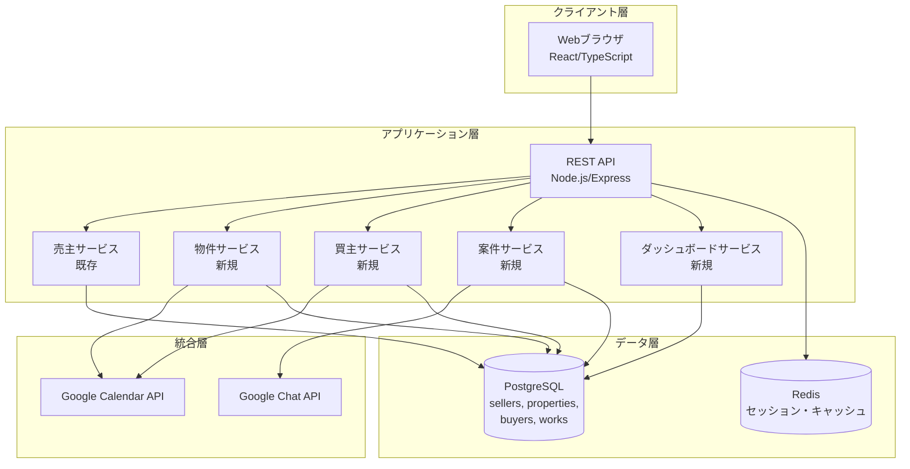
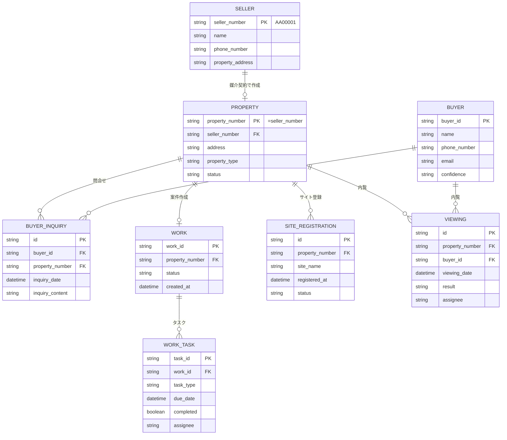

# 設計文書

## 概要

本機能拡張は、既存の売主リスト管理システムを拡張し、物件（property）、買主（buyer）、案件（work）の3つの新しいエンティティを統合管理できるようにするものです。

売主番号をキーとして、売主→物件→買主→案件の業務フローを一貫して管理し、不動産仲介業務の全工程をカバーします。

主要機能：
- **物件管理（property）**: 媒介契約を取得した物件の管理、サイト登録状況の追跡
- **買主管理（buyer）**: 問合せ客の管理、内覧スケジュール管理、Googleカレンダー連携
- **案件管理（work）**: 業務タスク管理、期限管理、進捗追跡
- **エンティティ間リレーション**: 売主番号をキーとした横断検索
- **統合ダッシュボード**: 全体の業務状況の可視化
- **サイドバーナビゲーション**: 各エンティティへの素早いアクセス

## アーキテクチャ

### システム構成



### エンティティ関連図



## コンポーネントとインターフェース

### 1. 物件管理サービス (PropertyService)

```typescript
interface PropertyService {
  // 物件作成（売主から自動コピー）
  createFromSeller(sellerNumber: string): Promise<Property>
  
  // 物件取得
  getProperty(propertyNumber: string): Promise<Property>
  
  // 物件リスト取得
  listProperties(params: ListPropertiesParams): Promise<PaginatedResult<Property>>
  
  // 物件更新
  updateProperty(propertyNumber: string, data: UpdatePropertyRequest): Promise<Property>
  
  // 問合せ記録
  recordInquiry(propertyNumber: string, inquiry: InquiryRequest): Promise<Inquiry>
  
  // サイト登録
  registerToSite(propertyNumber: string, site: SiteRegistrationRequest): Promise<SiteRegistration>
  
  // サイト登録解除
  unregisterFromSite(propertyNumber: string, siteId: string, reason: string): Promise<void>
}

interface ListPropertiesParams {
  page: number
  pageSize: number
  siteStatus?: string // 'registered' | 'not_registered'
  hasViewingScheduled?: boolean
  contractStatus?: string
  assignedTo?: string
}
```

### 2. 買主管理サービス (BuyerService)

```typescript
interface BuyerService {
  // 買主作成
  createBuyer(data: CreateBuyerRequest): Promise<Buyer>
  
  // 買主取得
  getBuyer(buyerId: string): Promise<Buyer>
  
  // 買主リスト取得
  listBuyers(params: ListBuyersParams): Promise<PaginatedResult<Buyer>>
  
  // 買主更新
  updateBuyer(buyerId: string, data: UpdateBuyerRequest): Promise<Buyer>
  
  // 物件問合せ紐付け
  linkToProperty(buyerId: string, propertyNumber: string, content: string): Promise<BuyerInquiry>
  
  // 内覧予約作成
  createViewing(viewing: ViewingRequest): Promise<Viewing>
  
  // 内覧結果記録
  recordViewingResult(viewingId: string, result: ViewingResultRequest): Promise<Viewing>
  
  // 内覧キャンセル
  cancelViewing(viewingId: string): Promise<void>
}

interface ListBuyersParams {
  page: number
  pageSize: number
  confidence?: string
  hasViewingScheduled?: boolean
  assignedTo?: string
  propertyNumber?: string
}
```

### 3. 案件管理サービス (WorkService)

```typescript
interface WorkService {
  // 案件作成（タスク自動生成）
  createWork(propertyNumber: string): Promise<Work>
  
  // 案件取得
  getWork(workId: string): Promise<Work>
  
  // 案件リスト取得
  listWorks(params: ListWorksParams): Promise<PaginatedResult<Work>>
  
  // タスク更新
  updateTask(taskId: string, data: UpdateTaskRequest): Promise<WorkTask>
  
  // タスク担当者変更
  reassignTask(taskId: string, newAssignee: string): Promise<WorkTask>
  
  // 期限切れタスク取得
  getOverdueTasks(): Promise<WorkTask[]>
  
  // 担当者別タスク取得
  getTasksByAssignee(assigneeId: string): Promise<WorkTask[]>
}

interface ListWorksParams {
  page: number
  pageSize: number
  status?: string
  hasOverdueTasks?: boolean
  assignedTo?: string
}

// 自動生成されるタスクタイプ
enum WorkTaskType {
  BROKERAGE_CONTRACT = 'brokerage_contract', // 媒介契約書の作成
  SITE_REGISTRATION = 'site_registration', // サイト登録（athome,SUUMO）
  SALES_CONTRACT = 'sales_contract', // 売買契約書
  IMPORTANT_EXPLANATION = 'important_explanation', // 重説作成
  SETTLEMENT_DOCUMENTS = 'settlement_documents' // 決済書類作成（金種表、領収書等）
}
```

### 4. ダッシュボードサービス (DashboardService)

```typescript
interface DashboardService {
  // ダッシュボード統計取得
  getStatistics(period: DateRange): Promise<DashboardStatistics>
  
  // 未対応件数取得
  getPendingCounts(): Promise<PendingCounts>
}

interface DashboardStatistics {
  sellers: {
    total: number
    newInquiries: number
    followingUp: number
  }
  properties: {
    total: number
    registered: number
    inquiryCount: number
  }
  buyers: {
    total: number
    scheduledViewings: number
    highConfidence: number
  }
  works: {
    total: number
    inProgress: number
    overdueTasks: number
  }
}

interface PendingCounts {
  sellersNeedingFollowUp: number
  propertiesNeedingAction: number
  buyersNeedingContact: number
  overdueTasks: number
}
```

### 5. 横断検索サービス (CrossSearchService)

```typescript
interface CrossSearchService {
  // 売主番号で横断検索
  searchBySellerNumber(sellerNumber: string): Promise<CrossSearchResult>
  
  // 担当者別業務取得
  getWorkloadByAssignee(assigneeId: string): Promise<AssigneeWorkload>
}

interface CrossSearchResult {
  seller?: Seller
  property?: Property
  work?: Work
  buyers: Buyer[]
  viewings: Viewing[]
}

interface AssigneeWorkload {
  sellers: Seller[]
  properties: Property[]
  buyers: Buyer[]
  tasks: WorkTask[]
}
```

## データモデル

### Property（物件）

```typescript
interface Property {
  propertyNumber: string // PK、売主番号と同一
  sellerNumber: string // FK to sellers
  
  // 物件情報（売主からコピー）
  address: string
  propertyType: PropertyType
  landArea?: number
  buildingArea?: number
  buildYear?: number
  structure?: string
  
  // 物件固有情報
  status: PropertyStatus
  listingPrice?: number
  
  // サイト登録状況
  siteRegistrations: SiteRegistration[]
  
  // 問合せ
  inquiries: BuyerInquiry[]
  
  // システム
  createdAt: Date
  updatedAt: Date
}

enum PropertyStatus {
  PREPARING = 'preparing', // 準備中
  LISTED = 'listed', // 掲載中
  UNDER_CONTRACT = 'under_contract', // 契約中
  SOLD = 'sold', // 成約
  WITHDRAWN = 'withdrawn' // 取り下げ
}

interface SiteRegistration {
  id: string
  propertyNumber: string
  siteName: string // 'athome', 'suumo', etc.
  registeredAt: Date
  status: 'active' | 'inactive'
  unregisteredAt?: Date
  unregisterReason?: string
  updatedBy: string
  updatedAt: Date
}
```

### Buyer（買主）

```typescript
interface Buyer {
  buyerId: string // PK、自動生成
  
  // 連絡先
  name: string // 暗号化
  phoneNumber: string // 暗号化
  email?: string // 暗号化
  
  // 状態
  confidence?: BuyerConfidence
  preferredContactTime?: string
  
  // 問合せ履歴
  inquiries: BuyerInquiry[]
  
  // 内覧履歴
  viewings: Viewing[]
  
  // 担当
  assignedTo?: string
  
  // システム
  createdAt: Date
  updatedAt: Date
}

enum BuyerConfidence {
  HIGH = 'high', // 購入意欲高い
  MEDIUM = 'medium', // 検討中
  LOW = 'low', // 情報収集
  LOST = 'lost' // 見込みなし
}

interface BuyerInquiry {
  id: string
  buyerId: string
  propertyNumber: string
  inquiryDate: Date
  inquiryContent: string
  inquirySource: string // 'athome', 'suumo', 'direct', etc.
  createdAt: Date
}

interface Viewing {
  id: string
  propertyNumber: string
  buyerId: string
  viewingDate: Date
  assignee: string
  calendarEventId?: string
  status: ViewingStatus
  result?: string
  feedback?: string
  createdAt: Date
  updatedAt: Date
}

enum ViewingStatus {
  SCHEDULED = 'scheduled',
  COMPLETED = 'completed',
  CANCELLED = 'cancelled',
  NO_SHOW = 'no_show'
}
```

### Work（案件）

```typescript
interface Work {
  workId: string // PK
  propertyNumber: string // FK to properties
  
  // 状態
  status: WorkStatus
  
  // タスク
  tasks: WorkTask[]
  
  // システム
  createdAt: Date
  updatedAt: Date
}

enum WorkStatus {
  IN_PROGRESS = 'in_progress',
  COMPLETED = 'completed',
  ON_HOLD = 'on_hold',
  CANCELLED = 'cancelled'
}

interface WorkTask {
  taskId: string
  workId: string
  taskType: WorkTaskType
  title: string
  dueDate?: Date
  completed: boolean
  completedAt?: Date
  completedBy?: string
  assignee?: string
  assigneeHistory: AssigneeChange[]
  isOverdue: boolean // 計算フィールド
  createdAt: Date
  updatedAt: Date
}

interface AssigneeChange {
  previousAssignee: string
  newAssignee: string
  changedAt: Date
  changedBy: string
}
```

## 正確性プロパティ

*プロパティとは、システムの全ての有効な実行において真であるべき特性や振る舞いのことです。本質的には、システムが何をすべきかについての形式的な記述です。プロパティは、人間が読める仕様と機械で検証可能な正確性保証の橋渡しとなります。*

### Property 1: 売主から物件へのデータコピー

*任意の*売主レコードに対して、物件を作成した場合、物件レコードは元の売主の住所、種別、面積、築年、構造を含んでいなければならない

**Validates: Requirements 1.1**

### Property 2: 物件番号と売主番号の一致

*任意の*物件作成に対して、物件番号は元の売主番号と完全に一致しなければならない

**Validates: Requirements 1.2**

### Property 3: 物件情報の完全性

*任意の*物件レコードに対して、物件所在地、種別、面積、築年、構造の全てが取得可能でなければならない

**Validates: Requirements 1.3**

### Property 4: 問合せ記録の完全性

*任意の*物件問合せに対して、システムは問合せ内容と問合せ元を記録し、それらが取得可能でなければならない

**Validates: Requirements 1.4**

### Property 5: 物件リストのフィルタリング

*任意の*物件リストとフィルタ条件（サイト掲載状況、内覧予定、契約進捗）に対して、返される全ての物件はフィルタ条件を満たしていなければならない

**Validates: Requirements 1.5**

### Property 6: サイト登録の記録

*任意の*サイト登録に対して、システムはサイト名と登録日を記録し、それらが取得可能でなければならない

**Validates: Requirements 2.1**

### Property 7: サイト登録状況の一覧表示

*任意の*物件に対して、登録されたサイトの一覧を取得した場合、全ての登録済みサイトが含まれていなければならない

**Validates: Requirements 2.2**

### Property 8: サイト登録更新の記録

*任意の*サイト登録更新に対して、システムは更新日時と更新者を記録し、それらが取得可能でなければならない

**Validates: Requirements 2.3**

### Property 9: サイト削除の記録

*任意の*サイト削除に対して、システムは削除日と削除理由を記録し、それらが取得可能でなければならない

**Validates: Requirements 2.4**

### Property 10: 買主連絡先の完全性

*任意の*買主登録に対して、システムは名前、電話番号、メールアドレスを記録し、それらが取得可能でなければならない

**Validates: Requirements 3.1**

### Property 11: 買主識別子の一意性

*任意の*2つの買主レコードに対して、それらの買主識別子は異なっていなければならない

**Validates: Requirements 3.2**

### Property 12: 買主と複数物件の紐付け

*任意の*買主と複数の物件に対して、買主を各物件に紐付けた場合、買主から全ての紐付けられた物件を取得できなければならない

**Validates: Requirements 3.3**

### Property 13: 買主リストのフィルタリング

*任意の*買主リストとフィルタ条件（確度、内覧予定、担当者）に対して、返される全ての買主はフィルタ条件を満たしていなければならない

**Validates: Requirements 3.5**

### Property 14: 内覧予約の完全性

*任意の*内覧予約に対して、システムは内覧日時、物件、買主、担当者を記録し、それらが取得可能でなければならない

**Validates: Requirements 4.1**

### Property 15: 内覧予約のラウンドトリップ

*任意の*内覧予約に対して、予約を作成してからキャンセルした場合、カレンダーイベントが削除されなければならない

**Validates: Requirements 4.2, 4.4**

### Property 16: 内覧結果の記録

*任意の*内覧完了に対して、システムは内覧結果（買主の反応、フィードバック）を記録し、それらが取得可能でなければならない

**Validates: Requirements 4.3**

### Property 17: 内覧履歴のフィルタリング

*任意の*内覧履歴と物件または買主に対して、フィルタリングした場合、返される全ての内覧は指定された物件または買主に関連していなければならない

**Validates: Requirements 4.5**

### Property 18: 案件作成とキーの一致

*任意の*案件作成に対して、案件の物件番号は元の売主番号と一致しなければならない

**Validates: Requirements 5.1**

### Property 19: 業務タスクの自動生成

*任意の*案件作成に対して、システムは媒介契約書作成、サイト登録、売買契約書作成、重説作成、決済書類作成の5つのタスクを自動生成しなければならない

**Validates: Requirements 5.2**

### Property 20: タスク更新の記録

*任意の*タスク更新に対して、システムは完了日時と担当者を記録し、それらが取得可能でなければならない

**Validates: Requirements 5.3**

### Property 21: 案件リストのフィルタリング

*任意の*案件リストとフィルタ条件（進捗状況、期限、担当者）に対して、返される全ての案件はフィルタ条件を満たしていなければならない

**Validates: Requirements 5.5**

### Property 22: タスク期限の記録

*任意の*タスク期限設定に対して、システムは期限日を記録し、それが取得可能でなければならない

**Validates: Requirements 6.1**

### Property 23: 遅延フラグの設定

*任意の*タスクに対して、現在日時が期限を過ぎている場合、遅延フラグがtrueに設定されなければならない

**Validates: Requirements 6.3**

### Property 24: 担当者変更履歴の記録

*任意の*タスク担当者変更に対して、システムは変更履歴（前担当者、新担当者、変更日時）を記録し、それらが取得可能でなければならない

**Validates: Requirements 6.4**

### Property 25: 担当者別タスク一覧

*任意の*担当者に対して、タスク一覧を取得した場合、返される全てのタスクはその担当者に割り当てられていなければならない

**Validates: Requirements 6.5**

### Property 26: 売主から物件へのリンク

*任意の*売主に対して、関連する物件が存在する場合、売主詳細から物件へのリンクが取得可能でなければならない

**Validates: Requirements 7.1**

### Property 27: 物件から関連エンティティへのリンク

*任意の*物件に対して、関連する売主、買主、案件へのリンクが取得可能でなければならない

**Validates: Requirements 7.2**

### Property 28: 買主から物件へのリンク

*任意の*買主に対して、問合せた物件一覧が取得可能でなければならない

**Validates: Requirements 7.3**

### Property 29: 売主番号による横断検索

*任意の*売主番号に対して、横断検索を実行した場合、関連する売主、物件、案件の全てが返されなければならない

**Validates: Requirements 7.5**

### Property 30: ダッシュボード統計の正確性

*任意の*期間に対して、ダッシュボードの統計（売主件数、物件掲載数、買主件数、案件進捗）は実際のデータ件数と一致しなければならない

**Validates: Requirements 8.1, 8.2, 8.3, 8.4**

### Property 31: 未対応件数の正確性

*任意の*エンティティに対して、サイドバーに表示される未対応件数は実際の未対応件数と一致しなければならない

**Validates: Requirements 9.4**

### Property 32: スタッフマスタの参照

*任意の*担当者選択に対して、選択可能な担当者はスタッフマスタに登録されている担当者のみでなければならない

**Validates: Requirements 10.1**

### Property 33: スタッフ情報の一括更新

*任意の*スタッフ情報更新に対して、全エンティティで参照されるスタッフ情報が更新されなければならない

**Validates: Requirements 10.3**

### Property 34: 担当者別業務の横断取得

*任意の*担当者に対して、担当業務を取得した場合、売主・物件・買主・案件の全てから担当業務が返されなければならない

**Validates: Requirements 10.4**

## エラーハンドリング

### エラーカテゴリ

1. **バリデーションエラー**: 入力データの検証失敗
   - 必須フィールドの欠落
   - 不正なフォーマット
   - 存在しない売主番号からの物件作成

2. **リレーションエラー**: エンティティ間の関連の問題
   - 存在しない物件への問合せ
   - 存在しない買主への内覧予約

3. **外部API連携エラー**: Google API呼び出しの失敗
   - Calendar API操作失敗
   - レート制限超過

4. **ビジネスロジックエラー**: 業務ルール違反
   - 既に案件が存在する物件への案件作成
   - 完了済みタスクの再完了

### エラーレスポンス

```typescript
interface ErrorResponse {
  error: {
    code: string
    message: string
    details?: any
    retryable: boolean
  }
}
```

## テスト戦略

### 単体テスト

Jest + React Testing Libraryを使用：

- 各サービスのビジネスロジック
- データ変換関数
- Reactコンポーネント

### プロパティベーステスト

fast-checkライブラリを使用し、正確性プロパティを検証：

- 各プロパティベーステストは最低100回の反復実行
- ランダムなテストデータ生成
- 各テストには設計文書のプロパティ番号を明記
- コメント形式: `// Feature: multi-entity-management-expansion, Property X: [プロパティ説明]`

テスト対象（全34プロパティ）：
- データコピー（プロパティ1, 2）
- データ完全性（プロパティ3, 4, 6, 8, 9, 10, 14, 16, 20, 22）
- 一意性（プロパティ11）
- フィルタリング（プロパティ5, 13, 17, 21, 25）
- ラウンドトリップ（プロパティ15）
- 自動生成（プロパティ19）
- 計算フィールド（プロパティ23）
- 履歴記録（プロパティ24）
- リレーション（プロパティ7, 12, 26, 27, 28, 29）
- 統計（プロパティ30, 31）
- マスタデータ（プロパティ32, 33, 34）

### テストデータ生成

```typescript
// 物件データジェネレータ
const propertyArbitrary = fc.record({
  propertyNumber: sellerNumberArbitrary,
  address: fc.string({ minLength: 10, maxLength: 100 }),
  propertyType: fc.constantFrom('detached_house', 'apartment', 'land'),
  status: fc.constantFrom('preparing', 'listed', 'under_contract', 'sold')
})

// 買主データジェネレータ
const buyerArbitrary = fc.record({
  buyerId: fc.uuid(),
  name: fc.string({ minLength: 1, maxLength: 50 }),
  phoneNumber: fc.string({ minLength: 10, maxLength: 11 }),
  email: fc.option(fc.emailAddress(), { nil: undefined }),
  confidence: fc.option(fc.constantFrom('high', 'medium', 'low', 'lost'), { nil: undefined })
})

// 案件データジェネレータ
const workArbitrary = fc.record({
  workId: fc.uuid(),
  propertyNumber: sellerNumberArbitrary,
  status: fc.constantFrom('in_progress', 'completed', 'on_hold', 'cancelled')
})

// タスクデータジェネレータ
const taskArbitrary = fc.record({
  taskId: fc.uuid(),
  taskType: fc.constantFrom(
    'brokerage_contract', 'site_registration', 
    'sales_contract', 'important_explanation', 'settlement_documents'
  ),
  dueDate: fc.option(fc.date(), { nil: undefined }),
  completed: fc.boolean(),
  assignee: fc.option(fc.string(), { nil: undefined })
})
```

### テストカバレッジ目標

- 単体テスト: 80%以上のコードカバレッジ
- プロパティベーステスト: 全34プロパティをカバー
- 統合テスト: 主要な業務フロー全てをカバー

