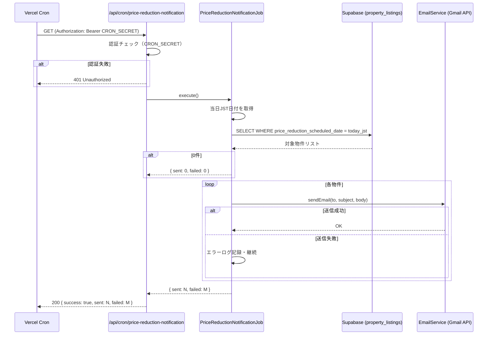

# 設計書：値下げ予約日メール配信機能

## 概要

`property_listings` テーブルの `price_reduction_scheduled_date`（値下げ予約日）が当日（JST）と一致する物件を検出し、担当者へメール通知を送信する Vercel Cron Job 機能。

毎日午前9時（JST）に自動実行され、対象物件ごとに個別メールを `tenant@ifoo-oita.com` へ送信する。既存の `EmailService`（Gmail API）と `CRON_SECRET` 認証の仕組みを再利用する。

---

## アーキテクチャ



### 配置

本機能は **社内管理システム用バックエンド**（`backend/src/`、ポート3000）に実装する。

| ファイル | 役割 |
|---------|------|
| `backend/src/services/PriceReductionNotificationService.ts` | 物件取得・メール送信ロジック |
| `backend/src/index.ts` | Cron Jobエンドポイント追加 |
| `backend/vercel.json` | Cronスケジュール設定追加 |

---

## コンポーネントとインターフェース

### PriceReductionNotificationService

```typescript
export interface PriceReductionTarget {
  property_number: string;
  address: string;
  price_reduction_scheduled_date: string; // YYYY-MM-DD
}

export interface NotificationResult {
  sent: number;
  failed: number;
  details: Array<{
    property_number: string;
    success: boolean;
    error?: string;
  }>;
}

export class PriceReductionNotificationService {
  /**
   * 当日（JST）の値下げ予約物件を取得する
   */
  async getTodayTargets(): Promise<PriceReductionTarget[]>;

  /**
   * 対象物件へメール通知を送信する
   * 1件失敗しても残りを継続する
   */
  async sendNotifications(targets: PriceReductionTarget[]): Promise<NotificationResult>;

  /**
   * UTC日時から JST の YYYY-MM-DD 文字列を返す（純粋関数）
   */
  getJSTDateString(utcDate: Date): string;

  /**
   * 物件情報からメール本文を生成する（純粋関数）
   */
  buildEmailBody(target: PriceReductionTarget): string;
}
```

### Cron Jobエンドポイント（`backend/src/index.ts` に追加）

```typescript
// GET /api/cron/price-reduction-notification
// Authorization: Bearer {CRON_SECRET}
// Response 200: { success: true, sent: number, failed: number }
// Response 401: { error: 'Unauthorized' }
// Response 500: { error: string }
```

### vercel.json への追加

```json
{
  "path": "/api/cron/price-reduction-notification",
  "schedule": "0 0 * * *"
}
```

UTC `0 0 * * *` = 毎日 00:00 UTC = 毎日 09:00 JST（UTC+9）

---

## データモデル

### 参照テーブル：`property_listings`

| カラム | 型 | 説明 |
|-------|-----|------|
| `property_number` | TEXT | 物件番号 |
| `address` | TEXT | 物件住所 |
| `price_reduction_scheduled_date` | DATE | 値下げ予約日（NULL可） |

### クエリ

```sql
SELECT property_number, address, price_reduction_scheduled_date
FROM property_listings
WHERE price_reduction_scheduled_date = CURRENT_DATE AT TIME ZONE 'Asia/Tokyo'
  AND price_reduction_scheduled_date IS NOT NULL;
```

実装上は Supabase クライアントで JST 当日日付文字列（`YYYY-MM-DD`）を生成してフィルタリングする。

### メール仕様

| 項目 | 値 |
|-----|-----|
| 送信先 | `tenant@ifoo-oita.com` |
| 件名 | `本日すぐに値下げお願い致します！！` |
| 本文形式 | プレーンテキスト |

本文テンプレート：
```
物件番号：{property_number}
物件住所：{address}
値下げ予約日：{price_reduction_scheduled_date}
```

---

## 正確性プロパティ

*プロパティとは、システムの全ての有効な実行において成立すべき特性・振る舞いのことです。プロパティは人間が読める仕様と機械検証可能な正確性保証の橋渡しをします。*

### Property 1: 当日物件フィルタリングの正確性

*任意の* 日付と物件リスト（当日・過去・未来・null の日付を含む）に対して、`getTodayTargets` が返す物件は全て当日（JST）の `price_reduction_scheduled_date` を持ち、null の物件は含まれない。

**Validates: Requirements 1.1, 1.4**

### Property 2: JST日付変換の正確性

*任意の* UTC日時（特に日付境界付近：UTC 14:59 = JST 23:59、UTC 15:00 = JST 翌日 00:00）に対して、`getJSTDateString` が返す日付文字列は UTC+9 オフセットを適用した正しい `YYYY-MM-DD` 形式である。

**Validates: Requirements 1.3**

### Property 3: メール送信件数の正確性

*任意の* N件（N ≥ 1）の対象物件リストに対して、`sendNotifications` が返す `sent + failed` の合計は常に N と等しい。また、全送信成功時のレスポンスの `sent` は N である。

**Validates: Requirements 2.1, 3.4**

### Property 4: メール内容の正確性

*任意の* 物件データ（`property_number`、`address`、`price_reduction_scheduled_date`）に対して、`buildEmailBody` が返す本文文字列はその物件の全フィールド値を含む。

**Validates: Requirements 2.2, 2.3**

### Property 5: エラー時の継続処理

*任意の* N件の物件リストで、K番目（1 ≤ K ≤ N）のメール送信が失敗した場合でも、残りの N-1 件の送信処理が実行される（`sent + failed = N` が成立する）。

**Validates: Requirements 2.4**

### Property 6: 不正認証の拒否

*任意の* 不正な Authorization ヘッダー値（空文字、ランダム文字列、`Bearer` プレフィックスなし、誤ったシークレット値）に対して、エンドポイントは常に HTTP 401 を返す。

**Validates: Requirements 3.2**

---

## エラーハンドリング

| エラー種別 | 対応 | HTTPレスポンス |
|-----------|------|--------------|
| 認証失敗（CRON_SECRET不一致） | ログ記録・即時終了 | 401 |
| DB取得エラー | エラーログ記録 | 500 |
| メール送信失敗（1件） | エラーログ記録・次の物件へ継続 | - |
| 予期しない例外 | エラーログ記録 | 500 |

メール送信失敗は個別物件単位で処理し、1件の失敗が他の物件の送信を妨げない。

---

## テスト戦略

### 単体テスト（例示ベース）

- 対象物件0件の場合にメール送信がスキップされること
- DB取得エラー時に500が返ること
- 正常完了時に200と送信件数が返ること
- ログ記録の確認（開始・検出件数・各物件結果・完了サマリー）

### プロパティベーステスト（fast-check を使用）

TypeScript プロジェクトのため [fast-check](https://fast-check.io/) を使用する。各プロパティテストは最低100回のイテレーションで実行する。

```typescript
// タグ形式: Feature: price-reduction-email-notification, Property {N}: {property_text}
```

| プロパティ | テスト対象 | 生成データ |
|-----------|-----------|-----------|
| Property 1 | `getTodayTargets` のフィルタリングロジック | 任意の日付を持つ物件リスト |
| Property 2 | `getJSTDateString` | 任意のUTC日時（境界値含む） |
| Property 3 | `sendNotifications` の件数集計 | 任意のN件物件リスト（EmailServiceをモック） |
| Property 4 | `buildEmailBody` | 任意の物件データ |
| Property 5 | エラー継続処理 | N件物件リスト + K番目失敗シナリオ |
| Property 6 | 認証チェックロジック | 任意の不正ヘッダー文字列 |

### 統合テスト

- Vercel Cron Job エンドポイントへの実際のHTTPリクエスト（ステージング環境）
- Gmail API 経由の実際のメール送信確認（ステージング環境）
